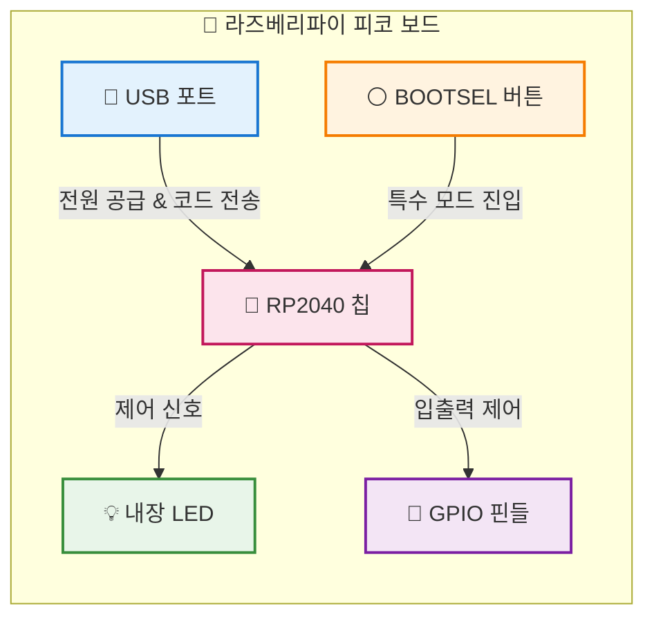
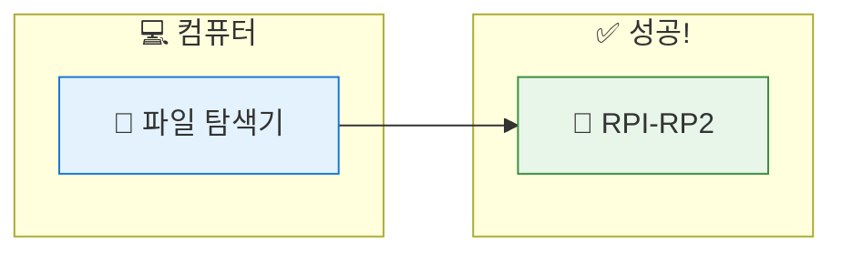

# 피코야, 반가워! - 하드웨어 살펴보기

> **Part 1**: 피코와 첫 만남 | ⏱️ **30분**

---

## 🎯 이 장에서 배우는 것

- [ ] 라즈베리파이 피코가 무엇인지 설명할 수 있다
- [ ] 피코 보드의 주요 부품(USB, LED, 핀)의 역할을 말할 수 있다
- [ ] 피코를 컴퓨터에 안전하게 연결할 수 있다

---

## 💡 왜 이걸 배우나요?

여러분이 레고 블록으로 무언가를 만들기 전에 각 블록이 어떤 역할을 하는지 알아야 하듯이, 피코로 프로젝트를 만들기 전에 이 작은 보드가 어떻게 생겼고 각 부분이 무슨 일을 하는지 알아야 해요.

"이 USB 포트는 왜 여기 있지?", "이 작은 버튼은 뭐지?", "옆에 늘어선 구멍들은 뭐야?"

이런 궁금증을 해결하고 나면, 앞으로 LED를 켜고, 센서를 연결하고, 인터넷에 연결하는 모든 과정이 훨씬 쉬워집니다!

---

## 📚 핵심 개념

### 개념 1: 라즈베리파이 피코란?

1. **비유로 시작**: "피코는 마치 **아주 작은 컴퓨터**와 같아요. 우리가 쓰는 컴퓨터처럼 프로그램을 실행할 수 있지만, 키보드나 모니터 대신 LED, 센서, 모터 같은 것들을 연결해서 사용해요."

2. **정확한 정의**: "라즈베리파이 피코(Raspberry Pi Pico)는 **마이크로컨트롤러 보드**입니다. 우리가 작성한 코드를 실행해서 전자 부품들을 제어하는 역할을 해요."

3. **예시로 확인**: "스마트폰이 앱을 실행하듯, 피코는 우리가 작성한 코드를 실행해요. 예를 들어 '버튼을 누르면 LED를 켜라'라는 코드를 넣으면, 피코가 24시간 그 일을 해줍니다!"

**쉽게 말하면**: 피코는 전자부품들의 두뇌 역할을 하는 초소형 컴퓨터예요! 🧠

---

### 개념 2: 피코 보드의 주요 부품

피코 보드를 손에 들고 직접 살펴볼까요?

| 부품 | 위치 | 역할 |
|------|------|------|
| 🔌 **USB 포트** | 보드 한쪽 끝 | 컴퓨터 연결, 전원 공급, 코드 전송 |
| ⚪ **BOOTSEL 버튼** | USB 포트 옆 | 특수 모드로 부팅 (처음 설정할 때 사용) |
| 💡 **내장 LED** | 보드 중앙 | 테스트용, 코드가 잘 동작하는지 확인 |
| 🧠 **RP2040 칩** | 보드 중앙 큰 칩 | 피코의 두뇌, 모든 계산 수행 |
| 📍 **GPIO 핀** | 보드 양쪽 가장자리 | 센서, LED 등 외부 장치 연결 |

**쉽게 말하면**: USB로 전원과 코드를 받고, 칩이 계산하고, 핀으로 외부 장치를 제어해요!

---

### 개념 3: GPIO 핀이란?

1. **비유로 시작**: "GPIO 핀은 피코의 **손가락**과 같아요. 손가락으로 버튼을 누르거나 물건을 집듯이, GPIO 핀으로 신호를 보내거나 받을 수 있어요."

2. **정확한 정의**: "GPIO는 General Purpose Input/Output의 약자로, **범용 입출력 핀**이라는 뜻이에요. 프로그램으로 이 핀들을 제어해서 전자부품과 소통해요."

3. **예시로 확인**: 
   - 📤 **출력**: "GP16 핀에 HIGH 신호를 보내면 LED가 켜져요"
   - 📥 **입력**: "GP20 핀으로 버튼이 눌렸는지 확인할 수 있어요"

**쉽게 말하면**: GPIO 핀 = 피코와 외부 세계를 연결하는 통로!

---

## 🔨 따라하기

### Step 1: 피코 보드 관찰하기

**목표**: 실제 피코 보드를 손에 들고 각 부품의 위치를 확인해요.

**해볼 것**:
1. 키트에서 피코 보드를 꺼내세요
2. USB 포트가 있는 쪽을 찾아보세요 (보드의 한쪽 끝에 있어요)
3. USB 포트 바로 옆에 있는 작은 흰색 버튼(BOOTSEL)을 찾아보세요
4. 보드 중앙의 작은 LED를 찾아보세요
5. 보드 양쪽 가장자리에 늘어선 핀(구멍)들을 확인하세요

**여기서 잠깐! 🤔**
피코를 다룰 때는 **가장자리를 잡으세요**! 보드 중앙의 칩이나 금속 부분을 손으로 직접 만지면 정전기로 고장날 수 있어요.

---

### Step 2: 피코를 컴퓨터에 연결하기

**목표**: USB 케이블로 피코를 컴퓨터에 안전하게 연결해요.

**준비물**: 
- 라즈베리파이 피코
- Micro USB 케이블

**연결 순서**:

1. **케이블 준비**: Micro USB 케이블의 작은 쪽이 피코에 연결됩니다
2. **BOOTSEL 버튼 누르기**: 피코의 BOOTSEL 버튼을 **누른 상태로 유지**
3. **USB 연결**: 버튼을 누른 채로 USB 케이블을 피코에 연결
4. **컴퓨터 연결**: 케이블의 반대쪽을 컴퓨터 USB 포트에 연결
5. **버튼 떼기**: 연결이 완료되면 BOOTSEL 버튼에서 손을 뗌

**성공 확인**:
- 컴퓨터에서 **RPI-RP2**라는 이름의 USB 드라이브가 나타나면 성공! 🎉

**여기서 잠깐! 🤔**
BOOTSEL 버튼을 누른 상태로 연결하는 건 **처음 한 번**만 필요해요. 나중에 MicroPython을 설치하고 나면, 그냥 연결만 하면 됩니다!

---

### Step 3: 연결 상태 확인하기

**목표**: 피코가 컴퓨터에 제대로 인식되었는지 확인해요.

**Windows에서 확인**:
1. 파일 탐색기를 열어요
2. "내 PC" 또는 "이 PC"를 클릭
3. **RPI-RP2** 드라이브가 보이는지 확인

**Mac에서 확인**:
1. Finder를 열어요
2. 왼쪽 사이드바에 **RPI-RP2**가 보이는지 확인

---

## ⚠️ 자주 하는 실수

### 실수 1: BOOTSEL 버튼을 안 누르고 연결함

**증상**: USB 드라이브(RPI-RP2)가 나타나지 않음

**원인**: 피코가 일반 모드로 부팅되어서 드라이브로 인식되지 않음

**해결**:
1. USB 케이블을 뽑으세요
2. BOOTSEL 버튼을 **먼저** 누르고
3. **누른 상태로** USB를 다시 연결하세요
4. 연결 후 버튼을 떼세요

---

### 실수 2: 충전 전용 케이블 사용

**증상**: 피코에 전원은 들어오는 것 같은데(LED가 깜빡일 수 있음) 컴퓨터에서 인식 안 됨

**원인**: 데이터 전송이 안 되는 충전 전용 케이블 사용

**해결**:
- **데이터 전송이 가능한** Micro USB 케이블을 사용하세요
- 스마트폰 충전기에 포함된 케이블 중 일부는 충전만 됩니다
- 키트에 포함된 케이블을 사용하면 확실해요!

---

### 실수 3: 보드를 잘못 잡아서 정전기 피해

**증상**: 처음엔 됐는데 갑자기 피코가 인식이 안 됨

**원인**: 손으로 칩이나 핀을 직접 만져서 정전기 피해 발생

**해결**:
- 항상 **보드의 가장자리**를 잡으세요
- 금속 부분을 직접 만지지 마세요
- 작업 전 금속 물체를 만져서 정전기를 빼는 것도 좋아요

---

## ✅ 스스로 점검하기

1. **피코의 역할은 무엇인가요?**

2. **BOOTSEL 버튼은 언제 사용하나요?**

3. **GPIO 핀의 역할을 한 문장으로 설명해보세요.**

4. **피코를 컴퓨터에 연결했을 때, 성공적으로 인식되면 무엇이 나타나나요?**

정답 확인

1. **피코의 역할**: 우리가 작성한 코드를 실행해서 LED, 센서, 모터 같은 전자부품을 제어하는 초소형 컴퓨터(마이크로컨트롤러)

2. **BOOTSEL 버튼**: 피코를 특수 모드(부트 모드)로 부팅할 때 사용. 주로 처음 MicroPython을 설치하거나 펌웨어를 업데이트할 때 필요

3. **GPIO 핀의 역할**: 피코와 외부 전자부품(센서, LED 등)을 연결해서 신호를 주고받는 통로

4. **성공 시 나타나는 것**: RPI-RP2라는 이름의 USB 드라이브

---

## 🚀 더 해보기

### 도전 1: 핀 번호 찾기 👀
피코 보드를 자세히 보면 각 핀 옆에 작은 글씨로 번호가 적혀 있어요. GP0, GP1, GP2... 이런 식으로요. **GP16이 어디 있는지** 찾아보세요!

### 도전 2: 피코 vs 아두이노 검색하기 🔍
"라즈베리파이 피코 vs 아두이노"를 검색해서 둘의 차이점을 3가지 찾아보세요. 어떤 점이 다른가요?

### 도전 3: 피코로 만든 프로젝트 구경하기 ⭐
YouTube에서 "Raspberry Pi Pico project"를 검색해보세요. 어떤 멋진 프로젝트들이 있나요? 가장 만들어보고 싶은 것을 하나 골라보세요!

---

## 🔗 다음 장으로

축하해요! 🎉 이번 장에서 우리는:
- ✅ 피코가 무엇인지 알았어요
- ✅ 보드의 각 부품(USB, BOOTSEL, LED, 칩, 핀)이 무슨 역할을 하는지 배웠어요
- ✅ 피코를 컴퓨터에 안전하게 연결하는 방법을 익혔어요

**다음 장**에서는 피코에 **MicroPython**을 설치하고, 드디어 **첫 번째 코드**를 실행해볼 거예요. "Hello, World!"를 출력하고, 피코의 내장 LED를 깜빡이게 만들어봐요! 

우리의 피코에 생명을 불어넣을 준비 되셨나요? 💪