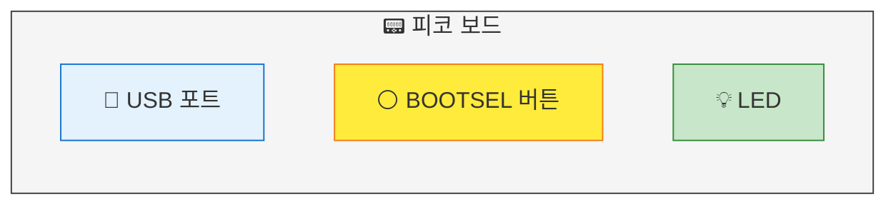
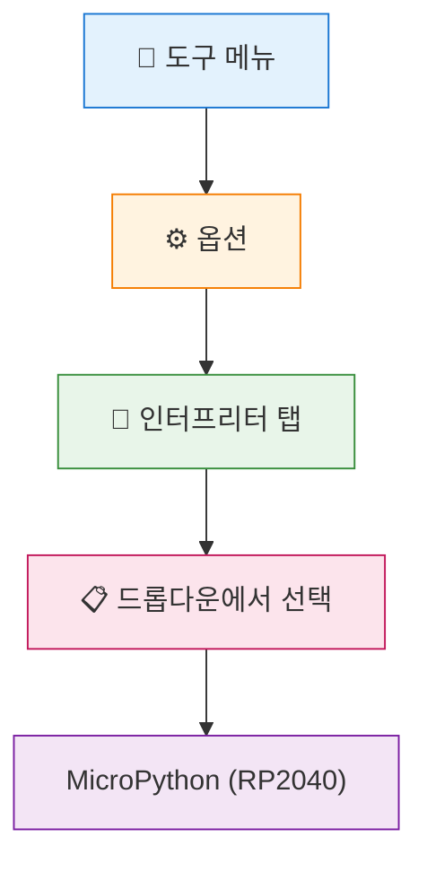

# 📘 Chapter 02: 개발 환경 설정 - Thonny 설치하기

> **Part 1**: 피코와 첫 만남 | ⏱️ 약 30분

---

## 🎯 이 장에서 배우는 것

- [ ] Thonny IDE를 다운로드하고 설치할 수 있다
- [ ] 피코를 컴퓨터에 연결하고 Thonny에서 인식시킬 수 있다
- [ ] MicroPython 펌웨어를 피코에 설치할 수 있다

---

## 💡 왜 이걸 배우나요?

코드를 작성하려면 **편집기**가 필요해요. 메모장으로도 코드를 쓸 수 있지만, 그건 마치 맨손으로 못을 박는 것과 같아요. 🔨

**Thonny**는 파이썬 초보자를 위해 만들어진 편집기예요. 특히 피코와 찰떡궁합인데, 이유가 있어요:

- 🔌 **바로 연결**: USB만 꽂으면 피코를 자동 인식
- ▶️ **즉시 실행**: 버튼 하나로 코드를 피코에 전송하고 실행
- 🐛 **친절한 오류**: 뭐가 잘못됐는지 쉽게 알려줌

그리고 피코는 처음 상태에서는 MicroPython을 이해하지 못해요. 마치 새 스마트폰에 운영체제를 설치하는 것처럼, 피코에도 **MicroPython 펌웨어**를 설치해야 우리가 작성한 코드를 이해할 수 있어요.

---

## 📚 핵심 개념

### 개념 1: IDE (통합 개발 환경)

1. **비유로 시작**: IDE는 마치 **요리사의 주방**과 같아요. 칼, 도마, 가스레인지가 한 곳에 모여 있으면 요리하기 편하죠? IDE도 코드 작성, 실행, 디버깅을 한 곳에서 할 수 있게 해줘요.

2. **정확한 정의**: IDE(Integrated Development Environment)는 코드 편집기, 실행 환경, 오류 검사 도구가 통합된 프로그램이에요.

3. **예시로 확인**: Thonny에서 코드를 작성하고 → 실행 버튼을 누르면 → 결과가 바로 아래에 표시돼요.

**쉽게 말하면**: 코딩에 필요한 모든 도구가 담긴 올인원 프로그램! 🧰

---

### 개념 2: 펌웨어 (Firmware)

1. **비유로 시작**: 펌웨어는 마치 **사람의 본능**과 같아요. 심장이 뛰고 숨을 쉬는 건 배우지 않아도 하잖아요? 펌웨어는 하드웨어가 "기본적으로 할 줄 아는 것"을 담당해요.

2. **정확한 정의**: 펌웨어는 하드웨어에 내장되어 기본 동작을 제어하는 소프트웨어예요. 피코의 MicroPython 펌웨어는 "파이썬 코드를 이해하는 능력"을 심어줘요.

3. **예시로 확인**: 펌웨어 설치 전에는 피코가 `print("안녕")`를 몰라요. 설치 후에는 이해하고 실행해요!

**쉽게 말하면**: 피코에게 "파이썬 말하는 법"을 가르치는 거예요! 🗣️

---

## 🔨 따라하기

### Step 1: Thonny 다운로드 및 설치

**목표**: 컴퓨터에 Thonny를 설치해요.

**1️⃣ 다운로드 사이트 접속**

웹 브라우저에서 **thonny.org**에 접속해요.


**2️⃣ 운영체제에 맞는 버전 다운로드**

| 운영체제 | 클릭할 버튼 |
|---------|------------|
| Windows | 오른쪽 상단 **Windows** |
| Mac | 오른쪽 상단 **Mac** |

**3️⃣ 설치 진행**

- 다운로드된 파일 실행
- **Next** → **Next** → **Install** → **Finish**
- 기본 설정 그대로 진행하면 OK!

**여기서 잠깐! 🤔**

> 설치 중 "이 앱이 디바이스를 변경할 수 있도록 허용하시겠습니까?" 라고 물으면 **예**를 클릭하세요. 정상적인 과정이에요!

---

### Step 2: 피코를 BOOTSEL 모드로 연결하기

**목표**: 피코를 펌웨어 설치 모드로 컴퓨터에 연결해요.

**1️⃣ BOOTSEL 버튼 찾기**

피코 보드에서 **BOOTSEL**이라고 적힌 작은 버튼을 찾아요. 보드 중앙 근처에 있어요.



**2️⃣ 버튼 누른 채로 USB 연결**

이 순서가 중요해요!

1. BOOTSEL 버튼을 **꾹 누른 상태**로
2. USB 케이블을 컴퓨터에 연결
3. 2초 정도 기다린 후 버튼에서 손 떼기

**3️⃣ 확인하기**

성공하면 컴퓨터에 **RPI-RP2**라는 USB 드라이브가 나타나요!

| 상태 | 의미 |
|------|------|
| ✅ RPI-RP2 드라이브 보임 | 성공! 다음 단계로 |
| ❌ 드라이브 안 보임 | USB 뽑고 다시 시도 |

**여기서 잠깐! 🤔**

> BOOTSEL 모드는 "나 지금 새 운영체제 받을 준비됐어!"라고 피코가 말하는 거예요. 일반 연결과 다른 특별한 모드랍니다.

---

### Step 3: Thonny에서 MicroPython 펌웨어 설치하기

**목표**: Thonny를 사용해 피코에 MicroPython을 설치해요.

**1️⃣ Thonny 실행**

설치한 Thonny를 실행해요. 처음 실행하면 언어 선택 화면이 나와요.
- **Language**: 한국어 선택해도 좋아요!

**2️⃣ 인터프리터 설정 열기**

메뉴에서: **도구(Tools)** → **옵션(Options)** → **인터프리터(Interpreter)** 탭

**3️⃣ MicroPython (Raspberry Pi Pico) 선택**



- 드롭다운에서 **MicroPython (Raspberry Pi Pico)** 또는 **MicroPython (RP2040)** 선택

**4️⃣ 펌웨어 설치**

- 오른쪽 아래 **"Install or update MicroPython"** 링크 클릭
- **Target volume**: RPI-RP2 선택
- **MicroPython variant**: Raspberry Pi Pico 2 W (WiFi 버전이면) 선택
- **Install** 클릭!

**5️⃣ 설치 완료 확인**

설치가 끝나면:
- RPI-RP2 드라이브가 사라짐 (정상!)
- Thonny 하단 Shell에 `>>>` 표시가 나타남

**실행 결과**:
```
MicroPython v1.22.0 on 2024-01-01; Raspberry Pi Pico 2 W
Type "help()" for more information.
>>> 
```

**여기서 잠깐! 🤔**

> `>>>` 이 기호는 "나 준비됐어, 명령 줘!"라는 뜻이에요. 이게 보이면 피코와 대화할 준비 완료! 🎉

---

## 📝 연결 확인 테스트

펌웨어가 잘 설치됐는지 간단히 테스트해볼까요?

Thonny 하단의 **Shell** 창에서 `>>>` 옆에 직접 타이핑해보세요:

```python
>>> print("안녕, 피코!")
```

**실행 결과**:
```
안녕, 피코!
>>> 
```

축하해요! 🎊 피코가 여러분의 말을 이해했어요!

---

## ⚠️ 자주 하는 실수

### 실수 1: BOOTSEL 버튼 타이밍 실수

**증상**: RPI-RP2 드라이브가 안 나타남

**원인**: 버튼을 누르기 전에 USB를 먼저 연결했거나, 버튼을 너무 빨리 놓음

**해결**:
```
❌ 잘못된 순서
1. USB 연결 → 2. BOOTSEL 누름

✅ 올바른 순서  
1. BOOTSEL 꾹 누름 → 2. USB 연결 → 3. 2초 후 버튼 놓음
```

---

### 실수 2: Thonny에서 피코가 인식 안 됨

**증상**: Shell에 `>>>` 대신 에러 메시지

**원인**: 인터프리터 설정이 안 됐거나, 포트 선택이 잘못됨

**해결**:
1. **도구** → **옵션** → **인터프리터**
2. **MicroPython (Raspberry Pi Pico)** 선택 확인
3. 포트가 **< Try to detect port automatically >** 인지 확인
4. USB 케이블을 뽑았다가 다시 연결

---

### 실수 3: 펌웨어 설치 중 Target volume 선택 불가

**증상**: Target volume 드롭다운이 비어있음

**원인**: BOOTSEL 모드로 연결되지 않음

**해결**:
1. Thonny 닫기
2. USB 케이블 분리
3. Step 2 다시 진행 (BOOTSEL 누른 채 연결)
4. Thonny 다시 열기

---

## ✅ 스스로 점검하기

1. **Thonny**는 어떤 프로그램인가요?

2. 피코에 **펌웨어**를 설치하는 이유는 무엇인가요?

3. **BOOTSEL 모드**로 연결하려면 어떤 순서로 해야 하나요?

<details>
<summary>정답 확인</summary>

1. 파이썬 코드를 작성하고 실행할 수 있는 통합 개발 환경(IDE)이에요. 특히 피코와 바로 연결해서 사용할 수 있어 편리해요.

2. 피코가 MicroPython 코드를 이해하고 실행할 수 있게 하려면 MicroPython 펌웨어가 필요해요. 마치 스마트폰에 운영체제를 설치하는 것과 같아요.

3. BOOTSEL 버튼을 꾹 누른 상태에서 → USB 연결 → 2초 후 버튼 놓기

</details>

---

## 🚀 더 해보기

### 도전 1: Shell에서 계산기처럼 사용하기 ⭐
Thonny Shell에서 이것들을 입력해보세요:
```python
>>> 1 + 1
>>> 100 * 5
>>> "파이썬" * 3
```
결과가 어떻게 나오나요?

### 도전 2: 피코 정보 확인하기 ⭐⭐
Shell에 이걸 입력해보세요:
```python
>>> import sys
>>> sys.implementation
```
여러분의 피코 정보가 나와요!

### 도전 3: 도움말 살펴보기 ⭐⭐⭐
```python
>>> help()
```
MicroPython이 제공하는 도움말을 탐험해보세요!

---

## 🔗 다음 장으로

**축하해요!** 🎉 이번 장에서 우리는:
- ✅ Thonny IDE를 설치했고
- ✅ 피코를 컴퓨터에 연결했고  
- ✅ MicroPython 펌웨어를 설치했어요

이제 피코가 파이썬을 이해할 수 있게 됐어요!

**다음 장**에서는 드디어 첫 번째 프로그램을 작성해볼 거예요. 피코에게 `"Hello, World!"`를 말하게 해봅시다! 🚀

---

> 📌 **환경 설정 완료 체크리스트**
> 
> - [ ] Thonny 설치됨
> - [ ] 피코 연결됨 (Shell에 `>>>` 보임)
> - [ ] `print("테스트")` 실행 성공
> 
> 모두 체크했다면 다음 장으로 GO! 🏃‍♂️