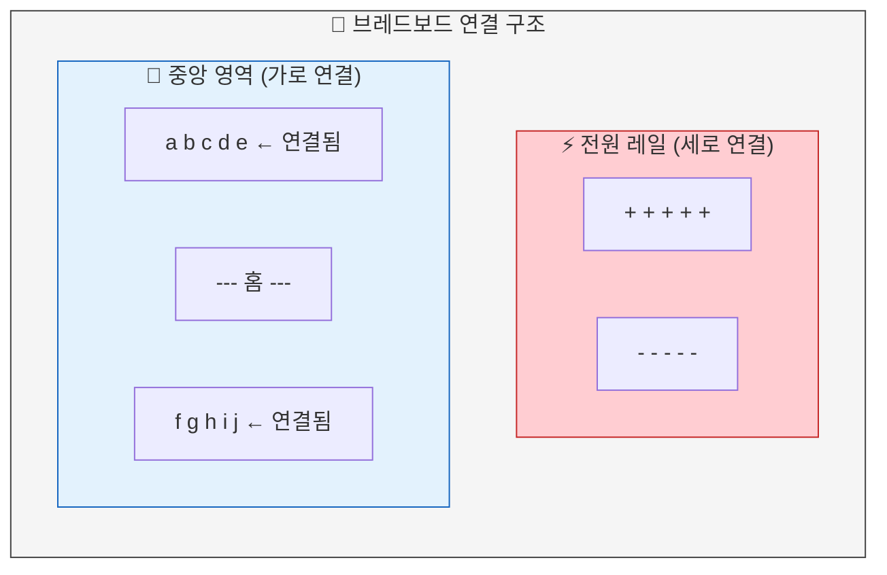
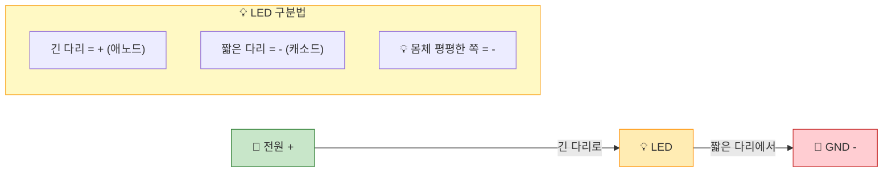
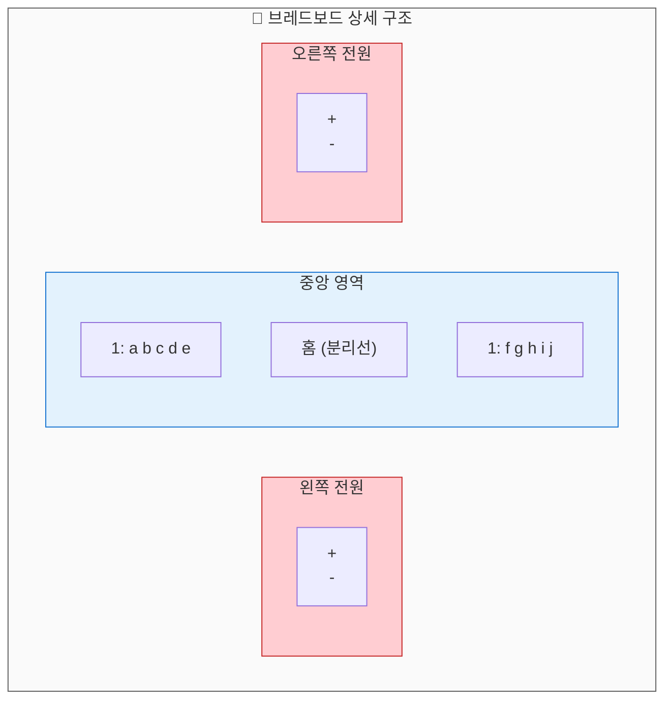
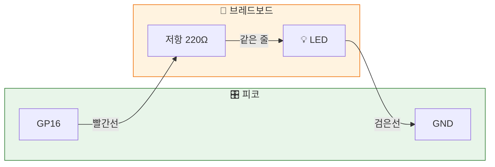
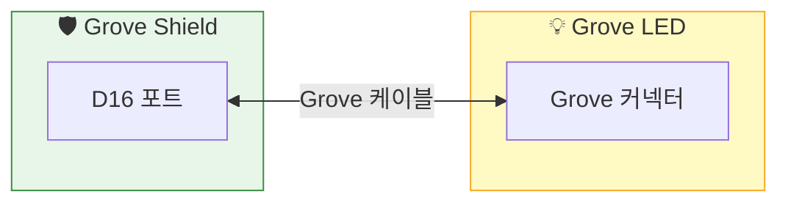

# Chapter 04: 브레드보드와 친해지기 - LED 회로 구성

> **Part 2**: 빛으로 말하기 - LED 제어

---

## 🎯 이 장에서 배우는 것

- [ ] 브레드보드의 구조와 내부 연결 원리를 설명할 수 있다
- [ ] LED의 극성(+/-)을 구분하고 올바르게 연결할 수 있다
- [ ] 저항의 역할을 이해하고 LED 보호 회로를 구성할 수 있다
- [ ] 회로도를 보고 브레드보드에 동일한 회로를 구성할 수 있다

---

## 💡 왜 이걸 배우나요?

지금까지는 피코에 내장된 LED만 제어했어요. 하지만 실제 프로젝트에서는 **외부 부품**을 연결해야 합니다. 무드등, 알림 장치, 로봇 눈... 모두 외부 LED가 필요하죠!

브레드보드는 **납땜 없이** 부품을 연결할 수 있는 마법의 보드예요. 레고 블록처럼 꽂았다 뺐다 할 수 있어서, 실험하고 수정하기 딱 좋습니다.

이번 장을 마치면, 여러분은 직접 LED 회로를 구성하고 코드로 제어할 수 있게 됩니다! 🎉

---

## 📚 핵심 개념

### 개념 1: 브레드보드의 구조

1. **비유로 시작**: "브레드보드는 마치 **아파트 복도**와 같아요. 같은 층(가로줄)에 사는 사람들은 서로 연결되어 있고, 다른 층과는 분리되어 있죠."

2. **정확한 정의**: "브레드보드는 내부에 금속 클립이 있어서 특정 구멍들이 전기적으로 연결되어 있는 실험용 기판입니다."

3. **예시로 확인**: "예를 들어, 1번 줄의 a-b-c-d-e 구멍은 모두 연결되어 있어요. 여기에 부품 다리들을 꽂으면 자동으로 연결됩니다!"



**쉽게 말하면**: 가로줄은 연결되고, 홈을 기준으로 위아래는 분리됩니다!

---

### 개념 2: LED의 극성

1. **비유로 시작**: "LED는 마치 **일방통행 도로**와 같아요. 전류가 정해진 방향으로만 흐를 수 있습니다."

2. **정확한 정의**: "LED(Light Emitting Diode)는 전류 방향이 정해진 부품입니다. 긴 다리가 양극(+, 애노드), 짧은 다리가 음극(-, 캐소드)입니다."

3. **예시로 확인**: "LED를 거꾸로 연결하면? 도로를 역주행하는 것처럼 전류가 흐르지 않아서 빛이 나지 않아요!"



**쉽게 말하면**: **긴 다리 = 플러스(+), 짧은 다리 = 마이너스(-)**

---

### 개념 3: 저항의 역할

1. **비유로 시작**: "저항은 마치 **수도꼭지**와 같아요. 물(전류)이 너무 세게 흐르면 파이프(LED)가 망가지니까, 적당히 조절해주는 거예요."

2. **정확한 정의**: "저항은 전류의 흐름을 제한하는 부품입니다. LED에 과전류가 흐르면 타버리기 때문에, 저항으로 전류를 제한합니다."

3. **예시로 확인**: "피코의 3.3V에 LED를 직접 연결하면? LED가 순간적으로 밝게 빛나다가 타버릴 수 있어요! 220Ω~330Ω 저항을 함께 연결하면 안전합니다."

**쉽게 말하면**: **저항 = LED 보호대**, 없으면 LED가 타요! 🔥

---

## 🔨 따라하기

### Step 1: 브레드보드 연결 이해하기

**목표**: 브레드보드의 어떤 구멍들이 연결되어 있는지 파악합니다.

실제로 부품을 꽂기 전에, 연결 원리를 확실히 이해해봅시다!



**핵심 규칙**:
| 영역 | 연결 방향 | 용도 |
|------|----------|------|
| 전원 레일 (+/-) | **세로**로 전체 연결 | 전원 공급 |
| 중앙 영역 | **가로**로 5칸씩 연결 | 부품 연결 |
| 중앙 홈 | 위아래 **분리** | IC칩 장착용 |

**여기서 잠깐! 🤔**
> 같은 가로줄에 꽂으면 연결되고, 홈을 넘어가면 분리됩니다!

---

### Step 2: LED 회로 구성하기

**목표**: 브레드보드에 LED와 저항을 연결합니다.

**준비물**: 브레드보드, LED 1개, 220Ω 저항 1개, 점퍼선 2개



**연결 순서**:

1. **저항 연결**: 저항의 한쪽 다리를 5번 줄 a에, 다른 쪽을 5번 줄 e에 꽂습니다
2. **LED 연결**: LED의 **긴 다리(+)**를 5번 줄 d에, **짧은 다리(-)**를 10번 줄 d에 꽂습니다
3. **점퍼선 연결**: 
   - 빨간선: 피코 GP16 → 브레드보드 5번 줄 a
   - 검은선: 피코 GND → 브레드보드 10번 줄 a

**여기서 잠깐! 🤔**
> 저항과 LED의 긴 다리가 **같은 가로줄**에 있어야 연결됩니다!

---

### Step 3: 코드로 LED 제어하기

**목표**: 외부 LED를 깜빡이게 합니다.

**코드**:
```python
# === WHAT: 외부 LED를 깜빡이는 코드 ===
# 브레드보드에 연결한 LED를 제어합니다

# --- WHY: 왜 필요한지 ---
# 내장 LED 말고, 원하는 위치에 LED를 추가하려면
# 외부 LED 연결 방법을 알아야 해요!

# HOW: 어떻게 동작하는지
from machine import Pin  # 핀 제어 기능 가져오기
import time              # 시간 관련 기능 가져오기

# GP16 핀을 출력 모드로 설정
led = Pin(16, Pin.OUT)

# 무한 반복
while True:
    led.on()         # LED 켜기 (3.3V 출력)
    print("💡 LED ON")
    time.sleep(0.5)  # 0.5초 대기
    
    led.off()        # LED 끄기 (0V 출력)
    print("LED OFF")
    time.sleep(0.5)  # 0.5초 대기
```

**실행 결과**:
```
💡 LED ON
LED OFF
💡 LED ON
LED OFF
...
```

**여기서 잠깐! 🤔**
> `Pin("LED")`는 내장 LED, `Pin(16)`은 GP16 핀입니다. 숫자로 쓰면 외부 핀!

---

### Step 4: Grove LED 사용하기 (더 쉬운 방법!)

**목표**: Grove 케이블로 간편하게 LED를 연결합니다.

Grove Shield가 있다면, 브레드보드 없이도 LED를 연결할 수 있어요!



**연결 방법**: Grove LED 모듈을 Grove Shield의 **D16 포트**에 케이블로 연결하면 끝!

**코드는 동일합니다**:
```python
from machine import Pin
import time

led = Pin(16, Pin.OUT)  # D16 포트 = GP16

while True:
    led.toggle()     # 현재 상태 반전 (켜짐↔꺼짐)
    time.sleep(0.5)
```

---

## 📝 전체 코드

```python
# === 외부 LED 깜빡이기 - 완성 코드 ===
# 브레드보드 또는 Grove LED 모두 사용 가능

from machine import Pin
import time

# 설정
LED_PIN = 16        # GP16 (Grove D16 포트)
BLINK_TIME = 0.5    # 깜빡임 간격 (초)

# LED 핀 설정
led = Pin(LED_PIN, Pin.OUT)

print("🚀 LED 깜빡이기 시작!")
print("중지하려면 Ctrl+C를 누르세요")

# 메인 루프
count = 0
while True:
    led.toggle()
    count += 1
    
    if led.value():  # LED가 켜져 있으면
        print(f"💡 ON  (#{count})")
    else:
        print(f"   OFF (#{count})")
    
    time.sleep(BLINK_TIME)
```

---

## ⚠️ 자주 하는 실수

### 실수 1: LED가 안 켜져요!

**증상**: 코드는 실행되는데 LED가 켜지지 않음

**원인**: LED 방향이 거꾸로 되어 있음

**해결**:
```python
# LED 방향 확인하기
# 긴 다리(+) → 저항 쪽 (GP16)
# 짧은 다리(-) → GND 쪽

# 💡 팁: LED를 180도 돌려서 다시 꽂아보세요!
```

---

### 실수 2: LED가 매우 어둡거나 안 켜져요

**증상**: LED가 희미하게 켜지거나 전혀 안 켜짐

**원인**: 같은 줄에 연결하지 않아서 회로가 끊어짐

**해결**:
```python
# 잘못된 연결 (서로 다른 줄)
# 저항: 5번 줄
# LED 긴 다리: 6번 줄  ← 연결 안 됨!

# 올바른 연결 (같은 줄)
# 저항: 5번 줄 a, e
# LED 긴 다리: 5번 줄 d  ← 연결됨!
```

---

### 실수 3: 저항 없이 연결했어요

**증상**: LED가 엄청 밝았다가 갑자기 안 켜짐

**원인**: 과전류로 LED가 손상됨

**해결**:
```python
# 잘못된 회로: GP16 → LED → GND (저항 없음)
# 위험! LED가 타버릴 수 있어요 🔥

# 올바른 회로: GP16 → 저항 → LED → GND
# 220Ω ~ 330Ω 저항을 반드시 연결하세요!
```

---

## ✅ 스스로 점검하기

1. **브레드보드에서 같은 가로줄의 a, b, c, d, e 구멍은 서로 연결되어 있나요, 분리되어 있나요?**

2. **LED의 긴 다리는 +극인가요, -극인가요?**

3. **저항을 연결하지 않으면 어떤 문제가 생길 수 있나요?**

<details>
<summary>정답 확인</summary>

1. **연결되어 있습니다.** 같은 가로줄의 a-e는 내부적으로 연결되어 있어요.

2. **+극(양극, 애노드)입니다.** 긴 다리 = +, 짧은 다리 = - 로 기억하세요!

3. **LED가 과전류로 손상될 수 있습니다.** 저항은 전류를 제한해서 LED를 보호하는 역할을 합니다.

</details>

---

## 🚀 더 해보기

### 도전 1: 깜빡임 속도 조절하기
`BLINK_TIME` 값을 0.1, 0.2, 1.0 등으로 바꿔보세요. 어떤 변화가 있나요?

### 도전 2: LED 2개 연결하기
GP16과 GP17에 각각 LED를 연결하고, 번갈아 깜빡이게 해보세요!

```python
# 힌트
led1 = Pin(16, Pin.OUT)
led2 = Pin(17, Pin.OUT)
# 번갈아 켜려면?
```

### 도전 3: SOS 신호 만들기 ⭐
모스 부호로 SOS(···−−−···)를 LED로 표현해보세요!
- 점(·): 0.2초 켜기
- 선(−): 0.6초 켜기
- 글자 사이: 0.4초 끄기

---

## 🔗 다음 장으로

이번 장에서 배운 것:
- ✅ 브레드보드의 연결 구조 (가로 연결, 홈으로 분리)
- ✅ LED의 극성 (+긴 다리, -짧은 다리)
- ✅ 저항으로 LED 보호하기
- ✅ 외부 LED를 코드로 제어하기

**다음 장**에서는 **PWM으로 LED 밝기 조절하기**를 배웁니다. 단순히 켜고 끄는 것을 넘어서, LED를 서서히 밝아지게 하거나 어둡게 하는 방법을 알아볼 거예요! 🌟