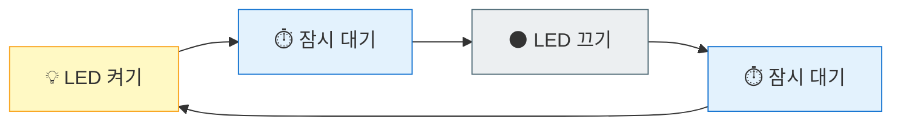

# 깜빡깜빡 - LED 점멸 프로그램

**Part 2**: 빛으로 말하기 - LED 제어

---

## 🎯 이 장에서 배우는 것

- [ ] GPIO 핀의 개념과 출력 모드를 설명할 수 있다
- [ ] `while` 반복문으로 무한히 반복하는 코드를 작성할 수 있다
- [ ] `sleep()` 함수로 시간 간격을 조절할 수 있다
- [ ] LED를 원하는 속도로 깜빡이게 만들 수 있다

---

## 💡 왜 이걸 배우나요?

앞 장에서 LED를 켜고 껐죠? 하지만 한 번 켜고 끝나면 심심하잖아요! 🙄

실제 세상의 LED를 떠올려 보세요:
- 🚗 자동차 방향지시등: 깜빡깜빡
- 🚨 비상구 표시등: 깜빡깜빡
- 🎄 크리스마스 트리 조명: 반짝반짝

모두 **반복적으로** 켜졌다 꺼졌다 하죠! 이번 장에서는 컴퓨터에게 "이걸 계속 반복해!"라고 명령하는 방법을 배웁니다. 이게 바로 **반복문**이에요.

반복문을 익히면 LED뿐 아니라 "센서 값을 계속 읽기", "계속 대기하며 버튼 누름 확인하기" 같은 모든 피지컬 컴퓨팅의 기본이 됩니다!

---

## 📚 핵심 개념

### 개념 1: GPIO 출력 모드

1. **비유로 시작**: GPIO 핀은 마치 **전기 스위치**와 같아요. 스위치를 켜면(HIGH) 전기가 흐르고, 끄면(LOW) 전기가 멈추죠.

2. **정확한 정의**: GPIO(General Purpose Input/Output)는 범용 입출력 핀입니다. **출력 모드**로 설정하면 핀에서 전기 신호(3.3V 또는 0V)를 내보낼 수 있습니다.

3. **예시로 확인**: LED를 GP16 핀에 연결하고 출력 모드로 설정하면, 코드로 "켜!" 또는 "꺼!"를 명령할 수 있어요.

**쉽게 말하면**: 피코의 핀을 "전기를 내보내는 모드"로 설정하는 거예요.

---

### 개념 2: 반복문 (while)

1. **비유로 시작**: 반복문은 마치 **노래 반복 재생** 버튼과 같아요. 한 번 누르면 노래가 끝나도 계속 처음부터 다시 재생되죠.

2. **정확한 정의**: `while True:`는 조건이 참(True)인 동안 코드 블록을 **무한히 반복** 실행합니다.

3. **예시로 확인**:
```python
while True:
    print("안녕!")  # 이 줄이 무한히 반복됨
```

**쉽게 말하면**: "이 코드를 영원히 반복해!"라고 명령하는 거예요.

---

### 개념 3: sleep() 함수

1. **비유로 시작**: sleep()은 마치 **알람 없는 낮잠**과 같아요. 정해진 시간 동안 아무것도 하지 않고 기다립니다.

2. **정확한 정의**: `time.sleep(초)`는 프로그램을 지정한 초(seconds) 동안 **일시 정지**시킵니다.

3. **예시로 확인**:
```python
time.sleep(1)    # 1초 대기
time.sleep(0.5)  # 0.5초(500ms) 대기
```

**쉽게 말하면**: "잠깐 멈춰!"를 몇 초간 할지 정하는 거예요.

---

### 💡 개념 연결: LED 점멸의 원리



이 네 단계가 **무한히 반복**되면 LED가 깜빡이는 것처럼 보여요!

---

## 🔨 따라하기

### Step 1: LED 한 번 깜빡이기

**목표**: LED를 켜고, 1초 기다리고, 끄는 기본 동작 확인하기

**코드**:
```python
# === WHAT: LED를 한 번 깜빡이는 코드 ===
# LED를 켰다가 1초 후에 끕니다

# --- WHY: 왜 필요한지 ---
# 반복하기 전에 기본 동작이 되는지 먼저 확인해야 해요

# HOW: 어떻게 동작하는지
from machine import Pin  # 핀 제어 도구 가져오기
import time              # 시간 관련 도구 가져오기

led = Pin(16, Pin.OUT)   # GP16 핀을 출력 모드로 설정

led.value(1)             # LED 켜기 (HIGH, 3.3V 출력)
time.sleep(1)            # 1초 동안 대기
led.value(0)             # LED 끄기 (LOW, 0V 출력)
```

**실행 결과**:
```
(LED가 1초간 켜졌다가 꺼집니다)
```

**여기서 잠깐! 🤔**
- `value(1)` = HIGH = 켜기, `value(0)` = LOW = 끄기
- 숫자 16은 Grove Shield의 D16 포트에 해당해요

---

### Step 2: 무한 반복으로 계속 깜빡이기

**목표**: `while True:`로 LED가 계속 깜빡이게 만들기

**코드**:
```python
# === WHAT: LED를 계속 깜빡이는 코드 ===
# LED가 1초마다 켜졌다 꺼졌다를 무한 반복합니다

# --- WHY: 왜 필요한지 ---
# 한 번만 깜빡이면 프로그램이 끝나버려요
# 계속 깜빡이려면 반복문이 필요해요!

# HOW: 어떻게 동작하는지
from machine import Pin
import time

led = Pin(16, Pin.OUT)

while True:              # 아래 코드를 무한 반복!
    led.value(1)         # LED 켜기
    time.sleep(1)        # 1초 대기
    led.value(0)         # LED 끄기
    time.sleep(1)        # 1초 대기 (이게 없으면?)
```

**실행 결과**:
```
(LED가 1초 켜짐 → 1초 꺼짐 → 반복...)
```

**여기서 잠깐! 🤔**
마지막 `sleep(1)`이 없으면 어떻게 될까요? LED가 꺼지자마자 바로 다시 켜져서 **거의 꺼진 것처럼 안 보여요**! 끄고 나서도 잠깐 기다려야 "깜빡임"이 눈에 보입니다.

---

### Step 3: 깜빡이는 속도 조절하기

**목표**: sleep 시간을 바꿔서 빠르게/느리게 깜빡이기

**코드**:
```python
# === WHAT: 빠르게 깜빡이는 LED ===
# 비상등처럼 빠르게 깜빡입니다

# --- WHY: 왜 필요한지 ---
# 상황에 따라 깜빡이는 속도가 달라야 해요
# 비상등은 빠르게, 호흡등은 느리게!

# HOW: 어떻게 동작하는지
from machine import Pin
import time

led = Pin(16, Pin.OUT)

# 깜빡임 간격을 변수로 만들면 수정이 쉬워요!
interval = 0.2           # 0.2초 = 200ms (빠른 깜빡임)

while True:
    led.value(1)
    time.sleep(interval)  # 변수 사용
    led.value(0)
    time.sleep(interval)
```

**실행 결과**:
```
(LED가 0.2초마다 빠르게 깜빡입니다)
```

**💡 실험해보세요!**
| interval 값 | 느낌 |
|------------|------|
| 0.1 | 매우 빠름 (비상!) |
| 0.5 | 적당히 빠름 |
| 1.0 | 느긋함 |
| 2.0 | 매우 느림 (졸려...) |

---

## 📝 전체 코드

```python
# === LED 점멸 프로그램 ===
# 피코의 GP16에 연결된 LED를 깜빡이게 합니다
# 실행 후 멈추려면 Thonny의 Stop 버튼을 누르세요!

from machine import Pin
import time

# 설정
led = Pin(16, Pin.OUT)   # D16 포트의 LED
interval = 0.5           # 깜빡임 간격 (초)

# 무한 반복
while True:
    led.value(1)         # 켜기
    time.sleep(interval)
    led.value(0)         # 끄기
    time.sleep(interval)
```

---

## ⚠️ 자주 하는 실수

### 실수 1: 들여쓰기 빠뜨리기

**증상**: `IndentationError: expected an indented block`

**원인**: `while True:` 다음 줄은 반드시 들여쓰기(스페이스 4칸)가 필요해요!

**해결**:
```python
# 잘못된 코드
while True:
led.value(1)  # ❌ 들여쓰기 없음!

# 올바른 코드
while True:
    led.value(1)  # ✅ 스페이스 4칸
```

---

### 실수 2: 끄고 나서 sleep 안 하기

**증상**: LED가 계속 켜져 있는 것처럼 보임

**원인**: 끄자마자 바로 다시 켜지면 꺼진 게 안 보여요

**해결**:
```python
# 잘못된 코드
while True:
    led.value(1)
    time.sleep(1)
    led.value(0)
    # ❌ sleep 없이 바로 다시 켜짐!

# 올바른 코드
while True:
    led.value(1)
    time.sleep(1)
    led.value(0)
    time.sleep(1)  # ✅ 끄고 나서도 대기
```

---

### 실수 3: 프로그램 멈추는 방법 모르기

**증상**: LED가 계속 깜빡여서 새 코드를 실행 못함

**원인**: `while True:`는 무한 반복이라 스스로 안 멈춰요!

**해결**:
- Thonny 상단의 **🔴 Stop** 버튼 클릭
- 또는 **Ctrl + C** 키 누르기

---

## ✅ 스스로 점검하기

1. `Pin(16, Pin.OUT)`에서 `Pin.OUT`의 의미는 무엇인가요?

2. `while True:`를 사용하지 않고 LED를 5번만 깜빡이게 하려면 어떻게 해야 할까요?

3. 왜 LED를 끄고 나서도 `sleep()`이 필요한가요?

<details>
<summary>정답 확인</summary>

1. **Pin.OUT**: 해당 핀을 **출력 모드**로 설정한다는 의미예요. 핀에서 전기 신호를 내보낼 수 있게 됩니다.

2. `for` 반복문을 사용하면 됩니다:
```python
for i in range(5):  # 5번 반복
    led.value(1)
    time.sleep(0.5)
    led.value(0)
    time.sleep(0.5)
```

3. 끄자마자 바로 다시 켜지면, 꺼진 시간이 너무 짧아서 **사람 눈에는 계속 켜져 있는 것처럼** 보여요. 깜빡임을 보려면 끄고 나서도 기다려야 합니다.

</details>

---

## 🚀 더 해보기

### 도전 1: SOS 신호 만들기 🆘
모스 부호 SOS는 `· · · — — — · · ·` (짧게 3번, 길게 3번, 짧게 3번)입니다.
- 짧은 신호: 0.2초
- 긴 신호: 0.6초
- 신호 사이: 0.2초 대기

### 도전 2: 심장 박동 LED 💓
심장처럼 "쿵... 쿵쿵... 쿵... 쿵쿵..." 리듬으로 깜빡이게 만들어보세요!
- 첫 번째 박동: 짧게
- 두 번째 박동: 빠르게 두 번
- 그리고 잠시 쉬기

### 도전 3: 점점 빨라지는 LED ⭐
시작은 1초 간격으로 깜빡이다가, 점점 빨라져서 0.1초 간격까지 빨라지게 만들어보세요! (힌트: 변수를 반복문 안에서 줄이기)

---

## 🔗 다음 장으로

축하해요! 🎉 이제 여러분은:
- GPIO 핀으로 전기 신호를 **출력**하는 방법
- `while True:`로 코드를 **무한 반복**하는 방법
- `sleep()`으로 **시간 조절**하는 방법

을 알게 되었어요!

**다음 장 "밝기 조절 - PWM으로 LED 페이드"** 에서는 LED를 그냥 켜고 끄는 것을 넘어서, **서서히 밝아지고 어두워지게** 만드는 방법을 배웁니다. 마치 고급 무드등처럼요! ✨