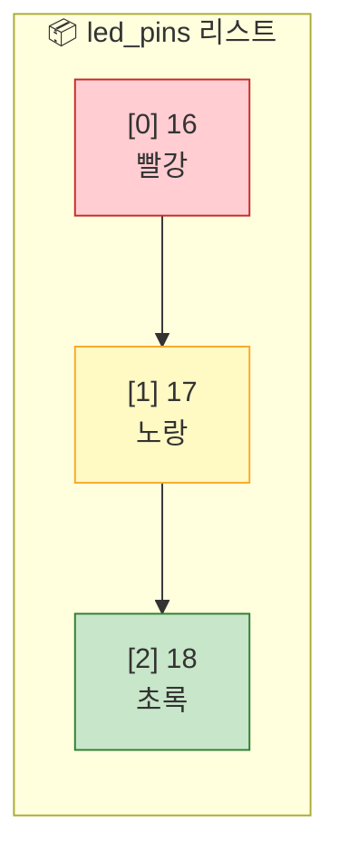
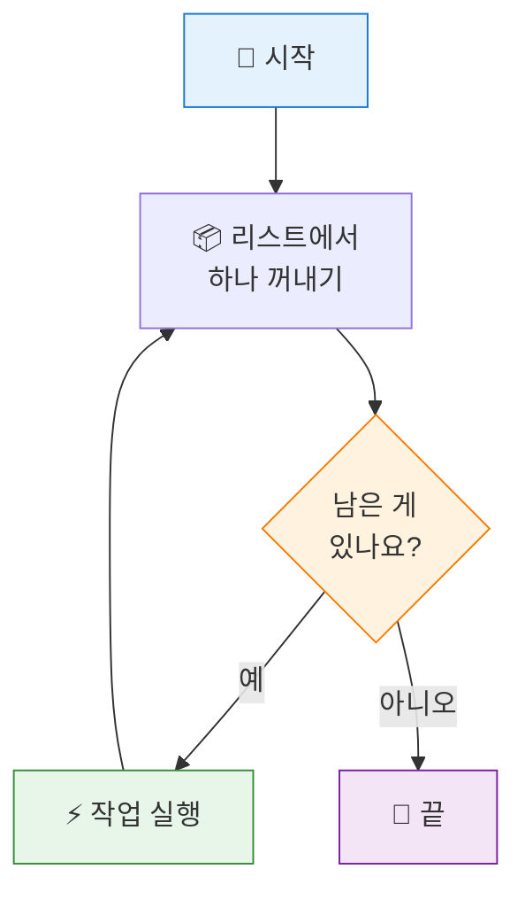

# 🌈 6장. 무지개 신호등 - 다중 LED 패턴

> **Part 2**: 빛으로 말하기 - LED 제어

---

## 🎯 이 장에서 배우는 것

- [ ] 여러 개의 LED를 동시에 제어할 수 있다
- [ ] 리스트를 활용해 LED들을 효율적으로 관리할 수 있다
- [ ] 신호등 패턴을 프로그래밍할 수 있다
- [ ] for 반복문으로 LED 순차 점등을 구현할 수 있다

---

## 💡 왜 이걸 배우나요?

지금까지 LED 하나를 껐다 켰다 해봤죠? 근데 실제 세상을 보세요. 신호등은 빨강-노랑-초록 **3개**가 순서대로 켜지고, 크리스마스 트리 조명은 **수십 개**가 물결처럼 움직여요.

LED 10개를 제어하려면 코드 10줄을 일일이 써야 할까요? **아니요!** 오늘 배울 **리스트**를 사용하면 LED가 100개여도 단 몇 줄로 끝납니다.

이건 실제로 많이 쓰여요:
- 🚦 교차로 신호등 시스템
- 🎄 LED 스트립 조명
- 🚗 자동차 후미등 순차 점멸
- 🎮 게임 컨트롤러 상태 표시

---

## 📚 핵심 개념

### 개념 1: 리스트(List)

1. **비유로 시작**: "리스트는 마치 **기차 칸**과 같아요. 여러 개의 물건을 순서대로 한 줄로 연결해서 보관하는 거죠."

2. **정확한 정의**: "정확히 말하면, 리스트는 **여러 데이터를 순서대로 담는 파이썬 자료구조**입니다. 대괄호 `[]`로 만들고, 각 항목은 번호(인덱스)로 접근해요."

3. **예시로 확인**:
```python
# LED가 연결된 핀 번호들을 리스트로!
led_pins = [16, 17, 18]  # 빨강, 노랑, 초록

# 첫 번째 핀 번호 가져오기 (인덱스는 0부터!)
print(led_pins[0])  # 16 출력
print(led_pins[1])  # 17 출력
print(led_pins[2])  # 18 출력
```

**쉽게 말하면**: 여러 개를 한 묶음으로 관리하는 마법 상자!



---

### 개념 2: for 반복문

1. **비유로 시작**: "for문은 **자동 반복 기계**예요. 리스트에 있는 것들을 하나씩 꺼내서 같은 작업을 반복해줍니다."

2. **정확한 정의**: "for문은 **반복 가능한 객체의 각 요소에 대해 코드 블록을 실행**하는 제어문입니다."

3. **예시로 확인**:
```python
colors = ["빨강", "노랑", "초록"]

for color in colors:
    print(f"{color} LED 켜기!")
    
# 출력:
# 빨강 LED 켜기!
# 노랑 LED 켜기!
# 초록 LED 켜기!
```

**쉽게 말하면**: "이 목록에 있는 거 **하나씩** 전부 처리해!"



---

## 🔨 따라하기

### 준비물
| 부품 | 수량 | 연결 |
|------|------|------|
| Grove LED (빨강) | 1 | D16 포트 |
| Grove LED (노랑/주황) | 1 | D17 포트 |
| Grove LED (초록) | 1 | D18 포트 |
| Grove 케이블 | 3 | - |

---

### Step 1: 3개 LED 연결하고 개별 테스트

**목표**: 각 LED가 제대로 연결됐는지 확인하기

**코드**:
```python
# === WHAT: 3개 LED 개별 점등 테스트 ===
# 신호등처럼 빨강, 노랑, 초록 LED를 하나씩 켜본다

# --- WHY: 왜 필요한지 ---
# 여러 LED를 제어하기 전에 각각 잘 연결됐는지 먼저 확인!

# HOW: 어떻게 동작하는지
from machine import Pin  # 핀 제어용
import time              # 시간 지연용

# 각 LED를 개별 변수로 설정
red = Pin(16, Pin.OUT)    # 빨간 LED - D16 포트
yellow = Pin(17, Pin.OUT) # 노란 LED - D17 포트  
green = Pin(18, Pin.OUT)  # 초록 LED - D18 포트

# 하나씩 테스트
print("빨간 LED 테스트")
red.on()
time.sleep(1)
red.off()

print("노란 LED 테스트")
yellow.on()
time.sleep(1)
yellow.off()

print("초록 LED 테스트")
green.on()
time.sleep(1)
green.off()

print("테스트 완료!")
```

**실행 결과**:
```
빨간 LED 테스트
노란 LED 테스트
초록 LED 테스트
테스트 완료!
```
(각 LED가 1초씩 순서대로 켜졌다 꺼짐)

**여기서 잠깐! 🤔**
코드가 비슷한 게 3번 반복되죠? 이걸 더 짧게 줄일 수 있어요!

---

### Step 2: 리스트로 LED 관리하기

**목표**: 3개 LED를 리스트 하나로 묶어서 관리

**코드**:
```python
# === WHAT: 리스트로 LED 관리 ===
# 여러 LED를 하나의 리스트로 묶어 효율적으로 제어

# --- WHY: 왜 필요한지 ---
# LED 10개면 변수 10개? NO! 리스트 하나면 충분!

from machine import Pin
import time

# 핀 번호를 리스트로
pin_numbers = [16, 17, 18]

# LED 객체들도 리스트로!
leds = []  # 빈 리스트 만들기

for pin_num in pin_numbers:
    led = Pin(pin_num, Pin.OUT)  # LED 객체 생성
    leds.append(led)             # 리스트에 추가
    
print(f"LED {len(leds)}개 준비 완료!")

# for문으로 모든 LED 순차 점등
for i, led in enumerate(leds):
    print(f"LED {i+1} 켜기")
    led.on()
    time.sleep(0.5)
    led.off()
    
print("완료!")
```

**실행 결과**:
```
LED 3개 준비 완료!
LED 1 켜기
LED 2 켜기
LED 3 켜기
완료!
```

**여기서 잠깐! 🤔**
- `leds.append(led)`: 리스트 끝에 새 항목 추가
- `enumerate(leds)`: 순서 번호(i)와 값(led)을 함께 가져옴
- LED가 100개여도 `pin_numbers`만 늘리면 끝!

---

### Step 3: 진짜 신호등 만들기!

**목표**: 실제 교통 신호등처럼 동작하는 프로그램

**코드**:
```python
# === WHAT: 교통 신호등 시뮬레이션 ===
# 빨강(정지) → 초록(통행) → 노랑(주의) 순서로 반복

# --- WHY: 왜 필요한지 ---
# 실제 신호등 타이밍을 이해하고 구현해보자!

from machine import Pin
import time

# LED 설정 (빨강, 노랑, 초록 순서)
red = Pin(16, Pin.OUT)
yellow = Pin(17, Pin.OUT)
green = Pin(18, Pin.OUT)

def all_off():
    """모든 LED 끄기"""
    red.off()
    yellow.off()
    green.off()

def traffic_light():
    """신호등 한 사이클 실행"""
    # 1. 빨간불 - 정지 (3초)
    all_off()
    red.on()
    print("🔴 빨간불 - 정지!")
    time.sleep(3)
    
    # 2. 초록불 - 통행 (3초)
    all_off()
    green.on()
    print("🟢 초록불 - 통행!")
    time.sleep(3)
    
    # 3. 노란불 - 주의 (1초)
    all_off()
    yellow.on()
    print("🟡 노란불 - 주의!")
    time.sleep(1)

# 메인 루프: 3번 반복
print("=== 신호등 시작 ===")
for cycle in range(3):
    print(f"\n--- {cycle + 1}번째 사이클 ---")
    traffic_light()

all_off()
print("\n=== 신호등 종료 ===")
```

**실행 결과**:
```
=== 신호등 시작 ===

--- 1번째 사이클 ---
🔴 빨간불 - 정지!
🟢 초록불 - 통행!
🟡 노란불 - 주의!

--- 2번째 사이클 ---
...
```

---

### Step 4: 기사단 LED (Knight Rider) 효과

**목표**: LED가 좌→우→좌로 왔다갔다 하는 멋진 효과!

**코드**:
```python
# === WHAT: 기사단 LED 효과 ===
# 80년대 드라마 '전격 Z작전'의 KITT 자동차처럼!

from machine import Pin
import time

# LED 리스트 (왼쪽부터 오른쪽 순서)
pin_numbers = [16, 17, 18]
leds = [Pin(p, Pin.OUT) for p in pin_numbers]  # 한 줄로 생성!

def all_off():
    for led in leds:
        led.off()

def knight_rider(speed=0.15):
    """기사단 효과: 좌→우→좌 한 사이클"""
    # 왼쪽 → 오른쪽
    for led in leds:
        all_off()
        led.on()
        time.sleep(speed)
    
    # 오른쪽 → 왼쪽 (역순, 양 끝 제외)
    for led in reversed(leds[1:-1]):
        all_off()
        led.on()
        time.sleep(speed)

# 5번 반복
print("🚗 Knight Rider 시작!")
for _ in range(5):
    knight_rider(0.1)  # 속도 조절 가능

all_off()
print("완료!")
```

**여기서 잠깐! 🤔**
- `[Pin(p, Pin.OUT) for p in pin_numbers]`: 리스트 컴프리헨션! 한 줄로 리스트 생성
- `reversed()`: 리스트를 거꾸로 순회
- `leds[1:-1]`: 첫 번째와 마지막 제외 (중복 방지)

---

## 📝 전체 코드

```python
# === 다중 LED 패턴 종합 ===
# 신호등 + 기사단 효과를 버튼으로 전환!

from machine import Pin
import time

# === 하드웨어 설정 ===
pin_numbers = [16, 17, 18]
leds = [Pin(p, Pin.OUT) for p in pin_numbers]
button = Pin(20, Pin.IN, Pin.PULL_DOWN)  # 버튼 (있다면)

# === 유틸리티 함수 ===
def all_off():
    """모든 LED 끄기"""
    for led in leds:
        led.off()

def all_on():
    """모든 LED 켜기"""
    for led in leds:
        led.on()

# === 패턴 함수들 ===
def pattern_blink(times=3, speed=0.3):
    """전체 깜빡이기"""
    for _ in range(times):
        all_on()
        time.sleep(speed)
        all_off()
        time.sleep(speed)

def pattern_wave(times=3, speed=0.15):
    """파도처럼 순차 점등"""
    for _ in range(times):
        for led in leds:
            led.on()
            time.sleep(speed)
        for led in leds:
            led.off()
            time.sleep(speed)

def pattern_knight(times=3, speed=0.1):
    """기사단 효과"""
    for _ in range(times):
        for led in leds:
            all_off()
            led.on()
            time.sleep(speed)
        for led in reversed(leds[1:-1]):
            all_off()
            led.on()
            time.sleep(speed)
    all_off()

# === 메인 실행 ===
print("🌈 LED 패턴 쇼 시작!")

print("\n1️⃣ 전체 깜빡이기")
pattern_blink()

print("\n2️⃣ 파도 효과")
pattern_wave()

print("\n3️⃣ 기사단 효과")
pattern_knight()

all_off()
print("\n✨ 쇼 종료!")
```

---

## ⚠️ 자주 하는 실수

### 실수 1: 인덱스 범위 초과
**증상**: `IndexError: list index out of range`

**원인**: 리스트 인덱스는 **0부터** 시작! 3개짜리 리스트의 마지막은 `[2]`

**해결**:
```python
# 잘못된 코드
leds = [led1, led2, led3]
print(leds[3])  # ❌ 에러! 0, 1, 2만 있음

# 올바른 코드
print(leds[2])  # ✅ 마지막 요소
print(leds[-1]) # ✅ 음수는 뒤에서부터!
```

---

### 실수 2: LED가 안 꺼지고 계속 켜져 있음
**증상**: 다음 LED 켜도 이전 LED가 안 꺼짐

**원인**: `all_off()` 호출을 빼먹음

**해결**:
```python
# 잘못된 코드
for led in leds:
    led.on()      # 켜기만 하고 안 끔!
    time.sleep(0.5)

# 올바른 코드
for led in leds:
    all_off()     # 먼저 전부 끄고
    led.on()      # 하나만 켜기
    time.sleep(0.5)
```

---

### 실수 3: 핀 번호와 포트 번호 혼동
**증상**: LED가 아예 안 켜지거나 엉뚱한 게 켜짐

**원인**: Grove 포트 번호(D16)와 GPIO 핀 번호(16)를 혼동

**해결**:
```python
# Grove Shield 포트별 GPIO 핀 번호
# D16 포트 → GPIO 16
# D17 포트 → GPIO 17  (일부 쉴드는 다를 수 있음)
# D18 포트 → GPIO 18

# 쉴드 실크스크린 확인하세요!
led = Pin(16, Pin.OUT)  # D16 포트에 연결했다면
```

---

## ✅ 스스로 점검하기

1. **리스트 `[10, 20, 30]`에서 20을 가져오려면 어떻게 쓰나요?**

2. **for문으로 리스트의 모든 요소를 출력하는 코드를 작성해보세요.**

3. **신호등에서 노란불이 가장 짧은 이유는 뭘까요?**

<details>
<summary>정답 확인</summary>

1. `리스트[1]` - 인덱스는 0부터 시작하므로 두 번째 요소는 1번!

2. ```python
   my_list = [10, 20, 30]
   for item in my_list:
       print(item)
   ```

3. 노란불은 "곧 빨간불로 바뀐다"는 경고 신호예요. 너무 길면 운전자가 무시하고 지나가려 할 수 있어서, 보통 3~5초로 짧게 설정합니다!

</details>

---

## 🚀 더 해보기

### 도전 1: 속도 조절 (쉬움)
기사단 효과의 속도를 0.05초로 바꿔서 더 빠르게 만들어보세요!

### 도전 2: 랜덤 패턴 (중간)
```python
import random
# random.choice(leds)를 사용해서 
# 랜덤한 LED가 켜지게 만들어보세요!
```

### 도전 3: 보행자 신호등 (도전) ⭐
실제 보행자 신호등처럼:
- 초록불일 때 "삐삐삐" 소리 (print로 대체 가능)
- 빨간불로 바뀌기 전 초록불 깜빡임 5회
- 힌트: 부저(Buzzer)를 연결하면 진짜 소리도 가능!

---

## 🔗 다음 장으로

오늘 배운 것:
- ✅ **리스트**: 여러 데이터를 한 묶음으로!
- ✅ **for문**: 리스트 항목 하나씩 처리
- ✅ **패턴 구현**: 신호등, 기사단 효과

다음 장에서는 **버튼**을 배워요! 버튼을 누르면 LED 패턴이 바뀌게 만들 수 있어요. 사용자의 **입력**을 받아서 반응하는 진짜 인터랙티브 장치를 만들어봅시다! 🎮