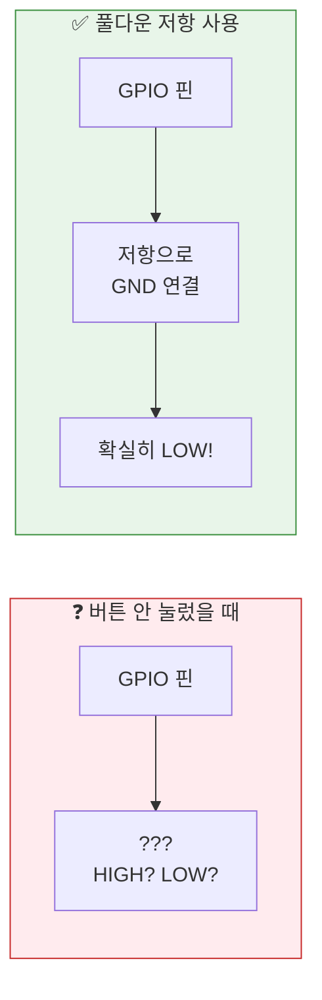
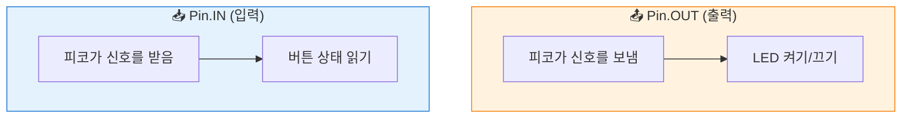
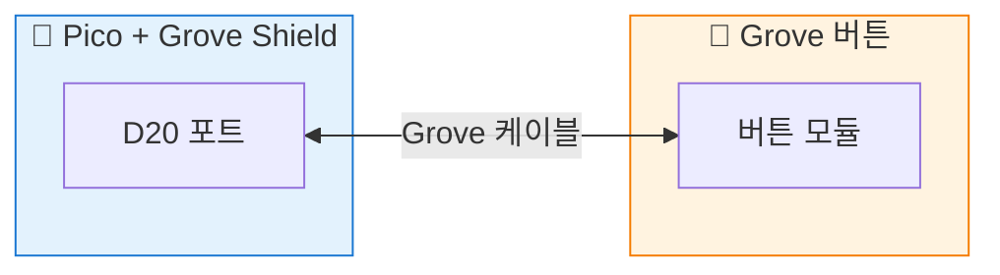

# Chapter 7: 버튼 연결하기 - 디지털 입력의 시작

## 🎯 이 장에서 배우는 것

- [ ] 푸시 버튼의 동작 원리를 이해할 수 있다
- [ ] 풀업/풀다운 저항이 왜 필요한지 설명할 수 있다
- [ ] 피코의 내부 풀다운 저항을 사용하여 버튼을 연결할 수 있다
- [ ] 버튼 상태를 읽어 화면에 출력할 수 있다

---

## 💡 왜 이걸 배우나요?

지금까지 우리는 피코에게 **일방적으로 명령**만 내렸어요. "LED 켜!", "LED 꺼!" 처럼요.

하지만 진짜 스마트한 기기는 **사용자의 입력을 받아** 반응해요. 스마트폰 화면을 터치하면 앱이 열리고, 리모컨 버튼을 누르면 TV 채널이 바뀌죠.

**버튼**은 가장 기본적인 입력 장치예요. 버튼 하나만 제대로 이해하면, 나중에 터치 센서, 모션 감지 센서 등 모든 **디지털 입력**의 원리를 파악할 수 있어요!

---

## 📚 핵심 개념

### 개념 1: 디지털 입력이란?

1. **비유로 시작**: 디지털 입력은 마치 **예/아니오 질문**과 같아요. "버튼 눌렸어?" → "응(1)" 또는 "아니(0)"

2. **정확한 정의**: 디지털 입력은 GPIO 핀으로 들어오는 전기 신호를 **HIGH(1)** 또는 **LOW(0)**로 읽는 것입니다.

3. **예시로 확인**: 버튼을 누르면 → 전기가 흐름 → HIGH(1), 버튼을 떼면 → 전기가 안 흐름 → LOW(0)

**쉽게 말하면**: 피코한테 "지금 버튼 눌렸어?"라고 물어보고 0 또는 1로 답을 받는 거예요!

---

### 개념 2: 풀다운 저항이 필요한 이유

버튼을 연결할 때 한 가지 문제가 있어요. 버튼을 **누르지 않았을 때** 핀이 어떤 상태인지 애매해요!



1. **비유로 시작**: 풀다운 저항은 마치 **기본값 설정**과 같아요. "아무것도 안 하면 0으로 해줘!"

2. **정확한 정의**: 풀다운 저항은 입력 핀을 GND(0V)에 연결하여, 아무 신호가 없을 때 **확실히 LOW 상태**를 유지하게 해줍니다.

3. **예시로 확인**: 
   - 버튼 안 눌림 → 풀다운 저항이 핀을 GND로 당김 → LOW(0)
   - 버튼 눌림 → 3.3V 전원이 연결됨 → HIGH(1)

**쉽게 말하면**: "버튼 안 누르면 무조건 0이야!"라고 확실히 정해주는 장치예요.

> 💡 **좋은 소식!** 피코에는 **내부 풀다운 저항**이 내장되어 있어서, 코드 한 줄로 쉽게 사용할 수 있어요!

---

### 개념 3: Pin.IN과 PULL_DOWN



| 모드 | 역할 | 사용 예 |
|------|------|---------|
| `Pin.OUT` | 피코가 신호를 **내보냄** | LED, 부저, 모터 |
| `Pin.IN` | 피코가 신호를 **받아들임** | 버튼, 센서 |
| `Pin.PULL_DOWN` | 내부 풀다운 저항 활성화 | 버튼 연결 시 필수! |

**쉽게 말하면**: `Pin.OUT`은 "말하기", `Pin.IN`은 "듣기"예요!

---

## 🔨 따라하기

### Step 1: Grove 버튼 연결하기

**목표**: Grove 버튼을 피코에 연결합니다.

Grove 버튼은 연결이 정말 간단해요! 케이블 하나로 끝!



**연결 방법**:
1. Grove 버튼 모듈을 준비해요
2. Grove 케이블로 **D20 포트**에 연결해요
3. 끝! 정말 간단하죠? 😄

> ⚠️ **주의**: Grove 케이블의 방향은 상관없어요. 어느 쪽으로 꽂아도 돼요!

---

### Step 2: 버튼 상태 읽기

**목표**: 버튼이 눌렸는지 안 눌렸는지 확인합니다.

**코드**:
```python
# === WHAT: 버튼 상태를 읽어서 출력하는 코드 ===
# 버튼을 누르면 1, 떼면 0이 출력돼요

# --- WHY: 왜 필요한지 ---
# 버튼이 제대로 연결됐는지 확인하고, 입력을 받는 방법을 배워요

# HOW: 어떻게 동작하는지
from machine import Pin  # 핀 제어를 위한 라이브러리
import time              # 시간 관련 기능

# 버튼을 D20 포트에 연결 (GP20 핀)
# Pin.IN: 입력 모드로 설정 (신호를 받아들임)
# Pin.PULL_DOWN: 내부 풀다운 저항 사용 (안 누르면 0)
button = Pin(20, Pin.IN, Pin.PULL_DOWN)

# 5번 반복해서 버튼 상태 확인
for i in range(5):
    state = button.value()  # 버튼 상태 읽기 (0 또는 1)
    print(f"버튼 상태: {state}")
    time.sleep(1)  # 1초 대기
```

**실행 결과**:
```
버튼 상태: 0
버튼 상태: 0
버튼 상태: 1    ← 이때 버튼을 누르고 있었어요!
버튼 상태: 1
버튼 상태: 0
```

**여기서 잠깐! 🤔**

`button.value()`는 **그 순간**의 버튼 상태만 읽어요. 
- 버튼을 누르는 순간에 읽으면 → 1
- 버튼을 떼고 있으면 → 0

---

### Step 3: 실시간으로 버튼 감지하기

**목표**: 버튼 상태가 바뀔 때만 메시지를 출력합니다.

**코드**:
```python
# === WHAT: 버튼 눌림/뗌을 감지하는 코드 ===
# 버튼 상태가 바뀔 때만 메시지가 출력돼요

# --- WHY: 왜 필요한지 ---
# 계속 같은 메시지가 출력되면 정신없어요!
# 상태가 "변할 때만" 알려주는 게 더 좋아요

# HOW: 어떻게 동작하는지
from machine import Pin
import time

button = Pin(20, Pin.IN, Pin.PULL_DOWN)

# 이전 버튼 상태를 기억하는 변수
last_state = 0

print("버튼을 눌러보세요! (Ctrl+C로 종료)")

while True:
    current_state = button.value()  # 현재 버튼 상태
    
    # 상태가 바뀌었을 때만 출력
    if current_state != last_state:
        if current_state == 1:
            print("🔘 버튼 눌림!")
        else:
            print("⚪ 버튼 뗌!")
        
        last_state = current_state  # 상태 업데이트
    
    time.sleep(0.05)  # 50ms 대기 (너무 빠른 확인 방지)
```

**실행 결과**:
```
버튼을 눌러보세요! (Ctrl+C로 종료)
🔘 버튼 눌림!
⚪ 버튼 뗌!
🔘 버튼 눌림!
⚪ 버튼 뗌!
```

**여기서 잠깐! 🤔**

`last_state` 변수가 핵심이에요! 이전 상태를 기억해서, **바뀔 때만** 반응하게 해요.
이런 방식을 **"엣지 감지(Edge Detection)"**라고 불러요.

---

## 📝 전체 코드

```python
# === 버튼 상태 감지 - 완성 코드 ===
# Grove 버튼을 D20 포트에 연결하세요
# 버튼을 누르면 "눌림!", 떼면 "뗌!" 출력

from machine import Pin
import time

# 버튼 설정: GP20, 입력 모드, 내부 풀다운 저항 사용
button = Pin(20, Pin.IN, Pin.PULL_DOWN)

# 이전 상태 기억용
last_state = 0
press_count = 0  # 누른 횟수 카운트

print("="*30)
print("🎮 버튼 테스트 시작!")
print("버튼을 눌러보세요 (Ctrl+C로 종료)")
print("="*30)

while True:
    current_state = button.value()
    
    if current_state != last_state:
        if current_state == 1:
            press_count += 1
            print(f"🔘 버튼 눌림! (총 {press_count}번)")
        else:
            print("⚪ 버튼 뗌!")
        
        last_state = current_state
    
    time.sleep(0.05)
```

---

## ⚠️ 자주 하는 실수

### 실수 1: PULL_DOWN을 빼먹음

**증상**: 버튼을 안 눌러도 1이 나오거나, 값이 계속 바뀜

**원인**: 풀다운 저항 없이 핀이 **떠 있는 상태(floating)**가 되어서 불안정해요

**해결**:
```python
# ❌ 잘못된 코드
button = Pin(20, Pin.IN)  # PULL_DOWN이 없어요!

# ✅ 올바른 코드
button = Pin(20, Pin.IN, Pin.PULL_DOWN)  # 내부 풀다운 저항 사용
```

---

### 실수 2: Pin.OUT으로 설정함

**증상**: `button.value()` 값이 이상하거나 버튼이 반응 안 함

**원인**: 출력 모드로 설정하면 신호를 **받는 게 아니라 보내는** 상태가 돼요

**해결**:
```python
# ❌ 잘못된 코드
button = Pin(20, Pin.OUT)  # 출력 모드네요!

# ✅ 올바른 코드
button = Pin(20, Pin.IN, Pin.PULL_DOWN)  # 입력 모드로!
```

---

### 실수 3: 포트 번호 혼동

**증상**: `버튼 상태: 0`만 계속 나옴

**원인**: 버튼은 D20 포트에 연결했는데, 코드에서 다른 핀 번호를 씀

**해결**:
```python
# ❌ 잘못된 코드 (D16 포트 번호)
button = Pin(16, Pin.IN, Pin.PULL_DOWN)

# ✅ 올바른 코드 (D20 포트 = GP20)
button = Pin(20, Pin.IN, Pin.PULL_DOWN)
```

> 💡 **팁**: Grove Shield의 포트 번호(D20)와 GPIO 핀 번호(GP20)의 숫자가 같아요!

---

## ✅ 스스로 점검하기

1. **`Pin.IN`과 `Pin.OUT`의 차이**는 무엇인가요?

2. **풀다운 저항**을 사용하지 않으면 어떤 문제가 생기나요?

3. 버튼을 **누르고 있을 때** `button.value()`의 값은 얼마인가요?

<details>
<summary>정답 확인</summary>

1. `Pin.IN`은 **입력 모드**로 외부 신호를 읽고, `Pin.OUT`은 **출력 모드**로 신호를 내보냅니다.

2. 풀다운 저항 없이는 버튼을 안 눌렀을 때 핀 상태가 **불안정(floating)**해져서, 값이 0과 1 사이를 왔다 갔다 해요.

3. **1**이에요! 버튼을 누르면 3.3V가 연결되어 HIGH(1) 상태가 됩니다.

</details>

---

## 🚀 더 해보기

### 도전 1: 버튼 누른 횟수 세기 (쉬움)
버튼을 누른 횟수를 세서 "총 5번 눌렸습니다!" 처럼 출력해보세요.
> 힌트: 전체 코드에 이미 `press_count` 변수가 있어요!

### 도전 2: 길게 누르기 감지 (중간)
버튼을 2초 이상 누르고 있으면 "길게 눌렸습니다!"라고 출력해보세요.
> 힌트: `time.ticks_ms()`로 시간을 잴 수 있어요!

### 도전 3: 더블 클릭 감지 (어려움) ⭐
버튼을 빠르게 2번 누르면 "더블 클릭!"이라고 출력해보세요.
> 힌트: 첫 번째 클릭 후 0.3초 이내에 두 번째 클릭이 오면 더블 클릭!

---

## 🔗 다음 장으로

이번 장에서 배운 것:
- ✅ 디지털 입력의 개념 (0 또는 1)
- ✅ 풀다운 저항의 필요성
- ✅ `Pin.IN`과 `Pin.PULL_DOWN` 사용법
- ✅ 버튼 상태 읽기와 변화 감지

**다음 장 예고**: 버튼으로 LED 제어하기! 🎮💡

버튼을 누르면 LED가 켜지고, 떼면 꺼지는 **버튼-LED 연동**을 만들어볼 거예요. 
그리고 버튼 한 번 누를 때마다 LED가 토글되는 **스위치 기능**도 구현해봐요!