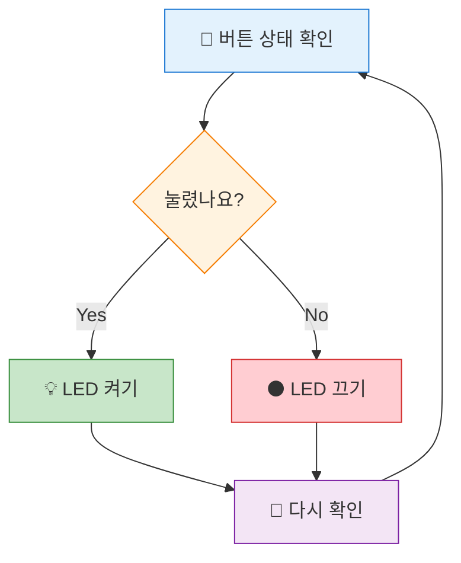
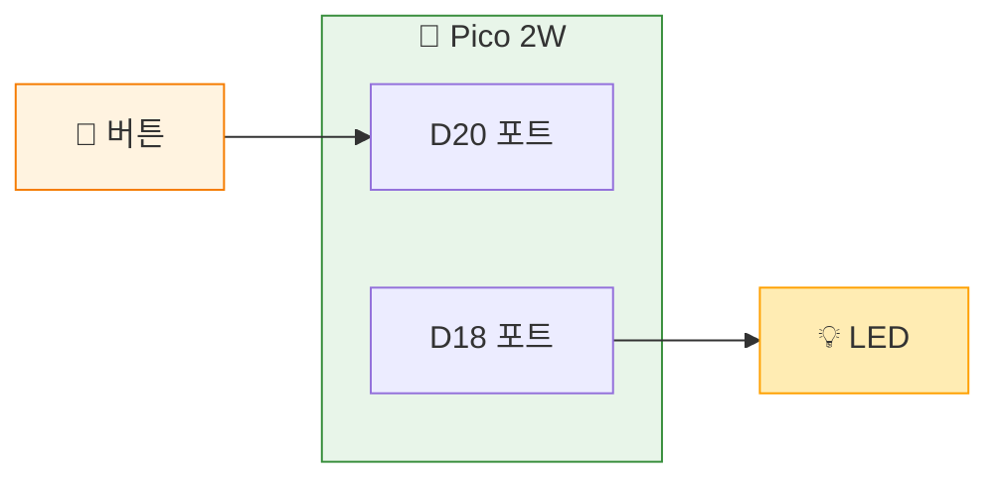
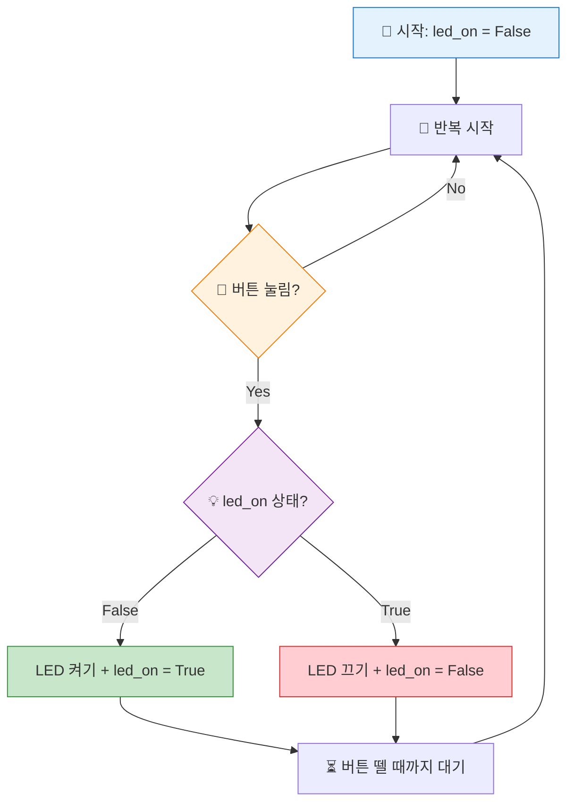

# 챕터 8: 누르면 반응해! - 조건문 활용

> **Part 3**: 입력을 받아라 - 버튼과 상호작용

---

## 🎯 이 장에서 배우는 것

- [ ] if-else 조건문의 구조와 동작을 이해할 수 있다
- [ ] 버튼을 누르면 LED가 켜지는 프로그램을 작성할 수 있다
- [ ] 토글 기능(누를 때마다 상태 변경)을 구현할 수 있다

---

## 💡 왜 이걸 배우나요?

여러분 집에 있는 전등 스위치를 생각해보세요. 누르면 켜지고, 다시 누르면 꺼지죠? 이게 바로 **조건문**의 핵심입니다!

프로그램이 똑똑해지려면 "상황에 따라 다르게 행동"해야 해요:
- 버튼이 눌렸으면 → LED 켜기
- 버튼이 안 눌렸으면 → LED 끄기

이런 **"만약 ~라면, ~해라"** 논리를 코드로 표현하는 게 조건문이에요. 조건문 없이는 스마트폰도, 게임도, 자동문도 만들 수 없답니다!

---

## 📚 핵심 개념

### 개념 1: 조건문 (if-else)

1. **비유로 시작**: "조건문은 마치 갈림길의 이정표와 같아요. '비가 오면 우산을 쓰고, 안 오면 그냥 가라'처럼요!"

2. **정확한 정의**: "조건문은 주어진 조건이 참(True)인지 거짓(False)인지에 따라 다른 코드를 실행하는 구조입니다."

3. **예시로 확인**:
```python
if 버튼이_눌렸다:
    LED를_켠다
else:
    LED를_끈다
```

**쉽게 말하면**: 조건문 = "만약 ~라면 A하고, 아니면 B해라"



### 개념 2: 토글(Toggle)

1. **비유로 시작**: "토글은 형광등 스위치예요. 한 번 누르면 켜지고, 다시 누르면 꺼지죠!"

2. **정확한 정의**: "토글은 한 번의 입력으로 상태를 반대로 바꾸는 동작입니다. ON→OFF, OFF→ON"

3. **예시로 확인**: 
   - 1번째 누름: 꺼짐 → 켜짐
   - 2번째 누름: 켜짐 → 꺼짐
   - 3번째 누름: 꺼짐 → 켜짐

**쉽게 말하면**: 토글 = "누를 때마다 반대로!"

---

## 🔨 따라하기

### Step 1: 버튼 누르면 LED 켜기

**목표**: 버튼을 누르고 있는 동안만 LED가 켜지게 만들기

**회로 연결**:
- Grove 버튼 → D20 포트
- Grove LED → D18 포트



**코드**:
```python
# === WHAT: 버튼으로 LED 제어하기 ===
# 버튼을 누르면 LED가 켜지고, 떼면 꺼져요

# --- WHY: 왜 필요한지 ---
# 입력(버튼)에 따라 출력(LED)을 제어하는 기본기를 배워요

# HOW: 어떻게 동작하는지
from machine import Pin  # 핀 제어 라이브러리
import time              # 시간 관련 기능

# 버튼 설정: 입력 모드, 풀다운 저항 사용
button = Pin(20, Pin.IN, Pin.PULL_DOWN)

# LED 설정: 출력 모드
led = Pin(18, Pin.OUT)

# 무한 반복
while True:
    if button.value() == 1:  # 버튼이 눌렸으면 (1 = 눌림)
        led.on()              # LED 켜기
    else:                     # 버튼이 안 눌렸으면
        led.off()             # LED 끄기
    
    time.sleep(0.1)  # 0.1초 대기 (CPU 부하 방지)
```

**실행 결과**:
```
버튼을 누르고 있으면 → LED 켜짐 💡
버튼을 떼면 → LED 꺼짐 ⚫
```

**여기서 잠깐! 🤔**

`Pin.PULL_DOWN`이 뭐냐고요? 버튼을 안 눌렀을 때 **확실하게 0**이 되도록 해주는 설정이에요. 이게 없으면 버튼 상태가 불안정해져서 LED가 깜빡거릴 수 있어요!

---

### Step 2: 토글 기능 구현하기

**목표**: 버튼을 한 번 누르면 켜지고, 다시 누르면 꺼지게 만들기

**핵심 아이디어**: LED의 현재 상태를 **변수에 기억**해두고, 버튼을 누를 때마다 **반대로** 바꿔요!



**코드**:
```python
# === WHAT: 토글 스위치 만들기 ===
# 버튼을 누를 때마다 LED가 켜졌다 꺼졌다 해요

# --- WHY: 왜 필요한지 ---
# 실제 전등 스위치처럼 동작하는 프로그램을 만들어요

# HOW: 어떻게 동작하는지
from machine import Pin
import time

button = Pin(20, Pin.IN, Pin.PULL_DOWN)
led = Pin(18, Pin.OUT)

# 💾 LED 상태를 기억하는 변수 (처음엔 꺼진 상태)
led_on = False

while True:
    if button.value() == 1:  # 버튼이 눌렸으면
        # 상태 반전! (True↔False)
        if led_on == False:
            led.on()
            led_on = True
            print("LED 켜짐! 💡")
        else:
            led.off()
            led_on = False
            print("LED 꺼짐! ⚫")
        
        # ⏳ 버튼을 뗄 때까지 대기 (중요!)
        while button.value() == 1:
            time.sleep(0.01)
        
        time.sleep(0.1)  # 디바운싱 (채터링 방지)
```

**실행 결과**:
```
(버튼 1번째 누름)
LED 켜짐! 💡

(버튼 2번째 누름)
LED 꺼짐! ⚫

(버튼 3번째 누름)
LED 켜짐! 💡
```

**여기서 잠깐! 🤔**

"버튼을 뗄 때까지 대기"하는 코드가 왜 필요할까요? 

버튼을 누르는 동안 `while True` 루프가 엄청 빠르게 돌아요. 그래서 한 번 눌렀는데 여러 번 눌린 것처럼 인식될 수 있어요! 이 대기 코드가 **한 번 누름 = 한 번 동작**을 보장해줍니다.

---

### Step 3: 더 깔끔한 토글 코드

**목표**: `not` 연산자로 토글 코드를 간단하게!

**코드**:
```python
# === WHAT: 깔끔한 토글 코드 ===
# not 연산자로 상태를 한 줄에 반전!

from machine import Pin
import time

button = Pin(20, Pin.IN, Pin.PULL_DOWN)
led = Pin(18, Pin.OUT)

led_on = False

while True:
    if button.value() == 1:
        # 🎯 핵심: not으로 True↔False 반전!
        led_on = not led_on
        
        # LED 상태 적용
        if led_on:
            led.on()
        else:
            led.off()
        
        print(f"LED 상태: {'켜짐 💡' if led_on else '꺼짐 ⚫'}")
        
        # 버튼 뗄 때까지 대기
        while button.value() == 1:
            time.sleep(0.01)
        
        time.sleep(0.1)
```

**`not` 연산자란?**
- `not True` → `False`
- `not False` → `True`

한 줄로 상태를 뒤집을 수 있어서 코드가 훨씬 깔끔해져요!

---

## 📝 전체 코드

```python
# === 토글 LED 스위치 - 완성 버전 ===
# 버튼을 누를 때마다 LED가 켜졌다 꺼졌다 합니다
# 
# 연결:
#   - Grove 버튼 → D20 포트
#   - Grove LED → D18 포트

from machine import Pin
import time

# 하드웨어 설정
button = Pin(20, Pin.IN, Pin.PULL_DOWN)  # 버튼: 입력
led = Pin(18, Pin.OUT)                    # LED: 출력

# 상태 변수
led_on = False

print("🔘 토글 스위치 프로그램 시작!")
print("버튼을 눌러 LED를 켜고 끄세요.\n")

while True:
    # 버튼이 눌렸는지 확인
    if button.value() == 1:
        # 상태 반전
        led_on = not led_on
        
        # LED에 상태 적용
        if led_on:
            led.on()
            print("💡 LED ON")
        else:
            led.off()
            print("⚫ LED OFF")
        
        # 버튼에서 손 뗄 때까지 대기
        while button.value() == 1:
            time.sleep(0.01)
        
        # 디바운싱
        time.sleep(0.1)
    
    time.sleep(0.01)  # CPU 부하 방지
```

---

## ⚠️ 자주 하는 실수

### 실수 1: 버튼 한 번 눌렀는데 여러 번 동작해요!

**증상**: 버튼을 한 번만 눌렀는데 LED가 막 깜빡거림

**원인**: 버튼에서 손 뗄 때까지 기다리는 코드가 없어서, 루프가 빠르게 돌면서 여러 번 인식됨

**해결**:
```python
# ❌ 잘못된 코드
if button.value() == 1:
    led_on = not led_on
    # 바로 다음 루프로 넘어감 → 계속 눌린 걸로 인식!

# ✅ 올바른 코드
if button.value() == 1:
    led_on = not led_on
    
    # 버튼 뗄 때까지 대기!
    while button.value() == 1:
        time.sleep(0.01)
```

### 실수 2: LED 상태가 안 바뀌어요!

**증상**: 버튼을 눌러도 LED가 계속 꺼져있거나 계속 켜져있음

**원인**: `led.on()`/`led.off()`를 빠뜨림 (변수만 바꾸고 실제 LED는 안 바꿈)

**해결**:
```python
# ❌ 잘못된 코드
led_on = not led_on  # 변수만 바꿈
# LED는 그대로!

# ✅ 올바른 코드
led_on = not led_on  # 변수 바꾸고
if led_on:
    led.on()   # 실제 LED도 켜기!
else:
    led.off()  # 실제 LED도 끄기!
```

### 실수 3: `PULL_DOWN` 빠뜨림

**증상**: 버튼을 안 눌러도 LED가 불규칙하게 반응함

**원인**: 풀다운 저항 없이 버튼 입력이 불안정함 (플로팅 상태)

**해결**:
```python
# ❌ 잘못된 코드
button = Pin(20, Pin.IN)  # 풀다운 없음 → 불안정!

# ✅ 올바른 코드
button = Pin(20, Pin.IN, Pin.PULL_DOWN)  # 풀다운 추가!
```

---

## ✅ 스스로 점검하기

1. **if-else 문에서 조건이 참(True)일 때 실행되는 부분은 어디인가요?**

2. **토글 기능을 구현할 때 왜 상태를 저장하는 변수가 필요한가요?**

3. **`not True`의 결과는 무엇인가요?**

4. **버튼을 뗄 때까지 대기하는 코드가 없으면 어떤 문제가 생기나요?**

<details>
<summary>정답 확인</summary>

1. `if` 바로 다음에 들여쓰기된 코드 블록이 실행됩니다.

2. 버튼을 누를 때마다 "현재 LED가 켜져있는지 꺼져있는지"를 알아야 반대 동작을 할 수 있기 때문이에요. 기억이 없으면 매번 "켜!"만 하게 됩니다.

3. `False`입니다. `not`은 참/거짓을 반대로 뒤집어요.

4. 버튼을 한 번만 눌러도 루프가 빠르게 돌면서 여러 번 눌린 것처럼 인식되어, LED가 깜빡거립니다.

</details>

---

## 🚀 더 해보기

### 도전 1: LED 2개 토글 (쉬움)
버튼을 누를 때마다 두 개의 LED가 번갈아 켜지게 만들어보세요!
- 1번 누름: LED1 켜짐, LED2 꺼짐
- 2번 누름: LED1 꺼짐, LED2 켜짐

### 도전 2: 버튼 카운터 (중간)
버튼을 누른 횟수를 세서 출력해보세요.
```
버튼 눌림! 총 1번
버튼 눌림! 총 2번
버튼 눌림! 총 3번
```
힌트: `count = count + 1` 또는 `count += 1`

### 도전 3: 길게 누르기 vs 짧게 누르기 (어려움) ⭐
- 짧게 누르면(1초 미만): LED 토글
- 길게 누르면(1초 이상): LED 3번 깜빡이기

힌트: `time.ticks_ms()`로 시간을 잴 수 있어요!

---

## 🔗 다음 장으로

축하해요! 🎉 이번 장에서 배운 것:
- **if-else 조건문**으로 상황에 따라 다르게 동작하기
- **버튼 입력**을 읽어서 **LED 출력** 제어하기
- **토글 기능**으로 누를 때마다 상태 바꾸기
- **상태 변수**로 현재 상태 기억하기

다음 장에서는 **센서로 세상 읽기**를 배워요! 온도, 습도, 밝기... 피코가 주변 환경을 느끼고 반응하게 만들어봐요. 버튼은 사람이 직접 눌러야 하지만, 센서는 **자동으로** 환경을 감지한답니다! 🌡️