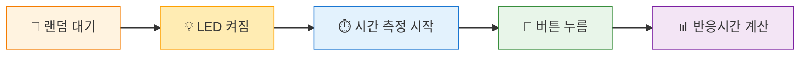
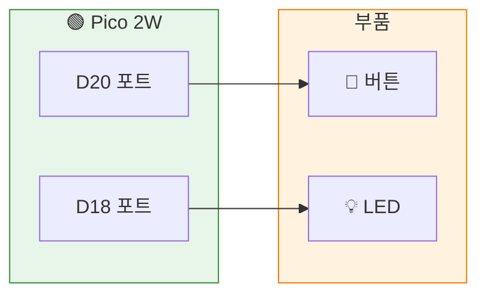

# Chapter 9: 반응속도 게임 만들기

## 🎯 이 장에서 배우는 것

- [ ] `time.ticks_ms()` 함수로 시간을 측정할 수 있다
- [ ] `random` 모듈로 예측 불가능한 대기 시간을 만들 수 있다
- [ ] 버튼과 LED를 조합해 반응속도 게임을 완성할 수 있다

---

## 💡 왜 이걸 배우나요?

스마트폰 게임에서 "정확한 타이밍에 터치하세요!"라는 미션을 본 적 있나요? 이런 게임들은 모두 **시간 측정**과 **랜덤 이벤트**를 활용합니다.

오늘 배울 기술은 게임뿐 아니라 실제로도 많이 쓰여요:
- 🏃 체육 시간의 반응속도 측정
- 🚗 자동차 급정거 시스템의 반응 시간
- 🎮 게임 컨트롤러의 입력 지연 측정

무엇보다, **친구들과 "누가 더 빠른가" 대결**을 할 수 있어요! 🏆

---

## 📚 핵심 개념

### 개념 1: 시간 측정 (time.ticks_ms)

1. **비유로 시작**: 스톱워치를 생각해보세요. 시작 버튼을 누르고, 멈춤 버튼을 누르면 그 사이 시간이 나오죠? `ticks_ms()`가 바로 그 스톱워치예요.

2. **정확한 정의**: `time.ticks_ms()`는 피코가 켜진 후 지난 시간을 **밀리초(1/1000초)** 단위로 알려주는 함수입니다.

3. **예시로 확인**:
```python
import time
시작 = time.ticks_ms()  # 지금 시간 기록
time.sleep(1)           # 1초 대기
끝 = time.ticks_ms()    # 다시 시간 기록
경과 = time.ticks_diff(끝, 시작)  # 차이 계산
print(f"경과 시간: {경과}ms")  # 약 1000ms 출력
```

**쉽게 말하면**: 시작 시간을 기록하고, 끝 시간을 기록한 뒤, 둘의 차이를 구하면 경과 시간이에요!

---

### 개념 2: 랜덤 함수 (random)

1. **비유로 시작**: 주사위를 던지면 1~6 중 어떤 숫자가 나올지 모르죠? `random`은 컴퓨터가 주사위를 던지는 거예요.

2. **정확한 정의**: `random` 모듈은 예측할 수 없는 무작위 숫자를 만들어주는 기능입니다.

3. **예시로 확인**:
```python
import random
대기시간 = random.randint(2, 5)  # 2~5 중 무작위 숫자
print(f"대기 시간: {대기시간}초")
```

**쉽게 말하면**: `randint(최소, 최대)`는 그 범위 안에서 무작위 정수를 골라줘요!

---

### 개념 흐름 한눈에 보기



---

## 🔨 따라하기

### Step 1: 시간 측정 연습

**목표**: 버튼을 누르는 데 걸린 시간 측정하기

**회로 연결**:
- Grove 버튼 → D20 포트
- Grove LED → D18 포트



**코드**:
```python
# === WHAT: 버튼 누르는 시간 측정 ===
# 버튼을 누르면 얼마나 걸렸는지 알려주는 코드

# --- WHY: 왜 필요한지 ---
# 반응속도 게임의 핵심! 시간 측정 방법을 먼저 익혀요

# HOW: 어떻게 동작하는지
from machine import Pin
import time

button = Pin(20, Pin.IN, Pin.PULL_DOWN)  # 버튼: D20

print("버튼을 누르세요!")
시작시간 = time.ticks_ms()  # 지금 시간 기록

while button.value() == 0:  # 버튼 안 눌린 동안 대기
    pass

끝시간 = time.ticks_ms()  # 버튼 눌린 시간 기록
걸린시간 = time.ticks_diff(끝시간, 시작시간)

print(f"걸린 시간: {걸린시간}ms")
```

**실행 결과**:
```
버튼을 누르세요!
걸린 시간: 2341ms
```

**여기서 잠깐! 🤔**
`ticks_diff()`를 쓰는 이유가 있어요. 단순히 `끝-시작`으로 계산하면 오버플로우 문제가 생길 수 있거든요. `ticks_diff()`가 이걸 안전하게 처리해줍니다!

---

### Step 2: 랜덤 대기 시간 추가

**목표**: 예측 불가능한 시점에 LED 켜기

**코드**:
```python
# === WHAT: 랜덤 시간 후 LED 켜기 ===
# 언제 켜질지 모르니까 긴장하게 만드는 코드

# --- WHY: 왜 필요한지 ---
# 타이밍을 예측할 수 있으면 게임이 안 돼요!

# HOW: 어떻게 동작하는지
from machine import Pin
import time
import random

led = Pin(18, Pin.OUT)    # LED: D18
button = Pin(20, Pin.IN, Pin.PULL_DOWN)

print("LED가 켜지면 버튼을 누르세요!")
print("준비...")

대기시간 = random.randint(2, 5)  # 2~5초 중 랜덤
time.sleep(대기시간)

led.on()  # LED 켜기
시작시간 = time.ticks_ms()

while button.value() == 0:
    pass

끝시간 = time.ticks_ms()
led.off()

반응시간 = time.ticks_diff(끝시간, 시작시간)
print(f"반응 시간: {반응시간}ms")
```

**실행 결과**:
```
LED가 켜지면 버튼을 누르세요!
준비...
(2~5초 후 LED 켜짐)
반응 시간: 287ms
```

**여기서 잠깐! 🤔**
평균 반응속도는 200~300ms 정도예요. 200ms 이하면 꽤 빠른 편이고, 150ms 이하면 프로게이머급!

---

### Step 3: 부정행위 방지하기

**목표**: LED 켜지기 전에 누르면 "부정행위!" 출력

**코드**:
```python
# === WHAT: 부정행위 감지 기능 추가 ===
# 미리 누르면 잡아내는 코드

# --- WHY: 왜 필요한지 ---
# 공정한 게임을 위해 필수!

# HOW: 어떻게 동작하는지
from machine import Pin
import time
import random

led = Pin(18, Pin.OUT)
button = Pin(20, Pin.IN, Pin.PULL_DOWN)

print("LED가 켜지면 버튼을 누르세요!")
print("준비...")

대기시간 = random.randint(2, 5)

# 대기 중 버튼 체크
for i in range(대기시간 * 10):  # 0.1초 단위로 체크
    if button.value() == 1:
        print("🚫 부정행위! 너무 빨리 눌렀어요!")
        led.off()
        raise SystemExit  # 프로그램 종료
    time.sleep(0.1)

led.on()
시작시간 = time.ticks_ms()

while button.value() == 0:
    pass

끝시간 = time.ticks_ms()
led.off()

반응시간 = time.ticks_diff(끝시간, 시작시간)
print(f"✅ 반응 시간: {반응시간}ms")
```

---

## 📝 전체 코드

```python
# === 반응속도 게임 완성판 ===
# 버튼: D20, LED: D18에 연결하세요

from machine import Pin
import time
import random

# 핀 설정
led = Pin(18, Pin.OUT)
button = Pin(20, Pin.IN, Pin.PULL_DOWN)

def 게임시작():
    print("\n🎮 반응속도 게임!")
    print("LED가 켜지면 최대한 빨리 버튼을 누르세요!")
    print("=" * 30)
    
    for 라운드 in range(1, 4):  # 3라운드
        print(f"\n[라운드 {라운드}] 준비...")
        time.sleep(1)
        
        대기시간 = random.randint(2, 5)
        부정행위 = False
        
        # 대기 중 버튼 체크
        for i in range(대기시간 * 10):
            if button.value() == 1:
                print("🚫 부정행위! 다시 시도하세요.")
                부정행위 = True
                break
            time.sleep(0.1)
        
        if 부정행위:
            continue  # 다음 라운드로
        
        # LED 켜고 시간 측정
        led.on()
        시작 = time.ticks_ms()
        
        while button.value() == 0:
            pass
        
        끝 = time.ticks_ms()
        led.off()
        
        반응시간 = time.ticks_diff(끝, 시작)
        
        # 결과 출력
        if 반응시간 < 200:
            print(f"⚡ {반응시간}ms - 번개같이 빨라요!")
        elif 반응시간 < 300:
            print(f"✨ {반응시간}ms - 좋은 반응속도!")
        else:
            print(f"👍 {반응시간}ms - 다음엔 더 빨리!")
        
        time.sleep(1)
    
    print("\n🏁 게임 종료!")

# 게임 실행
게임시작()
```

---

## ⚠️ 자주 하는 실수

### 실수 1: 시간 차이 계산을 잘못함

**증상**: 음수가 나오거나 이상한 값이 나옴

**원인**: 단순 뺄셈 사용

**해결**:
```python
# 잘못된 코드
걸린시간 = 끝시간 - 시작시간

# 올바른 코드
걸린시간 = time.ticks_diff(끝시간, 시작시간)
```

---

### 실수 2: 버튼 상태 체크 조건 오류

**증상**: 버튼을 안 눌러도 바로 통과됨

**원인**: PULL_DOWN 설정 누락 또는 조건문 방향 오류

**해결**:
```python
# 잘못된 코드
button = Pin(20, Pin.IN)  # PULL_DOWN 없음
while button.value() == 1:  # 조건 반대
    pass

# 올바른 코드
button = Pin(20, Pin.IN, Pin.PULL_DOWN)
while button.value() == 0:  # 0일 때 = 안 눌림
    pass
```

---

### 실수 3: random 모듈 import 누락

**증상**: `NameError: name 'random' is not defined`

**원인**: import 문 빠뜨림

**해결**:
```python
# 잘못된 코드
대기시간 = random.randint(2, 5)  # 오류!

# 올바른 코드
import random  # 꼭 추가!
대기시간 = random.randint(2, 5)
```

---

## ✅ 스스로 점검하기

1. **`time.ticks_ms()`는 무엇을 반환하나요?**

2. **`random.randint(1, 10)`이 반환할 수 있는 값의 범위는?**

3. **왜 `ticks_diff()` 함수를 사용해야 하나요?**

<details>
<summary>정답 확인</summary>

1. 피코가 켜진 후 지난 시간을 **밀리초(ms)** 단위로 반환합니다.

2. **1부터 10까지** (1과 10 포함)

3. 단순 뺄셈은 시간 값이 최대치를 넘어가면(오버플로우) 잘못된 결과가 나올 수 있어요. `ticks_diff()`는 이를 안전하게 처리해줍니다.

</details>

---

## 🚀 더 해보기

### 도전 1: 최고 기록 저장하기
3라운드 중 가장 빠른 기록을 저장하고 마지막에 출력해보세요.

**힌트**: `min()` 함수와 리스트 활용

---

### 도전 2: 평균 반응시간 계산
3라운드의 평균 반응시간을 계산해서 출력해보세요.

**힌트**: 리스트에 기록 저장 → `sum() / len()` 계산

---

### 도전 3: 2인용 대결 모드 ⭐
버튼 2개를 사용해서 누가 먼저 누르는지 대결하는 모드를 만들어보세요!

**힌트**: 버튼 2개 설정, `while` 루프에서 둘 다 체크

---

## 🔗 다음 장으로

오늘 배운 것:
- ⏱️ `time.ticks_ms()`로 정밀한 시간 측정
- 🎲 `random.randint()`로 예측 불가능한 동작 구현
- 🎮 버튼과 LED를 조합한 인터랙티브 게임 완성!

**다음 장 예고**: 이제 진짜 "화면"에 정보를 표시해볼 거예요! OLED 디스플레이를 연결해서 반응시간을 화면에 띄우고, 더 멋진 프로젝트를 만들어봅시다. 📺