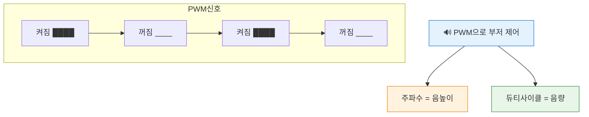
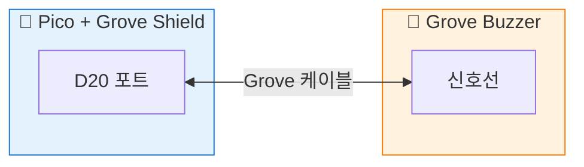

# 삐- 소리의 원리 - 부저 연결과 PWM

## 🎯 이 장에서 배우는 것

- [ ] 피에조 부저가 소리를 내는 원리를 설명할 수 있다
- [ ] PWM(펄스 폭 변조)의 개념을 이해하고 설명할 수 있다
- [ ] 주파수를 변경하여 다른 높이의 음을 연주할 수 있다
- [ ] 간단한 멜로디를 코드로 만들어 재생할 수 있다

---

## 💡 왜 이걸 배우나요?

알람 시계가 울릴 때, 전자레인지가 "삐-" 할 때, 게임에서 효과음이 날 때... 이 모든 소리는 어떻게 만들어질까요?

피에조 부저는 가장 단순한 형태의 전자 스피커입니다. 전기 신호를 주면 진동해서 소리를 냅니다. 그리고 이 진동 속도를 조절하면 **높은 음, 낮은 음**을 자유롭게 만들 수 있어요!

이번 장에서 배울 **PWM(Pulse Width Modulation)** 기술은 부저뿐 아니라 LED 밝기 조절, 모터 속도 제어 등 피지컬 컴퓨팅의 핵심 기술입니다. 소리라는 재미있는 결과물로 PWM을 익혀봅시다!

---

## 📚 핵심 개념

### 개념 1: 피에조 부저의 원리

1. **비유로 시작**: 피에조 부저는 마치 **빠르게 떨리는 딱지**와 같아요. 딱지를 천천히 튕기면 낮은 소리, 빠르게 튕기면 높은 소리가 나죠?

2. **정확한 정의**: 피에조 부저는 전기 신호를 받으면 내부의 얇은 판(진동판)이 움직여서 공기를 진동시키고, 이 진동이 우리 귀에 소리로 들립니다.

3. **예시로 확인**: 
   - 1초에 262번 진동 → "도" 음
   - 1초에 440번 진동 → "라" 음 (기준음)
   - 1초에 523번 진동 → 높은 "도" 음

**쉽게 말하면**: 전기로 판을 빠르게 떨어서 소리를 만드는 장치입니다!


---

### 개념 2: 주파수와 음높이

1. **비유로 시작**: 주파수는 마치 **줄넘기 속도**와 같아요. 1초에 몇 번 줄을 돌리는지가 주파수예요.

2. **정확한 정의**: 주파수(Hz, 헤르츠)는 1초 동안 진동하는 횟수입니다. 주파수가 높을수록 높은 음, 낮을수록 낮은 음이 납니다.

3. **예시로 확인**:

| 음이름 | 주파수(Hz) | 느낌 |
|:---:|:---:|:---:|
| 도(C4) | 262 | 기본 |
| 레(D4) | 294 | 조금 높음 |
| 미(E4) | 330 | |
| 파(F4) | 349 | |
| 솔(G4) | 392 | |
| 라(A4) | 440 | 기준음! |
| 시(B4) | 494 | |
| 높은도(C5) | 523 | 한 옥타브 위 |

**쉽게 말하면**: 1초에 몇 번 떨리는지 = 주파수, 많이 떨릴수록 높은 소리!

---

### 개념 3: PWM (펄스 폭 변조)

1. **비유로 시작**: PWM은 마치 **빠르게 껐다 켰다 하는 스위치**와 같아요. 너무 빨라서 우리 눈(귀)에는 연속적으로 느껴지죠.

2. **정확한 정의**: PWM은 디지털 신호(0 또는 1)를 아주 빠르게 켜고 꺼서 마치 중간값(아날로그)처럼 만드는 기술입니다.

3. **예시로 확인**:
   - LED에 PWM 적용 → 밝기 조절 (50% 켜짐 = 반만 밝음)
   - 부저에 PWM 적용 → 특정 주파수로 소리 발생



**쉽게 말하면**: 엄청 빠르게 껐다켜서 원하는 효과를 만드는 기술!

---

## 🔨 따라하기

### Step 1: 부저 연결하기

**목표**: Grove 부저를 피코에 연결합니다.

Grove 부저를 **D20 포트**에 연결하세요. Grove 케이블을 사용하면 핀 연결을 고민할 필요 없이 포트에 꽂기만 하면 됩니다!



**여기서 잠깐! 🤔**  
Grove Shield의 D20 포트는 GP20 핀에 연결되어 있어요. 코드에서는 `Pin(20)`으로 접근합니다.

---

### Step 2: 첫 소리 내기 - "삐-"

**목표**: 가장 간단한 방법으로 부저 소리를 냅니다.

**코드**:
```python
# === WHAT: 부저로 "삐-" 소리 내기 ===
# 가장 기본적인 부저 테스트 코드입니다

# --- WHY: 부저가 제대로 연결됐는지 확인 ---
# PWM 없이 단순히 켜고 끄는 것만으로도 소리가 납니다

from machine import Pin, PWM  # 핀 제어와 PWM 기능
import time                    # 시간 지연용

# 부저를 PWM 모드로 설정 (GP20 핀)
buzzer = PWM(Pin(20))

# 주파수 설정: 1000Hz = 1초에 1000번 진동
buzzer.freq(1000)

# 듀티 사이클: 32768 = 50% (최대값 65535의 절반)
buzzer.duty_u16(32768)

# 0.5초 동안 소리 유지
time.sleep(0.5)

# 소리 끄기: 듀티를 0으로
buzzer.duty_u16(0)

print("삐- 완료!")
```

**실행 결과**:
```
삐- 완료!
```
(동시에 부저에서 0.5초간 "삐-" 소리가 납니다)

**여기서 잠깐! 🤔**  
- `freq(1000)`: 1초에 1000번 진동 = 1000Hz
- `duty_u16(32768)`: 소리 크기 (0~65535 중 절반)
- `duty_u16(0)`: 소리 끄기

---

### Step 3: 음계 연주하기 - "도레미"

**목표**: 주파수를 바꿔서 다른 음을 냅니다.

**코드**:
```python
# === WHAT: 도레미파솔라시도 연주하기 ===
# 주파수를 바꿔서 다른 음높이를 만듭니다

# --- WHY: 각 음은 고유한 주파수를 가짐 ---
# 도=262Hz, 레=294Hz, 미=330Hz... 이렇게 정해져 있어요

from machine import Pin, PWM
import time

buzzer = PWM(Pin(20))

# 음계별 주파수 (Hz)
notes = {
    'C4': 262,  # 도
    'D4': 294,  # 레
    'E4': 330,  # 미
    'F4': 349,  # 파
    'G4': 392,  # 솔
    'A4': 440,  # 라
    'B4': 494,  # 시
    'C5': 523   # 높은 도
}

# 음을 연주하는 함수
def play_tone(frequency, duration):
    """주어진 주파수로 duration초 동안 소리를 냅니다"""
    buzzer.freq(frequency)      # 주파수 설정
    buzzer.duty_u16(32768)      # 소리 켜기
    time.sleep(duration)        # 지정 시간 대기
    buzzer.duty_u16(0)          # 소리 끄기
    time.sleep(0.05)            # 음 사이 짧은 쉼

# 도레미파솔라시도 연주!
print("🎵 도레미파솔라시도 연주 시작!")

for note_name, freq in notes.items():
    print(f"  {note_name}: {freq}Hz")
    play_tone(freq, 0.3)  # 0.3초씩 연주

print("🎵 연주 완료!")
```

**실행 결과**:
```
🎵 도레미파솔라시도 연주 시작!
  C4: 262Hz
  D4: 294Hz
  E4: 330Hz
  F4: 349Hz
  G4: 392Hz
  A4: 440Hz
  B4: 494Hz
  C5: 523Hz
🎵 연주 완료!
```

**여기서 잠깐! 🤔**  
주파수가 높아질수록 음이 높아지는 것을 귀로 확인해보세요!

---

### Step 4: 간단한 멜로디 연주

**목표**: "학교종이 땡땡땡" 멜로디를 연주합니다.

**코드**:
```python
# === WHAT: "학교종" 멜로디 연주 ===
# 음표 배열을 만들어 멜로디를 연주합니다

# --- WHY: 실제 음악처럼 연주하려면 ---
# 음의 순서와 길이를 배열로 정리하면 편합니다

from machine import Pin, PWM
import time

buzzer = PWM(Pin(20))

# 음계 주파수 정의
C4, D4, E4, F4, G4, A4, B4, C5 = 262, 294, 330, 349, 392, 440, 494, 523
REST = 0  # 쉼표 (소리 없음)

def play(freq, duration):
    """음을 연주하는 함수"""
    if freq == 0:  # 쉼표
        buzzer.duty_u16(0)
    else:
        buzzer.freq(freq)
        buzzer.duty_u16(32768)
    time.sleep(duration)
    buzzer.duty_u16(0)
    time.sleep(0.03)

# "학교종이 땡땡땡" 멜로디
# (솔솔라라 솔솔미- 솔솔미미 레레레-)
melody = [
    (G4, 0.3), (G4, 0.3), (A4, 0.3), (A4, 0.3),
    (G4, 0.3), (G4, 0.3), (E4, 0.6),
    (G4, 0.3), (G4, 0.3), (E4, 0.3), (E4, 0.3),
    (D4, 0.3), (D4, 0.3), (D4, 0.6)
]

print("🎵 학교종이 땡땡땡 연주!")

for note, duration in melody:
    play(note, duration)

print("🎵 연주 끝!")
```

**실행 결과**:
```
🎵 학교종이 땡땡땡 연주!
🎵 연주 끝!
```

---

## 📝 전체 코드

아래 코드를 복사해서 바로 실행할 수 있습니다:

```python
# === 부저로 멜로디 연주하기 - 완성 코드 ===
# Grove 부저를 D20 포트에 연결하세요

from machine import Pin, PWM
import time

# 부저 초기화
buzzer = PWM(Pin(20))

# 음계 주파수 사전
NOTES = {
    'C4': 262, 'D4': 294, 'E4': 330, 'F4': 349,
    'G4': 392, 'A4': 440, 'B4': 494, 'C5': 523,
    'REST': 0
}

def play_tone(note, duration):
    """음을 연주합니다"""
    freq = NOTES.get(note, 0)
    if freq == 0:
        buzzer.duty_u16(0)
    else:
        buzzer.freq(freq)
        buzzer.duty_u16(32768)
    time.sleep(duration)
    buzzer.duty_u16(0)
    time.sleep(0.03)

def play_scale():
    """도레미파솔라시도 연주"""
    print("🎵 음계 연주!")
    for note in ['C4', 'D4', 'E4', 'F4', 'G4', 'A4', 'B4', 'C5']:
        play_tone(note, 0.25)

def play_school_bell():
    """학교종 연주"""
    print("🎵 학교종이 땡땡땡!")
    song = [
        ('G4', 0.3), ('G4', 0.3), ('A4', 0.3), ('A4', 0.3),
        ('G4', 0.3), ('G4', 0.3), ('E4', 0.5),
        ('G4', 0.3), ('G4', 0.3), ('E4', 0.3), ('E4', 0.3),
        ('D4', 0.3), ('D4', 0.3), ('D4', 0.5)
    ]
    for note, dur in song:
        play_tone(note, dur)

# 실행
play_scale()
time.sleep(0.5)
play_school_bell()
print("✅ 완료!")
```

---

## ⚠️ 자주 하는 실수

### 실수 1: 소리가 안 난다

**증상**: 코드 실행은 되는데 부저에서 소리가 안 남

**원인**: 
- 연결 포트가 잘못됨
- 듀티 사이클이 0으로 설정됨

**해결**:
```python
# 잘못된 코드 - 포트 번호 오류
buzzer = PWM(Pin(16))  # D16이 아닌 D20에 연결했다면

# 올바른 코드 - 연결한 포트 번호 확인
buzzer = PWM(Pin(20))  # D20 포트 = GP20
```

---

### 실수 2: 이상한 음이 난다

**증상**: 소리는 나는데 원하는 음이 아님

**원인**: 주파수 값이 잘못됨

**해결**:
```python
# 잘못된 코드 - 주파수 단위 착각
buzzer.freq(262000)  # 262000Hz는 초음파 영역!

# 올바른 코드 - 올바른 주파수
buzzer.freq(262)  # 262Hz = 도(C4)
```

---

### 실수 3: 소리가 안 꺼진다

**증상**: 프로그램이 끝나도 부저가 계속 울림

**원인**: 프로그램 종료 전 듀티를 0으로 안 함

**해결**:
```python
# 잘못된 코드 - 끄는 코드 없음
buzzer.freq(440)
buzzer.duty_u16(32768)
time.sleep(1)
# 프로그램 끝... 하지만 소리는 계속!

# 올바른 코드 - 반드시 끄기
buzzer.freq(440)
buzzer.duty_u16(32768)
time.sleep(1)
buzzer.duty_u16(0)  # 소리 끄기!
```

---

## ✅ 스스로 점검하기

1. **피에조 부저는 어떻게 소리를 만드나요?**

2. **주파수 440Hz는 어떤 음인가요?**

3. **PWM에서 `duty_u16(0)`을 하면 어떻게 되나요?**

4. **높은 "도"의 주파수가 낮은 "도"보다 큰 이유는 무엇인가요?**

<details>
<summary>정답 확인</summary>

1. 전기 신호를 받으면 내부 진동판이 빠르게 떨려서 공기를 진동시키고, 이것이 소리가 됩니다.

2. 440Hz는 "라(A4)" 음입니다. 음악에서 기준음으로 사용됩니다.

3. 듀티를 0으로 설정하면 PWM 신호가 완전히 꺼져서 소리가 나지 않습니다.

4. 높은 음은 1초에 더 많이 진동해야 하므로 주파수(진동 횟수)가 더 높습니다. 높은 도(523Hz)는 낮은 도(262Hz)의 약 2배입니다.

</details>

---

## 🚀 더 해보기

### 도전 1: 비프음 알림 만들기 (쉬움)
버튼을 누르면 "삐삐삐" 3번 울리는 알림음을 만들어보세요.

**힌트**: for문으로 3번 반복!

---

### 도전 2: 나만의 멜로디 작곡 (중간)
좋아하는 노래의 일부분을 멜로디로 만들어보세요.

**힌트**: 악보에서 음이름을 찾아 주파수로 변환하세요.

---

### 도전 3: 전자 피아노 만들기 ⭐ (어려움)
버튼 여러 개를 연결해서 누르는 버튼에 따라 다른 음이 나는 전자 피아노를 만들어보세요.

**힌트**: 버튼 입력(이전 장에서 배움) + 부저 출력을 결합!

---

## 🔗 다음 장으로

축하합니다! 🎉 이번 장에서 배운 것들:

- ✅ 피에조 부저의 원리 (전기 → 진동 → 소리)
- ✅ 주파수와 음높이의 관계 (Hz가 높으면 음도 높음)
- ✅ PWM으로 부저 제어하기
- ✅ 멜로디 연주 코드 작성

다음 장에서는 **버튼과 부저를 결합**해서 인터랙티브한 소리 장치를 만들어봅니다. 버튼을 누르면 다른 멜로디가 재생되는 "효과음 장치"를 만들 수 있어요!