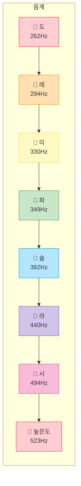
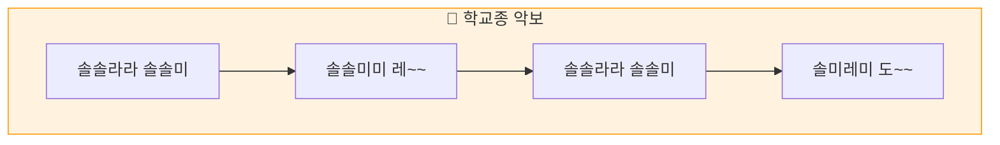

# 챕터 11: 나만의 멜로디 - 학교종 연주하기

## 🎯 이 장에서 배우는 것

- [ ] 음계(도레미파솔라시도)와 주파수의 관계를 이해할 수 있다
- [ ] 악보를 리스트 데이터로 변환할 수 있다
- [ ] 함수를 만들어 코드를 깔끔하게 정리할 수 있다
- [ ] 피코로 '학교종' 멜로디를 연주할 수 있다

---

## 💡 왜 이걸 배우나요?

지난 시간에 부저로 "삐~" 소리를 내봤죠? 이번에는 한 발 더 나아가 **진짜 멜로디**를 연주해봅니다!

"학교종이 땡땡땡~" 🎵 이 노래, 아시죠? 이 간단한 동요를 피코가 연주하게 만들어볼 거예요.

**이 과정에서 배우는 것들:**
- **음악의 원리**: 왜 '도'와 '레'는 다른 소리일까? → 주파수!
- **데이터 구조화**: 악보를 코드로 어떻게 표현할까? → 리스트!
- **함수 만들기**: 반복되는 코드를 깔끔하게 → 함수!

프로그래밍으로 음악을 만드는 경험, 생각보다 재밌어요! 🎹

---

## 📚 핵심 개념

### 개념 1: 음계와 주파수

1. **비유로 시작**: "음계는 마치 계단과 같아요"
   - 도레미파솔라시도는 8개의 계단
   - 한 칸 올라갈 때마다 소리가 높아져요
   - 이 "높이"를 결정하는 게 바로 **주파수**!

2. **정확한 정의**: "주파수는 1초에 공기가 몇 번 떨리는지예요"
   - 단위는 Hz (헤르츠)
   - 숫자가 클수록 높은 음
   - '도(C4)'는 약 262Hz, '레(D4)'는 약 294Hz

3. **예시로 확인**:



**쉽게 말하면**: 도레미파솔라시도는 각각 정해진 주파수(진동수)가 있고, 그 주파수를 부저에 보내면 해당 음이 나와요!

---

### 개념 2: 악보를 코드로 표현하기

1. **비유로 시작**: "악보는 마치 레시피와 같아요"
   - 레시피: "당근 100g, 3분 볶기"
   - 악보: "솔, 0.5초 연주"
   - 둘 다 **무엇을 + 얼마나**의 조합!

2. **정확한 정의**: "음 하나는 (주파수, 길이)의 쌍으로 표현해요"
   ```python
   음표 = (주파수, 길이)
   멜로디 = [음표1, 음표2, 음표3, ...]
   ```

3. **예시로 확인**: "학교종" 첫 소절
   ```
   악보: 솔솔라라 솔솔미
   코드: [(392, 0.5), (392, 0.5), (440, 0.5), (440, 0.5), 
          (392, 0.5), (392, 0.5), (330, 1.0)]
   ```

**쉽게 말하면**: 리스트 안에 (주파수, 길이) 튜플을 넣으면 악보가 됩니다!

---

### 개념 3: 함수 - 코드 재사용의 마법

1. **비유로 시작**: "함수는 마치 자판기와 같아요"
   - 돈을 넣고(입력) → 버튼 누르면(호출) → 음료가 나와요(결과)
   - 내부에서 어떻게 동작하는지 몰라도 사용 가능!

2. **정확한 정의**: "함수는 이름 붙인 코드 묶음이에요"
   ```python
   def 함수이름(입력값):
       실행할 코드
       return 결과값  # 선택사항
   ```

3. **예시로 확인**:
   ```python
   # 함수 정의 (자판기 만들기)
   def 인사하기(이름):
       print(f"안녕, {이름}!")
   
   # 함수 호출 (자판기 사용)
   인사하기("피코")  # 출력: 안녕, 피코!
   ```

**쉽게 말하면**: 자주 쓰는 코드에 이름을 붙여두면, 그 이름만 불러서 재사용할 수 있어요!

---

## 🔨 따라하기

### Step 1: 음계 사전 만들기

**목표**: 도레미파솔라시도의 주파수를 저장하기

**코드**:
```python
# === WHAT: 음계 주파수 정의 ===
# 도레미파솔라시도 각 음의 주파수를 딕셔너리에 저장해요

# --- WHY: 왜 필요한지 ---
# 매번 숫자를 기억하기 어려우니까 이름으로 찾을 수 있게!

# HOW: 어떻게 동작하는지
notes = {
    'C4': 262,   # 도
    'D4': 294,   # 레
    'E4': 330,   # 미
    'F4': 349,   # 파
    'G4': 392,   # 솔
    'A4': 440,   # 라
    'B4': 494,   # 시
    'C5': 523,   # 높은 도
    'REST': 0    # 쉼표 (소리 없음)
}

# 테스트: 솔 음의 주파수 확인
print("솔(G4)의 주파수:", notes['G4'], "Hz")
```

**실행 결과**:
```
솔(G4)의 주파수: 392 Hz
```

**여기서 잠깐! 🤔**
딕셔너리를 쓰면 `notes['G4']`처럼 이름으로 주파수를 찾을 수 있어요. 숫자 392를 외우는 것보다 훨씬 편하죠?

---

### Step 2: 음 재생 함수 만들기

**목표**: 한 음을 연주하는 함수 만들기

**코드**:
```python
# === WHAT: 음 재생 함수 ===
# 주파수와 길이를 받아서 부저로 소리 내는 함수

from machine import Pin, PWM
import time

# 부저 설정 (D20 포트)
buzzer = PWM(Pin(20))

# --- WHY: 왜 함수로 만드나 ---
# "주파수 설정 → 대기 → 끄기"를 매번 쓰기 귀찮으니까!

def play_tone(frequency, duration):
    """
    한 음을 연주하는 함수
    frequency: 주파수 (Hz)
    duration: 길이 (초)
    """
    if frequency == 0:  # 쉼표면
        buzzer.duty_u16(0)  # 소리 끄기
    else:
        buzzer.freq(frequency)  # 주파수 설정
        buzzer.duty_u16(30000)  # 소리 켜기
    
    time.sleep(duration)  # 길이만큼 대기
    buzzer.duty_u16(0)    # 소리 끄기
    time.sleep(0.05)      # 음 사이 짧은 쉼

# 테스트: 도레미 연주
play_tone(262, 0.5)  # 도
play_tone(294, 0.5)  # 레
play_tone(330, 0.5)  # 미
```

**실행 결과**:
```
🔊 도~레~미~ 소리가 순서대로 납니다!
```

**여기서 잠깐! 🤔**
`play_tone` 함수 하나로 어떤 음이든 연주할 수 있어요! 주파수와 길이만 바꿔서 호출하면 됩니다.

---

### Step 3: 학교종 악보를 코드로!

**목표**: "학교종" 멜로디를 리스트로 만들기



**코드**:
```python
# === WHAT: 학교종 악보 데이터 ===
# (음이름, 길이) 형태로 멜로디 저장

# --- WHY: 왜 이렇게 ---
# 리스트에 순서대로 넣으면 반복문으로 쭉 연주 가능!

# 음계 딕셔너리 (Step 1에서 만든 것)
notes = {
    'C4': 262, 'D4': 294, 'E4': 330, 'F4': 349,
    'G4': 392, 'A4': 440, 'B4': 494, 'C5': 523,
    'REST': 0
}

# 학교종 멜로디: (음이름, 박자)
# 0.5 = 반박자, 1.0 = 한박자, 1.5 = 한박자 반
school_bell = [
    # 1절: 솔솔라라 솔솔미
    ('G4', 0.5), ('G4', 0.5), ('A4', 0.5), ('A4', 0.5),
    ('G4', 0.5), ('G4', 0.5), ('E4', 1.0),
    
    # 2절: 솔솔미미 레~~
    ('G4', 0.5), ('G4', 0.5), ('E4', 0.5), ('E4', 0.5),
    ('D4', 1.5),
    ('REST', 0.3),  # 짧은 쉼
    
    # 3절: 솔솔라라 솔솔미
    ('G4', 0.5), ('G4', 0.5), ('A4', 0.5), ('A4', 0.5),
    ('G4', 0.5), ('G4', 0.5), ('E4', 1.0),
    
    # 4절: 솔미레미 도~~
    ('G4', 0.5), ('E4', 0.5), ('D4', 0.5), ('E4', 0.5),
    ('C4', 1.5)
]

print("악보 준비 완료! 음표 개수:", len(school_bell))
```

**실행 결과**:
```
악보 준비 완료! 음표 개수: 25
```

---

### Step 4: 멜로디 연주하기

**목표**: 반복문으로 전체 멜로디 연주

**코드**:
```python
# === WHAT: 멜로디 연주 함수 ===
# 악보 리스트를 받아서 전체 연주

def play_melody(melody):
    """
    멜로디 전체를 연주하는 함수
    melody: [(음이름, 길이), ...] 형태의 리스트
    """
    print("🎵 연주 시작!")
    
    for note_name, duration in melody:
        freq = notes[note_name]  # 음이름 → 주파수 변환
        play_tone(freq, duration)
    
    print("🎵 연주 끝!")

# 학교종 연주!
play_melody(school_bell)
```

**여기서 잠깐! 🤔**
`for note_name, duration in melody:` 이 부분이 핵심이에요!
- `melody` 리스트에서 하나씩 꺼내서
- `note_name`과 `duration`에 자동으로 나눠 담아요
- 이걸 **언패킹(unpacking)**이라고 해요

---

## 📝 전체 코드

```python
# === 🎵 학교종 연주 프로그램 ===
# 피코가 "학교종이 땡땡땡~"을 연주합니다!

from machine import Pin, PWM
import time

# --- 부저 설정 ---
buzzer = PWM(Pin(20))  # D20 포트

# --- 음계 주파수 딕셔너리 ---
notes = {
    'C4': 262,   # 도
    'D4': 294,   # 레
    'E4': 330,   # 미
    'F4': 349,   # 파
    'G4': 392,   # 솔
    'A4': 440,   # 라
    'B4': 494,   # 시
    'C5': 523,   # 높은 도
    'REST': 0    # 쉼표
}

# --- 함수 정의 ---
def play_tone(frequency, duration):
    """한 음을 연주하는 함수"""
    if frequency == 0:
        buzzer.duty_u16(0)
    else:
        buzzer.freq(frequency)
        buzzer.duty_u16(30000)
    
    time.sleep(duration)
    buzzer.duty_u16(0)
    time.sleep(0.05)

def play_melody(melody):
    """멜로디 전체를 연주하는 함수"""
    print("🎵 연주 시작!")
    for note_name, duration in melody:
        freq = notes[note_name]
        play_tone(freq, duration)
    print("🎵 연주 끝!")

# --- 학교종 악보 ---
school_bell = [
    ('G4', 0.5), ('G4', 0.5), ('A4', 0.5), ('A4', 0.5),
    ('G4', 0.5), ('G4', 0.5), ('E4', 1.0),
    ('G4', 0.5), ('G4', 0.5), ('E4', 0.5), ('E4', 0.5),
    ('D4', 1.5), ('REST', 0.3),
    ('G4', 0.5), ('G4', 0.5), ('A4', 0.5), ('A4', 0.5),
    ('G4', 0.5), ('G4', 0.5), ('E4', 1.0),
    ('G4', 0.5), ('E4', 0.5), ('D4', 0.5), ('E4', 0.5),
    ('C4', 1.5)
]

# --- 연주 실행 ---
play_melody(school_bell)

# 정리
buzzer.deinit()
print("프로그램 종료")
```

---

## ⚠️ 자주 하는 실수

### 실수 1: 딕셔너리 키 오타

**증상**: `KeyError: 'g4'`

**원인**: 대소문자가 다르면 다른 키로 인식!

**해결**:
```python
# 잘못된 코드
freq = notes['g4']  # 소문자 g

# 올바른 코드
freq = notes['G4']  # 대문자 G (딕셔너리에 정의된 대로!)
```

---

### 실수 2: 부저 초기화 안 함

**증상**: 소리가 안 나거나 이상한 소리

**원인**: `PWM` 설정을 안 했거나 핀 번호가 틀림

**해결**:
```python
# 잘못된 코드
buzzer = Pin(20)  # PWM이 아닌 일반 Pin

# 올바른 코드
buzzer = PWM(Pin(20))  # PWM으로 감싸야 해요!
```

---

### 실수 3: 음 사이에 끊김 없음

**증상**: 음이 뭉개져서 들림

**원인**: 음과 음 사이 쉬는 시간이 없음

**해결**:
```python
# 잘못된 코드
def play_tone(frequency, duration):
    buzzer.freq(frequency)
    buzzer.duty_u16(30000)
    time.sleep(duration)
    # 바로 다음 음으로 넘어감

# 올바른 코드
def play_tone(frequency, duration):
    buzzer.freq(frequency)
    buzzer.duty_u16(30000)
    time.sleep(duration)
    buzzer.duty_u16(0)    # 소리 끄기
    time.sleep(0.05)      # ← 음 사이 짧은 쉼 추가!
```

---

## ✅ 스스로 점검하기

1. **사실 확인**: '라(A4)'의 주파수는 몇 Hz인가요?

2. **적용 질문**: "도미솔"을 연주하려면 악보 리스트를 어떻게 만들어야 할까요?

3. **이유 질문**: 왜 `play_tone` 함수를 만들어서 사용하나요? 그냥 코드를 반복해서 쓰면 안 되나요?

<details>
<summary>정답 확인</summary>

1. **440Hz**입니다. 참고로 A4(라)는 음악에서 기준음으로 사용해요!

2. ```python
   do_mi_sol = [
       ('C4', 0.5),  # 도
       ('E4', 0.5),  # 미
       ('G4', 0.5)   # 솔
   ]
   ```

3. 함수를 사용하면:
   - **재사용**: 같은 코드를 여러 번 쓸 필요 없음
   - **수정 용이**: 한 곳만 고치면 전체에 적용
   - **가독성**: 코드가 깔끔해짐

</details>

---

## 🚀 더 해보기

### 도전 1: 비행기 연주하기 🛫
"비행기" 동요를 연주해보세요!
```
미레도레 미미미 (날아라 비행기)
```

**힌트**: 
```python
airplane = [
    ('E4', 0.5), ('D4', 0.5), ('C4', 0.5), ('D4', 0.5),
    ('E4', 0.5), ('E4', 0.5), ('E4', 1.0)
]
```

---

### 도전 2: 연주 속도 조절 ⏱️
BPM(빠르기)을 조절하는 기능을 추가해보세요!

**힌트**:
```python
def play_melody(melody, speed=1.0):
    for note_name, duration in melody:
        freq = notes[note_name]
        play_tone(freq, duration / speed)  # speed로 나누면 빨라짐
```

---

### 도전 3: 버튼으로 노래 선택 ⭐
버튼을 누를 때마다 다른 노래가 연주되게 만들어보세요!

**힌트**:
```python
songs = [school_bell, airplane, my_song]  # 노래 목록
current = 0  # 현재 노래 번호

# 버튼 누르면
current = (current + 1) % len(songs)  # 다음 노래로
play_melody(songs[current])
```

---

## 🔗 다음 장으로

축하해요! 🎉 이번 장에서 배운 것들:

- ✅ 음계와 주파수의 관계 (도=262Hz, 레=294Hz...)
- ✅ 악보를 리스트 데이터로 변환하기
- ✅ 함수를 만들어 코드 재사용하기
- ✅ 피코로 "학교종" 연주 성공!

**함수**는 프로그래밍에서 정말 중요한 개념이에요. 코드를 깔끔하게 정리하고, 재사용하고, 관리하기 쉽게 만들어주죠.

다음 장에서는 **OLED 디스플레이**를 다뤄볼 거예요. 지금까지 소리와 빛으로 표현했다면, 이제는 **화면에 글자와 그림**을 그려봅시다! 📺