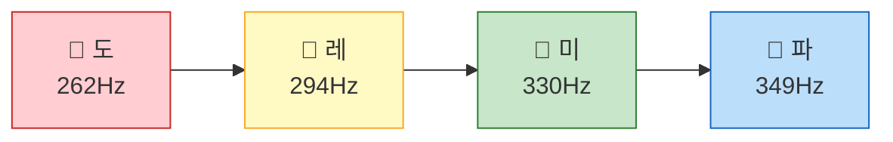
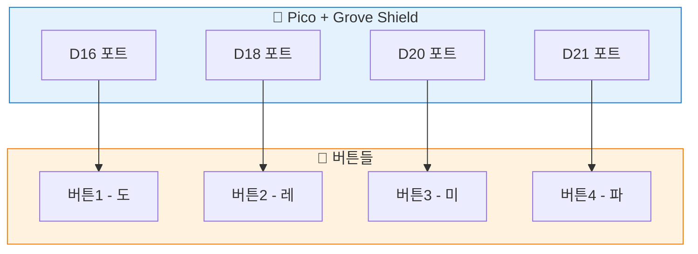
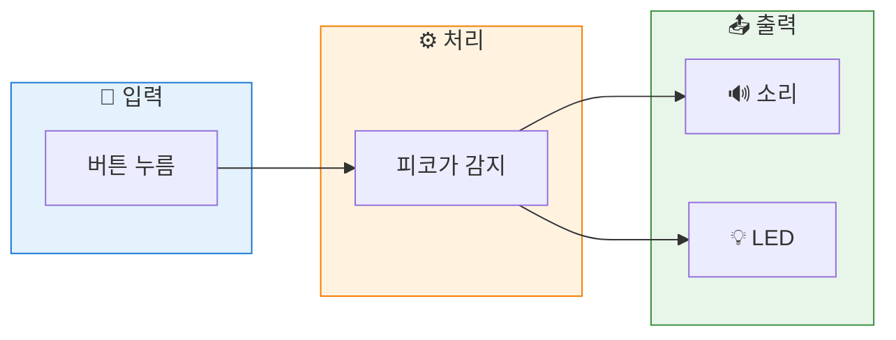

# 피아노 만들기 - 버튼으로 연주

> **Part 4**: 소리로 표현하기 - 부저 활용

---

## 🎯 이 장에서 배우는 것

- [ ] 여러 버튼 입력을 동시에 처리할 수 있다
- [ ] 버튼별로 다른 음을 출력하는 프로그램을 작성할 수 있다
- [ ] 버튼과 LED를 연동하여 시각적 피드백을 추가할 수 있다
- [ ] 이전에 배운 내용들을 조합하여 복합 프로젝트를 완성할 수 있다

---

## 💡 왜 이걸 배우나요?

지금까지 우리는 버튼 하나 읽기, LED 하나 켜기, 부저로 소리 내기를 각각 배웠어요. 하지만 실제 전자제품은 **여러 입력을 동시에 처리**하잖아요? 

TV 리모컨을 생각해보세요. 버튼이 수십 개인데, 어떤 버튼을 눌러도 즉시 반응하죠. 오늘 만들 미니 피아노도 마찬가지예요. 4개의 버튼을 연결하고, 각 버튼에 '도, 레, 미, 파' 음을 할당하면 **손가락으로 직접 연주**할 수 있어요!

이 프로젝트를 완성하면:
- 🎹 직접 만든 악기로 간단한 멜로디 연주 가능
- 💡 여러 입력을 효율적으로 처리하는 패턴 학습
- 🔧 지금까지 배운 모든 것을 하나로 통합

---

## 📚 핵심 개념

### 개념 1: 여러 버튼 동시 처리

1. **비유로 시작**: "여러 버튼을 처리하는 건 마치 콜센터 상담원과 같아요. 여러 전화(버튼)가 올 수 있지만, 한 번에 하나씩 빠르게 확인하면 마치 동시에 처리하는 것처럼 느껴지죠."

2. **정확한 정의**: "피코는 매우 빠르게 동작하기 때문에, 여러 버튼을 순서대로 확인해도 사람이 느끼기엔 '동시'처럼 보입니다. 이걸 **폴링(Polling)** 방식이라고 해요."

3. **예시로 확인**: 
```python
# 버튼 4개를 순서대로 확인
if 버튼1.value():
    도 연주
if 버튼2.value():
    레 연주
# ... 이게 1초에 수천 번 반복!
```

**쉽게 말하면**: 버튼마다 `if`문으로 체크하면, 피코가 알아서 빠르게 처리해줍니다.

---

### 개념 2: 딕셔너리로 버튼-음 연결

1. **비유로 시작**: "딕셔너리는 마치 전화번호부와 같아요. '이름 → 전화번호'처럼, '버튼 → 음' 을 연결해두면 편리하죠."

2. **정확한 정의**: "파이썬의 딕셔너리는 `{키: 값}` 형태로 데이터를 저장합니다. 버튼 객체를 키로, 음의 주파수를 값으로 저장하면 코드가 깔끔해져요."

3. **예시로 확인**:
```python
# 버튼별 음 주파수 딕셔너리
button_notes = {
    button1: 262,  # 도
    button2: 294,  # 레
    button3: 330,  # 미
    button4: 349,  # 파
}
```

**쉽게 말하면**: 버튼과 음을 짝지어 놓으면, 어떤 버튼이든 해당 음을 쉽게 찾을 수 있어요.

---

### 개념 3: 음계와 주파수

피아노 건반의 각 음은 고유한 **주파수(Hz)**를 가지고 있어요.



| 음 | 주파수(Hz) | 설명 |
|:--:|:--:|:--|
| 도(C4) | 262 | 가온다 |
| 레(D4) | 294 | |
| 미(E4) | 330 | |
| 파(F4) | 349 | |

**쉽게 말하면**: 숫자가 클수록 높은 음이에요!

---

## 🔨 따라하기

### Step 1: 버튼 4개 연결하기

**목표**: 4개의 버튼을 피코에 연결하고 각각 읽기

우선 하드웨어를 연결해볼게요.



> 💡 **팁**: Grove 버튼이 4개 없다면, 2개로 시작해도 괜찮아요!

**코드**:
```python
# === WHAT: 4개 버튼의 상태를 읽는 코드 ===
# 각 버튼이 눌렸는지 확인해요

# --- WHY: 피아노 건반처럼 사용하려면 ---
# 여러 버튼을 동시에 감지할 수 있어야 해요

# HOW: 어떻게 동작하는지
from machine import Pin  # 핀 제어 라이브러리
import time              # 시간 관련 기능

# 버튼 4개를 각각 설정
btn_do = Pin(16, Pin.IN, Pin.PULL_DOWN)  # 도 버튼
btn_re = Pin(18, Pin.IN, Pin.PULL_DOWN)  # 레 버튼
btn_mi = Pin(20, Pin.IN, Pin.PULL_DOWN)  # 미 버튼
btn_fa = Pin(21, Pin.IN, Pin.PULL_DOWN)  # 파 버튼

print("버튼을 눌러보세요!")

while True:
    # 각 버튼 상태 확인
    if btn_do.value():
        print("도!")
    if btn_re.value():
        print("레!")
    if btn_mi.value():
        print("미!")
    if btn_fa.value():
        print("파!")
    
    time.sleep(0.1)  # 0.1초마다 확인
```

**실행 결과**:
```
버튼을 눌러보세요!
도!
레!
미!
파!
```

**여기서 잠깐! 🤔**
`if`문이 `elif`가 아니라 모두 `if`인 이유가 뭘까요? 두 버튼을 **동시에** 누를 수도 있기 때문이에요! `elif`를 쓰면 하나만 인식되거든요.

---

### Step 2: 버튼에 소리 연결하기

**목표**: 각 버튼을 누르면 해당하는 음이 나오게 하기

**코드**:
```python
# === WHAT: 버튼별로 다른 음 내기 ===
# 버튼1=도, 버튼2=레, 버튼3=미, 버튼4=파

# --- WHY: 미니 피아노의 핵심 기능! ---
# 버튼과 음의 연결이 피아노를 만드는 거예요

# HOW: 어떻게 동작하는지
from machine import Pin, PWM
import time

# 버튼 설정
btn_do = Pin(16, Pin.IN, Pin.PULL_DOWN)
btn_re = Pin(18, Pin.IN, Pin.PULL_DOWN)
btn_mi = Pin(20, Pin.IN, Pin.PULL_DOWN)
btn_fa = Pin(21, Pin.IN, Pin.PULL_DOWN)

# 부저 설정 (Grove 부저는 D22에 연결)
buzzer = PWM(Pin(22))

# 음계 주파수 정의
NOTE_DO = 262  # 도
NOTE_RE = 294  # 레
NOTE_MI = 330  # 미
NOTE_FA = 349  # 파

def play_tone(freq):
    """주어진 주파수로 소리 내기"""
    buzzer.freq(freq)
    buzzer.duty_u16(32768)  # 50% 듀티 (소리 ON)

def stop_tone():
    """소리 멈추기"""
    buzzer.duty_u16(0)  # 듀티 0 (소리 OFF)

print("🎹 미니 피아노 시작!")
print("버튼을 눌러 연주하세요~")

while True:
    sound_playing = False  # 소리가 나고 있는지 체크
    
    if btn_do.value():
        play_tone(NOTE_DO)
        sound_playing = True
    elif btn_re.value():
        play_tone(NOTE_RE)
        sound_playing = True
    elif btn_mi.value():
        play_tone(NOTE_MI)
        sound_playing = True
    elif btn_fa.value():
        play_tone(NOTE_FA)
        sound_playing = True
    
    # 아무 버튼도 안 눌리면 소리 끄기
    if not sound_playing:
        stop_tone()
    
    time.sleep(0.01)  # 빠르게 체크 (반응성 향상)
```

**실행 결과**:
```
🎹 미니 피아노 시작!
버튼을 눌러 연주하세요~
(버튼을 누르면 해당 음이 들림!)
```

**여기서 잠깐! 🤔**
여기서는 `elif`를 사용했어요. 부저가 1개라서 동시에 두 음을 낼 수 없거든요. 먼저 누른 버튼의 음이 우선이에요.

---

### Step 3: LED로 시각 효과 추가

**목표**: 누른 버튼에 해당하는 LED도 함께 켜지게 하기



**코드**:
```python
# === WHAT: 소리 + LED 동시 출력 ===
# 버튼 누르면 소리도 나고 LED도 켜져요

# --- WHY: 실제 전자 피아노처럼! ---
# 건반 누르면 불빛이 들어오는 것처럼요

# HOW: 어떻게 동작하는지
from machine import Pin, PWM
import time

# ===== 핀 설정 =====
# 버튼들 (입력)
btn_do = Pin(16, Pin.IN, Pin.PULL_DOWN)
btn_re = Pin(18, Pin.IN, Pin.PULL_DOWN)
btn_mi = Pin(20, Pin.IN, Pin.PULL_DOWN)
btn_fa = Pin(21, Pin.IN, Pin.PULL_DOWN)

# 부저 (출력)
buzzer = PWM(Pin(22))

# LED (피코 내장 LED 사용)
led = Pin("LED", Pin.OUT)

# ===== 음계 정의 =====
NOTES = {
    'do': 262,
    're': 294,
    'mi': 330,
    'fa': 349
}

# ===== 함수 정의 =====
def play_note(note_name):
    """음 연주 + LED 켜기"""
    freq = NOTES.get(note_name, 0)
    if freq > 0:
        buzzer.freq(freq)
        buzzer.duty_u16(32768)
        led.on()
        print(f"♪ {note_name}!")

def stop_all():
    """모든 출력 끄기"""
    buzzer.duty_u16(0)
    led.off()

# ===== 메인 루프 =====
print("🎹 LED 피아노 시작!")

while True:
    pressed = False
    
    if btn_do.value():
        play_note('do')
        pressed = True
    elif btn_re.value():
        play_note('re')
        pressed = True
    elif btn_mi.value():
        play_note('mi')
        pressed = True
    elif btn_fa.value():
        play_note('fa')
        pressed = True
    
    if not pressed:
        stop_all()
    
    time.sleep(0.01)
```

**실행 결과**:
```
🎹 LED 피아노 시작!
♪ do!
♪ re!
♪ mi!
♪ fa!
```

---

## 📝 전체 코드

```python
# === 미니 피아노 - 완성 버전 ===
# 4개 버튼으로 도레미파 연주 + LED 효과

from machine import Pin, PWM
import time

# ========== 설정 ==========
# 버튼 (Grove 버튼들)
buttons = {
    'do': Pin(16, Pin.IN, Pin.PULL_DOWN),
    're': Pin(18, Pin.IN, Pin.PULL_DOWN),
    'mi': Pin(20, Pin.IN, Pin.PULL_DOWN),
    'fa': Pin(21, Pin.IN, Pin.PULL_DOWN)
}

# 부저
buzzer = PWM(Pin(22))

# LED (내장 LED)
led = Pin("LED", Pin.OUT)

# 음계 주파수
NOTES = {
    'do': 262,
    're': 294,
    'mi': 330,
    'fa': 349
}

# ========== 함수 ==========
def play_note(note):
    """음 연주하기"""
    buzzer.freq(NOTES[note])
    buzzer.duty_u16(32768)
    led.on()

def stop_sound():
    """소리 멈추기"""
    buzzer.duty_u16(0)
    led.off()

# ========== 메인 ==========
print("=" * 30)
print("🎹 미니 피아노")
print("버튼을 눌러 연주하세요!")
print("=" * 30)

while True:
    played = False
    
    # 모든 버튼 확인
    for note, button in buttons.items():
        if button.value():
            play_note(note)
            played = True
            break  # 한 음만 연주
    
    if not played:
        stop_sound()
    
    time.sleep(0.01)
```

---

## ⚠️ 자주 하는 실수

### 실수 1: 버튼이 계속 눌린 것처럼 인식됨

**증상**: 버튼을 한 번만 눌렀는데 소리가 계속 남
**원인**: `PULL_DOWN` 설정을 안 했거나, 배선이 잘못됨
**해결**:
```python
# 잘못된 코드
btn = Pin(16, Pin.IN)  # PULL 설정 없음!

# 올바른 코드
btn = Pin(16, Pin.IN, Pin.PULL_DOWN)  # PULL_DOWN 필수!
```

---

### 실수 2: 부저에서 소리가 안 남

**증상**: 코드는 실행되는데 부저가 조용함
**원인**: `duty_u16` 값이 0이거나, 주파수 설정이 안 됨
**해결**:
```python
# 잘못된 코드 - 순서가 잘못됨
buzzer.duty_u16(32768)
buzzer.freq(262)  # 주파수를 나중에 설정

# 올바른 코드 - 주파수 먼저!
buzzer.freq(262)      # 1. 주파수 설정
buzzer.duty_u16(32768)  # 2. 소리 켜기
```

---

### 실수 3: 딕셔너리 키 오류

**증상**: `KeyError: 'Do'` 에러 발생
**원인**: 대소문자가 다름 (Python은 대소문자 구분!)
**해결**:
```python
# 잘못된 코드
NOTES = {'do': 262}
freq = NOTES['Do']  # 'Do' ≠ 'do' 에러!

# 올바른 코드
NOTES = {'do': 262}
freq = NOTES['do']  # 정확히 같은 키 사용
```

---

## ✅ 스스로 점검하기

1. **사실 확인**: '도' 음의 주파수는 몇 Hz인가요?

2. **적용 질문**: '솔' 음(392Hz)을 추가하려면 어떤 코드를 수정해야 할까요?

3. **이유 질문**: 버튼 체크할 때 `elif` 대신 모두 `if`를 쓰면 어떤 문제가 생길까요?

<details>
<summary>정답 확인</summary>

1. **262Hz**입니다.

2. 두 곳을 수정해요:
   - 버튼 추가: `'sol': Pin(XX, Pin.IN, Pin.PULL_DOWN)`
   - 음 추가: `'sol': 392`

3. 부저가 1개라서 마지막 `if`의 음만 나와요. 여러 버튼을 동시에 눌러도 '파'만 들릴 거예요.

</details>

---

## 🚀 더 해보기

### 도전 1: 음역 확장하기 (⭐)
5번째 버튼을 추가하고 '솔'(392Hz) 음을 연결해보세요.

### 도전 2: 학교종 연주하기 (⭐⭐)
"학교종이 땡땡땡" 멜로디를 자동 연주하는 코드를 작성해보세요.

**힌트**: 음과 길이를 리스트로 저장하면 돼요!
```python
# 학교종 멜로디 힌트
melody = [
    ('sol', 0.3), ('sol', 0.3), ('la', 0.3), ('la', 0.3),
    ('sol', 0.3), ('sol', 0.3), ('mi', 0.6),
    # ... 계속
]
```

### 도전 3: 녹음 & 재생 기능 (⭐⭐⭐)
누른 버튼 순서를 기억했다가 다시 재생하는 기능을 만들어보세요!
- 녹음 시작/종료 버튼 추가
- 리스트에 누른 음 저장
- 재생 버튼으로 순서대로 연주

---

## 🔗 다음 장으로

오늘 우리는 **버튼 + 부저 + LED**를 조합해서 미니 피아노를 완성했어요! 🎉

**배운 것 정리**:
- ✅ 여러 버튼을 `if`문으로 빠르게 체크
- ✅ 딕셔너리로 버튼과 음을 연결
- ✅ PWM으로 다양한 음 연주
- ✅ 여러 출력 장치 동시 제어

다음 장에서는 **OLED 디스플레이**를 배워요! 화면에 텍스트와 그래픽을 표시하면, 지금 어떤 음이 연주 중인지 눈으로 볼 수 있겠죠? 피아노에 디스플레이를 달면 더 멋진 악기가 될 거예요! 🎹✨