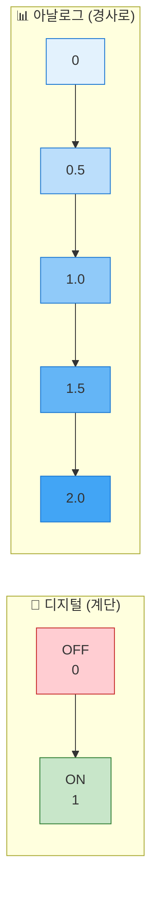
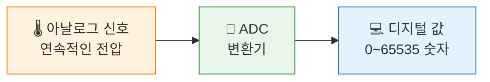
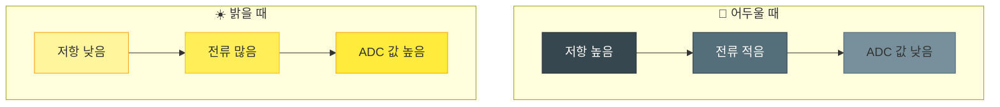
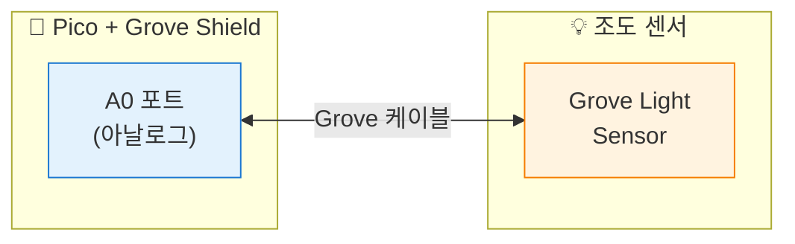
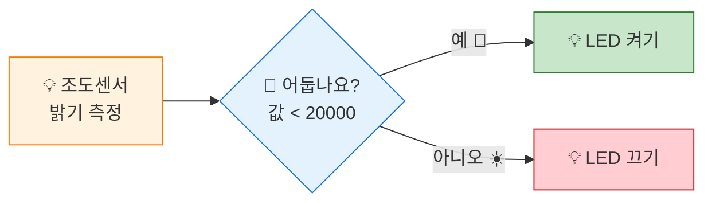

# 밝기 감지 - 조도 센서

## 🎯 이 장에서 배우는 것

- [ ] 아날로그 입력과 디지털 입력의 차이를 설명할 수 있다
- [ ] ADC(아날로그-디지털 변환)의 개념을 이해할 수 있다
- [ ] 조도 센서 값을 읽어 밝기를 측정할 수 있다
- [ ] 밝기에 따라 LED를 자동으로 제어할 수 있다

---

## 💡 왜 이걸 배우나요?

스마트폰 화면을 보세요. 어두운 곳에서는 화면이 어두워지고, 밝은 곳에서는 밝아집니다. 이게 어떻게 가능할까요? 바로 **조도 센서**가 주변 밝기를 측정하기 때문이에요!

버튼은 "눌렀다/안 눌렀다" 두 가지 상태만 구분합니다. 하지만 밝기는 어떨까요? "아주 어둡다 → 조금 어둡다 → 보통 → 밝다 → 아주 밝다"처럼 **연속적인 값**을 가집니다.

이런 연속적인 값을 읽으려면 **아날로그 입력**이 필요합니다. 이번 장에서 아날로그 세계로 한 발짝 들어가 봅시다!

---

## 📚 핵심 개념

### 개념 1: 디지털 vs 아날로그

**비유로 시작**: 디지털은 **계단**, 아날로그는 **경사로**와 같아요.



**정확히 말하면**:
- **디지털**: 0 또는 1, 두 가지 상태만 존재 (버튼, LED 켜기/끄기)
- **아날로그**: 연속적인 값 (밝기, 온도, 소리 크기)

**예시로 확인**:
| 센서 | 신호 타입 | 값의 범위 |
|------|----------|----------|
| 버튼 | 디지털 | 0 또는 1 |
| 조도 센서 | 아날로그 | 0 ~ 65535 |
| 온도 센서 | 아날로그 | 다양한 값 |

**쉽게 말하면**: 디지털은 "예/아니오", 아날로그는 "얼마나?"입니다.

---

### 개념 2: ADC (아날로그-디지털 변환)

**비유로 시작**: ADC는 **통역사**와 같아요. 아날로그 세상의 언어를 컴퓨터가 이해하는 디지털 숫자로 번역해줍니다.



**정확히 말하면**: 
- ADC = Analog to Digital Converter (아날로그-디지털 변환기)
- 피코는 **16비트 ADC**를 가지고 있어요
- 16비트 = 2^16 = **65,536단계** (0 ~ 65535)

**예시로 확인**:
- 조도 센서에 빛이 없으면 → 낮은 값 (예: 500)
- 조도 센서에 빛이 많으면 → 높은 값 (예: 60000)

**쉽게 말하면**: ADC는 연속적인 밝기를 0~65535 사이의 숫자로 바꿔주는 장치입니다.

---

### 개념 3: 조도 센서 (CdS / 포토레지스터)

**비유로 시작**: 조도 센서는 **빛에 반응하는 가변 저항**이에요. 마치 빛이 많을수록 문이 활짝 열리는 것처럼, 빛이 많으면 저항이 낮아집니다.



**쉽게 말하면**: 밝으면 값이 크고, 어두우면 값이 작습니다!

---

## 🔨 따라하기

### Step 1: 조도 센서 연결하기

**목표**: Grove 조도 센서를 피코에 연결합니다.



**연결 방법**:
1. Grove 조도 센서를 찾으세요 (동그란 센서가 보여요)
2. Grove 케이블로 센서와 Shield의 **A0 포트**를 연결하세요
3. 케이블 방향은 상관없어요 (양쪽 다 같은 모양)

> 💡 **Tip**: A0는 "Analog 0"의 약자예요. 아날로그 신호를 읽는 전용 포트입니다!

---

### Step 2: 기본 값 읽기

**목표**: 조도 센서 값을 읽어서 출력합니다.

**코드**:
```python
# === WHAT: 조도 센서 값 읽기 ===
# 주변 밝기를 측정해서 숫자로 보여주는 코드예요

# --- WHY: 왜 필요한지 ---
# 밝기 값을 알아야 나중에 자동 조명을 만들 수 있어요

# HOW: 어떻게 동작하는지
from machine import ADC, Pin  # ADC: 아날로그 값을 읽는 도구
import time

# 조도 센서 설정 (A0 포트 = GP26)
light_sensor = ADC(Pin(26))

# 반복해서 밝기 측정
while True:
    light_value = light_sensor.read_u16()  # 16비트 값 읽기 (0~65535)
    print("밝기:", light_value)
    time.sleep(0.5)  # 0.5초마다 측정
```

**실행 결과**:
```
밝기: 45230
밝기: 45180
밝기: 12500   ← 손으로 가렸을 때
밝기: 58000   ← 손전등 비췄을 때
밝기: 45300
```

**여기서 잠깐! 🤔**

손으로 센서를 가려보세요! 값이 확 줄어드나요? 스마트폰 손전등을 비춰보세요! 값이 올라가나요?

이렇게 **실시간으로 변하는 값**을 읽을 수 있다는 게 아날로그 입력의 매력입니다!

---

### Step 3: 밝기 단계로 표시하기

**목표**: 숫자 대신 "어둡다/보통/밝다"로 표시합니다.

**코드**:
```python
# === WHAT: 밝기를 단계로 표시 ===
# 숫자 대신 이해하기 쉬운 말로 바꿔요

from machine import ADC, Pin
import time

light_sensor = ADC(Pin(26))

while True:
    value = light_sensor.read_u16()
    
    # 값에 따라 상태 판단
    if value < 20000:
        status = "🌙 어두움"
    elif value < 45000:
        status = "🌤️ 보통"
    else:
        status = "☀️ 밝음"
    
    print(f"밝기: {value} → {status}")
    time.sleep(0.5)
```

**실행 결과**:
```
밝기: 15230 → 🌙 어두움
밝기: 35000 → 🌤️ 보통
밝기: 52000 → ☀️ 밝음
```

**여기서 잠깐! 🤔**

`20000`, `45000` 같은 기준값(임계값)은 환경마다 달라요! 여러분 교실에서 직접 값을 확인하고 조절해보세요.

---

### Step 4: 자동 야간등 만들기

**목표**: 어두워지면 자동으로 LED가 켜지는 야간등을 만듭니다.



**코드**:
```python
# === WHAT: 자동 야간등 ===
# 어두우면 LED가 켜지고, 밝으면 꺼져요

from machine import ADC, Pin
import time

# 센서와 LED 설정
light_sensor = ADC(Pin(26))  # A0 포트
led = Pin(16, Pin.OUT)       # D16 포트에 LED 연결

DARK_THRESHOLD = 20000  # 이 값보다 작으면 "어둡다"

while True:
    value = light_sensor.read_u16()
    
    if value < DARK_THRESHOLD:
        led.on()
        print(f"🌙 어두움 ({value}) - LED 켜짐")
    else:
        led.off()
        print(f"☀️ 밝음 ({value}) - LED 꺼짐")
    
    time.sleep(0.3)
```

**실행 결과**:
```
☀️ 밝음 (45230) - LED 꺼짐
🌙 어두움 (12500) - LED 켜짐  ← 손으로 가렸을 때
🌙 어두움 (11800) - LED 켜짐
☀️ 밝음 (48000) - LED 꺼짐  ← 손 뗐을 때
```

---

## 📝 전체 코드

```python
# === 자동 야간등 - 완성 코드 ===
# 주변이 어두워지면 자동으로 LED가 켜집니다

from machine import ADC, Pin
import time

# ===== 설정 =====
light_sensor = ADC(Pin(26))  # 조도 센서 (A0)
led = Pin(16, Pin.OUT)       # LED (D16)

DARK_THRESHOLD = 20000  # 이 값보다 작으면 어둡다고 판단
                         # ⬆️ 환경에 맞게 조절하세요!

# ===== 메인 루프 =====
print("🌙 자동 야간등 시작!")
print("센서를 손으로 가려보세요.\n")

while True:
    # 밝기 측정
    value = light_sensor.read_u16()
    
    # 어두우면 LED 켜기
    if value < DARK_THRESHOLD:
        led.on()
        status = "🌙 어두움 - LED ON"
    else:
        led.off()
        status = "☀️ 밝음 - LED OFF"
    
    print(f"밝기: {value:5d} | {status}")
    time.sleep(0.3)
```

---

## ⚠️ 자주 하는 실수

### 실수 1: 잘못된 핀 번호 사용

**증상**: 
```
ValueError: Pin(0) doesn't have ADC capabilities
```

**원인**: 아날로그 입력이 가능한 핀은 정해져 있어요.

**해결**:
```python
# 잘못된 코드
light_sensor = ADC(Pin(0))  # GP0는 ADC 지원 안 함!

# 올바른 코드
light_sensor = ADC(Pin(26))  # GP26 = A0 포트 ✅
# 사용 가능: GP26(A0), GP27(A1), GP28(A2)
```

---

### 실수 2: read_u16() 대신 value() 사용

**증상**: 
```
AttributeError: 'ADC' object has no attribute 'value'
```

**원인**: MicroPython에서는 `read_u16()` 메서드를 사용해요.

**해결**:
```python
# 잘못된 코드
value = light_sensor.value()  # Arduino 스타일

# 올바른 코드
value = light_sensor.read_u16()  # MicroPython 스타일 ✅
```

---

### 실수 3: 임계값이 환경에 안 맞음

**증상**: LED가 항상 켜져있거나 항상 꺼져있음

**원인**: 교실/집의 밝기가 코드의 기준값과 다름

**해결**:
```python
# 1단계: 먼저 현재 환경의 값 확인
while True:
    print(light_sensor.read_u16())  # 값 확인
    time.sleep(0.5)

# 2단계: 확인한 값을 기준으로 임계값 설정
# 예: 평소 35000, 손으로 가리면 8000이라면
DARK_THRESHOLD = 20000  # 중간값으로 설정
```

---

## ✅ 스스로 점검하기

1. **아날로그와 디지털의 가장 큰 차이점은 무엇인가요?**

2. **피코의 ADC가 출력하는 값의 범위는 얼마인가요?**

3. **조도 센서를 손으로 가리면 ADC 값은 어떻게 변하나요? 그 이유는?**

<details>
<summary>정답 확인</summary>

1. **디지털**은 0과 1 두 가지 상태만 있고, **아날로그**는 연속적인 값을 가집니다.

2. **0 ~ 65535** (16비트, 2^16 = 65536단계)

3. **값이 작아집니다.** 이유: 빛이 줄어들면 센서의 저항이 높아지고, 전류가 적게 흘러 ADC 값이 낮아지기 때문입니다.

</details>

---

## 🚀 더 해보기

### 도전 1: 밝기 막대 그래프 (쉬움)
Shell에 밝기를 막대 그래프로 표시해보세요!
```
밝기: ████████████████░░░░ (52000)
밝기: ████░░░░░░░░░░░░░░░░ (15000)
```

> 💡 힌트: `value // 3300`으로 0~20 사이 값으로 변환!

---

### 도전 2: 3단계 자동 조명 (중간)
밝기에 따라 LED 여러 개를 단계적으로 켜보세요.
- 아주 어두움: LED 3개 모두 켜짐
- 조금 어두움: LED 2개 켜짐
- 밝음: LED 모두 꺼짐

---

### 도전 3: 스마트 무드등 ⭐ (어려움)
조도 센서 + PWM을 결합해서, 어두워질수록 LED가 **서서히 밝아지는** 무드등을 만들어보세요!

> 💡 힌트: PWM의 duty 값을 조도 센서 값에 반비례하게 설정!

---

## 🔗 다음 장으로

이번 장에서 배운 것:
- ✅ 아날로그 vs 디지털의 차이
- ✅ ADC로 연속적인 값 읽기
- ✅ 조도 센서로 밝기 측정
- ✅ 자동 야간등 만들기

다음 장에서는 **거리 측정 - 초음파 센서**를 배웁니다. 박쥐처럼 소리로 거리를 측정하는 원리를 알아보고, 물체가 가까이 오면 반응하는 시스템을 만들어볼 거예요! 🦇