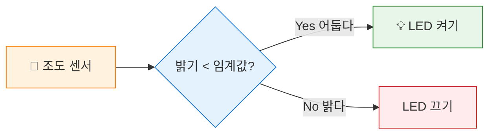

# 자동 조명 만들기

## 🎯 이 장에서 배우는 것

- [ ] 센서 값을 기준으로 조건문을 작성할 수 있다
- [ ] 임계값(threshold)의 개념을 이해하고 적절히 설정할 수 있다
- [ ] 어두워지면 자동으로 켜지는 조명을 완성할 수 있다

---

## 💡 왜 이걸 배우나요?

집에 들어오면 알아서 켜지는 현관등, 해가 지면 자동으로 켜지는 가로등을 본 적 있나요? 이 똑똑한 조명들은 모두 **"지금 어두운가?"**를 판단해서 동작합니다.

이번 장에서는 조도 센서로 밝기를 측정하고, **"어느 정도 어두우면 켤까?"**라는 기준(임계값)을 정해서 자동 조명을 만들어 봅니다. 센서 값을 읽는 것에서 한 발 더 나아가, **센서 값으로 판단하고 행동하는** 진짜 스마트 기기를 만드는 거예요!

---

## 📚 핵심 개념

### 개념 1: 임계값(Threshold)

1. **비유로 시작**: 임계값은 마치 **시험 합격선**과 같아요. 60점이 합격선이면, 60점 이상은 합격, 미만은 불합격이죠.

2. **정확한 정의**: 임계값은 **어떤 동작을 실행할지 결정하는 기준값**입니다. 센서 값이 이 기준보다 크거나 작은지에 따라 다른 동작을 합니다.

3. **예시로 확인**: 조도 센서 값이 20,000 미만이면 "어둡다"고 판단하고 LED를 켜요. 여기서 20,000이 임계값입니다.

**쉽게 말하면**: "이 값보다 작으면 어두운 거야!"라고 정한 기준선이에요.

---

### 개념 2: 센서 값과 조건문의 결합

센서로 측정한 값을 `if`문의 조건으로 사용하면, 피코가 스스로 판단해서 행동합니다.



**쉽게 말하면**: 센서가 눈이 되고, 조건문이 뇌가 되어 판단하는 거예요!

---

## 🔨 따라하기

### Step 1: 현재 밝기 확인하기

**목표**: 조도 센서로 지금 교실이 얼마나 밝은지 숫자로 확인해요.

**준비**: Grove 조도 센서를 **A0 포트**에 연결하세요.

**코드**:
```python
# === WHAT: 조도 센서 값 읽기 ===
# 현재 환경의 밝기를 숫자로 확인합니다

# --- WHY: 왜 필요한지 ---
# 임계값을 정하려면 먼저 지금 환경이 어느 정도인지 알아야 해요

from machine import ADC, Pin  # ADC: 아날로그 값을 읽는 기능
import time

light_sensor = ADC(Pin(26))  # A0 포트 = GPIO 26번

while True:
    light_value = light_sensor.read_u16()  # 0~65535 사이 값
    print("밝기:", light_value)
    time.sleep(0.5)
```

**실행 결과**:
```
밝기: 45230
밝기: 44890
밝기: 12340  ← 센서를 손으로 가렸을 때
밝기: 8920
```

**여기서 잠깐! 🤔**
- 숫자가 **클수록 밝고**, **작을수록 어두워요**
- 손으로 센서를 가려보면서 밝을 때와 어두울 때 값을 기억해두세요!

---

### Step 2: 임계값 정하기

**목표**: 우리 환경에 맞는 적절한 임계값을 찾아요.

밝을 때와 어두울 때 값의 **중간 정도**를 임계값으로 정하면 됩니다.

| 상황 | 예시 값 |
|------|---------|
| 밝은 교실 | 40,000 ~ 50,000 |
| 손으로 가림 | 5,000 ~ 15,000 |
| **적절한 임계값** | **20,000 ~ 25,000** |

💡 **Tip**: 환경마다 다르니까 직접 측정한 값을 기준으로 정하세요!

---

### Step 3: 자동 조명 완성하기

**목표**: 어두워지면 자동으로 LED가 켜지는 프로그램을 만들어요.

**준비**: Grove LED를 **D18 포트**에 연결하세요.

**코드**:
```python
# === WHAT: 자동 조명 시스템 ===
# 어두워지면 LED가 켜지고, 밝아지면 꺼집니다

# --- WHY: 왜 필요한지 ---
# 가로등, 현관등처럼 스스로 판단하는 조명을 만들어요

from machine import ADC, Pin
import time

# 센서와 LED 설정
light_sensor = ADC(Pin(26))  # A0 포트
led = Pin(18, Pin.OUT)       # D18 포트

# 임계값 설정 (직접 측정한 값으로 수정하세요!)
THRESHOLD = 20000

while True:
    light_value = light_sensor.read_u16()
    
    if light_value < THRESHOLD:  # 임계값보다 작으면 = 어둡다
        led.on()
        status = "어두움 → LED 켜짐"
    else:                        # 임계값보다 크거나 같으면 = 밝다
        led.off()
        status = "밝음 → LED 꺼짐"
    
    print(f"밝기: {light_value}, 상태: {status}")
    time.sleep(0.5)
```

**실행 결과**:
```
밝기: 45230, 상태: 밝음 → LED 꺼짐
밝기: 44890, 상태: 밝음 → LED 꺼짐
밝기: 12340, 상태: 어두움 → LED 켜짐  ← 손으로 가림
밝기: 8920, 상태: 어두움 → LED 켜짐
```

**여기서 잠깐! 🤔**
- `THRESHOLD = 20000` 이 한 줄만 바꾸면 민감도 조절 가능!
- 값을 **낮추면** 아주 어두울 때만, **높이면** 조금만 어두워도 켜져요

---

## 📝 전체 코드

```python
# === 스마트 자동 조명 시스템 ===
# 조도 센서로 밝기를 측정하고 자동으로 LED를 제어합니다
# Grove 조도 센서: A0 포트
# Grove LED: D18 포트

from machine import ADC, Pin
import time

# 하드웨어 설정
light_sensor = ADC(Pin(26))  # A0 = GPIO 26
led = Pin(18, Pin.OUT)       # D18 = GPIO 18

# 임계값 설정 (환경에 맞게 조절하세요)
THRESHOLD = 20000

print("=== 자동 조명 시스템 시작 ===")
print(f"임계값: {THRESHOLD}")
print("센서를 손으로 가려보세요!")
print()

while True:
    # 밝기 측정
    light_value = light_sensor.read_u16()
    
    # 판단 및 동작
    if light_value < THRESHOLD:
        led.on()
        status = "💡 LED ON"
    else:
        led.off()
        status = "LED OFF"
    
    # 상태 출력
    print(f"밝기: {light_value:5d} | {status}")
    time.sleep(0.5)
```

---

## ⚠️ 자주 하는 실수

### 실수 1: 임계값 방향 헷갈림

**증상**: 밝을 때 LED가 켜지고, 어두울 때 꺼짐

**원인**: 조건문의 부등호 방향이 반대

**해결**:
```python
# 잘못된 코드 (밝을 때 켜짐)
if light_value > THRESHOLD:
    led.on()

# 올바른 코드 (어두울 때 켜짐)
if light_value < THRESHOLD:
    led.on()
```

💡 **기억하세요**: 조도 센서는 **밝으면 값이 크고**, **어두우면 값이 작아요**!

---

### 실수 2: 임계값이 너무 극단적

**증상**: LED가 항상 켜져있거나 항상 꺼져있음

**원인**: 임계값이 환경에 맞지 않음

**해결**:
```python
# 잘못된 예: 임계값이 너무 낮음 (거의 안 켜짐)
THRESHOLD = 1000

# 잘못된 예: 임계값이 너무 높음 (항상 켜짐)
THRESHOLD = 60000

# 올바른 방법: 직접 측정한 값의 중간
# 밝을 때 45000, 어두울 때 10000이면
THRESHOLD = 25000  # 중간값 사용
```

---

### 실수 3: 센서 연결 포트 오류

**증상**: `light_value`가 항상 0이거나 65535

**원인**: 센서가 다른 포트에 연결됨

**해결**:
```python
# A0 포트 = GPIO 26번
light_sensor = ADC(Pin(26))  # 반드시 26번!

# A1 포트는 GPIO 27번
# light_sensor = ADC(Pin(27))  # A1에 연결했다면
```

---

## ✅ 스스로 점검하기

1. **임계값을 30,000으로 설정했을 때, 센서 값이 25,000이면 LED는 어떻게 되나요?**

2. **현재 교실에서 측정한 밝기가 밝을 때 50,000, 어두울 때 8,000이라면 적절한 임계값은 얼마일까요?**

3. **왜 `<` (미만)을 사용해서 어두움을 판단하나요?**

<details>
<summary>정답 확인</summary>

1. **LED가 켜집니다.** 25,000 < 30,000 이므로 어둡다고 판단합니다.

2. **약 25,000 ~ 30,000 정도**가 적절합니다. 밝을 때와 어두울 때의 중간값이에요.

3. 조도 센서는 **밝으면 값이 크고, 어두우면 값이 작기 때문**입니다. 값이 임계값보다 "작으면" 어두운 거예요.

</details>

---

## 🚀 더 해보기

### 도전 1: 나만의 임계값 찾기 (쉬움)
교실의 여러 상황(형광등 끔, 커튼 침, 손으로 가림)에서 센서 값을 측정하고, 가장 적절한 임계값을 찾아보세요.

---

### 도전 2: LED 깜빡임으로 경고하기 (중간)
완전히 어두우면 LED가 계속 켜지고, 살짝 어두우면 깜빡이게 만들어보세요.

**힌트**: 임계값을 2개 사용해요!
```python
DARK_THRESHOLD = 10000    # 완전 어두움
DIM_THRESHOLD = 25000     # 살짝 어두움

if light_value < DARK_THRESHOLD:
    # 완전 어두움: LED 계속 켜기
elif light_value < DIM_THRESHOLD:
    # 살짝 어두움: LED 깜빡이기
else:
    # 밝음: LED 끄기
```

---

### 도전 3: 밝기에 따른 LED 밝기 조절 ⭐
PWM을 사용해서 어두울수록 LED가 더 밝게, 밝을수록 LED가 어둡게 되는 조명을 만들어보세요.

**힌트**: 센서 값을 PWM 값으로 변환해요!

---

## 🔗 다음 장으로

이번 장에서는 **임계값**이라는 기준을 정해 센서 값으로 LED를 자동 제어하는 방법을 배웠어요. 이제 피코가 "판단"을 할 수 있게 되었습니다!

다음 장에서는 **온습도 센서**를 사용해서 온도와 습도를 측정하는 방법을 배워요. 환경 모니터링 시스템의 기초가 됩니다!