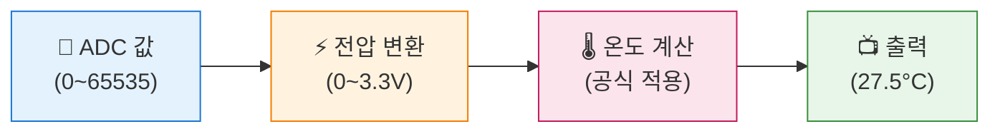

# 온도계 만들기 - 온도 센서 활용

## 🎯 이 장에서 배우는 것

- [ ] 피코 내장 온도 센서의 동작 원리를 설명할 수 있다
- [ ] ADC 값을 실제 섭씨 온도로 변환하는 공식을 적용할 수 있다
- [ ] 측정한 온도를 포맷팅하여 보기 좋게 출력할 수 있다
- [ ] 온도에 따라 LED나 부저로 경고하는 시스템을 만들 수 있다

---

## 💡 왜 이걸 배우나요?

온도는 우리 생활에서 가장 많이 측정하는 물리량 중 하나예요. 날씨 앱, 에어컨 리모컨, 냉장고, 심지어 스마트폰까지 온도 센서가 들어있죠.

**재미있는 사실**: 라즈베리파이 피코에는 온도 센서가 **이미 내장**되어 있어요! 추가 부품 없이도 바로 온도를 측정할 수 있답니다.

이번 장에서는:
- 센서가 보내는 "날것의 숫자"를 우리가 아는 **섭씨 온도로 변환**하는 방법
- `27.5°C` 처럼 **예쁘게 출력**하는 기술
- 온도가 너무 높으면 **자동으로 경고**하는 시스템

을 만들어볼 거예요. 이 원리를 알면 나중에 어떤 센서든 "읽고 → 변환하고 → 활용"할 수 있게 됩니다!

---

## 📚 핵심 개념

### 개념 1: 피코 내장 온도 센서

1. **비유로 시작**: "피코 내장 온도 센서는 마치 피코의 '체온계'와 같아요. 피코 칩 자체의 온도를 재는 거죠."

2. **정확한 정의**: 피코의 RP2040 칩 내부에는 온도에 따라 전압이 변하는 센서가 있어요. 이 센서는 ADC 채널 4번에 연결되어 있습니다.

3. **예시로 확인**: 방 온도가 25°C일 때, 피코 칩은 작동하면서 살짝 더 따뜻해져서 약 27~30°C 정도를 측정해요.

**쉽게 말하면**: 피코 안에 이미 온도 센서가 들어있어서, 코드만 작성하면 바로 온도를 잴 수 있어요!

---

### 개념 2: ADC 값을 온도로 변환하기

1. **비유로 시작**: "ADC 값을 온도로 바꾸는 건, 외국 돈을 우리나라 돈으로 환전하는 것과 같아요. 환율 공식만 알면 돼요!"

2. **정확한 정의**: 피코 온도 센서는 다음 공식을 사용합니다:
   ```
   온도(°C) = 27 - (ADC전압 - 0.706) / 0.001721
   ```
   - `27`: 기준 온도
   - `0.706V`: 27°C에서의 기준 전압
   - `0.001721`: 1°C당 전압 변화량

3. **예시로 확인**: ADC에서 읽은 전압이 0.700V라면
   ```
   온도 = 27 - (0.700 - 0.706) / 0.001721 = 27 - (-0.006) / 0.001721 ≈ 30.5°C
   ```

**쉽게 말하면**: 센서가 주는 숫자에 정해진 공식을 적용하면 섭씨 온도가 나와요!



---

### 개념 3: 문자열 포맷팅

1. **비유로 시작**: "포맷팅은 마치 선물 포장과 같아요. 같은 내용물이라도 예쁘게 포장하면 받는 사람이 더 기뻐하죠!"

2. **정확한 정의**: 파이썬의 f-string을 사용하면 숫자를 원하는 형태로 출력할 수 있어요.
   ```python
   f"{온도:.1f}°C"  # 소수점 1자리까지 표시
   ```

3. **예시로 확인**:
   ```python
   temp = 27.456
   print(f"{temp:.1f}°C")   # 출력: 27.5°C
   print(f"{temp:.2f}°C")   # 출력: 27.46°C
   ```

**쉽게 말하면**: `.1f`는 "소수점 아래 1자리만 보여줘"라는 뜻이에요!

---

## 🔨 따라하기

### Step 1: 내장 온도 센서 읽기

**목표**: 피코 내장 온도 센서의 원시 값(raw value)을 읽어봅니다.

**코드**:
```python
# === WHAT: 피코 내장 온도 센서 읽기 ===
# 피코 칩 내부의 온도 센서에서 ADC 값을 읽어요

# --- WHY: 왜 필요한지 ---
# 모든 센서 활용의 첫 단계는 "값 읽기"예요
# 먼저 센서가 어떤 값을 주는지 확인해야 해요

# HOW: 어떻게 동작하는지
from machine import ADC      # ADC(아날로그-디지털 변환) 라이브러리
import time                  # 시간 관련 기능

# 내장 온도 센서는 ADC 채널 4번에 연결되어 있어요
temp_sensor = ADC(4)

# 5번 측정해서 값 확인하기
for i in range(5):
    raw_value = temp_sensor.read_u16()  # 16비트 값 읽기 (0~65535)
    print(f"측정 {i+1}: ADC 값 = {raw_value}")
    time.sleep(1)  # 1초 대기
```

**실행 결과**:
```
측정 1: ADC 값 = 39876
측정 2: ADC 값 = 39912
측정 3: ADC 값 = 39845
측정 4: ADC 값 = 39889
측정 5: ADC 값 = 39901
```

**여기서 잠깐! 🤔**
- `read_u16()`은 0~65535 사이의 숫자를 반환해요
- 이 숫자 자체는 온도가 아니에요! 변환이 필요합니다
- 값이 조금씩 다른 건 정상이에요 (센서 노이즈)

---

### Step 2: ADC 값을 온도로 변환하기

**목표**: 공식을 적용해서 실제 섭씨 온도를 계산합니다.

**코드**:
```python
# === WHAT: ADC 값을 섭씨 온도로 변환하기 ===
# 센서가 준 숫자를 우리가 아는 온도로 바꿔요

# --- WHY: 왜 필요한지 ---
# 39876 같은 숫자는 의미가 없어요
# "27.5°C"처럼 이해할 수 있는 값이 필요해요

# HOW: 어떻게 동작하는지
from machine import ADC
import time

temp_sensor = ADC(4)

def read_temperature():
    """내장 온도 센서에서 섭씨 온도를 읽는 함수"""
    # 1단계: ADC 원시 값 읽기
    raw_value = temp_sensor.read_u16()
    
    # 2단계: 전압으로 변환 (3.3V 기준)
    voltage = raw_value * 3.3 / 65535
    
    # 3단계: 온도로 변환 (피코 공식)
    temperature = 27 - (voltage - 0.706) / 0.001721
    
    return temperature

# 5번 측정
for i in range(5):
    temp = read_temperature()
    print(f"측정 {i+1}: {temp}°C")
    time.sleep(1)
```

**실행 결과**:
```
측정 1: 28.234567890123456°C
측정 2: 27.987654321098765°C
측정 3: 28.456789012345678°C
측정 4: 28.123456789012345°C
측정 5: 28.345678901234567°C
```

**여기서 잠깐! 🤔**
- 소수점이 너무 길어요! 다음 단계에서 깔끔하게 정리할 거예요
- 피코 칩 온도라서 실제 방 온도보다 2~5°C 정도 높게 나와요

---

### Step 3: 예쁘게 출력하기

**목표**: f-string 포맷팅으로 깔끔하게 온도를 표시합니다.

**코드**:
```python
# === WHAT: 온도를 예쁘게 출력하기 ===
# 소수점 1자리로 깔끔하게 표시해요

# --- WHY: 왜 필요한지 ---
# "28.234567890123456°C"보다 "28.2°C"가 훨씬 읽기 좋아요!

# HOW: 어떻게 동작하는지
from machine import ADC
import time

temp_sensor = ADC(4)

def read_temperature():
    """섭씨 온도를 반환하는 함수"""
    raw_value = temp_sensor.read_u16()
    voltage = raw_value * 3.3 / 65535
    temperature = 27 - (voltage - 0.706) / 0.001721
    return temperature

print("🌡️ 온도 모니터링 시작!")
print("-" * 25)

for i in range(5):
    temp = read_temperature()
    
    # f-string으로 소수점 1자리까지만 표시
    print(f"  현재 온도: {temp:.1f}°C")
    time.sleep(1)

print("-" * 25)
print("✅ 측정 완료!")
```

**실행 결과**:
```
🌡️ 온도 모니터링 시작!
-------------------------
  현재 온도: 28.2°C
  현재 온도: 28.0°C
  현재 온도: 28.5°C
  현재 온도: 28.1°C
  현재 온도: 28.3°C
-------------------------
✅ 측정 완료!
```

**여기서 잠깐! 🤔**
- `:.1f` = 소수점 아래 1자리 (float)
- `:.2f` = 소수점 아래 2자리
- `:.0f` = 정수로 표시 (소수점 없음)

---

### Step 4: 온도 경보기 만들기

**목표**: 온도가 일정 기준을 넘으면 경고를 출력합니다.

**코드**:
```python
# === WHAT: 온도 경보 시스템 ===
# 온도가 너무 높으면 경고해요!

# --- WHY: 왜 필요한지 ---
# 서버실, 온실, 냉장고 등에서 온도 이상을 감지하는 게 중요해요

# HOW: 어떻게 동작하는지
from machine import ADC, Pin
import time

temp_sensor = ADC(4)
led = Pin("LED", Pin.OUT)  # 내장 LED

# 경고 기준 온도 설정
WARNING_TEMP = 30.0  # 30°C 이상이면 경고

def read_temperature():
    """섭씨 온도를 반환"""
    raw_value = temp_sensor.read_u16()
    voltage = raw_value * 3.3 / 65535
    return 27 - (voltage - 0.706) / 0.001721

def check_temperature(temp):
    """온도 상태를 확인하고 경고 여부 반환"""
    if temp >= WARNING_TEMP:
        return "🔴 경고! 온도 높음!"
    elif temp >= WARNING_TEMP - 3:
        return "🟡 주의: 온도 상승 중"
    else:
        return "🟢 정상"

print("=" * 30)
print("   🌡️ 온도 경보 시스템")
print(f"   경고 기준: {WARNING_TEMP}°C")
print("=" * 30)

while True:
    temp = read_temperature()
    status = check_temperature(temp)
    
    print(f"온도: {temp:.1f}°C  {status}")
    
    # 경고 상태면 LED 깜빡임
    if temp >= WARNING_TEMP:
        led.on()
        time.sleep(0.2)
        led.off()
        time.sleep(0.3)
    else:
        led.off()
        time.sleep(1)
```

**실행 결과**:
```
==============================
   🌡️ 온도 경보 시스템
   경고 기준: 30.0°C
==============================
온도: 28.2°C  🟢 정상
온도: 28.5°C  🟢 정상
온도: 29.1°C  🟡 주의: 온도 상승 중
온도: 30.2°C  🔴 경고! 온도 높음!
온도: 30.5°C  🔴 경고! 온도 높음!
```

💡 **팁**: 손가락으로 피코 칩을 살짝 감싸면 체온으로 온도가 올라가요!

---

## 📝 전체 코드

```python
# === 온도 경보 시스템 - 완성 코드 ===
# 피코 내장 온도 센서로 실시간 모니터링 + LED 경고

from machine import ADC, Pin
import time

# === 하드웨어 설정 ===
temp_sensor = ADC(4)       # 내장 온도 센서 (채널 4)
led = Pin("LED", Pin.OUT)  # 내장 LED

# === 설정 값 ===
WARNING_TEMP = 30.0  # 경고 온도 (°C)
INTERVAL = 1         # 측정 간격 (초)

# === 함수 정의 ===
def read_temperature():
    """내장 온도 센서에서 섭씨 온도를 읽어 반환"""
    raw = temp_sensor.read_u16()          # ADC 값 읽기
    voltage = raw * 3.3 / 65535           # 전압 변환
    temp = 27 - (voltage - 0.706) / 0.001721  # 온도 변환
    return temp

def get_status(temp):
    """온도에 따른 상태 문자열 반환"""
    if temp >= WARNING_TEMP:
        return "🔴 경고!"
    elif temp >= WARNING_TEMP - 3:
        return "🟡 주의"
    else:
        return "🟢 정상"

# === 메인 프로그램 ===
print("🌡️ 온도 모니터링 시작")
print(f"경고 기준: {WARNING_TEMP}°C")
print("-" * 30)

while True:
    temp = read_temperature()
    status = get_status(temp)
    
    print(f"현재 온도: {temp:.1f}°C  [{status}]")
    
    # 경고 시 LED 깜빡임
    if temp >= WARNING_TEMP:
        led.toggle()
        time.sleep(0.3)
    else:
        led.off()
        time.sleep(INTERVAL)
```

---

## ⚠️ 자주 하는 실수

### 실수 1: ADC 값을 바로 온도로 착각

**증상**: "온도가 39000도래요?!"

**원인**: ADC 원시 값(0~65535)을 변환 없이 출력

**해결**:
```python
# ❌ 잘못된 코드
temp = temp_sensor.read_u16()
print(f"온도: {temp}°C")  # 39876°C?!

# ✅ 올바른 코드
raw = temp_sensor.read_u16()
voltage = raw * 3.3 / 65535
temp = 27 - (voltage - 0.706) / 0.001721
print(f"온도: {temp:.1f}°C")  # 28.2°C
```

---

### 실수 2: 포맷팅 문법 오류

**증상**: `SyntaxError` 또는 이상한 출력

**원인**: f-string 문법 실수

**해결**:
```python
temp = 28.5

# ❌ 잘못된 코드들
print(f"{temp.1f}°C")    # 점(.) 위치 오류
print(f"{temp:1f}°C")    # 점(.) 누락
print("{temp:.1f}°C")    # f 누락

# ✅ 올바른 코드
print(f"{temp:.1f}°C")   # 콜론(:) 다음에 .1f
```

---

### 실수 3: 실제 방 온도와 다르다고 당황

**증상**: "실제 온도는 25도인데 30도가 나와요"

**원인**: 피코 **칩 온도**를 측정하는 것이지, 공기 온도가 아님

**해결**:
```python
# 💡 이해하기
# - 내장 센서 = 피코 칩의 온도 (작동 시 발열)
# - 보통 실제 기온보다 3~8°C 높음
# - 정확한 실내 온도 측정에는 외부 센서(DHT11) 사용

# 참고용 보정 (대략적)
OFFSET = -5  # 실험으로 결정
adjusted_temp = read_temperature() + OFFSET
```

---

## ✅ 스스로 점검하기

1. **사실 확인**: 피코 내장 온도 센서는 ADC 몇 번 채널에 연결되어 있나요?

2. **적용 질문**: 온도를 소수점 2자리까지 표시하려면 포맷 코드를 어떻게 써야 하나요?

3. **이유 질문**: 내장 온도 센서가 측정하는 온도가 실제 방 온도보다 높은 이유는 무엇인가요?

<details>
<summary>정답 확인</summary>

1. **ADC 채널 4번**에 연결되어 있습니다. `ADC(4)`로 접근해요.

2. `f"{temp:.2f}°C"` - 콜론 뒤에 `.2f`를 쓰면 소수점 아래 2자리까지 표시됩니다.

3. 내장 센서는 **피코 칩 자체의 온도**를 측정하기 때문이에요. 피코가 작동하면서 발열이 생겨서 주변 공기보다 몇 도 더 따뜻해집니다.

</details>

---

## 🚀 더 해보기

### 도전 1: 화씨 온도 추가 (쉬움)
섭씨와 화씨를 함께 출력해보세요.
```
💡 힌트: 화씨 = 섭씨 × 9/5 + 32
예: 현재 온도: 28.5°C / 83.3°F
```

### 도전 2: 최고/최저 온도 기록 (중간)
프로그램 실행 동안 최고 온도와 최저 온도를 기록하고 표시해보세요.
```
💡 힌트: max_temp, min_temp 변수를 만들어서 비교
예: 최고: 32.1°C | 최저: 27.8°C | 현재: 29.5°C
```

### 도전 3: Grove 부저로 경고음 추가 ⭐
온도가 경고 수준을 넘으면 LED 뿐만 아니라 부저로 "삐삐" 경고음을 내보세요.
```
💡 힌트: 
- Grove 부저를 D20에 연결
- PWM으로 소리 내기 (13장 참고)
```

---

## 🔗 다음 장으로

이번 장에서 배운 것:
- ✅ 피코 내장 온도 센서 사용법
- ✅ ADC 값 → 전압 → 온도 변환 공식
- ✅ f-string으로 예쁘게 출력하기
- ✅ 조건문으로 온도 경보 시스템 만들기

**다음 장 예고**: 📏 **초음파로 거리 측정하기**

온도 다음은 **거리**예요! 초음파 센서는 박쥐처럼 소리를 쏘고 돌아오는 시간으로 거리를 측정합니다. 자동차 후방 감지 센서, 로봇 청소기가 바로 이 원리를 사용해요. 다음 장에서 만나요! 🦇