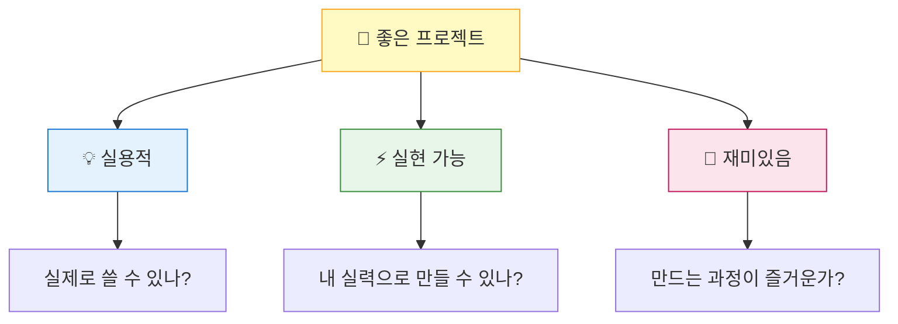
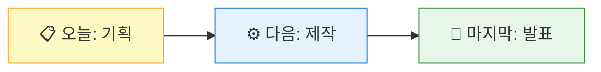

# 프로젝트 기획 - 아이디어 구체화

**Part 6**: 나만의 스마트 기기 - 통합 프로젝트

---

## 🎯 이 장에서 배우는 것

- [ ] 나만의 프로젝트 아이디어를 선정하고 정리할 수 있다
- [ ] 필요한 부품과 기능을 정리한 기획서를 작성할 수 있다
- [ ] 단계별 개발 계획을 수립할 수 있다

---

## 💡 왜 이걸 배우나요?

지금까지 우리는 LED, 버튼, 센서, OLED, WiFi까지 정말 많은 것을 배웠어요. 하지만 이 모든 것은 **누군가 정해준 예제**를 따라한 것이었죠.

이제는 다릅니다! 🚀

**"내가 원하는 것을 만든다"** - 이것이 진짜 메이커의 시작이에요.

세상의 모든 멋진 제품들은 누군가의 **"이런 거 있으면 좋겠다"**라는 생각에서 시작했어요. 여러분도 지금부터 그 첫 걸음을 떼는 거예요!

좋은 기획 없이 바로 코딩을 시작하면? 중간에 방향을 잃고 헤매게 됩니다. 오늘 배우는 기획 방법은 앞으로 어떤 프로젝트를 하든 도움이 될 거예요.

---

## 📚 핵심 개념

### 개념 1: 프로젝트 기획이란?

1. **비유로 시작**: "프로젝트 기획은 마치 여행 계획과 같아요. 어디로(목표), 무엇을 타고(도구), 어떤 경로로(단계) 갈지 미리 정하는 거죠."

2. **정확한 정의**: "정확히 말하면, 만들고 싶은 것을 구체적으로 정의하고, 필요한 것들을 정리하고, 실행 순서를 계획하는 과정입니다."

3. **예시로 확인**: "예를 들어, '스마트 알람시계'를 만든다면 → 어떤 센서가 필요한지, 어떤 기능이 핵심인지, 며칠에 걸쳐 무엇을 만들지 정리하는 거예요."

**쉽게 말하면**: 기획 = 무엇을 + 왜 + 어떻게 만들지 정리하는 것

---

### 개념 2: 좋은 프로젝트의 조건



세 가지 조건을 모두 만족하면 최고의 프로젝트가 됩니다!

**쉽게 말하면**: 쓸모있고 + 만들 수 있고 + 재미있어야 좋은 프로젝트!

---

## 🔨 따라하기

### Step 1: 아이디어 브레인스토밍

**목표**: 다양한 아이디어를 자유롭게 떠올리기

**아이디어 예시 모음** 📋

| 아이디어 | 핵심 기능 | 필요 부품 |
|----------|----------|-----------|
| 스마트 알람시계 | 시간 표시 + 알람 + 날씨 | OLED, 부저, WiFi |
| 식물 물주기 알림기 | 토양 습도 측정 + 알림 | 토양센서, LED, 부저 |
| 공부 집중 타이머 | 뽀모도로 타이머 + 휴식 알림 | OLED, 버튼, 부저 |
| 방문자 알림기 | 움직임 감지 + 알림 | 초음파센서, LED, 부저 |
| 스마트 무드등 | 밝기 자동 조절 + 색상 변경 | 조도센서, RGB LED |
| 온습도 모니터 | 환경 측정 + 경고 | DHT11, OLED, LED |

**여기서 잠깐! 🤔**

아이디어가 떠오르지 않나요? 이 질문들에 답해보세요:
- "아침에 일어날 때 불편한 점은?"
- "공부할 때 있으면 좋겠는 것은?"
- "우리 집에서 자동화되면 좋겠는 것은?"

---

### Step 2: 아이디어 평가하기

**목표**: 여러 아이디어 중 하나를 선택하기

아이디어가 몇 개 나왔다면, 아래 기준으로 점수를 매겨보세요 (1~5점):

| 평가 기준 | 아이디어 A | 아이디어 B | 아이디어 C |
|----------|-----------|-----------|-----------|
| 실용성 (쓸모있나?) | ? | ? | ? |
| 실현 가능성 (만들 수 있나?) | ? | ? | ? |
| 흥미도 (재미있나?) | ? | ? | ? |
| 부품 보유 여부 | ? | ? | ? |
| **총점** | ? | ? | ? |

가장 점수가 높은 아이디어를 선택하세요!

**여기서 잠깐! 🤔**

"너무 쉬운 것 같은데..." 걱정되나요? 
**괜찮아요!** 처음엔 작게 시작하고, 나중에 기능을 추가하면 됩니다.

---

### Step 3: 기획서 작성하기

**목표**: 선택한 아이디어를 구체적인 기획서로 정리하기

아래 템플릿을 채워보세요:

---

## 📄 프로젝트 기획서 템플릿

### 1️⃣ 기본 정보
- **프로젝트명**: 
- **만드는 사람**: 
- **예상 제작 기간**: 약 2시간 (다음 2차시)

### 2️⃣ 프로젝트 소개
- **한 줄 설명**: (이 기기는 무엇인가요?)
- **해결하려는 문제**: (어떤 불편함을 해결하나요?)
- **사용 대상**: (누가 사용하나요?)

### 3️⃣ 핵심 기능 (3개 이내)
| 기능 | 설명 | 우선순위 |
|-----|------|---------|
| 기능 1 | | ⭐⭐⭐ 필수 |
| 기능 2 | | ⭐⭐ 중요 |
| 기능 3 | | ⭐ 있으면 좋음 |

### 4️⃣ 필요한 부품
| 부품 | 용도 | 연결 포트 |
|-----|------|----------|
| | | |
| | | |
| | | |

### 5️⃣ 개발 단계 (2시간 기준)
| 단계 | 할 일 | 예상 시간 |
|-----|------|----------|
| 1단계 | 하드웨어 연결 | 20분 |
| 2단계 | 기본 기능 구현 | 40분 |
| 3단계 | 기능 통합 | 30분 |
| 4단계 | 테스트 및 개선 | 20분 |
| 5단계 | 발표 준비 | 10분 |

### 6️⃣ 예상 결과물
- **작동 시나리오**: (사용자가 어떻게 사용하나요?)
- **성공 기준**: (뭐가 되면 성공인가요?)

---

## 📝 기획서 예시: 스마트 알람시계

실제로 기획서가 어떻게 채워지는지 볼까요?

### 1️⃣ 기본 정보
- **프로젝트명**: 똑똑한 아침 알람시계
- **만드는 사람**: 김피코
- **예상 제작 기간**: 약 2시간

### 2️⃣ 프로젝트 소개
- **한 줄 설명**: 인터넷에서 시간을 받아와 알람을 울리고 날씨를 보여주는 시계
- **해결하려는 문제**: 아침에 일어날 때 오늘 날씨를 바로 확인하고 싶다
- **사용 대상**: 나 (책상 위에 두고 사용)

### 3️⃣ 핵심 기능
| 기능 | 설명 | 우선순위 |
|-----|------|---------|
| 시계 표시 | OLED에 현재 시간 표시 | ⭐⭐⭐ 필수 |
| 알람 | 설정 시간에 부저로 알림 | ⭐⭐ 중요 |
| 날씨 표시 | 현재 날씨 정보 표시 | ⭐ 있으면 좋음 |

### 4️⃣ 필요한 부품
| 부품 | 용도 | 연결 포트 |
|-----|------|----------|
| OLED | 시간/날씨 표시 | I2C |
| 부저 | 알람 소리 | D20 |
| 버튼 | 알람 끄기 | D18 |

### 5️⃣ 개발 단계
| 단계 | 할 일 | 예상 시간 |
|-----|------|----------|
| 1단계 | OLED 연결 및 시간 표시 | 20분 |
| 2단계 | NTP 시간 동기화 | 20분 |
| 3단계 | 알람 기능 추가 | 25분 |
| 4단계 | 버튼으로 알람 끄기 | 20분 |
| 5단계 | 테스트 및 발표 준비 | 15분 |

### 6️⃣ 예상 결과물
- **작동 시나리오**: 전원 켜면 → WiFi 연결 → 시간 표시 → 설정 시간에 부저 울림 → 버튼 누르면 알람 꺼짐
- **성공 기준**: 정확한 시간이 표시되고, 알람이 제 시간에 울리면 성공!

---

## ⚠️ 자주 하는 실수

### 실수 1: 너무 큰 목표 설정
**증상**: "AI 음성인식 스마트홈 시스템을 만들 거예요!"

**원인**: 처음이라 현실적인 범위를 가늠하기 어려움

**해결**: 
```
❌ 잘못된 목표: "모든 기능이 다 되는 완벽한 시스템"

✅ 올바른 목표: "일단 LED 하나 켜는 것부터!"
```

**Tip**: 핵심 기능 1개만 확실히 되게 만들고, 나머지는 "추가 기능"으로!

---

### 실수 2: 기획 없이 바로 코딩 시작
**증상**: 코딩하다 중간에 "어... 이제 뭐하지?"

**원인**: 전체 그림 없이 시작함

**해결**:
```
❌ 잘못된 순서: 코딩 → 막힘 → 고민 → 다시 시작

✅ 올바른 순서: 기획 → 설계 → 코딩 → 완성
```

---

### 실수 3: 없는 부품으로 기획
**증상**: "초음파 센서로 할 거예요!" (근데 우리 키트에 없음)

**원인**: 가지고 있는 부품을 확인하지 않음

**해결**: 기획 전에 **부품 목록을 먼저 확인**하세요!

---

## ✅ 스스로 점검하기

1. **사실 확인**: 좋은 프로젝트의 세 가지 조건은 무엇인가요?

2. **적용 질문**: 여러분의 프로젝트는 어떤 문제를 해결하나요?

3. **이유 질문**: 왜 기획을 먼저 하고 코딩을 나중에 하는 게 좋을까요?

<details>
<summary>정답 확인</summary>

1. 실용적(쓸모있음) + 실현 가능(만들 수 있음) + 재미있음

2. (여러분의 답을 적어보세요!)

3. 전체 방향을 먼저 정해야 중간에 헤매지 않고, 필요한 것을 미리 준비할 수 있기 때문입니다. 집을 지을 때 설계도 없이 바로 벽돌을 쌓지 않는 것과 같아요!

</details>

---

## 🚀 더 해보기

### 도전 1: 기획서 완성하기 (필수!)
오늘 수업 시간 안에 **기획서를 완성**하세요. 빈칸 없이 모두 채워야 합니다!

### 도전 2: 동료 피드백 받기
옆 친구와 기획서를 교환하고, 아래 질문에 답해주세요:
- 이 프로젝트가 뭘 하는지 이해가 되나요?
- 2시간 안에 만들 수 있을 것 같나요?
- 더 좋은 아이디어가 있나요?

### 도전 3: 스케치 그리기 ⭐
완성된 프로젝트가 어떻게 생겼을지 간단히 그림으로 그려보세요. 부품 배치, 버튼 위치 등을 표시하면 더 좋아요!

---

## 📋 오늘의 체크리스트

다음 시간 전까지 꼭 완료하세요:

- [ ] 프로젝트 아이디어 선정 완료
- [ ] 기획서 템플릿 모든 항목 작성 완료
- [ ] 필요한 부품 목록 확인 완료
- [ ] 친구에게 기획서 피드백 받기 (선택)

---

## 🔗 다음 장으로

오늘은 **무엇을 만들지** 계획을 세웠어요!

여러분의 기획서가 완성되었다면, 다음 시간부터는 진짜 **만들기**가 시작됩니다! 🔧



**다음 장에서는**:
- 기획서대로 하드웨어 연결하기
- 단계별로 코드 작성하기
- 기능 통합하고 테스트하기

기획서 잘 보관하세요! 다음 시간에 그대로 가져와야 해요! 📄✨