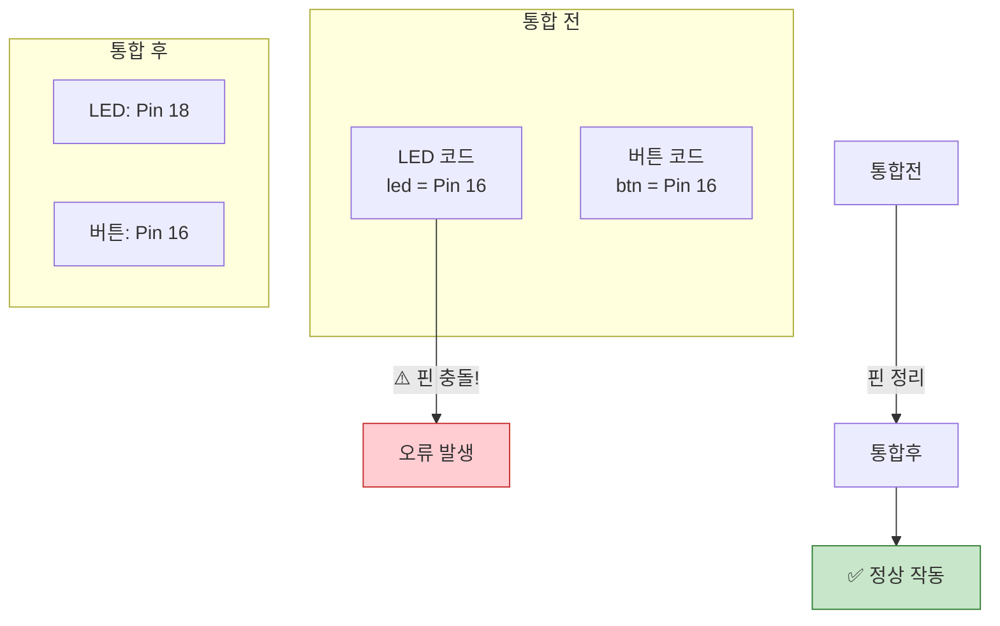
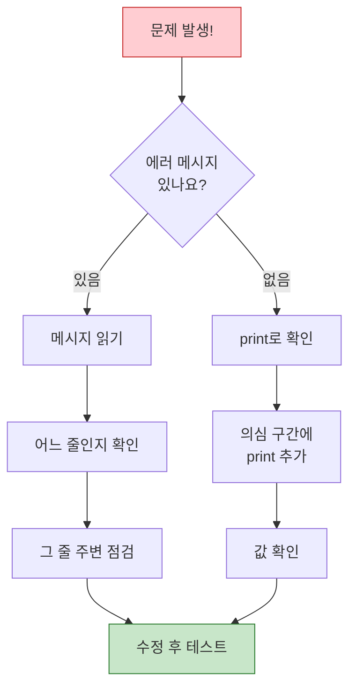

# Chapter 17: 만들기 - 회로 구성과 코딩

## 🎯 이 장에서 배우는 것

- [ ] 설계서를 보고 실제 회로를 구성할 수 있다
- [ ] 여러 기능을 하나의 프로그램으로 통합할 수 있다
- [ ] 오류를 체계적으로 찾아 해결하는 디버깅을 할 수 있다

---

## 💡 왜 이걸 배우나요?

지난 시간에 열심히 기획서를 작성했죠? 이제 **진짜 만들 시간**입니다! 🎉

설계도만 있으면 집이 저절로 지어지지 않듯, 기획서만 있다고 스마트 기기가 완성되지 않아요. 직접 부품을 연결하고, 코드를 작성하고, 테스트해야 합니다.

여기서 중요한 건 **문제가 생겨도 당황하지 않는 것**이에요. 프로 개발자들도 코드 작성 시간보다 **디버깅 시간**이 더 길다고 해요. 오류를 만나고 해결하는 과정에서 진짜 실력이 쌓입니다!

---

## 📚 핵심 개념

### 개념 1: 단계별 개발 전략

프로젝트를 만들 때 한 번에 모든 걸 완성하려고 하면 어디서 문제가 생겼는지 찾기 어려워요.

1. **비유로 시작**: "마치 요리할 때 재료를 하나씩 맛보며 확인하는 것처럼, 코드도 조금씩 테스트하며 만들어요"
2. **정확한 정의**: "단계별 개발은 기능을 작은 단위로 나누어 각각 완성하고 테스트한 후, 하나씩 합치는 방법입니다"
3. **예시로 확인**: "스마트 알람을 만든다면 ① LED만 테스트 → ② 부저만 테스트 → ③ 센서만 테스트 → ④ 합치기"

**쉽게 말하면**: 작게 나눠서 각각 성공시킨 후, 하나씩 합쳐요!

### 개념 2: 디버깅의 기본 원칙


1. **비유로 시작**: "의사가 증상을 듣고 원인을 찾듯, 에러 메시지는 컴퓨터가 알려주는 '증상'이에요"
2. **정확한 정의**: "디버깅은 프로그램의 오류(버그)를 찾아 수정하는 과정입니다"
3. **예시로 확인**: "'NameError: name 'led' is not defined'는 'led라는 이름을 모르겠어요'라는 뜻이에요"

**쉽게 말하면**: 에러 메시지를 친구처럼 대해요 - 뭐가 문제인지 알려주거든요!

### 개념 3: 코드 통합의 핵심

여러 기능을 합칠 때 가장 중요한 건 **핀 충돌 방지**와 **변수명 정리**예요.



**쉽게 말하면**: 같은 핀을 두 번 사용하면 안 돼요!

---

## 🔨 따라하기

### Step 1: 기획서 점검하기

**목표**: 만들기 전에 필요한 것들 확인하기

시작하기 전에 기획서를 다시 펼쳐보세요:

**✅ 체크리스트**
- [ ] 사용할 센서/출력장치 목록이 있나요?
- [ ] 각 부품의 연결 포트가 정해졌나요?
- [ ] 핀 번호가 겹치는 건 없나요?

📌 **예시 - 스마트 알람 기획서 요약**

| 부품 | 역할 | 연결 포트 | 핀 번호 |
|------|------|----------|---------|
| DHT11 | 온도 감지 | D16 | GP16 |
| LED | 상태 표시 | D18 | GP18 |
| 부저 | 알람 소리 | D20 | GP20 |
| 버튼 | 알람 끄기 | D17 | GP17 |

### Step 2: 부품 하나씩 테스트하기

**목표**: 각 부품이 제대로 작동하는지 개별 확인

**🔴 LED 테스트 코드**:
```python
# === WHAT: LED가 잘 연결됐는지 테스트 ===
# 먼저 LED만 따로 테스트해봐요

# --- WHY: 나중에 문제 생기면 어디가 문제인지 모르니까 ---
# 지금 확인해두면 통합할 때 편해요

# HOW: 어떻게 동작하는지
from machine import Pin  # 핀 제어 라이브러리
import time              # 시간 함수

led = Pin(18, Pin.OUT)   # GP18에 LED 연결

# 3번 깜빡여서 확인
for i in range(3):
    led.on()             # LED 켜기
    print("LED 켜짐")
    time.sleep(0.5)      # 0.5초 대기
    led.off()            # LED 끄기
    print("LED 꺼짐")
    time.sleep(0.5)

print("LED 테스트 완료! ✅")
```

**실행 결과**:
```
LED 켜짐
LED 꺼짐
LED 켜짐
LED 꺼짐
LED 켜짐
LED 꺼짐
LED 테스트 완료! ✅
```

**여기서 잠깐! 🤔**
LED가 깜빡이지 않는다면? 
1. Grove 케이블이 제대로 꽂혔는지 확인
2. 포트 번호(D18)가 맞는지 확인
3. LED 모듈의 방향이 맞는지 확인

**🔔 부저 테스트 코드**:
```python
# === WHAT: 부저가 잘 작동하는지 테스트 ===
from machine import Pin, PWM
import time

buzzer = PWM(Pin(20))    # GP20에 부저 연결

# 삐~ 소리 한 번
buzzer.freq(1000)        # 1000Hz 주파수
buzzer.duty_u16(32768)   # 50% 듀티 (소리 켜기)
print("삐~ 소리 나나요?")
time.sleep(0.5)
buzzer.duty_u16(0)       # 소리 끄기

print("부저 테스트 완료! ✅")
```

**🌡️ DHT11 센서 테스트 코드**:
```python
# === WHAT: 온습도 센서 테스트 ===
from machine import Pin
import dht
import time

sensor = dht.DHT11(Pin(16))  # GP16에 DHT11 연결

# 3번 측정해보기
for i in range(3):
    time.sleep(2)            # DHT11은 2초 간격 필요
    sensor.measure()         # 측정 실행
    temp = sensor.temperature()  # 온도 읽기
    humid = sensor.humidity()    # 습도 읽기
    print(f"#{i+1} 온도: {temp}°C, 습도: {humid}%")

print("센서 테스트 완료! ✅")
```

### Step 3: 기능 통합하기

**목표**: 테스트한 부품들을 하나의 프로그램으로 합치기

```python
# === WHAT: 스마트 알람 - 통합 버전 ===
# 온도가 높으면 부저가 울리고 LED가 켜져요

# --- WHY: 각각 성공한 코드를 하나로 합쳐요 ---
# 이미 테스트했으니 자신있게!

from machine import Pin, PWM
import dht
import time

# === 1단계: 모든 부품 초기화 ===
print("부품 초기화 중...")
sensor = dht.DHT11(Pin(16))  # 온습도 센서
led = Pin(18, Pin.OUT)        # LED
buzzer = PWM(Pin(20))         # 부저
button = Pin(17, Pin.IN, Pin.PULL_DOWN)  # 버튼

# 알람 기준 온도
ALARM_TEMP = 28

# === 2단계: 알람 함수 만들기 ===
def alarm_on():
    """알람을 켜는 함수"""
    led.on()
    buzzer.freq(1000)
    buzzer.duty_u16(32768)
    print("🚨 알람 켜짐!")

def alarm_off():
    """알람을 끄는 함수"""
    led.off()
    buzzer.duty_u16(0)
    print("알람 꺼짐")

# === 3단계: 메인 루프 ===
print(f"스마트 알람 시작! (기준 온도: {ALARM_TEMP}°C)")
print("버튼을 누르면 알람이 꺼져요")

alarm_active = False  # 알람 상태

while True:
    # 온도 측정
    try:
        sensor.measure()
        temp = sensor.temperature()
        print(f"현재 온도: {temp}°C")
        
        # 온도가 높으면 알람
        if temp >= ALARM_TEMP and not alarm_active:
            alarm_on()
            alarm_active = True
            
    except Exception as e:
        print(f"센서 오류: {e}")
    
    # 버튼으로 알람 끄기
    if button.value() == 1 and alarm_active:
        alarm_off()
        alarm_active = False
    
    time.sleep(2)  # 2초마다 체크
```

**여기서 잠깐! 🤔**
`try-except`는 오류가 나도 프로그램이 멈추지 않게 해줘요. 센서가 가끔 읽기 실패할 수 있거든요!

---

## 📝 전체 코드

```python
# === 스마트 알람 시스템 v1.0 ===
# 온도 기반 알람 + 버튼으로 끄기
# 만든이: ____________
# 날짜: ____________

from machine import Pin, PWM
import dht
import time

# ========== 설정값 ==========
ALARM_TEMP = 28      # 알람 기준 온도
CHECK_INTERVAL = 2   # 측정 간격(초)

# ========== 부품 초기화 ==========
sensor = dht.DHT11(Pin(16))
led = Pin(18, Pin.OUT)
buzzer = PWM(Pin(20))
button = Pin(17, Pin.IN, Pin.PULL_DOWN)

# ========== 함수 정의 ==========
def alarm_on():
    led.on()
    buzzer.freq(1000)
    buzzer.duty_u16(32768)
    print("🚨 알람 작동!")

def alarm_off():
    led.off()
    buzzer.duty_u16(0)
    print("✅ 알람 해제")

def read_temperature():
    try:
        sensor.measure()
        return sensor.temperature()
    except:
        return None

# ========== 메인 프로그램 ==========
print("=" * 30)
print("  스마트 알람 시스템 시작")
print(f"  기준 온도: {ALARM_TEMP}°C")
print("=" * 30)

alarm_active = False

while True:
    temp = read_temperature()
    
    if temp is not None:
        print(f"온도: {temp}°C", end=" ")
        
        if temp >= ALARM_TEMP and not alarm_active:
            alarm_on()
            alarm_active = True
        elif temp < ALARM_TEMP:
            print("- 정상")
    else:
        print("센서 읽기 실패")
    
    if button.value() == 1 and alarm_active:
        alarm_off()
        alarm_active = False
    
    time.sleep(CHECK_INTERVAL)
```

---

## ⚠️ 자주 하는 실수

### 실수 1: 같은 핀을 두 번 사용

**증상**: 
```
ValueError: Pin 16 already in use
```

**원인**: 두 개의 부품을 같은 핀에 연결하려고 함

**해결**:
```python
# 잘못된 코드
led = Pin(16, Pin.OUT)
sensor = dht.DHT11(Pin(16))  # 충돌!

# 올바른 코드
led = Pin(18, Pin.OUT)       # LED는 18번
sensor = dht.DHT11(Pin(16))  # 센서는 16번
```

### 실수 2: 변수명 오타

**증상**: 
```
NameError: name 'buzer' is not defined
```

**원인**: 변수 이름을 다르게 씀 (buzzer vs buzer)

**해결**:
```python
# 잘못된 코드
buzzer = PWM(Pin(20))
buzer.freq(1000)      # 오타!

# 올바른 코드
buzzer = PWM(Pin(20))
buzzer.freq(1000)     # 정확한 이름
```

### 실수 3: 들여쓰기 오류

**증상**: 
```
IndentationError: unexpected indent
```

**원인**: 들여쓰기(스페이스)가 맞지 않음

**해결**:
```python
# 잘못된 코드
if temp > 28:
print("덥다!")        # 들여쓰기 없음

# 올바른 코드  
if temp > 28:
    print("덥다!")    # 4칸 들여쓰기
```

### 실수 4: 센서 측정 간격 무시

**증상**: 온도가 항상 이상한 값이 나옴

**원인**: DHT11은 최소 2초 간격이 필요

**해결**:
```python
# 잘못된 코드
while True:
    sensor.measure()
    print(sensor.temperature())
    time.sleep(0.5)   # 너무 빨라!

# 올바른 코드
while True:
    sensor.measure()
    print(sensor.temperature())
    time.sleep(2)     # 2초 이상!
```

---

## ✅ 스스로 점검하기

1. **왜 부품을 하나씩 테스트한 후에 통합해야 할까요?**

2. **`try-except`를 쓰는 이유는 무엇인가요?**

3. **다음 에러 메시지의 의미는?**
   ```
   NameError: name 'sensor' is not defined
   ```

<details>
<summary>정답 확인</summary>

1. 문제가 생겼을 때 어디서 발생했는지 쉽게 찾을 수 있어요. 모두 합쳐놓으면 원인 찾기가 어려워요.

2. 오류가 나도 프로그램이 멈추지 않고 계속 실행되게 해줘요. 센서는 가끔 읽기 실패할 수 있거든요.

3. 'sensor'라는 변수를 정의하지 않고 사용했다는 뜻이에요. `sensor = dht.DHT11(Pin(16))` 같은 코드가 필요해요.

</details>

---

## 🚀 더 해보기

### 도전 1: LED 패턴 바꾸기
알람이 울릴 때 LED가 깜빡이도록 수정해보세요.

### 도전 2: 온도 단계별 반응
- 28°C 이상: 빨간 LED
- 25~28°C: 노란 LED  
- 25°C 미만: 초록 LED

### 도전 3: OLED에 상태 표시 ⭐
현재 온도와 알람 상태를 OLED 화면에 표시해보세요!

---

## 🛠️ 문제 해결 가이드

문제가 생겼을 때 이 순서로 확인하세요:



**💡 디버깅 꿀팁**
- `print()`를 자주 써서 값을 확인하세요
- 문제가 생기면 주석(`#`)으로 코드를 잠시 비활성화해보세요
- 작동하던 코드로 돌아가서 천천히 다시 시도하세요

---

## 🔗 다음 장으로

축하해요! 🎉 설계서를 바탕으로 실제 작동하는 기기를 만들었어요!

**이번 장에서 배운 것**:
- 단계별 개발로 안전하게 만들기
- 부품 개별 테스트의 중요성
- 에러 메시지 읽고 해결하기
- 코드 통합 시 주의점

**다음 장 예고**: 
완성된 프로젝트를 **테스트하고 발표**하는 시간이에요! 내 작품을 멋지게 소개하는 방법, 친구들 작품에서 배우는 법을 익혀봅시다. 최종 점검 후 자랑스럽게 발표해봐요! 🏆