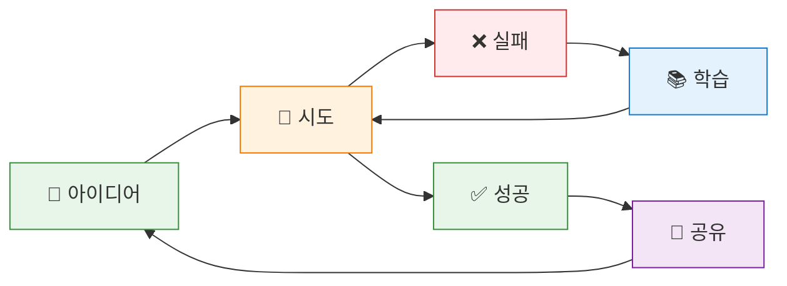
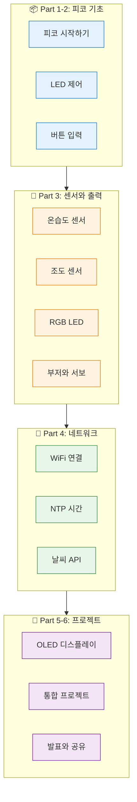
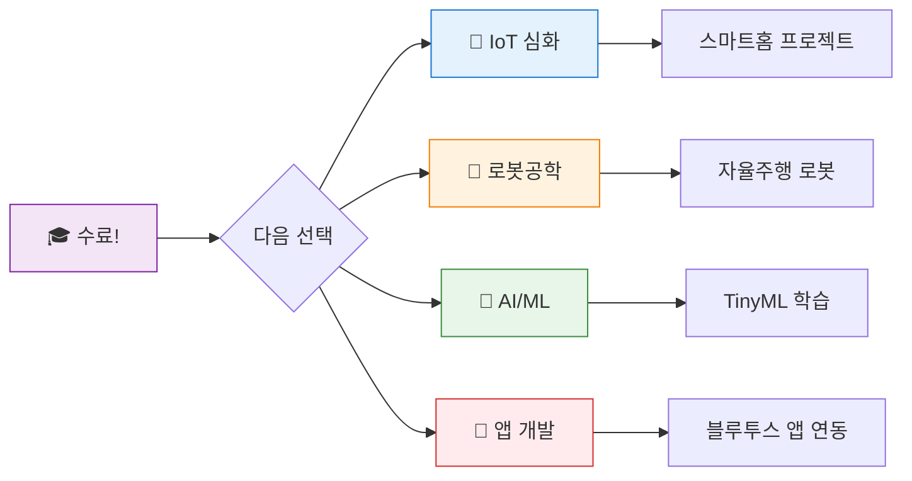

# 발표와 공유 - 프로젝트 시연

## 🎯 이 장에서 배우는 것

- [ ] 완성된 프로젝트를 청중 앞에서 시연할 수 있다
- [ ] 개발 과정과 배운 점을 논리적으로 설명할 수 있다
- [ ] 다른 사람의 프로젝트를 보고 건설적인 피드백을 줄 수 있다
- [ ] 6주간의 학습 여정을 정리하고 다음 단계를 계획할 수 있다

---

## 💡 왜 이걸 배우나요?

> **"좋은 프로젝트도 발표를 못하면 절반만 완성된 것이다"**

여러분이 만든 프로젝트는 정말 대단해요! 하지만 아무리 좋은 작품도 다른 사람에게 설명하지 못하면 그 가치가 절반으로 줄어들어요.

**실제 개발자들의 일상**을 생각해보세요:
- 🎤 **스타트업**: 투자자에게 아이디어를 피칭해야 해요
- 👥 **회사**: 팀원들에게 자신이 만든 기능을 설명해야 해요
- 🌐 **오픈소스**: 전 세계 개발자에게 프로젝트를 소개해야 해요

발표 능력은 **코딩 실력만큼 중요한 개발자의 필수 역량**이에요. 오늘 배운 것을 앞으로 수많은 발표에 활용할 수 있을 거예요!

---

## 📚 핵심 개념

### 개념 1: 효과적인 기술 발표

1. **비유로 시작**: 기술 발표는 마치 **영화 예고편**과 같아요. 짧은 시간 안에 핵심을 보여주고, 관객이 "와, 이거 대박이다!"라고 느끼게 만들어야 해요.

2. **정확한 정의**: 기술 발표란 자신이 만든 프로젝트의 **목적, 기능, 기술적 특징**을 청중이 이해할 수 있도록 설명하고 시연하는 것입니다.

3. **예시로 확인**: "저는 온도에 따라 자동으로 색이 변하는 스마트 무드등을 만들었어요. DHT20 센서로 온도를 읽고, RGB LED로 색을 표현합니다."

**쉽게 말하면**: 내가 뭘 만들었고, 왜 만들었고, 어떻게 작동하는지 보여주는 것!

---

### 개념 2: 피드백의 기술

1. **비유로 시작**: 좋은 피드백은 **거울**과 같아요. 상대방이 보지 못한 것을 비춰주되, 깨트리지 않고 함께 더 나은 모습을 찾아가는 거예요.

2. **정확한 정의**: 건설적인 피드백이란 상대방의 작품에서 **좋은 점을 인정**하고, **개선 가능한 부분을 구체적으로 제안**하는 것입니다.

3. **예시로 확인**: 
   - ❌ "별로예요" (구체적이지 않음)
   - ✅ "LED 반응이 빨라서 좋았어요! 소리 피드백도 추가하면 더 재밌을 것 같아요"

**쉽게 말하면**: 칭찬 + 구체적인 개선 아이디어 = 좋은 피드백!

---

### 개념 3: 메이커의 성장 마인드셋



**메이커 문화의 핵심**:
- 🔄 **반복**: 실패는 배움의 기회
- 🤝 **공유**: 서로의 지식을 나누며 성장
- 🎯 **도전**: 완벽보다 시작이 중요

---

## 🔨 따라하기

### Step 1: 발표 준비하기

**목표**: 3분 발표를 위한 구조를 만들어봐요.

**발표 구조 템플릿**:

```
🎯 1. 소개 (30초)
   - 프로젝트 이름
   - 한 문장 설명

💡 2. 동기 (30초)
   - 왜 만들었나요?
   - 어떤 문제를 해결하나요?

⚙️ 3. 시연 (1분)
   - 핵심 기능 보여주기
   - 센서/출력 장치 설명

🔧 4. 기술 설명 (30초)
   - 사용한 부품
   - 어려웠던 점과 해결 방법

🚀 5. 마무리 (30초)
   - 배운 점
   - 향후 개선 계획
```

**여기서 잠깐! 🤔**

발표할 때 가장 중요한 건 **시연이 잘 작동하는 것**이에요! 발표 전에 반드시 코드가 정상 작동하는지 확인하세요.

---

### Step 2: 발표 스크립트 작성하기

**목표**: 실제로 말할 내용을 정리해봐요.

**예시 스크립트** (스마트 무드등 프로젝트):

```
안녕하세요! 저는 "온도로 감정을 표현하는 스마트 무드등"을 
만들었습니다.

요즘 책상에서 공부할 때 너무 덥거나 추운지 잘 모를 때가 있어서,
온도를 색으로 알려주는 조명을 만들고 싶었어요.

[시연 시작]
지금 온도는 25도예요. 보시면 초록색이 켜져 있죠?
손으로 센서를 감싸면... 온도가 올라가면서 주황색으로 바뀝니다!

DHT20 온습도 센서와 RGB LED를 사용했고,
가장 어려웠던 건 온도 범위에 따라 색을 자연스럽게 바꾸는 것이었어요.
여러 번 테스트해서 지금의 값을 찾았습니다.

이 프로젝트를 통해 센서 데이터를 시각화하는 방법을 배웠고,
다음에는 스마트폰으로 색상을 조절하는 기능을 추가하고 싶어요.

감사합니다!
```

---

### Step 3: 피드백 카드 작성하기

**목표**: 다른 친구들의 발표를 듣고 피드백을 작성해봐요.

**피드백 카드 양식**:

```
📋 피드백 카드
━━━━━━━━━━━━━━━━━━━━━━━━━━━━━━━━━━

발표자: ________________
프로젝트명: ________________

⭐ 좋았던 점 (2가지 이상)
1. ________________________________
2. ________________________________

💡 개선 아이디어 (1가지)
________________________________
________________________________

🎯 한 줄 응원
________________________________

피드백 작성자: ________________
```

**좋은 피드백 예시**:
- ⭐ "OLED에 아이콘을 표시한 게 직관적이었어요!"
- ⭐ "버튼으로 모드를 바꾸는 기능이 실용적이에요!"
- 💡 "소리로도 알려주면 눈을 안 봐도 될 것 같아요"
- 🎯 "완전 상품화해도 될 것 같아요! 대단해요!"

---

## 📝 발표 체크리스트

발표 전 최종 점검!

```python
# === 발표 준비 체크리스트 ===

준비물_체크 = {
    "피코와 센서 연결 확인": False,
    "코드가 정상 작동": False,
    "USB 케이블 여분": False,
    "발표 스크립트 숙지": False,
    "3분 이내 연습 완료": False,
}

def 최종_점검():
    미완료 = [항목 for 항목, 완료 in 준비물_체크.items() if not 완료]
    
    if 미완료:
        print("⚠️ 아직 준비가 덜 됐어요!")
        for 항목 in 미완료:
            print(f"  □ {항목}")
    else:
        print("✅ 완벽해요! 발표 준비 완료!")
        print("🎤 자신감을 가지고 발표하세요!")

# 여러분의 체크리스트를 True로 바꿔보세요!
```

---

## 🏆 6주간의 여정 돌아보기

### 우리가 함께 배운 것들



---

## ⚠️ 발표할 때 자주 하는 실수

### 실수 1: 너무 기술적인 설명만 하기

**증상**: 청중이 멍한 표정을 지음

**원인**: 코드 설명에만 집중하고 "왜 만들었는지"를 빠뜨림

**해결**:
```
❌ "Pin 16에 DHT20을 연결하고 read() 함수로 값을 읽어서..."

✅ "방이 너무 더운지 추운지 색으로 알려주는 조명이에요!
   보시면 지금 초록색이죠? 온도가 적당하다는 뜻이에요."
```

---

### 실수 2: 시연이 작동하지 않을 때 당황하기

**증상**: "어... 아까는 됐는데..." 하며 멈춤

**원인**: 예상치 못한 오류, 연결 문제

**해결**:
```
미리 준비한 말:
"잠깐 연결 문제가 있네요. 다시 연결해볼게요!"
(침착하게 USB 재연결)

또는:
"시연 영상을 준비했는데, 먼저 보여드릴게요!"
(백업 영상 재생)
```

**팁**: 발표 전 영상으로 작동 모습을 찍어두세요! 📱

---

### 실수 3: 시간 초과

**증상**: "아, 시간이 벌써..." 하며 급하게 마무리

**원인**: 연습 부족, 너무 많은 내용

**해결**:
```
발표 연습 방법:
1. 스톱워치 켜고 혼자 연습 (3번 이상)
2. 3분을 넘기면 과감히 내용 줄이기
3. 핵심 기능 1-2개만 시연하기

기억하세요:
"모든 걸 보여주려 하지 마세요. 
 가장 자신 있는 것 하나만 확실히!"
```

---

## ✅ 스스로 점검하기

### 발표 준비 점검

1. **사실 확인**: 좋은 기술 발표의 5가지 구성요소는 무엇인가요?

2. **적용 질문**: 여러분의 프로젝트를 한 문장으로 설명해보세요.

3. **이유 질문**: 피드백을 줄 때 "좋았던 점"을 먼저 말하는 이유는 무엇일까요?

<details>
<summary>정답 확인</summary>

1. **5가지 구성요소**: 소개, 동기, 시연, 기술 설명, 마무리

2. **한 문장 설명 예시**: 
   - "온도에 따라 색이 변하는 스마트 무드등"
   - "거리에 따라 소리가 변하는 악기"
   - "시간과 날씨를 알려주는 IoT 시계"

3. **이유**: 먼저 긍정적인 분위기를 만들면 상대방이 개선 피드백도 열린 마음으로 받아들일 수 있어요. 또한 본인도 몰랐던 장점을 발견하게 해줘요!

</details>

---

## 🎓 수료를 축하합니다!

> ### 🏅 피지컬 컴퓨팅 과정 수료 인증
> 
> **수료자**: ________________
> 
> **과정명**: 피코와 친해지기 - 피지컬 컴퓨팅 입문
> 
> **기간**: 총 18차시 (36시간)
> 
> #### 📚 학습 내용
> - ✅ 라즈베리파이 피코 프로그래밍
> - ✅ 센서와 액추에이터 제어
> - ✅ 네트워크 연결과 API 활용
> - ✅ 통합 프로젝트 설계 및 구현
> 
> **"이제 당신은 무엇이든 만들 수 있는 메이커입니다!"** 🚀

---

## 🚀 더 해보기

### 도전 1: 프로젝트 문서화하기 📝
GitHub에 프로젝트를 올려보세요!
- README.md 작성
- 회로 연결 사진
- 코드 설명

### 도전 2: 개선 버전 만들기 🔧
피드백을 반영해서 프로젝트를 업그레이드해보세요.
- 새로운 기능 추가
- 버그 수정
- UI 개선

### 도전 3: 다른 사람 가르쳐보기 👨‍🏫 ⭐
친구나 가족에게 피코 사용법을 알려주세요!
- 가르치면서 더 깊이 이해하게 돼요
- 질문을 받으면 새로운 관점을 얻어요

---

## 🔗 앞으로의 여정

### 🌟 여러분이 이룬 것
```
시작: "피코가 뭐예요?"
     ↓
지금: "내가 만든 스마트 기기가 작동해요!"
```

### 🗺️ 다음 단계 추천



### 💬 기억해주세요

> **"완벽하지 않아도 괜찮아요. 시작했다는 것 자체가 대단한 거예요!"**

프로젝트가 100% 완성되지 않았어도, 작동하지 않는 부분이 있어도 괜찮아요. 중요한 건 **시도하고, 배우고, 공유하는 것**이에요.

여러분은 이제 **아이디어를 현실로 만들 수 있는 메이커**가 되었어요. 앞으로 어떤 멋진 것들을 만들게 될지 정말 기대돼요! 🚀

---

## 📋 마지막 활동: 성장 일지 작성

```
📝 나의 피지컬 컴퓨팅 성장 일지
━━━━━━━━━━━━━━━━━━━━━━━━━━━━━━━━━━

1. 가장 기억에 남는 순간
   _________________________________

2. 가장 어려웠던 것과 해결 방법
   _________________________________

3. 가장 뿌듯했던 순간
   _________________________________

4. 앞으로 만들고 싶은 것
   _________________________________

5. 미래의 나에게 한마디
   _________________________________

작성일: ___년 ___월 ___일
서명: ________________
```

---

**🎉 18차시 수업을 모두 완료했습니다!**

여러분의 도전과 성장에 박수를 보냅니다! 👏