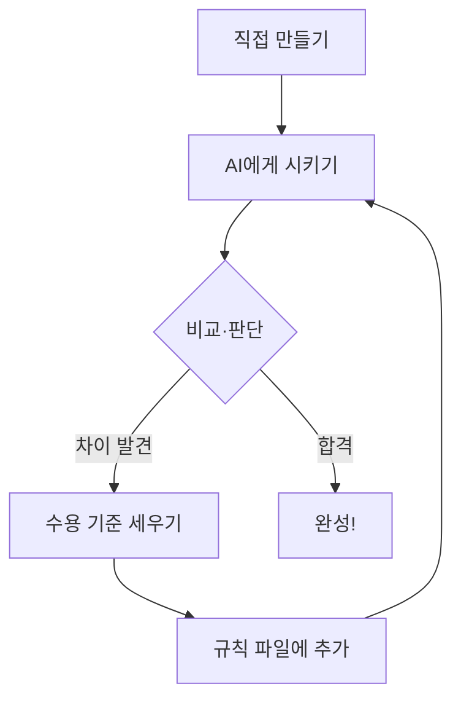

# 시각화 전략 · 기술 패턴 · Pico Grove 센서 사양

> 이 문서는 `vpython-thinking-30h` 프로젝트의 기술 패턴을 분석하고,
> `ai-rule-designer-30h` 3개 트랙에 어떻게 적용하는지 정리한다.

---

## 1. vpython-thinking-30h에서 가져올 5가지 핵심 기술 패턴

### 패턴 1: GlowScript iframe — 3D 인터랙티브

학생이 마우스로 돌려보는 3D 장면을 문서에 임베드한다.

**구현 방식:** `demos/*.html` 파일 + `<iframe>` 임베드

```html
<!-- docs/ 내 마크다운에서 -->
<div class="glowscript-demo" markdown>
<div class="demo-label">마우스로 돌려보세요!</div>
<iframe src="../demos/ch03_scene.html"></iframe>
</div>
```

**HTML 파일 템플릿** (`demos/ch_a1_bunny.html`):

```html
<!DOCTYPE html>
<html lang="ko">
<head>
<meta charset="utf-8">
<style>
  * { margin: 0; padding: 0; box-sizing: border-box; }
  html, body { width: 100%; height: 100%; overflow: hidden; }
  .glowscript { width: 100% !important; padding: 0 !important; margin: 0 !important; }
  div > canvas { display: block; }
</style>
</head>
<body>
<div id="glowscript" class="glowscript">
<link type="text/css" href="https://www.glowscript.org/css/redmond/2.1/jquery-ui.custom.css" rel="stylesheet" />
<link type="text/css" href="https://www.glowscript.org/css/ide.css" rel="stylesheet" />
<script type="text/javascript" src="https://www.glowscript.org/lib/jquery/2.1/jquery.min.js"></script>
<script type="text/javascript" src="https://www.glowscript.org/lib/jquery/2.1/jquery-ui.custom.min.js"></script>
<script type="text/javascript" src="https://www.glowscript.org/package/glow.3.2.min.js"></script>
<script type="text/javascript" src="https://www.glowscript.org/package/RSrun.3.2.min.js"></script>
<script type="text/javascript"><!--//--><![CDATA[//><!--
;(function() {
function __main__() {
    var scene = canvas();
    scene.width = window.innerWidth;
    scene.height = window.innerHeight;
    // === 여기에 VPython 코드 ===
}
;$(function(){ window.__context = { glowscript_container: $("#glowscript").removeAttr("id") }; __main__() })})()
//--><!]]></script>
</div>
</body>
</html>
```

**주의:** GlowScript iframe용 코드는 `GlowScript 3.2 VPython` 문법이 아니라, 컴파일된 JavaScript 형태(`var scene = canvas(); box({pos: vec(0,0,0), ...})`)로 작성해야 한다. 교재 본문의 코드(`GlowScript 3.2 VPython` 형식)와 iframe 데모의 코드(JS 형식)는 별도로 관리한다.

---

### 패턴 2: CSS scene-preview — 2D 정적 미리보기

코드 실행 결과를 CSS 그라디언트/도형으로 표현하는 정적 미리보기.
"모호한 요청 결과 vs 정밀 명세 결과" 비교에 적합하다.

```html
<div class="scene-preview">
  <!-- 원 (sphere 표현) -->
  <div class="obj" style="left: 45%; top: 30%; width: 60px; height: 60px;
       border-radius: 50%; background: radial-gradient(circle at 35% 35%, #ff9ff3, #f368e0);"></div>
  <!-- 상자 (box 표현) -->
  <div class="obj" style="left: 30%; top: 50%; width: 120px; height: 80px;
       border-radius: 4px; background: linear-gradient(135deg, #ffeaa7, #fdcb6e);"></div>
</div>
```

**CSS 클래스:**

```css
.scene-preview {
  background: #1a1a2e;
  border-radius: 8px;
  padding: 2rem;
  margin: 1rem 0;
  position: relative;
  min-height: 200px;
  display: flex;
  align-items: center;
  justify-content: center;
}

.scene-preview .obj {
  position: absolute;
  border-radius: 50%;
  display: flex;
  align-items: center;
  justify-content: center;
  font-size: 0.7rem;
  color: rgba(255,255,255,0.7);
}
```

---

### 패턴 3: Mermaid 흐름도

코드 로직, 분석 파이프라인, 신호 흐름을 다이어그램으로 표현한다.

```markdown

```

MkDocs Material의 `pymdownx.superfences` + `mermaid2` 플러그인으로 자동 렌더링.

---

### 패턴 4: SVG 개념도

좌표계, 핀 배치도 등을 SVG로 정밀 표현한다.

- `docs/images/*.svg` 에 저장
- `` 또는 마크다운 `` 로 삽입
- 트랙별 활용:
  - 트랙 A: VPython 3D 좌표계 (x-y-z 축)
  - 트랙 B: 차트 구조 다이어그램
  - 트랙 C: **Pico 2WH + Grove 포트맵** (어떤 포트에 어떤 센서)

---

### 패턴 5: Admonition 접기/펼침

정답, 힌트, 교사 참고사항을 접어둔다.

```markdown
??? question "화면에 무엇이 보일까요?"
    **하얀 정육면체**가 화면 한가운데에 나타납니다.

!!! tip "바꿔 보기"
    - `size=vector(1, 4, 1)` → 세로로 긴 기둥 모양
    - `color=color.red` → 빨간색으로 변경

!!! warning "교사 참고"
    이 코드에서 학생이 자주 하는 실수: `pos` 대신 `position`을 쓰는 것
```

MkDocs Material의 `admonition` + `pymdownx.details` 확장으로 렌더링.

---

### 보조 패턴: code-result 블록

코드 바로 아래에 실행 결과를 텍스트로 보여준다.

```html
<div class="code-result">
  <strong>실행 결과:</strong> 화면에 하얀 정육면체가 나타남. 크기 1×1×1, 위치 (0, 0, 0)
</div>
```

```css
.code-result {
  background: linear-gradient(135deg, #1a1a2e 0%, #16213e 100%);
  border-left: 4px solid #e2b714;
  padding: 1rem 1.2rem;
  border-radius: 0 8px 8px 0;
  margin: -0.5rem 0 1.5rem 0;
  color: #a0aec0;
  font-size: 0.9em;
}
```

---

## 2. 트랙별 시각화 적용 전략

| 패턴 | 트랙 A (VPython) | 트랙 B (데이터 분석) | 트랙 C (Pico 2WH) |
|------|:---:|:---:|:---:|
| **iframe 인터랙티브** | GlowScript 3D 데모 | Plotly.js 차트 | (해당 없음) |
| **SVG 개념도** | 좌표계 다이어그램 | 차트 구조 / 분석 개념 | **Pico + Grove 포트맵** |
| **Mermaid 흐름도** | 애니메이션 루프 | 분석 파이프라인 | **센서→Pico→출력 신호 흐름** |
| **CSS scene-preview** | 모호 vs 정밀 비교 | 잘못된 차트 vs 올바른 차트 | **Pico + Grove 연결 배치도** |
| **code-result 블록** | 3D 결과 설명 | 데이터 출력 / 통계치 | **시리얼 출력** (센서 값, 에러) |
| **Admonition** | 정답/힌트/교사 참고 | 정답/힌트/교사 참고 | 정답/힌트/교사 참고 |

### 트랙 A: VPython (그대로 활용 + 확장)

| 차시 | 시각화 | 구현 |
|------|--------|------|
| 1-2 (3D 조형) | 캐릭터 완성 모습 | GlowScript iframe — 학생이 마우스로 돌려보기 |
| 1-2 (비교) | 모호한 요청 vs 정밀 명세 결과 | scene-preview 2칸 — 좌: AI 실패 / 우: 정답 |
| 3-4 (애니메이션) | 걷기/회전 루프 | Mermaid (while-rate-update 흐름도) + iframe (움직이는 데모) |
| 5-6 (시뮬레이션) | 물리 시뮬 구조 | Mermaid (힘-가속도-속도-위치 순환) |

**새로 추가:** 모호한 요청의 AI 실패 결과를 GlowScript iframe으로 직접 보여주면, "아, 이래서 안 되는구나"를 3D로 체감.

### 트랙 B: 데이터 분석

| 시각화 유형 | 구현 방식 | 왜 이 방식? |
|-------------|----------|------------|
| 차트 (막대/선/파이) | **Plotly.js iframe** | 마우스 오버로 값 확인, 확대/축소 — GlowScript와 같은 패턴 |
| AI가 잘못 만든 차트 | 정적 이미지(PNG) + 빨간 주석 | "여기가 틀렸다"를 교사가 미리 표시 |
| 데이터 테이블 | HTML styled table | 이상값에 하이라이트 (노란 배경) |
| 분석 흐름 | Mermaid | 데이터 수집→정제→분석→시각화→해석 파이프라인 |
| AI 실패 비교 | 좌우 scene-preview | 좌: 오해의 소지 있는 차트 / 우: 올바른 차트 |

**Plotly.js iframe 템플릿** (`demos/ch_b1_chart.html`):

```html
<!DOCTYPE html>
<html lang="ko">
<head>
<meta charset="utf-8">
<script src="https://cdn.plot.ly/plotly-2.27.0.min.js"></script>
<style>
  * { margin: 0; padding: 0; }
  html, body { width: 100%; height: 100%; }
  #chart { width: 100%; height: 100%; }
</style>
</head>
<body>
<div id="chart"></div>
<script>
  // AI가 만든 오류 차트 vs 올바른 차트
  var data = [{ x: [...], y: [...], type: 'bar' }];
  var layout = { title: '...' };
  Plotly.newPlot('chart', data, layout, {responsive: true});
</script>
</body>
</html>
```

**AI 실패 시나리오 예시:**
- "이 데이터로 그래프 만들어줘" → AI가 y축 시작을 0이 아닌 값으로 설정 → 차이가 과장됨
- "추세를 분석해줘" → AI가 상관관계를 인과관계로 설명
- "이상값을 찾아줘" → AI가 정상 데이터를 이상값으로 오판

### 트랙 C: Pico 2WH + Grove 센서

| 시각화 유형 | 구현 방식 | 왜 이 방식? |
|-------------|----------|------------|
| Pico + Grove 포트맵 | **SVG** | 어떤 포트에 어떤 센서인지 컬러로 구분 |
| 센서→Pico→출력 흐름 | **Mermaid sequence** | 신호 흐름을 시각적으로 추적 |
| Pico + Grove 연결 배치도 | **CSS scene-preview 변형** | Grove 커넥터 기반 배치를 CSS로 표현 |
| 시리얼 출력 | **code-result 블록** | AI 코드의 예상 출력 / 실제 출력 비교 |

---

## 3. Pico 2WH + Grove 센서 시스템 사양

### 왜 Grove인가

| 항목 | 기존 (브레드보드) | Grove 시스템 |
|------|:---:|:---:|
| 연결 방식 | 점퍼선 + 저항 + 배선 | **4핀 플러그 꽂기** |
| 실수 가능성 | 높음 (핀 잘못 꽂기, 쇼트) | **매우 낮음** (커넥터가 방향 강제) |
| 수업 시간 중 배선 | 10~15분 | **1~2분** |
| 교사 부담 | 회로도 설명, 배선 디버깅 | **포트 번호만 안내** |
| AI 실패 초점 | 배선까지 AI가 다루기 어려움 | **"이 코드가 이 센서에서 되는가"에 집중** |

Grove는 배선의 어려움을 제거하여, 학생이 **"AI가 만든 코드가 실제로 동작하는가"**에만 집중할 수 있게 한다. 이것이 이 교육과정의 핵심 루프(AI에게 시키기 → 검증 → 규칙 추가)와 완벽하게 맞닿는다.

### 하드웨어 구성

| 부품 | 모델 | 역할 | 수량 (1인) |
|------|------|------|:---:|
| 마이크로컨트롤러 | **Raspberry Pi Pico 2WH** | 메인 보드 (WiFi + Bluetooth, 헤더 납땜 완료) | 1 |
| 확장 보드 | **Grove Shield for Pi Pico v1.0** | Pico 핀을 Grove 커넥터로 변환 | 1 |
| LED | **Grove - LED (빨강)** | 디지털 출력 실습 | 1 |
| 버튼 | **Grove - Button** | 디지털 입력 실습 | 1 |
| 온도/습도 센서 | **Grove - Temperature & Humidity Sensor (DHT11)** | 아날로그 입력 실습 | 1 |
| 부저 | **Grove - Buzzer** | PWM 출력 실습 | 1 |
| OLED 디스플레이 | **Grove - OLED Display 0.96"** (I2C) | I2C 통신 실습 | 1 (선택) |
| USB 케이블 | USB-C to USB-A | Pico↔PC 연결 | 1 |
| Grove 케이블 | 4핀 범용 (20cm) | 센서↔쉴드 연결 | 4~5 |

### Grove Shield 포트 배치 (Pico용)

```
┌──────────────────────────────────────────────────┐
│             Grove Shield for Pi Pico             │
│                                                    │
│  ┌──────┐  ┌──────┐  ┌──────┐  ┌──────┐          │
│  │ D16  │  │ D18  │  │ D20  │  │ D26  │  ← 디지털│
│  └──────┘  └──────┘  └──────┘  └──────┘          │
│                                                    │
│  ┌──────┐  ┌──────┐                               │
│  │ A0   │  │ A1   │                     ← 아날로그│
│  └──────┘  └──────┘                               │
│                                                    │
│  ┌──────┐  ┌──────┐                               │
│  │ I2C0 │  │ I2C1 │                     ← I2C    │
│  └──────┘  └──────┘                               │
│                                                    │
│  ┌──────┐                                         │
│  │ UART │                                ← UART  │
│  └──────┘                                         │
│                                                    │
│         ┌─────────────────────┐                   │
│         │  Pico 2WH 소켓      │                   │
│         └─────────────────────┘                   │
└──────────────────────────────────────────────────┘
```

### 차시별 센서-포트 매핑

| 차시 | 사용 센서 | Grove 포트 | GPIO 핀 | 통신 방식 |
|------|----------|:---:|:---:|:---:|
| 1-2 (기초) | LED + 버튼 | D16, D18 | GP16, GP18 | 디지털 |
| 3-4 (중간) | 온습도(DHT11) + 부저 | D20, D26 | GP20, GP26 | 디지털 + PWM |
| 5-6 (자유) | 학생 선택 조합 | 상황별 | 상황별 | 혼합 |
| 7-8 (완성) | 전체 조합 가능 | 전체 | 전체 | 혼합 |

### MicroPython 코드 형식 (교재 기준)

```python
# Pico 2WH + Grove Shield 기본 구조
from machine import Pin, PWM, ADC, I2C
import time

# Grove D16 포트에 연결된 LED
led = Pin(16, Pin.OUT)

# Grove D18 포트에 연결된 버튼
button = Pin(18, Pin.IN, Pin.PULL_UP)

# 버튼 누르면 LED 켜기
while True:
    if button.value() == 0:  # Grove 버튼은 LOW active
        led.value(1)
    else:
        led.value(0)
    time.sleep(0.1)
```

### AI 실패 시나리오 (트랙 C)

| 시나리오 | AI가 자주 하는 실수 | 학생이 만들 규칙 |
|---------|-------------------|----------------|
| LED 켜기 | 핀 번호 오류 (GP25는 온보드 LED) | "Grove 포트 번호를 확인해야 한다" |
| 버튼 읽기 | Pull-up/Pull-down 혼동 | "Grove 버튼은 LOW active임을 명시해야 한다" |
| DHT11 | 존재하지 않는 MicroPython 라이브러리 호출 | "라이브러리 존재 여부를 확인해야 한다" |
| 부저 PWM | 주파수 설정 오류 (50Hz vs 1000Hz) | "PWM 주파수를 명시해야 한다" |
| I2C OLED | 주소/SDA/SCL 핀 오류 | "I2C 주소와 핀을 확인해야 한다" |
| WiFi | Pico 2W 전용 API 미사용 | "network.WLAN(network.STA_IF) 사용 명시" |

### 검증 방법의 차이 (트랙 C만의 특수성)

```
┌──────────────────────────────────────────────────┐
│            트랙 C 디버깅 3단계                       │
├──────────────────────────────────────────────────┤
│                                                    │
│  1. 하드웨어 확인                                   │
│     □ 센서가 올바른 포트에 꽂혀 있는가?              │
│     □ USB 케이블이 연결되어 있는가?                  │
│     □ Grove 커넥터가 단단히 꽂혀 있는가?             │
│                                                    │
│  2. 소프트웨어 확인                                 │
│     □ GPIO 핀 번호가 Grove 포트 번호와 일치하는가?   │
│     □ 사용한 라이브러리가 실제로 존재하는가?          │
│     □ 통신 방식(디지털/아날로그/I2C/PWM)이 맞는가?   │
│                                                    │
│  3. 환경 확인                                      │
│     □ MicroPython 펌웨어 버전이 맞는가?              │
│     □ Thonny IDE가 Pico를 인식하는가?               │
│     □ 이전 프로그램이 아직 실행 중이 아닌가?          │
│                                                    │
└──────────────────────────────────────────────────┘
```

---

## 4. CSS/JS 인프라 세팅 (한 번 세팅, 전 트랙 재활용)

### 필요한 파일 구조

```
docs/
├── stylesheets/
│   └── custom-theme.css      ← vpython-theme.css 기반 커스텀
├── demos/
│   ├── ch_a1_bunny.html      ← 트랙 A: GlowScript 데모
│   ├── ch_a1_fail.html       ← 트랙 A: AI 실패 결과 데모
│   ├── ch_b1_chart.html      ← 트랙 B: Plotly.js 차트
│   └── ...
├── images/
│   ├── coord-xyz.svg         ← 트랙 A: 좌표계
│   ├── pico-grove-portmap.svg ← 트랙 C: Pico + Grove 포트맵
│   └── ...
└── chapter01.md ~ chapter06.md
```

### mkdocs.yml 필수 설정

```yaml
extra_css:
  - stylesheets/custom-theme.css

markdown_extensions:
  - admonition
  - pymdownx.details
  - pymdownx.superfences:
      custom_fences:
        - name: mermaid
          class: mermaid
          format: !!python/name:pymdownx.superfences.fence_code_format
  - attr_list
  - md_in_html
```

---

## 5. 요약: 트랙별 시각화 매트릭스

```
┌─────────────────────────────────────────────────────────────┐
│                    시각화 패턴 매트릭스                         │
├──────────────────┬────────┬────────┬────────────────────────┤
│ 패턴              │ 트랙 A │ 트랙 B │ 트랙 C                 │
├──────────────────┼────────┼────────┼────────────────────────┤
│ iframe           │ GlowSc │ Plotly │ (해당 없음)             │
│ scene-preview    │ 비교   │ 차트비교│ Grove 배치도           │
│ Mermaid          │ 루프   │ 파이프 │ 신호 흐름               │
│ SVG              │ 좌표계 │ 차트구조│ Pico+Grove 포트맵      │
│ code-result      │ 3D결과 │ 통계치 │ 시리얼 출력             │
│ Admonition       │ 힌트   │ 힌트   │ 힌트                   │
└──────────────────┴────────┴────────┴────────────────────────┘
```
