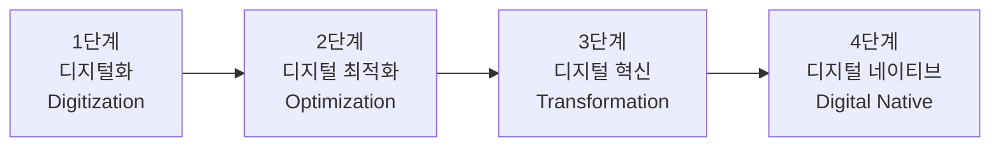

# 디지털 트랜스포메이션 전략

## 💼 비즈니스 임팩트

IDC에 따르면 2025년까지 전 세계 기업의 디지털 트랜스포메이션(DX) 투자 규모는 3.9조 달러에 달할 전망입니다. 그러나 맥킨지 조사에 의하면 DX 프로젝트의 **70%가 목표 달성에 실패**합니다. 왜 대부분 실패하고, 성공한 기업은 무엇이 달랐을까요?

디지털 트랜스포메이션은 "기술 도입"이 아니라 **비즈니스 모델과 조직 문화의 근본적 변화**입니다. 이 차시를 마치면 DX 전략 수립 프레임워크를 자기 조직에 적용할 수 있습니다.

## 🧭 핵심 프레임워크

### 프레임워크: DX 성숙도 4단계 모델

디지털 트랜스포메이션(Digital Transformation — 디지털 기술을 활용해 비즈니스 모델, 프로세스, 조직 문화를 근본적으로 변혁하는 것)은 하루아침에 이뤄지지 않습니다. 조직은 보통 4단계를 거칩니다.

- **1단계 — 디지털화(Digitization)**: 종이 문서를 전자화하고, 수작업을 자동화하는 단계. 예) 경비 청구를 종이에서 앱으로 전환
- **2단계 — 디지털 최적화(Optimization)**: 데이터를 활용해 기존 프로세스를 개선하는 단계. 예) 고객 데이터 분석으로 마케팅 효율 30% 향상
- **3단계 — 디지털 혁신(Transformation)**: 비즈니스 모델 자체를 바꾸는 단계. 예) 제조업체가 구독 서비스 모델로 전환
- **4단계 — 디지털 네이티브(Digital Native)**: 조직 전체가 데이터 기반으로 의사결정하는 단계. 예) 아마존, 넷플릭스

> **실무 TIP**: 먼저 우리 조직이 몇 단계에 있는지 파악하세요. 1단계인 조직이 갑자기 3단계를 시도하면 실패 확률이 급격히 높아집니다. "한 단계씩"이 핵심입니다.

## 📊 케이스 스터디

### 도미노피자 — "피자 회사가 아니라 기술 회사입니다"

- **상황**: 2008년 도미노피자는 "미국에서 가장 맛없는 피자" 1위라는 불명예를 안고 있었습니다. 주가는 3달러까지 떨어졌습니다.
- **실행**: CEO 패트릭 도일은 "우리는 피자를 배달하는 기술 회사"라고 선언. 전체 직원의 50% 이상을 IT 인력으로 채우고, 모바일 주문 앱, AI 기반 주문 예측, GPS 배달 추적 시스템을 도입했습니다. AnyWare 플랫폼으로 스마트워치, 슬랙, 트위터 등 15개 이상의 채널에서 주문 가능하게 했습니다.
- **결과**: 2008년 주가 3달러에서 2020년 400달러로 약 130배 상승. 온라인 주문 비율 75% 이상, 같은 기간 매출 2배 성장.
- **시사점**: DX의 핵심은 기술이 아니라 **"고객 경험 전체를 재설계"**하겠다는 경영진의 의지와 비전. 기술은 수단이지 목적이 아닙니다.

## 🔧 실무 워크시트

### DX 현황 진단 시트 (빈 템플릿)

우리 조직의 DX 현황을 진단해 보세요. 각 영역별로 현재 수준(1~4단계)을 체크하세요.

- **고객 접점**: 현재 단계 [ ] → 목표 단계 [ ] → 핵심 과제: ________________
- **내부 프로세스**: 현재 단계 [ ] → 목표 단계 [ ] → 핵심 과제: ________________
- **데이터 활용**: 현재 단계 [ ] → 목표 단계 [ ] → 핵심 과제: ________________
- **조직 문화**: 현재 단계 [ ] → 목표 단계 [ ] → 핵심 과제: ________________
- **기술 인프라**: 현재 단계 [ ] → 목표 단계 [ ] → 핵심 과제: ________________

### 작성 예시 (가상 기업 "한빛제조")

- **고객 접점**: 현재 2단계 → 목표 3단계 → 핵심 과제: B2B 고객 포털 구축, 실시간 주문/재고 조회 시스템
- **내부 프로세스**: 현재 1단계 → 목표 2단계 → 핵심 과제: ERP 시스템 도입, 수기 발주서 전자화
- **데이터 활용**: 현재 1단계 → 목표 2단계 → 핵심 과제: 생산 데이터 수집 센서 설치, 대시보드 구축
- **조직 문화**: 현재 1단계 → 목표 2단계 → 핵심 과제: 전 직원 디지털 리터러시 교육, DX 전담팀 신설
- **기술 인프라**: 현재 2단계 → 목표 3단계 → 핵심 과제: 클라우드 마이그레이션, API 기반 시스템 연동

## ✅ 실무 체크리스트

아래 항목에 스스로 답해보세요.

- [ ] 우리 조직의 DX 성숙도 단계를 명확히 파악하고 있다
- [ ] DX 추진 시 "기술 도입"이 아니라 "비즈니스 문제 해결"에서 출발하고 있다
- [ ] 경영진이 DX에 대한 명확한 비전과 의지를 갖고 있다
- [ ] DX 성과를 측정할 구체적인 KPI가 설정되어 있다
- [ ] 조직 내 변화 저항에 대한 관리 계획이 있다

## 🔗 다음 장 미리보기

다음 차시에서는 DX 실행 로드맵을 수립하는 방법을 다룹니다. 90일 단위 스프린트 계획, 퀵윈(Quick Win) 과제 선정법, 그리고 변화관리 커뮤니케이션 전략을 실습합니다.
