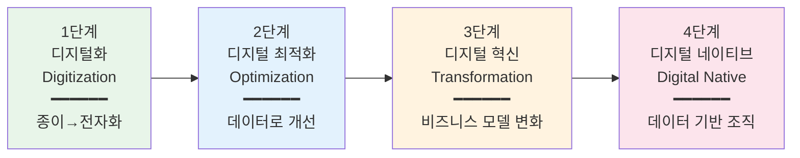

# 디지털 트랜스포메이션 전략

## 💼 비즈니스 임팩트

IDC에 따르면 2025년 전 세계 기업의 DX 투자 규모는 3.9조 달러에 달합니다. 그러나 맥킨지 조사에 의하면 DX 프로젝트의 **70%가 목표 달성에 실패**합니다. 실패 원인의 70%는 기술이 아니라 **조직 문화와 변화관리**에 있습니다.

디지털 트랜스포메이션(DX — 디지털 기술을 활용해 비즈니스 모델, 프로세스, 고객 경험을 근본적으로 변혁하는 것)은 "IT 부서의 프로젝트"가 아니라 **경영 전략 그 자체**입니다. 이 차시를 마치면 DX 성숙도 진단 프레임워크를 자기 조직에 적용하고, 우선순위를 설정할 수 있습니다.

## 🧭 핵심 프레임워크

### 프레임워크: DX 성숙도 4단계 모델

조직의 디지털 전환은 하루아침에 일어나지 않습니다. 보통 4단계를 거치며, 현재 위치를 정확히 파악하는 것이 전략 수립의 출발점입니다.

- **1단계 — 디지털화(Digitization)**: 아날로그 프로세스를 전자화하는 단계. 종이 문서를 PDF로, 수기 장부를 엑셀로 전환. 대부분의 중소기업이 이 단계에 있습니다.
- **2단계 — 디지털 최적화(Optimization)**: 수집된 데이터를 분석하여 기존 프로세스를 개선하는 단계. CRM(고객관계관리 시스템)으로 고객 데이터를 통합 관리하거나, BI(Business Intelligence — 데이터 시각화 도구)로 의사결정을 지원합니다.
- **3단계 — 디지털 혁신(Transformation)**: 비즈니스 모델 자체를 바꾸는 단계. 제조업체가 "제품 판매"에서 "구독 서비스"로 전환하거나, 오프라인 유통이 O2O(Online to Offline) 플랫폼으로 변신합니다.
- **4단계 — 디지털 네이티브(Digital Native)**: 조직 전체가 데이터 기반으로 의사결정하고, 기술이 비즈니스의 DNA에 내장된 상태. 아마존, 넷플릭스, 쿠팡이 대표적입니다.

> **실무 TIP**: 먼저 우리 조직의 각 영역(고객 접점, 내부 프로세스, 데이터 활용, 인재/문화, 기술 인프라)별로 몇 단계인지 따로 진단하세요. "전사 2단계"보다 "고객 접점은 3단계인데 내부 프로세스는 1단계"라는 진단이 훨씬 유용합니다. 격차가 큰 영역이 바로 우선 투자 영역입니다.

## 📊 케이스 스터디

### 사례 1: 도미노피자 — "피자 회사가 아니라 기술 회사입니다"

- **상황**: 2008년 도미노피자는 "미국에서 가장 맛없는 피자" 1위라는 소비자 조사 결과를 받았습니다. 주가는 3달러까지 폭락했고, 경쟁사 파파존스에 시장 점유율을 빼앗기고 있었습니다.
- **실행**: CEO 패트릭 도일은 "우리는 피자를 배달하는 기술 회사"라고 재정의했습니다. 전체 직원의 50% 이상을 IT 인력으로 확충하고, 3가지 핵심 DX를 추진했습니다. (1) 모바일 주문 앱과 피자 트래커 도입, (2) AnyWare 플랫폼으로 스마트워치, 슬랙, 트위터 등 15개 이상 채널에서 주문 가능, (3) AI 기반 수요 예측으로 매장별 식재료 사전 준비.
- **결과**: 주가 3달러(2008) → 400달러(2020), 약 130배 상승. 온라인 주문 비율 75% 돌파. 같은 기간 매출 2배 성장하며 피자헛을 제치고 미국 1위 피자 체인으로 등극.
- **시사점**: DX의 핵심은 기술 자체가 아니라 **"고객 경험 전체를 기술로 재설계"**하겠다는 경영진의 비전과 의지. 도미노는 "피자 맛 개선"이라는 제품 문제를 "주문~배달 전 과정의 고객 경험 혁신"으로 재정의한 것이 성공의 열쇠였습니다.

### 사례 2: GE 디지털 — DX 과잉 투자의 교훈

- **상황**: 2015년 GE의 CEO 제프 이멜트는 "GE를 세계 Top 10 소프트웨어 기업으로 만들겠다"고 선언하며 GE 디지털 부문을 신설했습니다. 산업 IoT(사물인터넷) 플랫폼 "프레딕스(Predix)"에 수십억 달러를 투자했습니다.
- **실행**: 실리콘밸리에 대규모 디지털 허브를 설립하고, 소프트웨어 엔지니어 수천 명을 채용. 전통적 제조 기업 문화와 실리콘밸리 개발 문화를 동시에 운영하려 했습니다. 그러나 핵심 제조 사업과의 연계가 불분명했고, 플랫폼은 고객이 원하는 것보다 GE가 만들고 싶은 것 중심으로 개발되었습니다.
- **결과**: 2018년 이멜트 퇴임, GE 디지털 부문 매각 검토, 주가 50% 이상 하락. 프레딕스 플랫폼은 시장에서 AWS IoT, Azure IoT에 밀려 존재감을 잃었습니다.
- **시사점**: DX는 **"기존 비즈니스의 문제를 기술로 해결"**해야지, "기술 자체가 목적"이 되면 실패합니다. 1단계를 건너뛰고 바로 3~4단계를 시도한 것, 그리고 고객 니즈가 아닌 내부 비전 중심으로 추진한 것이 패인이었습니다.

## 🤔 의사결정 시나리오

**상황**: 당신은 연매출 500억 원 규모의 B2B 제조업체 "한빛산업"의 경영기획팀장입니다. CEO가 "올해 안에 DX를 추진하라"고 지시했습니다. 현재 영업팀은 엑셀로 고객 관리를 하고, 생산 현장은 수기 작업 일지를 쓰며, 사내 커뮤니케이션은 카카오톡 단체방입니다. DX 전담 인력은 없고, IT 부서는 2명(서버 관리 담당)입니다. 연간 DX 예산으로 5억 원이 배정되었습니다.

**당신은 경영기획팀장입니다. 어떤 전략을 선택하시겠습니까?**

- **선택지 A — 전사 ERP 도입**: 5억 원 전액을 투입해 SAP/Oracle 같은 대형 ERP(전사적 자원관리 시스템)를 도입합니다. 한번에 모든 부서의 프로세스를 통합 관리할 수 있지만, 도입에 12~18개월, 조직 저항이 예상됩니다.
- **선택지 B — 퀵윈 전략**: 3개월 이내에 성과를 낼 수 있는 작은 프로젝트 3개(CRM 도입, 협업 툴 전환, 생산 현황 대시보드)를 먼저 시작합니다. 각 1~2억 원 규모. 작은 성공을 쌓아 조직의 변화 수용도를 높인 후 확대합니다.
- **선택지 C — 외부 컨설팅 + 로드맵 수립**: 1억 원을 컨설팅에 투자해 6개월간 현황 진단과 3년 로드맵을 먼저 수립합니다. 나머지 4억 원은 다음 해에 로드맵에 따라 집행합니다.

전문가 분석 보기

**추천: 선택지 B (퀵윈 전략)**

- **선택지 A의 리스크**: 현재 1단계(디지털화도 미완)인 조직이 대형 ERP를 도입하면 GE 디지털 사례처럼 "기술은 있는데 쓸 줄 아는 사람이 없는" 상황에 빠질 확률이 높습니다. 맥킨지에 따르면 대형 IT 프로젝트의 45%가 예산 초과, 7%가 일정 초과를 겪습니다.
- **선택지 B가 유리한 이유**: 도미노피자도 처음부터 15개 채널 주문 시스템을 만든 것이 아닙니다. 모바일 앱 → 피자 트래커 → AnyWare 순으로 단계적으로 확장했습니다. 3개월 이내 가시적 성과("영업팀이 엑셀 대신 CRM을 쓰니 고객 응대 시간이 30% 줄었다")가 나오면, CEO에게 추가 투자를 설득하기 훨씬 쉬워집니다.
- **선택지 C의 한계**: 로드맵 수립 자체는 좋지만, 6개월간 "진단만 하고 실행은 없는" 상황이 되면 CEO와 현업 부서의 기대 관리가 어렵습니다. 진단과 실행을 병행하는 것이 이상적입니다.
- **판단 기준**: 조직의 DX 성숙도가 낮을수록 "작게 시작해서 빠르게 성과를 보여주는" 퀵윈 전략이 효과적입니다. KPI(핵심성과지표 — 목표 달성도를 측정하는 정량적 지표) 예시: CRM 도입 후 고객 응대 시간 단축률, 협업 툴 전환 후 회의 시간 감소율.

## 🔧 실무 워크시트

### DX 현황 진단 시트 (빈 템플릿)

우리 조직의 DX 현황을 5개 영역별로 진단해 보세요. 각 영역의 현재 단계(1~4)와 목표 단계를 적고, 격차가 가장 큰 영역을 우선 투자 대상으로 선정합니다.

- **고객 접점**: 현재 [ ]단계 → 목표 [ ]단계 → 격차 [ ] → 핵심 과제: _______________
- **내부 프로세스**: 현재 [ ]단계 → 목표 [ ]단계 → 격차 [ ] → 핵심 과제: _______________
- **데이터 활용**: 현재 [ ]단계 → 목표 [ ]단계 → 격차 [ ] → 핵심 과제: _______________
- **인재 & 문화**: 현재 [ ]단계 → 목표 [ ]단계 → 격차 [ ] → 핵심 과제: _______________
- **기술 인프라**: 현재 [ ]단계 → 목표 [ ]단계 → 격차 [ ] → 핵심 과제: _______________

**우선순위 판정**: 격차가 가장 큰 영역 → _______________
**퀵윈 과제 후보**: 3개월 이내 실행 가능한 것 → _______________

### 작성 예시 (가상 기업 "한빛산업")

- **고객 접점**: 현재 1단계 → 목표 3단계 → 격차 2 → 핵심 과제: B2B 고객 포털 구축, 실시간 주문/재고 조회 시스템
- **내부 프로세스**: 현재 1단계 → 목표 2단계 → 격차 1 → 핵심 과제: ERP 도입, 수기 발주서 전자화
- **데이터 활용**: 현재 1단계 → 목표 2단계 → 격차 1 → 핵심 과제: 생산 데이터 수집 센서, BI 대시보드 구축
- **인재 & 문화**: 현재 1단계 → 목표 2단계 → 격차 1 → 핵심 과제: 전 직원 디지털 리터러시 교육, DX 전담팀(2명) 신설
- **기술 인프라**: 현재 2단계 → 목표 3단계 → 격차 1 → 핵심 과제: 클라우드 마이그레이션, API 기반 시스템 연동

**우선순위 판정**: 격차가 가장 큰 영역 → 고객 접점 (격차 2)
**퀵윈 과제 후보**: CRM(Salesforce/HubSpot) 도입 → 영업팀 고객 관리 효율화 (도입 기간 약 2개월, 비용 연 2,000만 원)

## 📋 액션 플랜

- **이번 주**: (1) DX 성숙도 진단 워크시트를 작성하여 현황을 파악한다. (2) 팀원 2~3명과 30분 미팅으로 "가장 불편한 업무 프로세스 Top 3"를 뽑는다.
- **이번 달**: (1) 퀵윈 과제 1개를 선정하고, 예산/일정/담당자를 확정한 1장짜리 DX 추진 계획서를 CEO에게 보고한다. (2) 무료 체험 가능한 SaaS(Software as a Service — 클라우드 기반 구독형 소프트웨어) 도구를 2~3개 시범 사용해 본다.

## ✅ 실무 체크리스트

아래 항목에 스스로 "예/아니오"로 답해보세요. "아니오"가 3개 이상이면 DX 전략 재점검이 필요합니다.

- [ ] 우리 조직의 DX 성숙도 단계를 5개 영역별로 진단했다
- [ ] DX 추진의 출발점이 "기술 도입"이 아니라 "비즈니스 문제 해결"이다
- [ ] 3개월 이내에 가시적 성과를 낼 수 있는 퀵윈 과제가 선정되어 있다
- [ ] DX 성과를 측정할 구체적인 KPI(예: 처리 시간 단축률, 비용 절감액)가 설정되어 있다
- [ ] 조직 내 변화 저항(현업 부서의 반발, "지금도 잘 되는데 왜 바꾸나")에 대한 대응 전략이 있다

## 🔗 다음 장 미리보기

다음 차시에서는 **DX 실행 로드맵 수립**을 다룹니다. 90일 스프린트 계획법, 퀵윈 과제의 ROI(투자 대비 수익률) 측정법, 그리고 "변화 저항자를 변화 챔피언으로" 만드는 체인지 매니지먼트 전략을 실습합니다.
