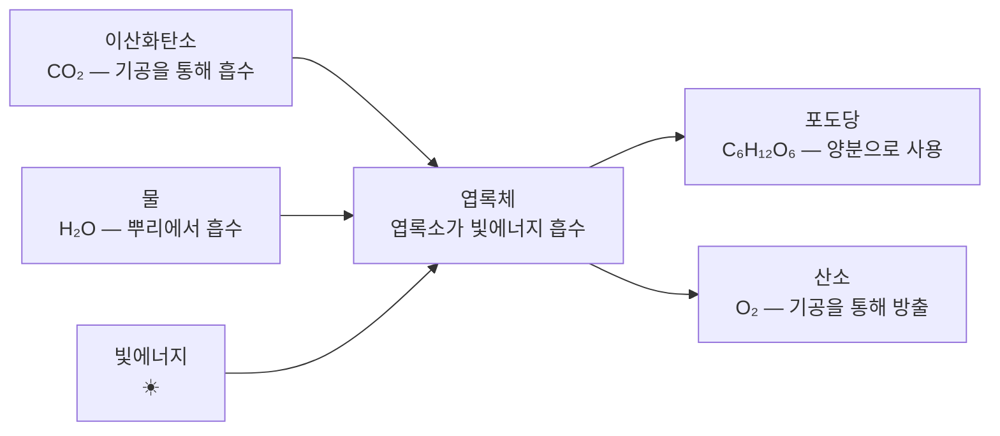
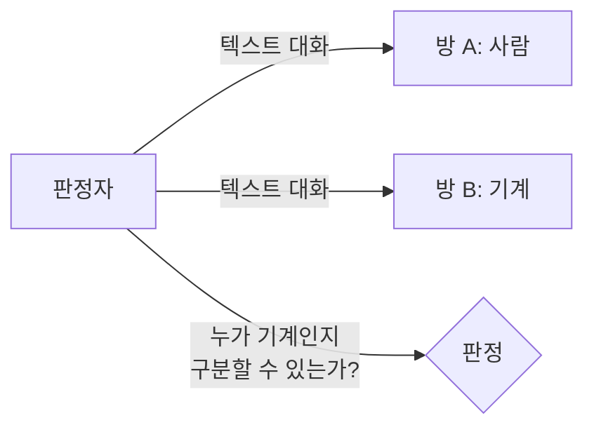

# 템플릿별 샘플 챕터

---

## 1. 스토리텔링 교육자료 — "페니실린, 곰팡이가 세상을 구하다"

1928년 9월, 런던 세인트메리 병원 2층의 실험실은 한 달째 주인 없이 비어 있었습니다. 알렉산더 플레밍은 스코틀랜드 고향에서 가족과 여름휴가를 보내고 있었습니다. 그 사이 실험실 창문 틈으로 런던의 습한 공기가 드나들었고, 세균을 배양해둔 페트리 접시들은 방치된 채 천천히 변해가고 있었습니다.

이 시점에서 당시의 세균학 실험실이 어떤 곳이었는지 잠시 이야기할 필요가 있습니다. 1920년대의 세균 배양은 오늘날처럼 밀폐된 인큐베이터 안에서 이루어지지 않았습니다. 한천 배지를 깐 유리 접시를 실험대 위에 올려놓고, 뚜껑을 살짝 덮어두는 정도였습니다. 공기 중의 먼지나 곰팡이 포자가 배양 접시에 떨어지는 일은 드물지 않았고, 그렇게 '오염된' 접시는 대개 버려졌습니다. 그것이 당연한 일이었습니다.

플레밍 자신도 정리정돈과는 거리가 먼 사람이었습니다. 동료들은 그의 실험대가 늘 접시와 시약병으로 어지러웠다고 회고합니다. 역설적이게도, 바로 그 습관이 이 이야기의 출발점이 됩니다. 깔끔한 연구자였다면 휴가를 떠나기 전에 배양 접시를 정리했을 것이고, 그랬다면 이후의 일은 일어나지 않았을 것입니다.

9월 3일, 휴가에서 돌아온 플레밍은 실험실 문을 열었습니다. 실험대 위에는 여러 개의 페트리 접시가 쌓여 있었고, 대부분은 예상대로 세균이 자라 있었습니다. 그는 접시들을 하나씩 살펴보며 쓸 만한 것이 남았는지 확인하기 시작했습니다.

한 접시에서 그의 손이 멈추었습니다. 포도상구균을 배양해둔 접시 한쪽에 푸른 곰팡이가 자라 있었는데, 그 곰팡이 주변으로 세균이 없는 투명한 영역이 뚜렷하게 형성되어 있었습니다. 세균학에서는 이것을 **저지대(inhibition zone)**라고 부릅니다. 곰팡이가 어떤 물질을 분비하여, 자기 주변의 세균이 자라지 못하게 막고 있었던 것입니다.

여기서 정확하게 짚고 넘어갈 것이 있습니다. 곰팡이가 세균의 성장을 억제하는 현상 자체는 당시 세균학자들에게 완전히 낯선 것이 아니었습니다. 1870년대에 이미 존 틴들이 비슷한 관찰을 기록한 바 있었고, 프랑스의 에르네스트 뒤셴은 1897년에 곰팡이와 세균의 길항 관계에 대한 논문을 발표하기도 했습니다. 다만 이들은 그 현상의 의학적 가능성까지 밀고 나가지 않았습니다. 대부분은 단순한 오염으로 여기고 넘어갔을 뿐입니다.

플레밍이 달랐던 것은, 그 현상 앞에서 잠시 멈춰 섰다는 점입니다. 그는 곰팡이를 따로 배양하여 그것이 **페니실리움 노타툼(Penicillium notatum)** 종임을 확인했고, 이 곰팡이가 분비하는 항균 물질을 **페니실린**이라고 이름 붙였습니다. 이후 몇 달에 걸친 실험에서 페니실린은 포도상구균뿐 아니라 연쇄상구균, 폐렴균, 임균 등 다양한 병원성 세균에 효과를 보였습니다. 반면 장티푸스균이나 대장균처럼 효과가 없는 세균도 있었습니다. 플레밍은 이 결과를 꼼꼼히 기록했습니다.

하지만 이야기는 여기서 극적인 방향으로 흐르지 않았습니다. 플레밍은 세균학자였지 화학자가 아니었습니다. 페니실린을 순수하게 추출하고 농축하는 작업은 그의 역량 밖이었습니다. 배양액에서 페니실린을 분리하려 할 때마다 활성이 급격히 떨어졌고, 안정적으로 보관할 수도 없었습니다. 실험실에서 세균을 죽이는 것과 그것을 사람에게 투여할 수 있는 약으로 만드는 것 사이에는 거대한 간극이 있었던 것입니다.

1929년, 플레밍은 《영국 실험병리학 저널》에 논문을 발표했습니다. 논문의 톤은 조심스러웠습니다. 그는 페니실린이 "세균 배양에서 유용할 수 있다"고 썼을 뿐, 감염병 치료제로서의 가능성을 크게 강조하지 않았습니다. 학계의 반응도 미미했습니다. 인용 횟수는 손에 꼽을 정도였습니다. 페니실린은 그렇게, 발견된 뒤 **12년 동안 잊혀졌습니다**.

1940년이 되어서야 이야기가 다시 움직이기 시작합니다. 옥스퍼드 대학의 병리학자 하워드 플로리와 독일 출신 생화학자 에른스트 체인이 항균 물질에 대한 문헌을 조사하던 중, 플레밍의 오래된 논문을 발견했습니다. 체인은 화학적 전문성을 갖추고 있었고, 플로리는 임상시험을 설계하고 조직할 수 있는 실행력을 갖춘 사람이었습니다. 이 조합이 핵심이었습니다. 플레밍 혼자서는 넘지 못한 벽을, 서로 다른 전문성을 가진 두 사람이 함께 넘은 것입니다.

체인은 동결건조법을 이용하여 페니실린을 갈색 분말 형태로 추출하는 데 성공했습니다. 그리고 동물 실험에서 이 분말이 세균 감염을 치료할 수 있다는 것을 확인했습니다. 8마리의 생쥐에게 치사량의 연쇄상구균을 주입한 뒤, 4마리에게만 페니실린을 투여했습니다. 다음 날 아침, 페니실린을 맞은 생쥐 4마리는 모두 살아 있었고, 나머지 4마리는 모두 죽었습니다.

1941년 2월, 첫 인체 투여가 이루어졌습니다. 환자는 43세 경찰관 앨버트 알렉산더였습니다. 장미 가시에 얼굴을 긁힌 것이 시작이었는데, 상처가 감염되어 패혈증으로 번졌습니다. 한쪽 눈을 적출했지만 감염은 멈추지 않았고, 그는 죽어가고 있었습니다. 페니실린 투여가 시작되자 하루 만에 체온이 내렸고, 식욕이 돌아왔습니다. 회복은 분명해 보였습니다.

하지만 당시 옥스퍼드 팀이 확보한 페니실린의 양은 극히 적었습니다. 그들은 환자의 소변에서 배출된 페니실린을 다시 회수하여 재투여할 정도였습니다. 5일째 되는 날, 약이 완전히 바닥났습니다. 투여가 중단되자 감염이 재발했고, 알렉산더는 한 달 뒤 세상을 떠났습니다. 약은 효과가 있었지만, 양이 부족했던 것입니다.

이후 플로리는 대량생산의 길을 찾기 위해 미국으로 건너갔습니다. 미국 농무부의 북부연구소에서 옥수수 침지액을 배양 배지로 사용하면 페니실린 생산량이 10배 이상 늘어난다는 것을 발견했고, 이를 기반으로 제약회사들이 본격적인 생산에 뛰어들었습니다. 1944년 노르망디 상륙작전 때, 연합군 병사들의 군장에는 페니실린이 들어 있었습니다. 제2차 세계대전에서 감염으로 인한 사망률은 제1차 세계대전의 절반 이하로 떨어졌습니다.

역사에서 가장 많은 생명을 구한 약은, 곰팡이 핀 접시 하나에서 시작되었습니다. 그리고 그 시작과 완성 사이에는, 학계의 무관심이 놓인 12년과 약이 모자라 잃은 첫 환자가 있었습니다. 위대한 발견이란 으레 그렇습니다. 한 번의 유레카가 아니라, 긴 시간에 걸친 축적과 우연과 끈기가 겹쳐진 결과물입니다.

---

### 생각해보기
- 플레밍이 그날 접시를 그냥 버렸다면, 페니실린은 영영 발견되지 않았을까요? 아니면 다른 누군가가 언젠가 발견했을까요?
- 플레밍은 발견자이고, 플로리와 체인은 개발자입니다. 노벨상은 셋이 공동 수상했는데, 발견과 개발 중 어느 쪽의 기여가 더 크다고 생각하나요?
- "준비된 사람만이 우연을 잡는다"는 파스퇴르의 말이 있습니다. 이 말은 플레밍에게 얼마나 정확하게 들어맞나요?

---

## 2. 학교 교과서 — "광합성의 원리"

### 생각 열기
> 식물은 밥을 먹지 않는데 어떻게 자랄 수 있을까요? 100년 된 느티나무의 무게는 수 톤에 달하는데, 그 무게는 어디에서 온 것일까요? 땅에서 왔다면 나무 주변의 흙이 크게 줄어들어야 하는데, 실제로는 그렇지 않습니다.

### 이 단원의 학습 목표
- 광합성의 과정을 화학 반응식으로 설명할 수 있다.
- 광합성에 필요한 물질과 생성되는 물질을 구분할 수 있다.
- 광합성이 일어나는 조건과 장소를 설명할 수 있다.

### 선수학습 확인
이전에 배운 '세포의 구조'에서 엽록체를 기억하나요? 식물 세포에만 있는 초록색 구조물이었습니다. 엽록체 안에는 **엽록소**라는 초록색 색소가 들어 있는데, 이것이 바로 광합성의 핵심 도구입니다. 잎이 초록색으로 보이는 이유도 엽록소가 초록색 빛을 반사하기 때문입니다.

### 탐구 활동
#### 탐구 1: 검정말의 기포 관찰
- **준비물**: 검정말 3~4줄기, 비커(500mL), 물, 스탠드, 전등(100W), 깔때기, 시험관
- **과정**:
  1. 비커에 물을 채우고 검정말을 넣는다.
  2. 검정말 위에 깔때기를 뒤집어 놓고, 깔때기 위에 물을 채운 시험관을 거꾸로 세운다.
  3. 전등을 비커에서 10cm 거리에 놓고 켠다.
  4. 5분 간격으로 기포의 발생 속도를 관찰하고 기록한다.
  5. 전등의 거리를 20cm, 30cm로 바꾸어 같은 실험을 반복한다.
- **결과 예측**: "빛이 가까울수록 기포가 많이 발생할까요, 적게 발생할까요?"
- **결과 기록표**:

| 전등 거리 | 1분간 기포 수 |
|-----------|--------------|
| 10cm | |
| 20cm | |
| 30cm | |

- **토의**: "기포의 정체는 무엇일까요? 빛의 세기와 기포 발생량 사이에는 어떤 관계가 있나요?"

#### 탐구 2: 잎의 녹말 검출 (BTB 실험)
- **준비물**: 화분(2개), 알루미늄 호일, 아이오딘-아이오딘화 칼륨 용액, 에탄올, 비커
- **과정**:
  1. 하루 전날, 식물을 어두운 곳에 놓아 잎의 녹말을 제거한다(암처리).
  2. 잎 하나는 알루미늄 호일로 일부를 감싸고, 다른 잎은 그대로 둔다.
  3. 다음 날 햇빛에 4시간 둔 뒤, 두 잎을 각각 에탄올에 넣어 엽록소를 제거한다.
  4. 아이오딘 용액을 떨어뜨려 색 변화를 관찰한다.
- **결과 예측**: "호일로 감싼 부분과 감싸지 않은 부분의 색이 같을까요?"
- **예상 결과**: 빛을 받은 부분은 청남색(녹말 존재), 호일로 감싼 부분은 변화 없음
- **결론**: 광합성에는 빛이 필요하며, 광합성의 산물로 녹말이 만들어진다.

### 핵심 개념
#### 광합성이란?
- **정의**: 식물이 빛에너지를 이용하여 이산화탄소와 물로 포도당(유기물)을 합성하는 과정
- **비유**: "광합성은 식물의 요리와 같습니다. 햇빛이 불, 이산화탄소와 물이 재료, 포도당이 완성된 음식입니다."
- **반응식**: 6CO₂ + 6H₂O → (빛에너지, 엽록체) → C₆H₁₂O₆ + 6O₂
- **말로 풀어쓰면**: 이산화탄소 6분자 + 물 6분자 → 포도당 1분자 + 산소 6분자



#### 광합성이 일어나는 조건
| 조건 | 설명 |
|------|------|
| **빛** | 에너지원. 빛이 없으면 광합성 불가 (밤에는 X) |
| **이산화탄소** | 잎의 기공(숨구멍)을 통해 공기 중에서 흡수 |
| **물** | 뿌리에서 흡수하여 줄기의 물관을 통해 잎으로 이동 |
| **엽록체** | 광합성이 일어나는 장소. 엽록소가 빛을 흡수 |

#### 광합성의 산물은 어디로 갈까?
포도당은 식물이 살아가는 데 필요한 에너지원입니다. 일부는 바로 사용되고, 나머지는 **녹말** 형태로 저장됩니다. 감자의 덩이줄기, 고구마의 뿌리, 벼의 낟알에 녹말이 많은 이유가 바로 이것입니다. 또한 포도당은 셀룰로스로 변환되어 식물의 몸(세포벽)을 만드는 재료가 되기도 합니다. 100년 된 느티나무의 무게는 대부분 이산화탄소와 물에서 온 것입니다.

#### 광합성과 호흡의 관계
> ⚠️ 주의: "식물은 낮에 광합성, 밤에 호흡"이라는 표현은 정확하지 않습니다. 식물은 낮에도 밤에도 항상 호흡합니다. 다만 낮에는 광합성이 호흡보다 활발하여 산소를 방출하고, 밤에는 호흡만 하므로 이산화탄소를 방출합니다.

| | 광합성 | 세포 호흡 |
|---|--------|----------|
| 시간 | 빛이 있을 때 | 항상 (24시간) |
| 장소 | 엽록체 | 미토콘드리아 |
| 흡수 | CO₂, H₂O | O₂, 포도당 |
| 방출 | O₂, 포도당 | CO₂, H₂O, 에너지 |

### 확인 문제
1. 광합성에 필요한 물질 두 가지와 생성되는 물질 두 가지를 각각 쓰세요.
2. 광합성이 일어나는 세포 소기관의 이름은?
3. 검정말 실험에서 전등을 가까이 했을 때 기포가 더 많이 발생한 이유를 설명하세요.
4. (서술형) "식물은 밤에 산소를 내뿜지 않으므로 침실에 화분을 두면 안 된다"는 말이 있습니다. 이 말이 과학적으로 타당한지, 광합성과 호흡의 관계를 근거로 설명하세요.

<details><summary>정답 확인</summary>

1. 필요: 이산화탄소, 물 / 생성: 포도당(녹말), 산소
2. 엽록체
3. 빛의 세기가 강할수록 광합성이 활발하게 일어나 산소(기포)가 더 많이 발생하기 때문이다.
4. 식물은 밤에 호흡만 하므로 이산화탄소를 방출하지만, 그 양은 극히 적어 사람에게 영향을 줄 정도가 아니다. 따라서 과학적으로 큰 근거가 없는 말이다.
</details>

---

## 3. 프로그래밍 강의 — "리스트: 데이터를 한 줄로 정리하기"

### 🎯 이 챕터의 목표
변수 하나에 데이터 하나만 저장하면, 학생 30명의 점수를 관리하려면 변수가 30개 필요합니다. 리스트를 쓰면 하나로 끝납니다. 이 챕터에서는 리스트를 만들고, 데이터를 추가/삭제하고, 반복문과 함께 사용하는 방법까지 배웁니다.

### 📚 핵심 개념: 리스트란?

여러 데이터를 순서대로 담는 상자입니다. 대괄호 `[]`로 만듭니다.

```python
# 먼저 이렇게 해보세요
scores = [85, 92, 78, 96, 88]
print(scores)       # [85, 92, 78, 96, 88]
print(scores[0])    # 85 (첫 번째 — 인덱스는 0부터!)
print(scores[-1])   # 88 (마지막)
print(len(scores))  # 5 (개수)
```

> 💡 **왜 0부터 시작하나요?**
> 프로그래밍에서 인덱스는 "처음에서 얼마나 떨어져 있는가"를 의미합니다.
> 첫 번째 요소는 처음에서 0만큼 떨어져 있으므로 `scores[0]`입니다.

**리스트에 담을 수 있는 것들:**
```python
# 숫자, 문자열, 심지어 섞어서도 가능합니다
names = ["김민수", "이서연", "박지호"]      # 문자열 리스트
mixed = [1, "hello", 3.14, True]            # 혼합 (가능하지만 보통은 같은 타입으로)
empty = []                                    # 빈 리스트도 가능
```

### 🔨 따라하기: 성적 관리 프로그램

**Step 1** — 리스트 만들기
```python
students = ["김민수", "이서연", "박지호"]
scores = [85, 92, 78]
```

**Step 2** — 데이터 추가하기
```python
# append(): 맨 뒤에 추가
students.append("최유진")
scores.append(96)
print(students)  # ['김민수', '이서연', '박지호', '최유진']

# insert(): 원하는 위치에 삽입
students.insert(1, "정하늘")  # 인덱스 1 위치에 삽입
scores.insert(1, 88)
print(students)  # ['김민수', '정하늘', '이서연', '박지호', '최유진']
```

**Step 3** — 데이터 삭제하기
```python
# remove(): 값으로 삭제 (첫 번째로 일치하는 것만)
students.remove("박지호")
print(students)  # ['김민수', '정하늘', '이서연', '최유진']

# pop(): 인덱스로 삭제 (삭제된 값을 돌려줌)
removed_score = scores.pop(2)    # 인덱스 2의 값을 꺼냄
print(f"삭제된 점수: {removed_score}")  # 삭제된 점수: 78

# del: 인덱스로 삭제 (돌려주지 않음)
del scores[2]    # 인덱스 2의 값을 삭제
```

> ⚠️ **흔한 실수**: `remove()`에 인덱스를 넣는 것
> `scores.remove(2)`는 "값 2를 삭제"이지 "2번 인덱스를 삭제"가 아닙니다.
> 인덱스로 삭제하려면 `pop(2)` 또는 `del scores[2]`를 쓰세요.

**Step 4** — 유용한 함수들
```python
scores = [85, 88, 92, 96]

# 기본 통계
print(sum(scores))          # 361 (합계)
print(len(scores))          # 4 (개수)
print(max(scores))          # 96 (최댓값)
print(min(scores))          # 85 (최솟값)

# 평균 계산
average = sum(scores) / len(scores)
print(f"평균: {average:.1f}점")  # 평균: 90.2점
```

**Step 5** — 반복문과 함께 사용하기
```python
students = ["김민수", "정하늘", "이서연", "최유진"]
scores = [85, 88, 92, 96]

# 방법 1: 인덱스 없이 순회
for name in students:
    print(f"학생: {name}")

# 방법 2: 인덱스와 함께 순회 (enumerate)
for i, name in enumerate(students):
    print(f"{i+1}번 {name}: {scores[i]}점")
# 출력:
# 1번 김민수: 85점
# 2번 정하늘: 88점
# 3번 이서연: 92점
# 4번 최유진: 96점

# 방법 3: 조건 필터링
high_scores = []
for i, score in enumerate(scores):
    if score >= 90:
        high_scores.append(students[i])
print(f"90점 이상: {high_scores}")  # 90점 이상: ['이서연', '최유진']
```

### 🏋️ 도전 과제: 완성된 성적 관리 프로그램

아래 코드를 직접 완성해보세요. `???` 부분을 채우면 됩니다.

```python
students = ["김민수", "정하늘", "이서연", "최유진"]
scores = [85, 88, 92, 96]

# 1. 전체 학생 수 출력
print(f"전체 학생 수: {???}명")

# 2. 평균 계산
average = ???
print(f"평균 점수: {average:.1f}점")

# 3. 평균 이하인 학생 목록
below_avg = []
for i, score in enumerate(scores):
    if ???:
        below_avg.append(students[i])
print(f"평균 이하 학생: {below_avg}")

# 4. 최고 점수 학생 찾기
max_score = ???
max_index = scores.index(max_score)
print(f"최고 점수: {students[max_index]} ({max_score}점)")
```

<details><summary>정답 확인</summary>

```python
# 1. len(students)
# 2. sum(scores) / len(scores)
# 3. score <= average
# 4. max(scores)
```
</details>

### ✅ 체크포인트
- [ ] `scores[2]`가 무엇을 출력하는지 예측할 수 있다
- [ ] `append()`와 `insert()`의 차이를 설명할 수 있다
- [ ] `remove()`, `pop()`, `del`의 차이를 설명할 수 있다
- [ ] `for`문으로 리스트의 모든 요소를 순회할 수 있다
- [ ] `len()`, `sum()`, `max()`, `min()`을 사용하여 통계를 구할 수 있다

---

## 4. 자기주도 학습서 — "Matplotlib으로 첫 그래프 그리기"

### 🌅 워밍업
엑셀에서 그래프를 만들어 본 적이 있나요? Python으로도 똑같이 할 수 있습니다. 그것도 코드 몇 줄이면 됩니다. 게다가 코드로 만든 그래프는 데이터가 바뀔 때마다 자동으로 업데이트할 수 있다는 장점이 있습니다.

### 🎯 이 챕터를 마치면
- 막대그래프, 선그래프, 원그래프를 직접 그릴 수 있습니다
- 그래프에 제목, 축 이름, 색상을 추가할 수 있습니다
- 하나의 그림에 여러 그래프를 배치할 수 있습니다

### 📚 따라하기

**설치 확인** (한 번만 하면 됩니다):
```bash
pip install matplotlib
```

> ⚠️ **막힘 방지**: `ModuleNotFoundError: No module named 'matplotlib'`이 뜨면 터미널에서 `pip install matplotlib`을 실행하세요. Jupyter Notebook을 사용 중이라면 셀에 `!pip install matplotlib`을 입력하세요.

---

**🔰 첫 그래프 — 막대그래프**
```python
import matplotlib.pyplot as plt

months = ['1월', '2월', '3월', '4월']
sales = [120, 150, 180, 200]

plt.bar(months, sales)
plt.title('월별 매출')
plt.ylabel('매출 (만원)')
plt.show()
```

> 💡 **지금 바로 실행해보세요!** 막대그래프가 화면에 나타나면 성공입니다.

**각 줄이 하는 일:**
| 코드 | 의미 |
|------|------|
| `import matplotlib.pyplot as plt` | matplotlib의 그래프 도구를 `plt`라는 이름으로 불러옴 |
| `plt.bar(months, sales)` | 막대그래프 생성 (x축: months, y축: sales) |
| `plt.title('월별 매출')` | 그래프 제목 설정 |
| `plt.ylabel('매출 (만원)')` | y축 이름 설정 |
| `plt.show()` | 그래프를 화면에 표시 |

---

**📈 선그래프로 바꾸기 — 한 단어만 바꾸면 됩니다:**
```python
plt.plot(months, sales, marker='o')  # bar → plot, marker로 점 표시
plt.title('월별 매출 추이')
plt.ylabel('매출 (만원)')
plt.grid(True)  # 격자선 추가
plt.show()
```

> 💡 `marker='o'`를 빼면 선만 그려집니다. `marker='s'`는 네모, `marker='^'`는 삼각형입니다.

---

**🎨 색상과 스타일 꾸미기:**
```python
months = ['1월', '2월', '3월', '4월']
sales = [120, 150, 180, 200]
colors = ['#3498db', '#2ecc71', '#e74c3c', '#f39c12']  # 파랑, 초록, 빨강, 주황

plt.bar(months, sales, color=colors)
plt.title('월별 매출', fontsize=16, fontweight='bold')
plt.ylabel('매출 (만원)', fontsize=12)
plt.xlabel('월', fontsize=12)

# 각 막대 위에 숫자 표시
for i, v in enumerate(sales):
    plt.text(i, v + 3, f'{v}만원', ha='center', fontsize=10)

plt.tight_layout()  # 여백 자동 조절
plt.show()
```

---

**🥧 원그래프 — 비율을 보여줄 때:**
```python
categories = ['식비', '교통비', '문화생활', '저축', '기타']
amounts = [45, 15, 20, 30, 10]
colors = ['#FF6B6B', '#4ECDC4', '#45B7D1', '#96CEB4', '#FFEAA7']

plt.pie(amounts, labels=categories, colors=colors,
        autopct='%1.1f%%',    # 퍼센트 표시
        startangle=90)         # 12시 방향부터 시작
plt.title('월 지출 비율')
plt.show()
```

---

**📊 여러 그래프 한 번에 — subplot 사용:**
```python
fig, axes = plt.subplots(1, 2, figsize=(12, 5))  # 1행 2열

# 왼쪽: 막대그래프
axes[0].bar(months, sales, color='#3498db')
axes[0].set_title('월별 매출')
axes[0].set_ylabel('매출 (만원)')

# 오른쪽: 선그래프
axes[1].plot(months, sales, marker='o', color='#e74c3c', linewidth=2)
axes[1].set_title('월별 매출 추이')
axes[1].set_ylabel('매출 (만원)')
axes[1].grid(True)

plt.tight_layout()
plt.show()
```

> 💡 `figsize=(12, 5)`는 그래프 전체 크기를 가로 12인치, 세로 5인치로 설정합니다.

---

**💾 그래프를 파일로 저장하기:**
```python
plt.bar(months, sales, color='#3498db')
plt.title('월별 매출')
plt.savefig('monthly_sales.png', dpi=150, bbox_inches='tight')
# plt.show() 대신 savefig를 사용하면 파일로 저장됩니다
```

> ⚠️ **주의**: `plt.savefig()`는 반드시 `plt.show()` **앞에** 써야 합니다. `show()` 이후에는 그래프가 초기화되어 빈 이미지가 저장됩니다.

### 🔍 자가 진단
| 질문 | 예/아니오 |
|------|-----------|
| 막대그래프가 화면에 나타났나요? | |
| 선그래프로 바꿔서 실행했나요? | |
| 색상을 바꿔보았나요? | |
| 원그래프를 그려보았나요? | |
| 그래프를 파일로 저장해보았나요? | |

> 4개 이상 "예"라면 다음 섹션으로 넘어가세요!
> 3개 이하라면 해당 코드를 다시 실행해보세요. 직접 해봐야 기억에 남습니다.

### 🏋️ 혼자 해보기
아래 데이터로 막대그래프와 선그래프를 각각 그려보세요. 제목, 축 이름, 색상을 자유롭게 설정하세요.

```python
subjects = ['국어', '수학', '영어', '과학', '사회']
my_scores = [88, 72, 95, 80, 85]
class_avg = [82, 78, 85, 76, 80]
```

> 💡 **힌트**: 한 그래프에 두 개의 데이터를 겹쳐 그리려면 `plt.bar()`나 `plt.plot()`을 두 번 호출하면 됩니다. `plt.legend()`로 범례를 추가하세요.

---

## 5. 비즈니스 교육 — "린 스타트업: 빠른 실패가 성공을 앞당긴다"

### 🎯 학습 목표
- MVP(최소 기능 제품)의 개념과 설계 원리를 이해한다
- "만들기→측정→학습" 반복 루프를 자사 프로젝트에 적용할 수 있다
- 피봇(pivot) 결정을 위한 정량적 기준을 설정할 수 있다

### 📖 개념 설명

전통적인 사업 방식은 이렇습니다. 시장조사를 하고, 사업계획서를 쓰고, 투자를 받고, 1~2년간 제품을 개발하고, 마침내 출시합니다. 문제는 출시 후에야 비로소 "고객이 이 제품을 원하는가?"라는 가장 중요한 질문에 답할 수 있다는 것입니다. 만약 원하지 않는다면? 투자한 시간과 비용은 회수할 수 없습니다.

에릭 리스가 2011년 제안한 **린 스타트업(Lean Startup)** 방법론은 이 순서를 뒤집습니다. 완벽한 제품을 만들기 전에, **가장 작은 형태의 제품(MVP)**으로 먼저 시장 반응을 확인하자는 것입니다.

> **전통적 방식**: 계획 (6개월) → 개발 (12개월) → 출시 → 시장 반응 확인
> **린 방식**: 가설 수립 (1주) → MVP 개발 (2~4주) → 출시 → 측정 → 학습 → 반복

핵심은 **"만들기 → 측정 → 학습(Build-Measure-Learn)"** 반복 루프입니다. 이 루프를 최대한 빠르게 돌리는 것이 린 스타트업의 전부입니다.

```mermaid
flowchart LR
    A[💡 가설 수립<br/>"고객은 X 문제를<br/>겪고 있다"] --> B[🔨 MVP 제작<br/>가설을 검증할<br/>최소한의 제품]
    B --> C[📊 측정<br/>핵심 지표 수집<br/>전환율·재방문율 등]
    C --> D{🧠 학습<br/>가설이<br/>맞았는가?}
    D -->|맞다 → 유지| E[⚡ 가속<br/>기능 확장·투자 유치]
    D -->|틀리다 → 피봇| A
```

#### MVP란 정확히 무엇인가?

**MVP(Minimum Viable Product, 최소 기능 제품)**는 "고객에게 가치를 전달할 수 있는 가장 작은 형태의 제품"입니다. 여기서 핵심 단어는 '최소(Minimum)'가 아니라 **'기능하는(Viable)'**입니다. 아무리 작아도 고객이 실제로 사용할 수 있어야 합니다.

MVP의 유형은 다양합니다:

| 유형 | 설명 | 예시 |
|------|------|------|
| **랜딩 페이지** | 제품 설명 페이지만 만들고 사전등록 받기 | Buffer, Dropbox |
| **설명 영상** | 제품 데모 영상으로 관심도 측정 | Dropbox (초기) |
| **컨시어지 MVP** | 자동화 없이 수동으로 서비스 제공 | Food on the Table |
| **오즈의 마법사 MVP** | 겉은 자동화처럼 보이지만 뒤에서 사람이 처리 | Zappos 초기 |
| **기능 축소 MVP** | 핵심 기능 1~2개만 구현한 실제 제품 | Instagram 초기 |

### 💼 케이스 스터디

#### 케이스 1: 드롭박스(Dropbox) — 영상 하나로 75,000명

2007년, MIT 출신 드류 휴스턴은 USB 드라이브를 자주 잊어버리는 자신의 문제에서 출발했습니다. "파일을 어디서든 접근할 수 있으면 좋겠다"는 단순한 아이디어였습니다. 하지만 문제가 있었습니다. 파일 동기화 기술을 완성하려면 최소 6개월 이상의 개발이 필요했고, 완성해도 고객이 원하는지 알 수 없었습니다.

휴스턴의 선택은 **3분짜리 데모 영상**이었습니다. 실제로 작동하는 것처럼 보이는 화면 녹화 영상을 Hacker News에 올렸습니다. 영상 공개 하룻밤 만에 베타 대기자 명단이 **5,000명에서 75,000명**으로 급증했습니다. 제품이 없는 상태에서 시장 수요를 검증한 것입니다.

- **가설**: "사람들은 파일을 여러 기기에서 자동으로 동기화하는 서비스를 원한다"
- **MVP**: 3분 데모 영상 + 사전등록 페이지
- **측정 지표**: 대기자 등록 수
- **결과**: 15배 성장 → 가설 검증 성공 → 본격 개발 착수

#### 케이스 2: 자포스(Zappos) — 신발 한 켤레도 없던 신발 쇼핑몰

1999년, 닉 스윈번은 "사람들이 온라인으로 신발을 살까?"라는 질문에 답하고 싶었습니다. 당시 상식으로는 "신어보지 않고 신발을 사는 사람은 없다"는 것이었습니다. 재고를 확보하려면 수십만 달러가 필요했습니다.

스윈번은 동네 신발 가게에 가서 **진열된 신발의 사진을 찍어** 웹사이트에 올렸습니다. 주문이 들어오면 그 가게에 가서 정가로 신발을 사서 직접 배송했습니다. 물류 시스템도, 재고도, 창고도 없었습니다. 이것이 현재 기업가치 수조 원 규모인 자포스의 시작입니다.

- **가설**: "사람들은 온라인으로 신발을 구매할 의향이 있다"
- **MVP**: 오즈의 마법사 MVP (겉은 쇼핑몰, 뒤에서는 수동 구매·배송)
- **측정 지표**: 실제 주문 건수, 반품률
- **결과**: 주문 발생 → 가설 검증 성공 → 재고 시스템 구축 착수

### 🎯 핵심 프레임워크: MVP 설계 캔버스

| 단계 | 질문 | 우리 팀의 답 |
|------|------|-------------|
| **1. 가설 수립** | 고객은 어떤 문제를 겪고 있는가? | |
| | 우리의 해결책은 무엇인가? | |
| **2. MVP 설계** | 가설을 검증할 가장 작은 실험은? | |
| | MVP 유형은? (랜딩페이지/영상/컨시어지/축소제품) | |
| | 개발 기간은? (목표: 2~4주 이내) | |
| **3. 측정 기준** | 핵심 지표(KPI)는 무엇인가? | |
| | 성공 기준은? (예: 전환율 5% 이상) | |
| | 실패 기준은? (예: 2주 내 등록 100명 미만) | |
| **4. 피봇 판단** | 실패 시 어떤 방향으로 전환할 것인가? | |

### ⚠️ 흔한 함정

1. **"기능 하나만 더" 함정**: MVP에 기능을 계속 추가하다 보면 MVP가 아니게 됩니다. 배포가 두려워서 기능을 추가하는 것은 아닌지 스스로 점검하세요.
2. **허영 지표(Vanity Metrics)**: 총 가입자 수, 페이지뷰 같은 지표는 좋아 보이지만 실제 사업 성과를 반영하지 못합니다. **재방문율, 전환율, 유료 전환율** 같은 행동 지표를 추적하세요.
3. **완벽주의 함정**: "이 상태로 내놓으면 부끄럽다"고 느끼지 않는다면, 너무 늦게 출시한 것입니다. — 리드 호프만(링크드인 창업자)

### ✅ 실무 적용 과제
- [ ] 우리 팀의 다음 프로젝트에서 검증해야 할 가설 1개를 작성하세요
- [ ] 그 가설을 검증할 MVP 유형을 위 표에서 선택하세요
- [ ] 2주 내에 측정할 수 있는 핵심 지표(KPI) 1개를 정하세요
- [ ] 성공/실패 기준 수치를 구체적으로 설정하세요
- [ ] MVP 설계 캔버스를 팀원과 함께 작성하세요

---

## 6. 교사용 지도서 (4C 역량) — "분수의 덧셈 (초등 5학년)"

### 📌 차시 개요
- **차시**: 3/10차시
- **주제**: 분모가 다른 분수의 덧셈
- **성취기준**: [수05-03] 분모가 다른 분수의 덧셈 원리를 이해하고 계산할 수 있다
- **학습목표**: 통분을 활용하여 분모가 다른 분수의 덧셈을 할 수 있다
- **4C 역량 초점**: 비판적 사고(왜 통분이 필요한지 추론), 의사소통(자기 풀이 방법 설명)

### 📋 수업 전 준비사항
- [ ] 피자 모형 (8등분, 6등분, 4등분, 3등분, 2등분 각 6세트)
- [ ] 모눈종이 (모둠당 4장)
- [ ] 색연필 세트 (모둠당 1세트)
- [ ] 학습지 A: 통분 연습 (난이도별 3단계)
- [ ] 학습지 B: 서술형 문제 (상위권용)

### ⏱️ 수업 흐름 (40분)

#### 도입 (5분) — 인지적 갈등 유발

💬 **교사 발문**: "자, 오늘 선생님이 피자를 가져왔어요. (피자 모형 제시) 민수가 피자 1/2을 먹었고, 서연이가 1/3을 먹었습니다. 둘이 합쳐서 얼마나 먹었을까요?"

> **예상 반응 1**: "2/5요!" (분자끼리, 분모끼리 더함 — 가장 흔한 오류)
> **예상 반응 2**: "1/5이요!" (분모끼리만 더함)
> **예상 반응 3**: "잘 모르겠어요" (계산법을 모름)

💬 **교사 후속 발문**: "2/5라고 한 친구들, 이 피자 모형으로 확인해볼까요?"
- 1/2 피자 모형과 1/3 피자 모형을 나란히 놓는다
- 두 조각을 합쳐 전체 피자 위에 올려본다
- **시각적 확인**: 합친 조각이 피자의 절반(1/2 = 5/10)보다 큰 것이 눈에 보임
- 💬 "2/5는 절반보다 작죠? 그런데 이미 절반(1/2)을 먹었는데, 거기에 더 먹었으니 절반보다 커야 맞지 않나요?"

> **교사 의도**: 답이 틀렸다고 직접 말하지 않고, 학생 스스로 모순을 발견하게 유도 → **비판적 사고(Critical Thinking)**

#### 전개 (25분)

**활동 1: 피자 모형으로 통분 이해하기 (10분)**

💬 "1/2 피자와 1/3 피자를 더하려면 어떻게 해야 할까요? 힌트: 두 피자의 조각 크기가 다른 게 문제입니다."

단계별 진행:
1. 1/2 피자 모형(2등분)과 1/3 피자 모형(3등분)을 나란히 놓기
2. 💬 "조각 크기를 같게 만들 수 있을까요? 둘 다 몇 등분으로 바꾸면 될까요?"
3. 학생들이 6등분을 발견하도록 유도 (2와 3의 최소공배수)
4. 1/2 피자를 6등분 모형으로 교체 → 💬 "1/2이 몇 조각이 되었나요?" → **3/6**
5. 1/3 피자를 6등분 모형으로 교체 → 💬 "1/3이 몇 조각?" → **2/6**
6. 💬 "이제 같은 크기 조각이니까 더할 수 있겠죠?" → **3/6 + 2/6 = 5/6**
7. 5/6 모형을 전체 피자 위에 올려 확인 → "피자 한 조각만 남았네요!"

> **순회 지도 포인트**:
> - 분모를 같게 만드는 이유를 "같은 크기로 나눠야 합칠 수 있다"로 설명
> - "cm와 mm를 바로 더할 수 없는 것과 같은 원리"라는 비유 활용
> - 모형을 직접 손으로 만지면서 확인하도록 독려

**활동 2: 모눈종이로 시각화 (5분)**

- 모눈종이에 같은 크기의 직사각형 두 개를 그린다
- 하나는 세로로 2등분하여 1칸을 칠한다 (1/2)
- 다른 하나는 세로로 3등분하여 1칸을 칠한다 (1/3)
- 두 직사각형 모두 세로로 6등분이 되도록 선을 추가한다
- 칠해진 칸 수를 세어 합산한다: 3칸 + 2칸 = 5칸 → 5/6

> **이 활동의 목적**: 피자(원형)와 다른 도형(직사각형)에서도 같은 원리가 작동함을 확인 → 일반화

**활동 3: 연습 문제 — 짝 활동 (10분)**

💬 "짝꿍과 함께 풀어보세요. 한 명이 풀면 다른 한 명이 검산합니다. 풀이 과정을 말로 설명하면서 풀어보세요."

**학습지 A (난이도별 3단계)**:

| 단계 | 문제 | 포인트 |
|------|------|--------|
| ⭐ | 1/2 + 1/4 = | 분모가 배수 관계 (통분 쉬움) |
| ⭐ | 1/3 + 1/6 = | 분모가 배수 관계 |
| ⭐⭐ | 1/4 + 1/6 = | 최소공배수 12 필요 |
| ⭐⭐ | 2/3 + 1/4 = | 분자가 1이 아닌 경우 |
| ⭐⭐⭐ | 3/4 + 2/3 = | 결과가 가분수 → 대분수 변환 필요 |
| ⭐⭐⭐ | 5/6 + 3/4 = | 결과가 가분수 → 대분수 변환 필요 |

> ⚠️ **흔한 오류와 대응**:
> | 오류 유형 | 예시 | 대응 방법 |
> |----------|------|-----------|
> | 분자·분모 각각 더하기 | 1/2 + 1/3 = 2/5 | 피자 모형으로 시각적 반증 |
> | 통분 후 분모도 더하기 | 3/6 + 2/6 = 5/12 | "분모는 조각 크기, 바뀌지 않는다" 강조 |
> | 최소공배수 오류 | 1/4 + 1/6에서 공통분모를 24로 잡음 | 틀린 건 아니지만, 최소공배수 찾는 연습 유도 |
> | 가분수→대분수 변환 누락 | 3/4 + 2/3 = 17/12 (여기서 멈춤) | "1보다 큰 분수는 대분수로 바꾸기" 안내 |

**활동 4 (상위권 심화): 서술형 문제**

💬 "빨리 끝난 친구들은 학습지 B를 풀어보세요."

> 학습지 B 예시: "영희는 리본 2/5m를 가지고 있고, 철수는 리본 1/3m를 가지고 있습니다. 두 사람의 리본을 이어 붙이면 1m가 될까요? 풀이 과정과 함께 설명하세요."

#### 정리 (10분)

💬 **핵심 질문**: "오늘 배운 것을 한 문장으로 말해볼까요? 분모가 다른 분수를 더하려면 어떻게 해야 하나요?"

> **기대 답변**: "분모를 같게 만든 다음에 분자끼리 더해요" / "통분해서 더해요"

💬 **심화 질문**: "왜 분모가 같아야 더할 수 있는 건가요?"

> **기대 답변**: "조각 크기가 같아야 합칠 수 있으니까요"
> **교사 정리**: "맞아요. 분모는 '조각의 크기'를 나타내고, 분자는 '조각의 개수'를 나타냅니다. 크기가 같은 조각이어야 개수를 합칠 수 있는 거예요. cm와 mm를 바로 더할 수 없는 것과 같은 원리입니다."

**형성평가** (전원 참여):
- 문제: **1/4 + 1/6 = ?**
- 미니 화이트보드에 풀이 과정과 함께 적어 들어올리기
- 정답: 3/12 + 2/12 = 5/12

**차시 예고**:
💬 "오늘은 분수의 덧셈을 배웠는데, 다음 시간에는 분수의 뺄셈을 배울 거예요. 어떻게 하면 될지 미리 생각해올 수 있나요?"

### 📝 평가 기준
| 수준 | 기준 | 구체적 지표 |
|------|------|------------|
| 상 | 통분의 원리를 설명하고 스스로 계산할 수 있다 | 서술형 문제에서 왜 통분이 필요한지 설명 가능. 가분수→대분수 변환 가능 |
| 중 | 통분하여 덧셈을 수행할 수 있다 | ⭐⭐ 수준 문제를 정확히 풀 수 있음. 풀이 과정 기술 가능 |
| 하 | 교사의 도움으로 통분하여 덧셈을 수행할 수 있다 | 피자 모형과 함께하면 ⭐ 수준 문제를 풀 수 있음 |

### 💡 수업 후 성찰 메모
- 인지적 갈등(2/5가 아닌 이유)에서 학생들이 충분히 사고했는가?
- 피자 모형에서 모눈종이로의 전환이 자연스러웠는가?
- 짝 활동에서 "설명하며 풀기"가 실제로 이루어졌는가?
- 상위권 학생에게 심화 과제가 적절했는가?

---

## 7. 워크숍 자료 — "프롬프트 엔지니어링 기초 (90분)"

### 세션 개요
- **소요 시간**: 90분
- **참여 인원**: 15~25명
- **대상**: AI를 업무에 활용하고 싶은 직장인 (사전 경험 불필요)
- **준비물**: 노트북(인터넷 연결), ChatGPT 또는 Claude 접속 가능
- **학습 목표**: 프롬프트의 구조를 이해하고, 자신의 업무에 맞는 효과적인 프롬프트를 작성할 수 있다

### ⏱️ 타임라인

| 시간 | 활동 | 형태 |
|------|------|------|
| 0~5분 | 아이스브레이크 | 전체 |
| 5~20분 | 활동 1: 나쁜 vs 좋은 프롬프트 | 개인 |
| 20~35분 | 미니 강의: 프롬프트의 4요소 | 전체 |
| 35~60분 | 활동 2: 내 업무에 적용하기 | 개인→짝 |
| 60~80분 | 활동 3: 조별 프롬프트 대회 | 조별 |
| 80~90분 | 정리 & 핵심 요약 | 전체 |

#### 아이스브레이크 (5분)

💬 **퍼실리테이터 멘트**: "AI에게 '맛있는 저녁 메뉴 추천해줘'라고 물어본 적 있으신 분? (손 들기) 결과가 만족스러웠나요? 대부분 '삼겹살, 치킨, 피자' 같은 뻔한 답을 받으셨을 겁니다. 오늘이 끝나면 AI가 '냉장고에 남은 두부와 계란으로 15분 안에 만들 수 있는 저탄수화물 메뉴 3가지'를 추천해주도록 만들 수 있습니다."

#### 활동 1: 나쁜 프롬프트 vs 좋은 프롬프트 (15분)

💬 **퍼실리테이터 멘트**: "직접 체험이 가장 빠릅니다. 워크시트 A의 두 프롬프트를 AI에 각각 입력해보세요. 시간은 10분입니다."

> **📋 워크시트 A: 프롬프트 비교 실험**
>
> 아래 3쌍의 프롬프트를 각각 AI에 입력하고, 결과의 차이를 메모하세요.
>
> **실험 1: 마케팅**
> | | 프롬프트 | 결과 메모 |
> |---|---------|-----------|
> | A | "마케팅 전략 알려줘" | |
> | B | "직원 5명인 온라인 쇼핑몰이 월 500만원 예산으로 20~30대 여성 고객을 타겟할 때, 3개월 마케팅 전략을 월별 표로 정리해줘. 각 월에 채널, 예산 배분, 예상 성과를 포함해줘" | |
>
> **실험 2: 이메일**
> | | 프롬프트 | 결과 메모 |
> |---|---------|-----------|
> | A | "거절 이메일 써줘" | |
> | B | "네가 IT 스타트업의 사업개발 담당자라고 상상해. 파트너사가 제안한 공동 프로모션을 예산 부족으로 거절해야 해. 관계를 유지하면서 정중하게 거절하되, 다음 분기에 재논의 가능성을 열어두는 이메일을 써줘. 200자 이내, 비즈니스 존댓말" | |
>
> **실험 3: 보고서**
> | | 프롬프트 | 결과 메모 |
> |---|---------|-----------|
> | A | "보고서 초안 써줘" | |
> | B | "2024년 4분기 매출 분석 보고서 초안을 써줘. 구조: 1) 핵심 요약 (3줄), 2) 매출 현황 (전분기 대비 증감), 3) 원인 분석 (3가지), 4) 개선 제안 (우선순위별). 데이터는 내가 채울 테니 [여기에 데이터 입력]이라고 표시해줘" | |
>
> **비교 질문**: 세 실험에서 공통적으로 발견한 패턴은 무엇인가요?

💬 **디브리핑 (5분)**:
- "A와 B의 차이를 한 마디로 말하면 무엇일까요?" → **'맥락'**
- "AI는 여러분의 상황을 모릅니다. 회사 규모, 예산, 대상, 목적을 모르는 상태에서 일반적인 답을 할 수밖에 없습니다."
- "B 프롬프트가 한 것은 간단합니다: **누가, 무엇을, 왜, 어떤 형식으로** 원하는지 알려준 것입니다."

#### 미니 강의: 프롬프트의 4요소 (15분)

💬 **퍼실리테이터 멘트**: "좋은 프롬프트에는 공통된 구조가 있습니다. 저는 이것을 **RCFO 공식**이라고 부릅니다."

> **📋 슬라이드: RCFO 공식**
>
> | 요소 | 영어 | 설명 | 예시 |
> |------|------|------|------|
> | **R** | Role (역할) | AI에게 전문가 페르소나 부여 | "너는 10년차 UX 디자이너야" |
> | **C** | Context (맥락) | 상황, 배경, 제약조건 | "직원 50명, B2B SaaS, 예산 1000만원" |
> | **F** | Format (형식) | 원하는 출력 형태 | "표로 정리", "3단계로 나눠", "200자 이내" |
> | **O** | Output (산출물) | 구체적으로 무엇을 원하는지 | "주간 보고서 초안", "면접 질문 10개" |
>
> 💡 **기억법**: "역맥형산(역할·맥락·형식·산출물)" 또는 영어로 RCFO

**예시 분석**: 앞서 실험한 프롬프트 B를 RCFO로 분해

> "**네가 IT 스타트업의 사업개발 담당자라고 상상해**(R). **파트너사가 제안한 공동 프로모션을 예산 부족으로 거절해야 해. 관계를 유지하면서 정중하게 거절하되, 다음 분기에 재논의 가능성을 열어두는**(C) **이메일을 써줘**(O). **200자 이내, 비즈니스 존댓말**(F)"

💬 **핵심 메시지**: "4가지를 항상 다 넣을 필요는 없습니다. 하지만 결과가 마음에 안 들면, 이 4가지 중 무엇이 빠졌는지 체크해보세요."

#### 활동 2: 내 업무에 적용하기 (25분)

💬 **퍼실리테이터 멘트**: "이제 본인의 실제 업무에 적용해봅시다. 가장 시간이 많이 걸리거나, AI에게 맡기고 싶은 업무 하나를 골라주세요."

> **📋 워크시트 B: RCFO 프롬프트 빌더**
>
> **Step 1**: 업무 선택
> AI에게 맡기고 싶은 업무: _______________
>
> **Step 2**: RCFO 채우기
> | 요소 | 내용 |
> |------|------|
> | **R** 역할 | 너는 _____ 전문가야 |
> | **C** 맥락 | 상황: _____ / 대상: _____ / 제약: _____ |
> | **F** 형식 | 표 / 목록 / 단계별 / ___자 이내 / 기타: _____ |
> | **O** 산출물 | 최종 결과물: _____ |
>
> **Step 3**: 프롬프트 조합
> 위 내용을 자연스러운 문장으로 합쳐 프롬프트를 완성하세요:
>
> _______________________________________________
>
> **Step 4**: 실행 & 평가
> - AI에 입력하고 결과를 확인하세요
> - 결과 점수 (1~5): ___
> - 부족한 점: _______________
> - 프롬프트 수정사항: _______________
>
> **Step 5**: 수정 후 재실행
> - 수정된 프롬프트로 다시 실행
> - 결과 점수 (1~5): ___
> - 개선되었나요? _______________

💬 **(15분 후)**: "옆 사람과 프롬프트를 교환해서 읽어보세요. 상대방의 프롬프트에서 RCFO 중 빠진 요소가 있으면 알려주세요. (5분)"

> **짝 피드백 기록**:
> - 상대방 프롬프트에서 좋았던 점: _______________
> - RCFO 중 빠진/부족한 요소: _______________
> - 개선 제안: _______________

#### 활동 3: 조별 프롬프트 대회 (20분)

💬 **퍼실리테이터 멘트**: "3~4명씩 조를 만들어주세요. 지금부터 10분간 조별로 하나의 프롬프트를 만듭니다."

**과제**: 아래 상황에 맞는 최적의 프롬프트를 조별로 작성하세요.
> "당신은 중소기업(직원 30명)의 인사담당자입니다. 신입사원 온보딩 프로그램을 만들어야 합니다. 첫 주(5일) 동안의 일정표를 만들어주세요."

**진행**:
1. (10분) 조별로 프롬프트 작성 → AI에 입력 → 결과 확인 → 필요시 수정
2. (5분) 각 조에서 프롬프트와 결과를 화면에 띄워 발표
3. (5분) 전체 투표: 가장 유용한 결과를 낸 조에 투표

> **평가 기준** (참여자 투표):
> - 결과의 실용성: 실제로 사용할 수 있는 수준인가?
> - 구체성: 날짜, 시간, 담당자 등이 구체적인가?
> - 완성도: 빠진 항목 없이 체계적인가?

#### 정리 & 핵심 요약 (10분)

💬 **퍼실리테이터 멘트**: "오늘 가장 중요한 것을 세 가지만 기억하세요."

> **📋 핵심 정리 카드 (참여자 배포)**
>
> 1. **AI는 맥락을 모른다** — 당신의 상황을 구체적으로 알려줘야 합니다
> 2. **RCFO 공식** — 역할(R), 맥락(C), 형식(F), 산출물(O)을 포함하세요
> 3. **한 번에 완벽할 필요 없다** — 결과를 보고 프롬프트를 수정하는 것이 핵심입니다

💬 "마지막으로, 오늘 만든 프롬프트 중 가장 만족스러운 것을 캡처해서 팀에 공유해보세요. 다른 사람의 프롬프트를 보는 것만으로도 큰 학습이 됩니다."

### 📌 퍼실리테이터 체크리스트
- [ ] 참여자 전원이 최소 5개 이상의 프롬프트를 직접 AI에 입력했는가?
- [ ] RCFO 4요소를 예시와 함께 설명했는가?
- [ ] 워크시트 B에서 실제 본인 업무를 기반으로 프롬프트를 작성했는가?
- [ ] 짝 피드백이 이루어졌는가?
- [ ] 조별 대회에서 각 조가 최소 1개의 프롬프트를 발표했는가?
- [ ] 핵심 정리 카드를 배포했는가?

### ⚠️ 퍼실리테이터 주의사항
- **AI 접속 불가 시**: 모바일 핫스팟 백업 준비. 그래도 안 되면 퍼실리테이터가 대형 화면에서 시연하고, 참여자는 프롬프트만 작성하는 형태로 전환
- **참여도가 낮을 때**: 활동 1의 실험 결과가 예상과 다르게 나와도 괜찮습니다. 차이를 토론하는 것 자체가 학습입니다
- **"AI가 틀린 답을 하는데요?"**: "좋은 발견입니다! AI는 사실 확인 용도가 아니라 초안 생성 도구로 활용하는 것이 효과적입니다. 결과는 반드시 사람이 검토해야 합니다"라고 안내
- **특정 참여자가 독점할 때**: 조별 활동에서 역할을 지정하세요 (작성자, 검토자, 발표자 등)

---

## 8. 수업 프리뷰 — "전자담배 감지 프로젝트: 문제 정의"

선생님: "청소년건강행태조사에 따르면, 고등학생 전자담배 사용률이 매년 증가하고 있어요. 그런데 왜 학교에서 잡기가 어려울까요? 짝이랑 1분 동안 이야기해보세요."

(1분 토의)

선생님: "자, 나와볼 사람? 왜 전자담배는 잡기 어려운 걸까요?"

학생 A: "냄새가 별로 안 나요."

학생 B: "연기가 금방 사라져요."

학생 C: "화재 감지기가 안 울려요."

선생님: "맞아요! 정확해요. 기존 담배는 연기가 나고 냄새가 강해서 바로 알 수 있는데, 전자담배는 에어로졸이라는 아주 미세한 입자를 만들어내요. 이게 빠르게 퍼져서 사라지거든요. 그래서 기존 화재감지기로는 못 잡아요."

선생님: "그럼 질문을 바꿔볼게요. 만약 눈에 안 보이고, 냄새도 잘 안 나는 전자담배 연기를 잡으려면... 뭘 써야 할까요?"

(학생들 생각하게 잠시 기다림)

선생님: "힌트를 줄게요. 우리 코가 냄새를 맡잖아요? 기계에도 코 같은 게 있어요. 그게 바로 '가스 센서'예요."

선생님: "자, 이제 짝이랑 같이 '문제 정의 캔버스'를 작성해볼게요. 기술로 문제를 해결하려면, 먼저 문제를 정확히 정의하는 게 가장 중요해요."

(활동지 배부 — 5분 작성 시간)

선생님: "다 적었으면, 5번 '걱정되는 점'에 뭐라고 적었는지 한 조만 발표해볼까요?"

학생: "센서가 방귀에도 반응하면 어떡하죠?"

선생님: "(웃으며) 아주 좋은 질문이에요! 진짜로 MQ-2 센서는 메탄가스에도 반응해요. 그래서 3주차에 '어떻게 구분할 것인가'를 다룰 거예요. 이런 걱정이 바로 좋은 문제 정의예요."

학생: "학생 인권 침해 아니에요? 감시카메라 같은 거잖아요."

선생님: "이것도 정말 중요한 포인트예요. 6주차에 이 주제로 깊이 있게 토론할 거예요. 지금은 '걱정되는 점'에 꼭 적어두세요."

**[수업 장면: 문제 정의의 힘]**

지훈이와 서연이 조가 캔버스를 작성하고 있다.

서연: "3번에 뭐라고 쓰지? 센서를 화장실에 달면 되는 거 아니야?"

지훈: "근데 화장실 몇 개야? 전부 다 달아야 하나?"

서연: "그러면 돈이 엄청 들겠다..."

지훈: "아, 그러면 '가장 문제가 많은 곳부터 설치한다'라고 쓰자."

선생님이 지나가며: "좋은 생각이에요. 실제 엔지니어도 예산 안에서 가장 효과적인 곳부터 설치하거든요. 그게 바로 '우선순위 설정'이에요."

**[수업 장면: 첫 성공]**

민수가 코드를 실행하자 Pico 보드의 작은 초록 LED가 켜진다.

민수: "어? 켜졌어요!"

유진: "진짜네! 이거 코드 세 줄로 된 거야?"

선생님: "축하해요! 여러분이 방금 하드웨어를 프로그래밍한 거예요. 코드 한 줄이 실제 물리적인 LED를 켜는 거, 신기하지 않아요?"

> **참고**: 수업 프리뷰 템플릿은 교사-학생 대화문, 수업 장면 시나리오, 예상 Q&A, 단계별 실습 코드, 도전과제(Level 1~3)를 포함하는 완성형 수업 자료를 생성합니다. 피지컬 컴퓨팅 수업 시에는 Pico 핀 배치도·회로 연결도·센서 모듈 다이어그램도 자동 생성됩니다.

---

## 9. 차시별 수업 교재 — "기계가 생각할 수 있는가?"

# 1차시: 기계가 생각할 수 있는가?

<div class="lesson-banner" markdown>

**⏰ 50분** · 튜링 테스트 · 중국어 방 · 강한/약한 AI · **난이도** ●○○○○

**학습목표**: 인공지능의 정의를 설명하고, 강한 AI와 약한 AI를 구분할 수 있다.

> **오늘의 질문**: "ChatGPT는 정말 '생각'하는 걸까?"

</div>

## 🎯 이 차시의 핵심 주제

<div class="cards-grid" markdown>

<div class="card card-orange" markdown>

### 🧠 튜링 테스트
기계의 지능을 판별하는 역사적 실험

</div>

<div class="card card-green" markdown>

### 💬 중국어 방 토론
"이해"와 "흉내"의 차이를 토론합니다

</div>

<div class="card card-blue" markdown>

### 🔧 이미테이션 게임
AI와 대화하며 사람인지 맞춰봅니다

</div>

<div class="card card-red" markdown>

### 📝 자기점검
AI에 대한 나의 이해도를 확인합니다

</div>

</div>

## ⏱️ 수업 흐름

<div class="steps" markdown>

<div class="step" markdown>

#### 도입: 이미테이션 게임 (10분)
AI 챗봇과 대화하며 "이 대화 상대가 사람인지 기계인지" 맞춰봅니다. 정체를 밝히기 전에 학생들의 예측을 모아봅니다.

</div>

<div class="step" markdown>

#### 전개 1: 튜링 테스트의 역사 (15분)
앨런 튜링이 1950년에 제안한 "기계가 생각할 수 있는가?"라는 질문의 배경과 의미를 알아봅니다.

</div>

<div class="step" markdown>

#### 전개 2: 중국어 방 사고실험 (15분)
존 설의 중국어 방 사고실험을 통해 "이해"와 "처리"의 차이를 탐구하고, 모둠 토론을 진행합니다.

</div>

<div class="step" markdown>

#### 정리: 평가 및 성찰 (10분)
강한 AI와 약한 AI의 개념을 정리하고, 형성 평가와 자기 성찰을 진행합니다.

</div>

</div>

## 📚 핵심 개념

### 🤖 인공지능이란?

여러분은 오늘도 AI를 사용했습니다. 아침에 스마트폰의 얼굴 인식으로 잠금을 해제하고, 유튜브에서 추천 영상을 클릭했다면 — 이미 AI와 함께한 하루를 시작한 것입니다.

**인공지능(AI)**은 인간의 학습, 추론, 판단 등 지적 능력을 컴퓨터로 구현한 기술입니다.

하지만 중요한 질문이 남아 있습니다. 유튜브의 추천 알고리즘은 여러분의 취향을 정말 "이해"하는 걸까요, 아니면 패턴을 "계산"하는 것일까요?

### 🧪 튜링 테스트

1950년, 영국의 수학자 앨런 튜링은 혁명적인 질문을 던졌습니다. "기계가 생각할 수 있는가?"

튜링은 이 질문에 답하기 위해 간단한 실험을 제안했습니다.



- **판정자**: 텍스트로만 대화합니다
- **방 A**: 사람이 답변합니다
- **방 B**: 기계가 답변합니다
- **핵심**: 판정자가 30% 이상 틀리면, 그 기계는 "지능적"이라고 봅니다

### 💡 강한 AI vs 약한 AI

AI를 바라보는 두 가지 관점이 있습니다.

- **약한 AI (Weak AI)**: 특정 분야에서만 뛰어난 AI입니다. 체스를 이기는 딥블루, 바둑을 이기는 알파고, 그림을 그리는 DALL-E가 모두 약한 AI입니다. 하나의 일만 잘하고, 다른 일은 전혀 못합니다.
- **강한 AI (Strong AI)**: 인간처럼 모든 분야에서 사고하고, 감정을 느끼며, 자아를 가진 AI입니다. 영화 속 AI(터미네이터, 사만다)가 여기에 해당합니다. 아직 실현되지 않았습니다.

!!! tip "지금 우리가 사용하는 AI는?"
    ChatGPT, 클로드, 제미나이 등 생성형 AI는 모두 **약한 AI**입니다. 텍스트를 매우 잘 다루지만, 실제로 "이해"하거나 "느끼는" 것은 아닙니다. 통계적 패턴을 바탕으로 그럴듯한 답변을 생성하는 것입니다.

## 🤔 토론 활동: 중국어 방 사고실험

**활동 유형**: 4인 모둠 토론 (15분)

철학자 존 설(John Searle)은 이런 사고실험을 제안했습니다.

!!! example "중국어 방 사고실험"
    영어만 하는 사람이 방 안에 있습니다. 밖에서 중국어 질문이 들어오면, 매뉴얼을 보고 중국어 답변을 내보냅니다. 밖에서 보면 이 방은 중국어를 "이해"하는 것처럼 보입니다. 하지만 안의 사람은 중국어를 전혀 모릅니다.

**토론 질문**:

1. 이 방은 중국어를 "이해"한다고 할 수 있나요?
2. ChatGPT도 이 "중국어 방"과 같은 것일까요?
3. "이해"와 "처리"의 차이는 무엇이라고 생각하나요?

## 📝 형성 평가

<div class="assessment" markdown>

### 📝 형성 평가

**객관식 1.** 다음 중 '약한 AI'에 해당하는 것은?

① 스스로 감정을 느끼고 표현하는 로봇
② 바둑에서 세계 챔피언을 이기는 프로그램
③ 모든 학문 분야를 인간처럼 이해하는 시스템
④ 자아를 가지고 스스로 목표를 설정하는 AI

<details><summary>정답 확인</summary>

**정답: ②**
약한 AI는 특정 분야에서만 뛰어난 성능을 보이는 AI입니다. 바둑 프로그램(알파고)은 바둑만 잘 두지, 요리를 하거나 시를 쓸 수는 없습니다.

</details>

**객관식 2.** 튜링 테스트에서 '기계가 지능적이다'고 판단하는 기준은?

① 기계가 수학 문제를 풀 수 있을 때
② 판정자가 텍스트 대화로 사람과 기계를 구별하지 못할 때
③ 기계가 감정을 표현할 때
④ 기계가 인간보다 빠르게 계산할 때

<details><summary>정답 확인</summary>

**정답: ②**
튜링 테스트의 핵심은 텍스트 대화만으로 판정자가 사람과 기계를 구별할 수 없으면, 그 기계를 지능적이라고 간주하는 것입니다.

</details>

**서술형 1.** 중국어 방 사고실험을 참고하여, "ChatGPT는 인간의 언어를 이해하는가?"에 대한 자신의 입장을 논리적으로 서술하세요.

<details><summary>예시 답안</summary>

ChatGPT는 중국어 방의 사람과 유사하게, 방대한 텍스트 데이터의 통계적 패턴을 학습하여 그럴듯한 답변을 생성합니다. 따라서 인간처럼 의미를 "이해"한다고 보기는 어렵습니다. 그러나 실용적 관점에서 보면, 튜링 테스트의 기준을 통과할 만큼 자연스러운 대화가 가능하므로, "이해"의 정의에 따라 답이 달라질 수 있습니다.

</details>

**자기점검 체크리스트**

- [ ] 인공지능의 정의를 자신의 말로 설명할 수 있다
- [ ] 강한 AI와 약한 AI의 차이를 구분하고 예시를 들 수 있다
- [ ] 튜링 테스트의 원리와 과정을 설명할 수 있다
- [ ] 중국어 방 사고실험이 제기하는 문제를 이해한다

</div>

## 💭 성찰

- 이 차시에서 가장 인상 깊었던 것은 무엇인가요?
- AI가 "생각한다"는 것은 무엇을 의미한다고 생각하나요?
- 다음 차시에서 더 알고 싶은 것이 있나요?

## 🔗 다음 차시 미리보기

다음 차시에서는 **"기계가 스스로 학습할 수 있는가?"**를 탐구합니다. AI가 데이터를 통해 패턴을 찾고, 예측하는 머신러닝의 원리를 알아봅니다.

> **참고**: 차시별 수업 교재 템플릿은 수업 배너, 카드 그리드, Steps 수업 흐름, 평가 섹션 등 Starlight 스타일 인터랙티브 컴포넌트를 포함하는 차시별(50분) 교재를 생성합니다.
