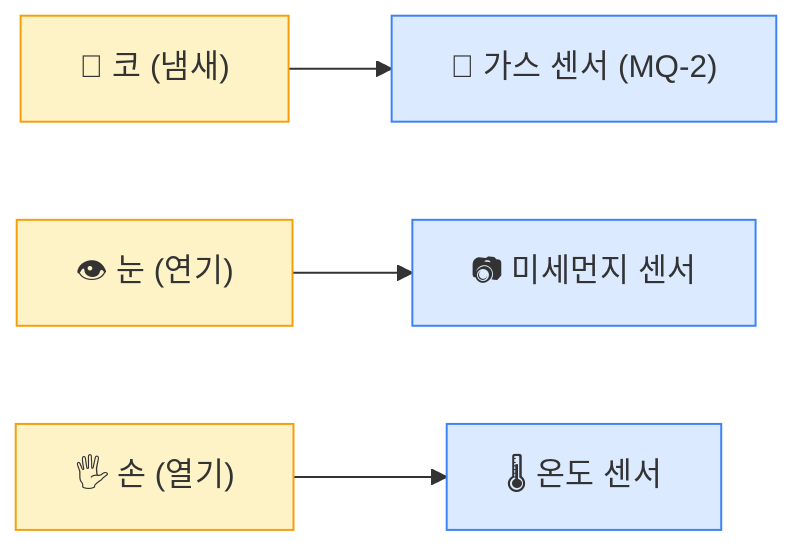
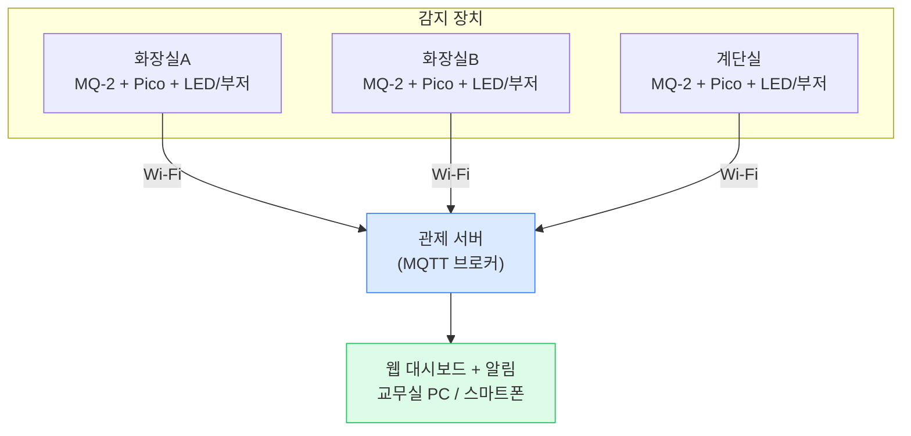
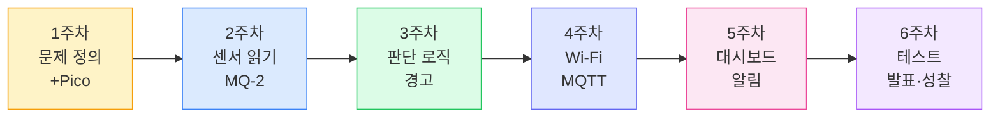

# 1주차: 문제 정의 & Pico 입문

## 기본 정보

| 항목 | 내용 |
|------|------|
| 주제 | 학교 전자담배 문제 인식 & Raspberry Pi Pico 2 WH 첫 만남 |
| 시간 | 3시간 (150분 수업 + 쉬는 시간 20분) |
| 형태 | 2인 1조 |
| 준비물 | Pico 2 WH (조별 1대), Micro USB 케이블, 브레드보드, LED 2개(빨강·초록), 220Ω 저항 2개, 점퍼 와이어 M-M 6개, 노트북 (조별 1대, Thonny 사전 설치) |

## 학습목표

1. 학교 내 전자담배 흡연 문제의 심각성을 인식하고, 기술적 해결 방안을 구상할 수 있다.
2. Raspberry Pi Pico 2 WH의 구조와 핀 배치를 이해하고, Thonny IDE에서 MicroPython 코드를 실행할 수 있다.
3. GPIO를 이용하여 LED를 켜고 끄는 프로그램을 작성할 수 있다.
4. 센서 → 판단 → 반응의 기본 흐름을 설명할 수 있다.

## 타임라인

- **[1교시: 50분]** 문제 정의 & 프로젝트 소개
  - 00-10분: 아이스브레이킹 & 조 편성
  - 10-25분: 전자담배 문제 인식 활동
  - 25-40분: 프로젝트 전체 소개 & 시스템 개념
  - 40-50분: 문제 정의 캔버스 작성
- **[쉬는 시간: 10분]**
- **[2교시: 50분]** Pico 2 WH 첫 만남
  - 00-10분: Pico 2 WH 하드웨어 소개
  - 10-20분: Thonny IDE 설정 & 연결
  - 20-35분: 첫 코드 실행 (내장 LED)
  - 35-50분: 브레드보드 & 외부 LED 연결
- **[쉬는 시간: 10분]**
- **[3교시: 50분]** LED 제어 실습 & 정리
  - 00-15분: LED 깜빡이기 (Blink)
  - 15-30분: 두 개의 LED 교차 제어
  - 30-40분: 도전과제 & 자유 실험
  - 40-50분: 오늘 배운 것 정리 & 다음 주 예고

---

## 상세 수업 진행

---

### 1교시: 문제 정의 & 프로젝트 소개

---

#### 도입 & 아이스브레이킹 (00-10분)

**[강의 스크립트]**

선생님: "안녕하세요, 여러분! 오늘부터 6주 동안 정말 특별한 프로젝트를 함께 할 거예요. 그 전에 먼저 짝을 정해볼게요."

(조 편성 — 미리 짝을 정해두거나, 번호순/자율 선택)

선생님: "자, 짝이랑 인사하세요. 앞으로 6주 동안 이 짝이 여러분의 '개발 파트너'예요. 실제 IT 회사에서도 '페어 프로그래밍'이라고 해서 두 명이 한 컴퓨터로 같이 코딩하거든요. 한 명이 코드를 치면, 다른 한 명이 옆에서 실수를 잡아주고 아이디어를 내는 거예요."

선생님: "오늘 수업 시작하기 전에 질문 하나 할게요. 혹시 우리 학교에서 전자담배 때문에 문제가 된 적 있다는 거 알고 있는 사람?"

(학생 반응을 기다림)

선생님: "네, 사실 이건 우리 학교만의 문제가 아니라 전국적으로 심각한 문제예요. 오늘은 이 문제를 여러분이 직접 기술로 해결해보는 프로젝트를 시작합니다."

---

#### 전자담배 문제 인식 활동 (10-25분)

**[강의 스크립트]**

선생님: "먼저, 전자담배가 왜 문제인지부터 살펴볼게요."

(화면에 통계 자료 또는 뉴스 기사 제시)

선생님: "청소년건강행태조사에 따르면, 고등학생 전자담배 사용률이 매년 증가하고 있어요. 그런데 왜 학교에서 잡기가 어려울까요? 짝이랑 1분 동안 이야기해보세요."

(1분 토의)

선생님: "자, 나와볼 사람? 왜 전자담배는 잡기 어려운 걸까요?"

학생 A: "냄새가 별로 안 나요."

학생 B: "연기가 금방 사라져요."

학생 C: "화재 감지기가 안 울려요."

선생님: "맞아요! 정확해요. 기존 담배는 연기가 나고 냄새가 강해서 바로 알 수 있는데, 전자담배는 에어로졸이라는 아주 미세한 입자를 만들어내요. 이게 빠르게 퍼져서 사라지거든요. 그래서 기존 화재감지기로는 못 잡아요."

선생님: "그럼 질문을 바꿔볼게요. 만약 눈에 안 보이고, 냄새도 잘 안 나는 전자담배 연기를 잡으려면... 뭘 써야 할까요?"

(학생들 생각하게 잠시 기다림)

선생님: "힌트를 줄게요. 우리 코가 냄새를 맡잖아요? 기계에도 코 같은 게 있어요. 그게 바로 '가스 센서'예요."



선생님: "우리 프로젝트에서는 MQ-2라는 가스 센서를 사용할 거예요. 이 센서가 전자담배 증기 속의 화학 물질에 반응해서 '여기서 누가 전자담배 피웠다!' 하고 알려주는 거죠."

---

#### 프로젝트 전체 소개 & 시스템 개념 (25-40분)

**[강의 스크립트]**

선생님: "그럼 6주 동안 우리가 뭘 만들 건지 전체 그림을 보여줄게요."



선생님: "학교 여기저기에 센서를 설치하고, 각 센서가 Wi-Fi로 데이터를 보내면, 중앙 서버에서 한 번에 모니터링하는 거예요. 누가 어디서 전자담배를 피우면 바로 선생님 폰으로 알림이 오는 시스템이에요."

선생님: "이걸 6주에 걸쳐서 하나씩 만들어 갈 거예요."



선생님: "오늘은 1주차니까, 문제를 정의하고, Pico라는 작은 컴퓨터를 처음 만나볼 거예요. LED를 깜빡이는 것부터 시작합니다."

선생님: "혹시 '나는 코딩 완전 못하는데...' 하는 사람?"

(몇 명 손 들면)

선생님: "걱정 마세요. 완전 처음부터 시작합니다. 그리고 짝이 있잖아요. 둘이서 머리 맞대면 혼자보다 훨씬 잘 됩니다."

---

#### 문제 정의 캔버스 작성 (40-50분)

**[강의 스크립트]**

선생님: "자, 이제 짝이랑 같이 '문제 정의 캔버스'를 작성해볼게요. 기술로 문제를 해결하려면, 먼저 문제를 정확히 정의하는 게 가장 중요해요."

(활동지 배부)

> **문제 정의 캔버스**
>
> 조: ___조 &nbsp;&nbsp; 이름: __________, __________
>
> **1. 문제는 무엇인가?**
> (학교에서 전자담배가 문제인 이유를 구체적으로 적어보세요)
>
> **2. 왜 해결이 어려운가?**
> (기존 방법으로 안 되는 이유)
>
> **3. 우리의 해결 아이디어**
> (센서를 어디에, 어떻게 쓸 것인지)
>
> **4. 성공하면 어떤 변화?**
> (이 시스템이 완성되면 뭐가 달라질까)
>
> **5. 걱정되는 점**
> (기술적 한계, 윤리적 우려 등)

선생님: "5분 동안 짝이랑 같이 작성해보세요. 정답이 없는 거예요. 여러분 생각을 자유롭게 적으면 됩니다."

(5분 작성 시간)

선생님: "다 적었으면, 5번 '걱정되는 점'에 뭐라고 적었는지 한 조만 발표해볼까요?"

학생: "센서가 방귀에도 반응하면 어떡하죠?"

선생님: "(웃으며) 아주 좋은 질문이에요! 진짜로 MQ-2 센서는 메탄가스에도 반응해요. 그래서 3주차에 '어떻게 구분할 것인가'를 다룰 거예요. 이런 걱정이 바로 좋은 문제 정의예요."

학생: "학생 인권 침해 아니에요? 감시카메라 같은 거잖아요."

선생님: "이것도 정말 중요한 포인트예요. 6주차에 이 주제로 깊이 있게 토론할 거예요. 지금은 '걱정되는 점'에 꼭 적어두세요."

**[수업 장면: 문제 정의의 힘]**

지훈이와 서연이 조가 캔버스를 작성하고 있다.

서연: "3번에 뭐라고 쓰지? 센서를 화장실에 달면 되는 거 아니야?"

지훈: "근데 화장실 몇 개야? 전부 다 달아야 하나?"

서연: "그러면 돈이 엄청 들겠다..."

지훈: "아, 그러면 '가장 문제가 많은 곳부터 설치한다'라고 쓰자."

선생님이 지나가며: "좋은 생각이에요. 실제 엔지니어도 예산 안에서 가장 효과적인 곳부터 설치하거든요. 그게 바로 '우선순위 설정'이에요."

---

### 2교시: Pico 2 WH 첫 만남

---

#### Pico 2 WH 하드웨어 소개 (00-10분)

**[강의 스크립트]**

선생님: "자, 이제 진짜 하드웨어를 만져볼 시간이에요! 각 조에 나눠준 이 작은 보드가 바로 Raspberry Pi Pico 2 WH예요."

(실물을 들어 보이며)

선생님: "이 작은 보드가 컴퓨터예요. 진짜 컴퓨터. CPU도 있고, 메모리도 있고, 심지어 Wi-Fi까지 돼요. 가격은 약 12,000원밖에 안 해요."

선생님: "이름이 좀 길죠? 하나씩 풀어볼게요."

- **Raspberry Pi** — 만든 회사 (영국)
- **Pico** — 작다 (Pico = 아주 작은)
- **2** — 2세대
- **W** — Wi-Fi 무선 기능
- **H** — 핀이 미리 납땜되어 있음 (Header)

선생님: "'H'가 중요해요. Header의 H인데, 이 금색 핀들이 미리 납땜되어 있다는 뜻이에요. 이게 없으면 우리가 직접 납땜해야 해서 훨씬 어려워요."

선생님: "핀 배치도를 나눠줄게요. 이 프로젝트 내내 참고할 자료예요."

<div class="hw-diagram" data-type="pico-pinout"
     data-highlight='[
       {"pin":"GP15","label":"빨간 LED","color":"#ef4444"},
       {"pin":"GP16","label":"초록 LED / 부저","color":"#22c55e"},
       {"pin":"GP26","label":"MQ-2 센서 (ADC0)","color":"#f59e0b"}
     ]'>
</div>

선생님: "별표 친 핀을 주목하세요. GP15는 LED, GP16은 부저, GP26은 센서에 연결할 거예요. 지금 당장 외울 필요 없고, 이 표를 프로젝트 내내 옆에 놓고 보면 돼요."

선생님: "중요한 용어 하나만 알고 가죠. 'GPIO'라고 읽는데, General Purpose Input/Output의 약자예요. 한국어로 하면 '범용 입출력 핀'. 쉽게 말하면 '아무거나 연결할 수 있는 핀'이에요."

---

#### Thonny IDE 설정 & 연결 (10-20분)

**[강의 스크립트]**

선생님: "Pico에 프로그램을 넣으려면 도구가 필요해요. 우리는 Thonny라는 프로그램을 쓸 거예요. 이미 설치되어 있죠?"

(사전에 학생 노트북에 Thonny 설치 완료 상태)

선생님: "자, 저를 따라 하세요. 하나씩 천천히 갈게요."

선생님: "첫 번째, Pico를 Micro USB 케이블로 노트북에 연결하세요. 아직 Thonny는 안 켜도 돼요."

(학생들 연결)

선생님: "두 번째, Thonny를 여세요."

선생님: "세 번째, Thonny 오른쪽 아래를 보세요. 'Python 3' 또는 'Local Python 3'이라고 되어 있을 거예요. 거기를 클릭해서 'MicroPython (Raspberry Pi Pico)'로 바꿔주세요."

선생님: "하단 Shell 영역에 '>>>' 표시가 나오면 성공이에요! Pico랑 연결된 거예요."

선생님: "혹시 연결 안 되는 조?"

(트러블슈팅 진행)

**[예상 Q&A]**

- **Q**: "Thonny 오른쪽 아래에 Pico가 안 보여요."
- **A**: "USB 케이블을 뽑았다가 다시 꽂아보세요. 그래도 안 되면 Thonny를 껐다가 다시 켜보세요. 간혹 충전 전용 케이블이면 데이터 전송이 안 돼요 — 다른 케이블로 바꿔보세요."

- **Q**: "COM 포트가 여러 개 나와요."
- **A**: "Pico USB를 뽑았을 때 사라지는 COM 포트가 Pico예요. 그걸 선택하세요."

- **Q**: "'MicroPython (Raspberry Pi Pico)'가 목록에 없어요."
- **A**: "Thonny 버전이 낮을 수 있어요. 도구 > 옵션 > 인터프리터에서 'Raspberry Pi Pico'를 선택하고, 'Install or update MicroPython' 버튼을 눌러서 펌웨어를 설치하세요."

---

#### 첫 코드 실행 — 내장 LED (20-35분)

**[강의 스크립트]**

선생님: "자, 드디어 코드를 쳐볼 거예요! 프로그래밍 인생의 첫 코드입니다."

선생님: "Thonny 위쪽 편집 영역에 이 코드를 그대로 따라 치세요. 철자 하나도 틀리면 안 되니까 천천히, 정확하게 치세요."

**[코드: step1_내장led_켜기.py]**

```python
# ============================================
# step1_내장led_켜기.py
# Pico 2 WH의 내장 LED를 켜는 첫 번째 코드
# ============================================

# === 무엇을 하는 코드인지 (WHAT) ===
# Pico 보드 위에 있는 작은 초록색 LED를 켜는 코드예요

# --- 왜 필요한지 (WHY) ---
# Pico가 제대로 작동하는지 확인하는 가장 쉬운 방법이에요
# 하드웨어 세계의 "Hello, World!"와 같아요

from machine import Pin    # machine 모듈에서 Pin 기능을 가져옴

led = Pin("LED", Pin.OUT)  # 내장 LED를 출력(OUT) 모드로 설정
led.on()                   # LED 켜기!

# 실행 후 Pico 보드의 작은 LED가 켜지면 성공!
```

선생님: "다 쳤으면 위쪽 초록색 ▶ 버튼을 눌러보세요. 또는 F5를 눌러도 돼요."

(학생들 실행)

선생님: "Pico 보드를 봐보세요. 작은 LED가 켜졌죠?"

**[수업 장면: 첫 성공]**

민수가 코드를 실행하자 Pico 보드의 작은 초록 LED가 켜진다.

민수: "어? 켜졌어요!"

유진: "진짜네! 이거 코드 세 줄로 된 거야?"

선생님: "축하해요! 여러분이 방금 하드웨어를 프로그래밍한 거예요. 코드 한 줄이 실제 물리적인 LED를 켜는 거, 신기하지 않아요?"

민수: "이거 끄려면요?"

선생님: "좋은 질문! `led.off()`라고 쳐보세요."

선생님: "이제 LED를 껐다 켰다 반복하는 코드를 만들어볼게요."

**[코드: step2_내장led_깜빡이기.py]**

```python
# ============================================
# step2_내장led_깜빡이기.py
# Pico 2 WH의 내장 LED를 반복적으로 깜빡이기
# ============================================

# === 무엇을 하는 코드인지 (WHAT) ===
# LED를 1초마다 켰다 껐다 반복하는 코드예요
# 하드웨어 세계에서 이걸 "Blink"라고 불러요

# --- 왜 필요한지 (WHY) ---
# 반복(loop)과 시간 지연(sleep)을 배우는 가장 기본적인 실습이에요

from machine import Pin    # Pin 기능 가져오기
import time                # 시간 관련 기능 가져오기 (sleep 사용)

led = Pin("LED", Pin.OUT)  # 내장 LED를 출력 모드로 설정

# 무한 반복! (Ctrl+C로 멈출 수 있어요)
while True:                # True인 동안 계속 반복 = 영원히 반복
    led.on()               # LED 켜기
    time.sleep(1)          # 1초 기다리기
    led.off()              # LED 끄기
    time.sleep(1)          # 1초 기다리기

# 멈추려면: Thonny의 빨간 ■ 정지 버튼 또는 Ctrl+C
```

선생님: "실행해보세요. LED가 1초 간격으로 깜빡이죠?"

선생님: "여기서 `time.sleep(1)`의 숫자를 바꿔보세요. 0.1로 바꾸면 어떻게 될까요?"

(학생들 실험)

학생: "엄청 빨리 깜빡여요!"

선생님: "맞아요! sleep 안의 숫자가 '초'예요. 0.1이면 0.1초, 즉 아주 빠르게 깜빡이는 거죠. 이렇게 숫자 하나만 바꿔도 동작이 달라지는 게 프로그래밍의 재미예요."

**[예상 Q&A]**

- **Q**: "while True가 뭐예요? 왜 True예요?"
- **A**: "while은 '~하는 동안 반복해'라는 뜻이에요. True는 '항상 참'이니까 '항상 반복해' = 무한 반복이 되는 거예요. 나중에 센서 값을 계속 읽어야 할 때도 이 구조를 쓸 거예요."

- **Q**: "멈추려면 어떻게 해요?"
- **A**: "Thonny의 빨간 정지 버튼 ■을 누르거나, Shell에서 Ctrl+C를 누르세요."

- **Q**: "from machine import Pin이 뭐예요?"
- **A**: "machine이라는 도구 상자에서 Pin이라는 도구를 꺼내는 거예요. Pico의 핀을 제어하려면 이 도구가 필요해요."

---

#### 브레드보드 & 외부 LED 연결 (35-50분)

**[강의 스크립트]**

선생님: "이제 내장 LED 말고, 우리가 직접 LED를 연결해볼 거예요. 이때 쓰는 게 이 흰색 판이에요. '브레드보드'라고 해요."

(브레드보드 실물을 들어 보이며)

선생님: "브레드보드의 구멍들은 안쪽에서 연결되어 있어요. 이걸 이해하는 게 중요해요."

<div class="hw-diagram" data-type="breadboard">
</div>

선생님: "가운데 홈을 기준으로 좌우가 분리돼 있어요. a-b-c-d-e는 서로 연결되고, f-g-h-i-j는 서로 연결되지만, e와 f는 연결이 안 돼요."

선생님: "이제 빨간 LED를 GP15에 연결해볼게요."

<div class="hw-diagram" data-type="connection"
     data-title="빨간 LED 연결 회로도"
     data-connections='[
       {"from":"GP15","to":"220Ω 저항","then":"빨간 LED (+, 긴 다리)","color":"#ef4444"},
       {"from":"GND","to":"빨간 LED (-, 짧은 다리)","color":"#6b7280"}
     ]'
     data-notes='["LED에는 방향이 있어요! 긴 다리(+)가 저항 쪽, 짧은 다리(-)가 GND 쪽","저항 없이 LED를 바로 연결하면 과전류로 LED가 타요","저항은 방향이 없어요 — 어느 쪽으로 꽂든 상관없어요"]'>
</div>

선생님: "LED에는 방향이 있어요. 다리가 긴 쪽이 +, 짧은 쪽이 -예요. 거꾸로 꽂으면 안 켜져요. 하지만 고장 나지는 않으니까 걱정 마세요."

선생님: "그리고 저항을 꼭 연결해야 해요. 저항 없이 LED를 바로 연결하면 과전류가 흘러서 LED가 타버릴 수 있어요."

선생님: "자, 이제 짝이랑 역할을 나누세요. 한 명이 회로를 연결하고, 다른 한 명이 회로도를 보면서 확인해주세요."

(학생들 회로 연결 — 선생님 순회하며 확인)

**[예상 Q&A]**

- **Q**: "저항 방향도 있어요?"
- **A**: "저항은 방향이 없어요! 어느 쪽으로 꽂든 똑같이 동작해요. LED만 방향 주의하세요."

- **Q**: "LED 안 켜져요."
- **A**: "체크리스트를 확인해보세요. ① LED 방향 맞나요? (긴 다리가 + 쪽) ② 저항이 연결되어 있나요? ③ GND가 연결되어 있나요? ④ 브레드보드에 같은 행에 꽂았나요?"

- **Q**: "220옴 저항을 어떻게 구분해요?"
- **A**: "저항에 색띠가 있어요. 빨강-빨강-갈색-금색이면 220Ω이에요. 이 수업에서는 선생님이 미리 분류해놨으니 나눠준 저항을 그대로 쓰면 돼요."

---

### 3교시: LED 제어 실습 & 정리

---

#### LED 깜빡이기 — Blink (00-15분)

**[강의 스크립트]**

선생님: "회로 연결됐죠? 이제 코드로 외부 LED를 제어해봅시다."

**[코드: step3_외부led_깜빡이기.py]**

```python
# ============================================
# step3_외부led_깜빡이기.py
# 브레드보드에 연결한 외부 LED 깜빡이기
# ============================================

# === 무엇을 하는 코드인지 (WHAT) ===
# GP15에 연결한 빨간 LED를 깜빡이는 코드예요

# --- 왜 필요한지 (WHY) ---
# 내장 LED가 아닌, 우리가 직접 연결한 LED를 제어하는 거예요
# 나중에 '경고등'으로 쓸 거예요 — 전자담배 감지되면 빨간불!

from machine import Pin
import time

# GP15 핀을 출력(OUT) 모드로 설정
# 아까 내장 LED는 "LED"라고 썼지만, 외부 LED는 핀 번호를 써요
red_led = Pin(15, Pin.OUT)

print("빨간 LED 깜빡이기 시작!")  # Thonny Shell에 메시지 표시

while True:
    red_led.on()           # LED 켜기 (= red_led.value(1) 과 같음)
    print("LED ON")        # 상태 표시
    time.sleep(0.5)        # 0.5초 대기

    red_led.off()          # LED 끄기 (= red_led.value(0) 과 같음)
    print("LED OFF")       # 상태 표시
    time.sleep(0.5)        # 0.5초 대기
```

선생님: "실행해보세요! 브레드보드의 빨간 LED가 깜빡이나요?"

(학생들 실행)

선생님: "Thonny 아래쪽 Shell에도 'LED ON', 'LED OFF'가 반복되는 거 보이죠? print()는 화면에 메시지를 띄우는 거예요. 나중에 센서 값을 확인할 때 아주 유용해요."

**[수업 장면: 문제 해결]**

준호와 소율이 조에서 LED가 안 켜진다.

준호: "선생님, 코드 실행했는데 LED가 안 깜빡여요."

선생님: "Shell에 뭐라고 나와요?"

준호: "LED ON, LED OFF는 나와요."

선생님: "그러면 코드는 맞는 거예요. 회로를 봐볼까? 소율아, LED 다리 어느 쪽이 긴 다리야?"

소율: "...같은 것 같은데요?"

선생님: "자세히 보면 하나가 살짝 길어요. 한번 LED를 뽑아서 반대로 꽂아보세요."

(소율이 LED를 반대로 꽂자 깜빡이기 시작)

준호: "와, 됐다!"

선생님: "LED 방향이 반대였던 거예요. 이런 실수는 프로도 해요. 중요한 건 '안 되면 차근차근 확인하기'예요."

---

#### 두 개의 LED 교차 제어 (15-30분)

**[강의 스크립트]**

선생님: "이번엔 LED 두 개를 써볼게요. 초록 LED를 하나 더 추가하세요. GP16에 연결합니다."

<div class="hw-diagram" data-type="connection"
     data-title="2개 LED 연결 회로도"
     data-connections='[
       {"from":"GP15","to":"220Ω 저항","then":"빨간 LED (+)","color":"#ef4444"},
       {"from":"GP16","to":"220Ω 저항","then":"초록 LED (+)","color":"#22c55e"},
       {"from":"GND","to":"모든 LED의 (-)","color":"#6b7280"}
     ]'>
</div>

선생님: "회로 연결됐으면 이 코드를 입력하세요."

**[코드: step4_두개_led_교차.py]**

```python
# ============================================
# step4_두개_led_교차.py
# 빨간 LED와 초록 LED를 교대로 깜빡이기
# ============================================

# === 무엇을 하는 코드인지 (WHAT) ===
# 빨간불과 초록불이 번갈아 켜지는 코드예요
# 나중에 "정상(초록) vs 경고(빨강)" 상태를 표시하는 데 쓸 거예요!

# --- 왜 필요한지 (WHY) ---
# 전자담배 감지 시스템에서:
#   초록 LED = "공기 깨끗함, 정상"
#   빨간 LED = "전자담배 감지! 경고!"

from machine import Pin
import time

red_led = Pin(15, Pin.OUT)    # 빨간 LED (경고용)
green_led = Pin(16, Pin.OUT)  # 초록 LED (정상 상태)

print("=== 전자담배 감지 시스템 LED 테스트 ===")
print("초록 = 정상 / 빨강 = 경고")
print()

while True:
    # 정상 상태: 초록 켜기, 빨강 끄기
    green_led.on()
    red_led.off()
    print("상태: 정상 (공기 깨끗)")
    time.sleep(2)          # 2초 유지

    # 경고 상태: 빨강 켜기, 초록 끄기
    green_led.off()
    red_led.on()
    print("상태: 경고! 전자담배 감지!")
    time.sleep(2)          # 2초 유지
```

선생님: "실행하면 초록-빨강-초록-빨강 번갈아 깜빡이죠? 이게 바로 우리 프로젝트의 기본 출력이에요. 나중에 센서가 연결되면, 센서 값에 따라 초록이냐 빨강이냐를 결정하는 거예요."

선생님: "지금은 2초마다 그냥 번갈아 가는데, 다음 주부터는 '센서가 위험 신호를 보내면 빨간불'이 되도록 만들 거예요."

**[예상 Q&A]**

- **Q**: "LED를 3개, 4개도 연결할 수 있어요?"
- **A**: "당연하죠! Pico에는 GPIO 핀이 26개나 있어요. 원하면 26개 LED도 가능해요. 다만 전류 제한이 있어서, 많이 연결할 때는 별도 전원이 필요할 수 있어요."

- **Q**: "on()/off() 대신 value()를 써도 돼요?"
- **A**: "네! `red_led.value(1)`은 `red_led.on()`과 같고, `red_led.value(0)`은 `red_led.off()`와 같아요. 나중에 변수로 제어할 때 value()가 더 편할 수 있어요."

---

#### 도전과제 & 자유 실험 (30-40분)

**[강의 스크립트]**

선생님: "남은 시간은 자유 실험 시간이에요. 아래 도전과제 중에 하나를 골라서 짝이랑 같이 해보세요."

**도전과제**

- **⭐ Level 1: SOS 신호 만들기** — LED로 모스부호 SOS (· · · — — — · · ·)를 표현해보세요. 힌트: 짧은 점멸 = 0.2초, 긴 점멸 = 0.6초

- **⭐⭐ Level 2: 경고 패턴 만들기** — 빨간 LED를 빠르게 3번 깜빡이고 → 1초 쉬고 → 반복 (실제 경보기처럼 보이게 만들어보세요)

- **⭐⭐⭐ Level 3: 상태 표시기 만들기** — 초록 3초 (안전) → 빨강 빠르게 5번 깜빡 (경고) → 반복. Shell에 현재 상태도 함께 출력하기

선생님: "Level 1부터 도전해보고, 되면 Level 2로 넘어가세요. 짝이랑 의논하면서 해보세요!"

**[도전과제 Level 2 예시 답안 — 교사용]**

```python
# Level 2: 경고 패턴
from machine import Pin
import time

red_led = Pin(15, Pin.OUT)

while True:
    # 빠르게 3번 깜빡이기
    for i in range(3):        # 3번 반복
        red_led.on()
        time.sleep(0.1)       # 0.1초 켜기
        red_led.off()
        time.sleep(0.1)       # 0.1초 끄기

    time.sleep(1)             # 1초 쉬기
```

**[수업 장면: 협업]**

하윤이와 재민이가 Level 3에 도전하고 있다.

하윤: "초록 3초는 알겠는데, 빨강 빠르게 5번은 어떻게 해?"

재민: "아까 while True 안에 for 쓰면 되지 않을까? 선생님이 Level 2 힌트에서 range 쓴다고 했잖아."

하윤: "for i in range(5)? 한번 해보자."

(코드를 실행하자 원하는 대로 동작)

재민: "오, 된다! 근데 print도 넣어야 하는 거 아니야?"

하윤: "맞다, '상태 표시기'니까. print('안전')이랑 print('경고!')를 넣자."

---

#### 오늘 배운 것 정리 & 다음 주 예고 (40-50분)

**[강의 스크립트]**

선생님: "자, 오늘 수업 정리해볼게요. 짝이랑 번갈아가면서 대답해보세요."

선생님: "첫 번째 질문. 오늘 우리가 해결하려는 문제가 뭐였죠?"

학생들: "학교 전자담배 흡연!"

선생님: "두 번째. Pico에서 LED를 켜려면 어떤 코드를 쓰죠?"

학생들: "led.on()!"

선생님: "세 번째. LED를 계속 깜빡이게 하려면 어떤 구조를 쓰죠?"

학생들: "while True!"

선생님: "완벽해요."

**오늘 배운 것 정리**

- 전자담배 문제 정의 → 문제 정의 캔버스 작성
- Pico 2 WH 구조 이해 → GPIO 핀의 역할
- Thonny IDE 연결 → MicroPython 환경 설정
- 내장 LED 제어 → `led.on()` / `led.off()`
- 외부 LED 연결 → 브레드보드 + 저항 + LED
- 반복문 활용 → `while True` + `time.sleep()`
- **핵심 키워드**: GPIO, Pin, OUT, while True, sleep

**[다음 주 예고]**

선생님: "다음 주에는 드디어 센서를 연결합니다! MQ-2라는 가스 센서를 Pico에 연결해서, 공기 중의 가스 농도를 숫자로 읽어볼 거예요."

선생님: "오늘 LED를 켜고 끄는 건 '출력'이었다면, 다음 주 센서 값을 읽는 건 '입력'이에요. 입력과 출력을 합치면 비로소 '센서로 읽고 → LED로 알려주는' 시스템이 되는 거죠."

(MQ-2 센서 실물을 잠깐 보여주며)

선생님: "이게 MQ-2예요. 이 동그란 금속 부분이 가스를 감지하는 부분이에요. 다음 주에 이걸 Pico에 연결하면 전자담배 증기를 감지할 수 있게 됩니다. 기대하세요!"

선생님: "마지막으로, 오늘 작성한 문제 정의 캔버스는 꼭 보관하세요. 6주차 발표 때 다시 쓸 거예요."

---

## 교사용 체크리스트

- [ ] 3시간 타임라인이 현실적인가? → 1교시(개념/토의) + 2교시(환경설정/첫코드) + 3교시(실습/도전)
- [ ] 모든 코드가 복사-실행 가능한가? → step1~step4 모두 독립 실행 가능
- [ ] 초보자도 이해할 수 있는 스크립트인가? → 전문 용어 최소화, 비유 활용
- [ ] 예상 Q&A가 5개 이상 있는가? → 총 9개
- [ ] 수업 장면 시나리오가 2개 이상 있는가? → 4개 (문제정의, 첫성공, 문제해결, 협업)
- [ ] 다음 주와의 연결이 자연스러운가? → LED 출력 → 센서 입력으로 연결

## 교사용 사전 준비 메모

1. **Thonny 사전 설치**: 가능하면 수업 전 주에 학생 노트북에 Thonny 설치 완료. 설치 안내: https://thonny.org
2. **Pico 펌웨어**: MicroPython 펌웨어가 Pico에 미리 설치되어 있으면 좋음. Thonny에서 자동 설치도 가능하지만 시간이 걸림.
3. **부품 사전 분류**: 조별로 투명 지퍼백에 부품 세트를 미리 담아두면 나눠주기 편함.
4. **여분 부품 준비**: LED 5~10개, 저항 10개 정도 여분 준비 (분실/파손 대비).
5. **USB 케이블 주의**: 충전 전용 케이블은 데이터 전송이 안 됨. 데이터 전송 가능한 Micro USB 케이블로 준비.
6. **전자담배 통계 자료**: 질병관리청 '청소년건강행태조사' 최신 자료를 PPT 또는 프린트로 준비.
