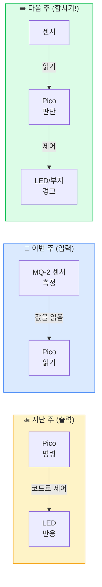
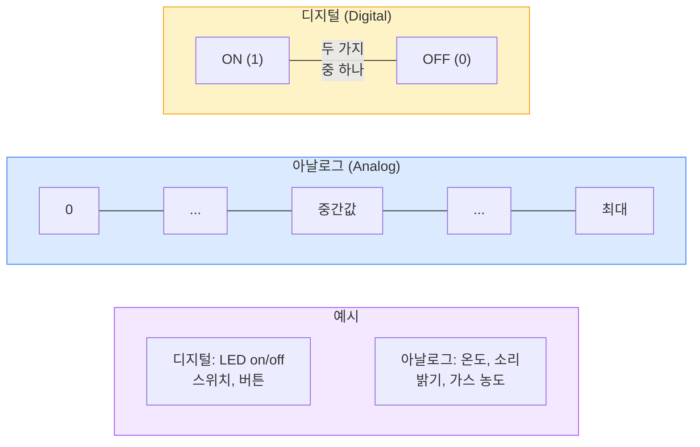
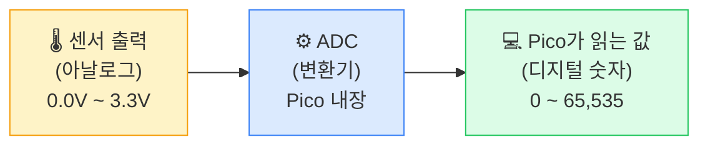
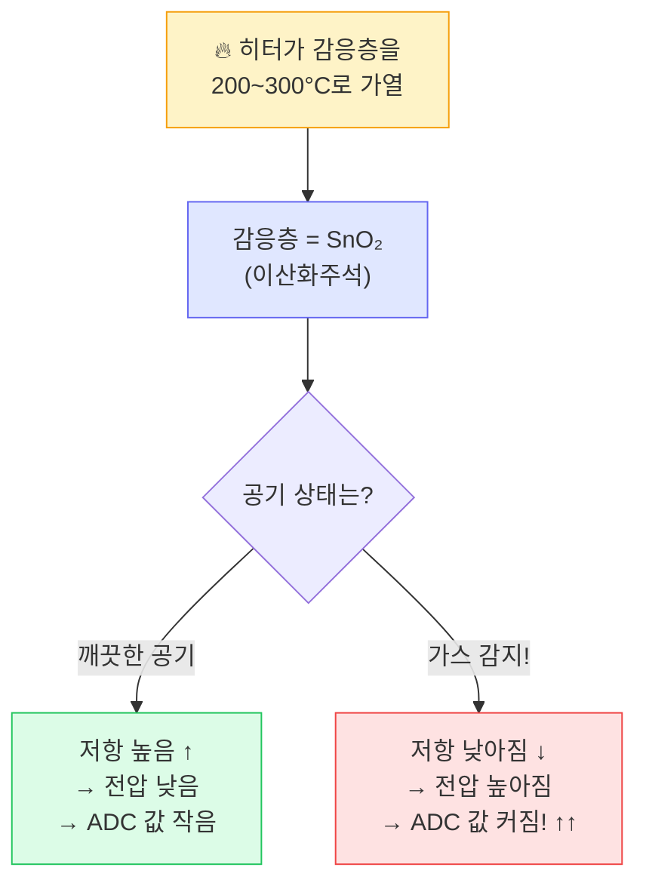
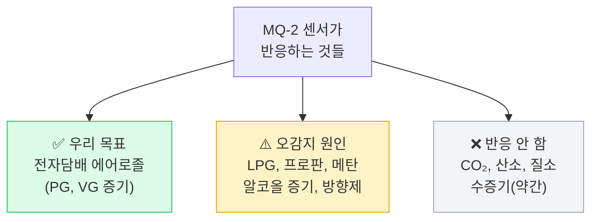
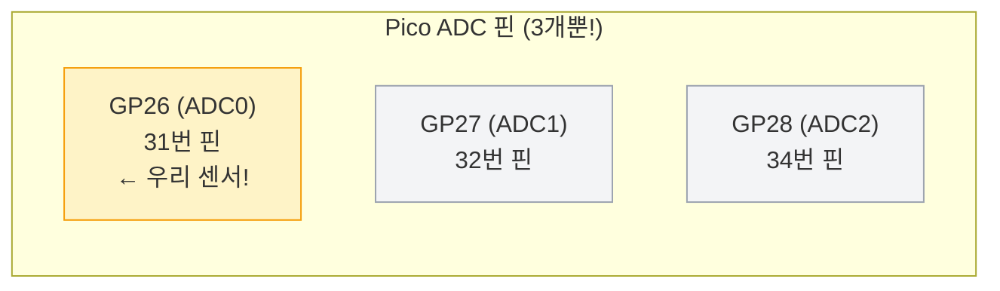
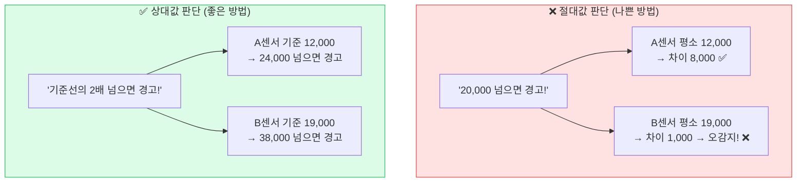
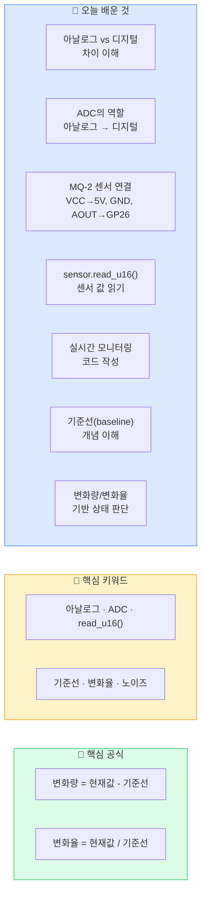

# 2주차: 센서 읽기 — MQ-2 가스 센서의 세계

## 기본 정보

| 항목 | 내용 |
|------|------|
| 대상 | 고등학생 (코딩 초보 가능) |
| 시간 | 3시간 (150분 수업 + 쉬는 시간 20분) |
| 형태 | 2인 1조 |
| 준비물 | 1주차 세트 전체 (Pico 2 WH, Micro USB 케이블, 브레드보드, LED 2개, 220Ω 저항 2개, 점퍼 와이어) + MQ-2 가스센서 모듈 (조별 1개), 점퍼 와이어 M-F 3개 추가, 손 소독제(에탄올), 라이터(교사용), 노트북 (조별 1대, Thonny 설치 완료) |
| 핵심역량 | 센서 데이터 수집, 아날로그-디지털 변환 이해, 기준선(baseline) 기반 판단 |
| 선수학습 | 1주차 — Pico 2 WH 기본 사용, GPIO 출력(LED on/off), while True 반복문, time.sleep() |
| 안전유의 | MQ-2 센서 금속부 가열됨(장시간 접촉 주의), 라이터 가스 실험은 교사만 수행, 실험 중 교실 환기 필수 |

## 학습목표

1. 아날로그 신호와 디지털 신호의 차이를 설명할 수 있다. ⬜
2. MQ-2 가스센서를 Pico 2 WH에 올바르게 연결할 수 있다. ⬜
3. ADC(아날로그-디지털 변환기)의 원리를 이해하고, 센서 값을 읽어 출력할 수 있다. ⬜
4. 센서 값의 변화를 관찰하고, 기준선(baseline) 개념을 직관적으로 이해할 수 있다. ⬜

## 수업 타임라인

```mermaid
gantt
    title 2주차: 센서 읽기 — MQ-2 가스 센서의 세계
    dateFormat HH:mm
    axisFormat %H:%M

    section 1교시
    1주차 복습 & 오늘의 목표       :a1, 09:00, 10min
    아날로그 vs 디지털 개념         :a2, after a1, 15min
    MQ-2 센서 소개 & 동작 원리     :a3, after a2, 15min
    MQ-2 회로 연결 실습             :a4, after a3, 10min

    section 쉬는 시간
    휴식                            :break1, after a4, 10min

    section 2교시
    ADC 개념 설명                   :b1, after break1, 10min
    첫 센서 값 읽기 코드            :b2, after b1, 15min
    실시간 모니터링 코드            :b3, after b2, 15min
    센서 반응 실험                   :b4, after b3, 10min

    section 쉬는 시간
    휴식                            :break2, after b4, 10min

    section 3교시
    기준선(baseline) 개념 도입      :c1, after break2, 15min
    기준선 측정 코드 작성            :c2, after c1, 15min
    도전과제 & 자유 실험             :c3, after c2, 10min
    오늘 배운 것 정리 & 다음 주 예고 :c4, after c3, 10min
```



---

## 강의 스크립트

---

### 도입: 1주차 복습 & 오늘의 목표 (1교시 00-10분)

> 🎯 이 섹션의 목표: 지난 주 학습 내용을 떠올리고, 오늘 배울 '입력(센서 읽기)'의 방향을 잡는다.

👨‍🏫 선생님: "지난 주에 뭘 했는지 기억나요? 짝이랑 30초 동안 이야기해보세요."

(30초 후)

👨‍🏫 선생님: "누가 정리해볼까요?"

👧 학생: "LED를 깜빡이는 거 했어요. while True 쓰고 sleep 넣고..."

👨‍🏫 선생님: "맞아요! LED를 on/off 하는 것, 이게 바로 '출력'이었어요. Pico가 LED한테 명령을 내리는 거였죠."

👨‍🏫 선생님: "오늘은 반대로 '입력'을 배울 거예요. 센서에서 값을 읽어오는 겁니다."



👨‍🏫 선생님: "다음 주에 이 둘을 합치면? 센서에서 읽고 → 판단하고 → LED로 알려주는 시스템이 됩니다! 오늘은 그 첫 번째 단계, '읽기'에 집중합니다."

---

### 전개1: 아날로그 vs 디지털 & MQ-2 센서 (1교시 10-50분)

> 🎯 이 섹션의 목표: 아날로그와 디지털의 차이를 이해하고, MQ-2 센서의 원리를 파악한 뒤, 실제 회로를 연결한다.

#### 아날로그와 디지털 개념 (10-25분)

👨‍🏫 선생님: "센서를 다루기 전에 중요한 개념 하나를 알아야 해요. '아날로그'와 '디지털'이에요."

👨‍🏫 선생님: "지난 주에 LED를 켜고 끄는 건 뭐였죠? on 아니면 off. 1 아니면 0. 두 가지 중 하나. 이게 바로 '디지털'이에요."

👨‍🏫 선생님: "그런데 세상의 많은 것들은 두 가지로만 나눌 수 없어요. 예를 들어, 이 교실의 온도가 딱 '춥다/덥다'로만 나뉘나요?"

👧 학생: "아니요, 좀 선선하다, 따뜻하다 이런 것도 있어요."

👨‍🏫 선생님: "맞아요! 온도는 연속적으로 변하는 값이에요. 23.5도, 23.7도, 24.1도... 이렇게 끊임없이 변하죠. 이런 걸 '아날로그'라고 해요."



👨‍🏫 선생님: "MQ-2 가스센서도 아날로그예요. '가스 있다/없다'가 아니라 '가스가 얼마나 있다'를 연속적인 전압으로 알려줘요."

👦 학생B: "그러면 Pico가 아날로그를 못 읽는 거 아니에요? Pico는 디지털이잖아요."

👨‍🏫 선생님: "아주 좋은 질문이에요! 맞아요, Pico는 디지털 기계예요. 0과 1밖에 모르는데, 아날로그 값을 어떻게 읽을까요?"

(학생들 생각하게 잠시 기다림)

👨‍🏫 선생님: "바로 '변환기'가 필요해요. 아날로그를 디지털로 바꿔주는 장치, 이걸 **ADC**라고 해요. Analog-to-Digital Converter. 다행히 Pico 안에 이게 내장되어 있어요!"



👨‍🏫 선생님: "Pico의 ADC는 0V부터 3.3V까지의 전압을 0부터 65,535까지의 숫자로 바꿔줘요. 숫자가 크면 전압이 높다, 작으면 전압이 낮다. 간단하죠?"

👧 학생: "왜 하필 65,535예요? 숫자가 이상해요."

👨‍🏫 선생님: "Pico의 ADC가 16비트이기 때문이에요. 2의 16승이 65,536이고, 0부터 세면 최대값이 65,535가 돼요. 쉽게 말하면 '0부터 약 6만5천까지의 눈금'이 있는 자 같은 거예요."

---

#### MQ-2 센서 소개 & 동작 원리 (25-40분)

👨‍🏫 선생님: "(MQ-2 센서 모듈을 들어 보이며) 자, 이게 오늘의 주인공 MQ-2예요. 이 동그란 금속 부분을 한번 관찰해보세요."

(학생들이 센서를 관찰)

<div class="hw-diagram" data-type="sensor-module" data-sensor="mq2" data-show-pins="true"></div>

👨‍🏫 선생님: "이 안에 뭐가 있냐면, 아주 작은 '히터'와 '감응층'이 있어요. 쉽게 비유하면, 센서 안에 조그만 난로가 있어서 특수한 물질을 데우고 있는 거예요."

👧 학생: "헐, 안에 히터가 있어요? 뜨거워요?"

👨‍🏫 선생님: "네, 살짝 따뜻해져요. 약 200~300도로 가열되는데, 케이스 안에 있으니까 바깥은 미지근한 정도예요. 장시간 만지진 마세요."

👨‍🏫 선생님: "동작 원리를 쉽게 설명할게요."



👨‍🏫 선생님: "정리하면, 공기가 깨끗하면 숫자가 작고, 전자담배 연기 같은 가스가 있으면 숫자가 커지는 거예요. 아주 단순하죠?"

👦 학생B: "오~ 그러면 숫자만 보면 되는 거네요?"

👨‍🏫 선생님: "맞아요! 그런데 MQ-2가 전자담배'만' 잡는 건 아니에요."

👨‍🏫 선생님: "MQ-2가 반응하는 것들을 볼게요."



👧 학생: "아, 그러면 손 소독제 뿌려도 반응하겠네요?"

👨‍🏫 선생님: "정확해요! 그래서 '전자담배'만 구분하는 게 이 프로젝트의 도전 과제예요. 3주차에 이 문제를 다룰 거예요."

👨‍🏫 선생님: "그리고 중요한 거 하나! MQ-2는 전원 켜자마자 바로 정확한 값을 내놓지 않아요. 히터가 감응층을 충분히 데워야 해요. 자동차 시동 걸고 엔진 예열하는 것처럼, 센서도 2~3분 워밍업이 필요합니다."

---

#### MQ-2 회로 연결 실습 (40-50분)

👨‍🏫 선생님: "이제 MQ-2를 Pico에 연결해볼게요. 지난 주 LED는 그대로 두고, 센서를 추가로 연결합니다."

👨‍🏫 선생님: "MQ-2 모듈 뒷면을 보세요. VCC, GND, AOUT, DOUT 이렇게 4개 핀이 적혀 있을 거예요. 또는 A0, D0이라고 적혀 있을 수도 있는데, A0이 AOUT, D0이 DOUT이에요."

<div class="hw-diagram" data-type="connection" data-from="pico" data-to="mq2" data-connections='[{"from":"GP26","to":"AOUT","color":"#f59e0b"},{"from":"3V3","to":"VCC","color":"#ef4444"},{"from":"GND","to":"GND","color":"#1e1e1e"}]' data-title="Pico - MQ-2 센서 연결"></div>

> ⚠️ **연결 핵심 포인트**
> 1. **VCC는 VBUS(5V)에 연결!** — 3.3V로는 히터가 제대로 가열되지 않아요
> 2. **AOUT → GP26** — ADC 입력이 가능한 핀 (GP26, GP27, GP28 중 하나)
> 3. **DOUT는 이번에 사용하지 않아요** — 디지털 출력 핀이지만 아날로그가 더 정확해요
> 4. **GND는 공유 가능** — 1주차 LED의 GND와 같은 GND에 연결해도 돼요

👨‍🏫 선생님: "연결 순서가 중요해요. ①GND부터 → ②AOUT → ③VCC 마지막. 전원을 마지막에 연결하는 게 안전한 습관이에요."

👨‍🏫 선생님: "역할 분담하세요. 한 명이 연결하고, 한 명이 회로도 보면서 체크해주세요. 실제 엔지니어도 항상 더블체크합니다."

(학생들 연결 — 선생님 순회하며 확인)

👧 학생: "선생님, 연결했는데 MQ-2 모듈에 빨간 불이 켜졌어요!"

👨‍🏫 선생님: "전원이 잘 들어간 거예요! 센서 금속 부분이 서서히 따뜻해지는 걸 느낄 수 있을 거예요. 지금부터 워밍업 2~3분 기다리는 동안 2교시 준비를 하죠."

**[수업 장면: 첫 연결의 긴장감]**

현우와 지아 조가 MQ-2를 연결하고 있다.

지아: "이거 VCC가 어디야? 글씨가 너무 작아서 안 보여."

현우: "여기, 뒤집어봐. VCC, GND, AOUT, DOUT 순서로 적혀 있어."

지아: "GND부터 연결한다고 했지? 검은색 점퍼 와이어로 할게."

현우: "잠깐, GND가 Pico 어디에 있더라? (핀 배치도를 확인하며) 여기, 38번 핀!"

지아: (연결 후) "다음은 AOUT. 노란색 와이어로 GP26에... 31번 핀이네."

현우: "마지막 VCC! 빨간색 와이어로 VBUS에..."

(연결하자 MQ-2 모듈의 빨간 LED가 켜진다)

지아: "와, 켜졌다! 진짜 따뜻해지네!"

선생님이 지나가며: "완벽해요! 연결 순서도 정확하고, 색깔별로 구분한 것도 좋은 습관이에요."

---

### 전개2: 센서 값 읽기 & 실시간 모니터링 (2교시)

> 🎯 이 섹션의 목표: ADC로 센서 값을 읽는 코드를 작성하고, 실시간 모니터링과 반응 실험을 통해 센서의 동작을 체감한다.

#### ADC 개념 설명 & 첫 코드 (00-25분)

👨‍🏫 선생님: "워밍업 끝났을 거예요. 이제 센서 값을 읽어봅시다! Pico에서 아날로그 값을 읽으려면 ADC 객체를 만들어야 해요."

👨‍🏫 선생님: "먼저, Pico에서 ADC를 쓸 수 있는 핀이 정해져 있어요. 아무 핀에서나 되는 게 아닙니다."



👨‍🏫 선생님: "우리는 GP26(ADC0)에 MQ-2를 연결했죠. 자, 이제 진짜 코드를 쳐봅시다!"

**[코드: step1_센서값_한번_읽기.py]**

```python
# ============================================
# step1_센서값_한번_읽기.py
# MQ-2 센서의 현재 값을 한 번 읽어서 출력하기
# ============================================

# === 무엇을 하는 코드인지 (WHAT) ===
# MQ-2 센서에서 가스 농도 값을 읽어서 화면에 보여주는 코드예요

# --- 왜 필요한지 (WHY) ---
# 센서가 제대로 연결됐는지, 어떤 값이 나오는지 확인하는 첫 단계예요
# 하드웨어를 다룰 때는 항상 "일단 값이 나오나?" 부터 확인해야 해요

from machine import ADC, Pin    # ADC 기능과 Pin 기능을 가져옴
import time

# GP26(ADC0)에 연결된 MQ-2 센서 설정
sensor = ADC(26)    # 26 = GP26 핀 번호

# 센서 값 읽기 — 이 한 줄이 핵심!
raw_value = sensor.read_u16()   # u16 = unsigned 16-bit (0~65535)

# 결과 출력
print("=" * 40)
print("  MQ-2 센서 값 읽기 테스트")
print("=" * 40)
print(f"  원시 값 (raw): {raw_value}")
print(f"  범위: 0 ~ 65535")
print(f"  전압 환산: {raw_value * 3.3 / 65535:.2f}V")
print("=" * 40)

# 실행 후 숫자가 나오면 센서 연결 성공!
```

👨‍🏫 선생님: "다 쳤으면 실행해보세요. 어떤 숫자가 나오나요?"

(학생들 실행)

👨‍🏫 선생님: "각 조가 나온 숫자를 말해보세요."

👧 학생: "12,340이요!"

👦 학생B: "저희는 15,678이에요."

👨‍🏫 선생님: "조마다 다르죠? 이게 정상이에요. MQ-2 센서는 개체마다 조금씩 다른 값을 내놓아요. 중요한 건 절대값이 아니라, 이 값이 '변하는지' 여부예요."

👨‍🏫 선생님: "한 번 더 실행해보세요. 아까랑 숫자가 좀 다를 거예요."

👧 학생: "진짜 달라요! 아까 12,340이었는데 지금 12,518이에요."

👨‍🏫 선생님: "맞아요. 센서 값은 항상 조금씩 흔들려요. 이걸 '노이즈(noise)'라고 해요. 살짝 흔들리는 건 정상이에요. 자, 이제 한 번만 읽는 건 재미없으니, 계속 읽는 코드를 만들어볼게요."

**[코드: step2_실시간_모니터링.py]**

```python
# ============================================
# step2_실시간_모니터링.py
# MQ-2 센서 값을 1초마다 계속 읽어서 출력하기
# ============================================

# === 무엇을 하는 코드인지 (WHAT) ===
# 센서 값을 1초마다 읽어서 화면에 실시간으로 보여주는 코드예요
# 마치 심전도 모니터처럼 계속 숫자가 업데이트돼요

# --- 왜 필요한지 (WHY) ---
# 평소 값이 어느 정도인지, 가스를 가져다 대면 어떻게 변하는지
# 눈으로 직접 확인하는 게 센서를 이해하는 가장 좋은 방법이에요

from machine import ADC, Pin
import time

# 센서 설정
sensor = ADC(26)

# 읽기 카운터
count = 0

print("=" * 50)
print("  MQ-2 실시간 모니터링 시작!")
print("  1초마다 센서 값을 읽습니다")
print("  멈추려면: Ctrl+C 또는 정지 버튼")
print("=" * 50)
print()
print(f"{'번호':>5} | {'원시값':>8} | {'전압':>6} | {'막대 그래프'}")
print("-" * 50)

while True:
    # 센서 값 읽기
    raw = sensor.read_u16()

    # 전압으로 환산 (0~3.3V)
    voltage = raw * 3.3 / 65535

    # 간단한 막대 그래프 (값을 시각적으로 표현)
    bar_length = int(raw / 65535 * 30)   # 최대 30칸
    bar = "█" * bar_length + "░" * (30 - bar_length)

    # 출력
    count += 1
    print(f"{count:>5} | {raw:>8} | {voltage:>5.2f}V | {bar}")

    # 1초 대기
    time.sleep(1)
```

👨‍🏫 선생님: "실행해보세요! 1초마다 숫자가 쌓이는 거 보이죠? 막대 그래프도 같이 나와요."

👧 학생: "오~ 숫자가 계속 바뀌어요! 12,000에서 13,000 사이를 왔다갔다 해요."

👨‍🏫 선생님: "이 상태에서 잠깐 지켜보세요. 숫자가 어느 정도 범위에서 왔다갔다하는지 관찰해보세요. 이게 바로 '평상시 값', 즉 '기준선'이에요. 잘 기억해두세요!"

**[수업 장면: 관찰의 즐거움]**

시은이와 동현이 조가 실시간 모니터링을 지켜보고 있다.

시은: "숫자가 계속 바뀌어! 12,000에서 13,000 사이를 왔다갔다 해."

동현: "막대 그래프 움직이는 거 신기하다."

시은: "이 상태에서 전자담배를 피우면 숫자가 확 올라가겠지?"

선생님이 지나가며: "정확해요! 이따가 실험해볼 거예요. 지금 이 '왔다갔다 하는 범위'를 잘 기억해두세요. 그게 기준선이에요."

---

#### 센서 반응 실험 (25-50분)

👨‍🏫 선생님: "자, 이제 재미있는 실험을 해볼 거예요. 실시간 모니터링 코드를 실행한 상태에서, 센서에 다양한 것을 가져다 대볼 거예요."

👨‍🏫 선생님: "⚠️ 안전 주의: 라이터는 선생님만 사용합니다. 불을 켜지 않고 가스만 살짝 분사합니다."

| 실험 | 방법 | 예상 반응 |
|------|------|-----------|
| 실험 1: 입김 불기 | 센서 위에 '후~' 하고 불기 | 약간 반응 (수분+CO₂) |
| 실험 2: 손 소독제 | 손에 소독제 바르고 센서 가까이 | 꽤 강하게 반응 (알코올 증기) |
| 실험 3: 라이터 가스 | 교사가 버튼 살짝 눌러 가스 분사 | 매우 강하게 반응 (LPG/부탄) |
| 실험 4: 향수/방향제 | 센서 근처에 살짝 뿌리기 | 강하게 반응 (유기용매 증기) |

👨‍🏫 선생님: "모니터링 코드가 돌아가고 있죠? 그 상태에서 실험 1번부터 해보세요. 센서 위에 '후~' 하고 입김을 불어보세요."

(학생들 실험)

👧 학생: "조금 올라갔어요! 12,000에서 14,000으로!"

👨‍🏫 선생님: "좋아요. 이제 손 소독제를 손에 바르고 센서 가까이 가져가 보세요."

👦 학생B: "와! 30,000 넘었어요! 막대가 반쪽 넘었다!"

👨‍🏫 선생님: "엄청나죠? 알코올 증기에 아주 민감하게 반응하는 거예요."

(선생님이 라이터 가스 시연)

👨‍🏫 선생님: "자, 선생님이 라이터 가스를 살짝 분사합니다. 화면을 봐보세요."

👧 학생: "헐! 50,000 넘었어요!"

👦 학생B: "막대가 거의 끝까지 차요!"

👨‍🏫 선생님: "이렇게 가스가 감지되면 값이 확 올라가죠? 이 '확 올라가는 것'을 감지하면 되는 거예요."

👨‍🏫 선생님: "자, 여기서 중요한 질문. 손 소독제에도 반응하고, 라이터 가스에도 반응했어요. 그러면 이 센서가 '전자담배'만 콕 집어낼 수 있을까요?"

👧 학생: "아마... 구분을 못할 것 같아요."

👨‍🏫 선생님: "바로 그거예요! 이게 3주차에 풀어야 할 과제예요. '얼마나 빨리 올라가느냐', '얼마나 오래 지속되느냐'를 보면 어느 정도 구분이 가능해요. 기대하세요!"

**[수업 장면: 실험의 즐거움]**

민서와 준혁이 조가 다양한 실험을 하고 있다.

준혁: "야, 형광펜 뚜껑 열어서 센서 앞에 대봐."

민서: "우와 올라간다! 17,000이 됐어."

준혁: "지우개는?"

민서: (센서 앞에 지우개를 대며) "반응 없어."

준혁: "그럼 냄새가 나는 건 다 반응하는 건가?"

선생님이 지나가며: "전부 다는 아니에요. MQ-2는 '가연성 가스와 유기 증기'에 반응해요. 지우개에서는 가연성 증기가 안 나오니까 반응이 없는 거예요. 아주 좋은 실험이에요!"

---

### 정리: 기준선 개념 & 마무리 (3교시)

> 🎯 이 섹션의 목표: 기준선(baseline) 개념을 이해하고, 변화율 기반 판단 코드를 작성한 뒤, 도전과제에 도전한다.

#### 기준선(Baseline) 개념 도입 (00-15분)

👨‍🏫 선생님: "2교시에 실험하면서 중요한 걸 발견했어요. 뭐였죠?"

👧 학생: "평소에도 센서 값이 있고, 뭔가 가져다 대면 올라가요."

👨‍🏫 선생님: "정확해요! 그 '평소 값'을 '기준선(baseline)'이라고 해요."

👨‍🏫 선생님: "왜 기준선이 중요할까요? 아까 실험에서 조마다 평소 값이 달랐잖아요. A조는 12,000, B조는 15,000. 이러면 '15,000 넘으면 경고!' 같은 절대 기준을 정할 수 있을까요?"

👦 학생B: "안 되죠. B조는 평소에도 15,000이니까 바로 경고가 울리겠네요."

👨‍🏫 선생님: "맞아요! 그래서 '각 센서가 자기 기준선을 스스로 파악하고, 거기서 얼마나 올라갔느냐를 보는 방식'이 필요해요."



👨‍🏫 선생님: "상대값으로 판단하면 각 센서에 맞는 기준이 자동으로 설정돼요. 이게 이 프로젝트의 핵심 아이디어예요!"

---

#### 기준선 측정 코드 작성 (15-30분)

👨‍🏫 선생님: "이제 기준선을 자동으로 측정하는 코드를 만들어봅시다. 오늘의 하이라이트 코드예요!"

**[코드: step3_기준선_측정.py]**

```python
# ============================================
# step3_기준선_측정.py
# 기준선(baseline)을 자동으로 측정하고,
# 현재 값과 비교하여 변화량을 표시하기
# ============================================

# === 무엇을 하는 코드인지 (WHAT) ===
# 처음 10초 동안 평균값을 구해서 기준선으로 설정하고,
# 이후 센서 값이 기준선에서 얼마나 변했는지 보여주는 코드예요

# --- 왜 필요한지 (WHY) ---
# 절대값이 아닌 '변화량'으로 판단해야
# 센서 개체 차이에 상관없이 정확한 감지가 가능해요

from machine import ADC, Pin
import time

# 센서 설정
sensor = ADC(26)

# =============================================
# STEP 1: 기준선(baseline) 측정 (10초)
# =============================================
print("=" * 50)
print("  기준선(baseline) 측정 중...")
print("  10초 동안 센서를 건드리지 마세요!")
print("=" * 50)

total = 0
samples = 10   # 10번 읽어서 평균

for i in range(samples):
    value = sensor.read_u16()
    total += value
    remaining = samples - i - 1
    print(f"  측정 중... {i + 1}/{samples}  (현재값: {value})")
    time.sleep(1)   # 1초 간격으로 10번 = 10초

# 평균값 = 기준선
baseline = total // samples    # //는 소수점 버리는 나눗셈

print()
print(f"  ✅ 기준선 설정 완료: {baseline}")
print()

# =============================================
# STEP 2: 실시간 모니터링 (기준선 대비 변화량)
# =============================================
print("=" * 50)
print("  실시간 모니터링 시작! (기준선 대비 변화)")
print("  멈추려면: Ctrl+C")
print("=" * 50)
print()
print(f"{'현재값':>8} | {'기준선':>8} | {'변화량':>8} | {'변화율':>6} | 상태")
print("-" * 60)

while True:
    raw = sensor.read_u16()

    # 기준선 대비 변화량 계산
    delta = raw - baseline                         # 차이 (양수면 증가)
    ratio = raw / baseline if baseline > 0 else 0  # 비율 (1.0이면 동일)

    # 상태 판단 (기본적인 수준)
    if ratio > 3.0:
        status = "🚨 위험!"
    elif ratio > 2.0:
        status = "⚠️ 주의"
    elif ratio > 1.5:
        status = "👀 관심"
    else:
        status = "✅ 정상"

    print(f"{raw:>8} | {baseline:>8} | {delta:>+8} | {ratio:>5.1f}x | {status}")

    time.sleep(1)
```

👨‍🏫 선생님: "실행하면 먼저 10초 동안 기준선을 측정해요. 이 동안 센서를 건드리지 마세요! 10초가 지나면 자동으로 모니터링이 시작돼요."

(학생들 실행)

👨‍🏫 선생님: "기준선이 설정됐죠? 이제 아까처럼 손 소독제나 입김을 가져다 대보세요. '변화량'과 '변화율' 열을 주목하세요!"

👧 학생: "입김 불면 1.2x, 소독제 가져다 대면 2.5x까지 올라가요!"

👨‍🏫 선생님: "좋아요! 1.5배 이상이면 '관심', 2배 이상이면 '주의', 3배 이상이면 '위험'이라고 표시되죠? 이 기준이 합리적인지, 3주차에서 더 세밀하게 조정할 거예요."

**[수업 장면: 연결의 기쁨]**

수아와 태민이 조가 코드를 확장해보고 있다.

태민: "야, 이거 아까 1주차에서 만든 빨간 LED 코드 합치면 어떨까?"

수아: "뭐? LED를 같이 켜자고?"

태민: "응. ratio가 2.0 넘으면 red_led.on() 하면 되는 거 아니야?"

수아: "오, 그거 도전과제 Level 2 아니야?"

(둘이 코드를 수정한다. 손 소독제를 센서 앞에 대자마자 빨간 LED가 켜진다)

태민: "우와! 진짜 경고등이다!"

수아: "손 치우니까 바로 초록으로 바뀌어!"

태민: "이거 진짜 전자담배 감지기 같아!"

선생님: "축하해요! 이게 바로 '센서 → 판단 → 반응'의 기본 흐름이에요. 여러분이 방금 감지 시스템의 프로토타입을 만든 거예요!"

---

#### 도전과제 & 자유 실험 (30-40분)

👨‍🏫 선생님: "남은 시간은 자유 실험 시간이에요. 아래 도전과제 중에 하나를 골라서 짝이랑 같이 해보세요."

**도전과제**

- **⭐ Level 1: 기준선 측정 횟수 바꾸기** — `samples`를 20으로 바꿔보세요. 기준선이 더 안정적인가요? 10번 vs 20번 기준선 값을 비교해보세요.

- **⭐⭐ Level 2: LED 연동하기** — 상태가 "주의" 이상이면 빨간 LED 켜기, "정상"이면 초록 LED 켜기. 힌트: `red_led = Pin(15, Pin.OUT)`, `green_led = Pin(16, Pin.OUT)` 추가하고, `if ratio > 2.0: red_led.on()` 형태로 제어

- **⭐⭐⭐ Level 3: 최대값 기록하기** — 모니터링 중 가장 높았던 값(`max_value`)을 추적해서 매 줄에 "최대: XXXXX"도 함께 출력하기. 힌트: `max_value = 0`으로 시작, `if raw > max_value: max_value = raw`

**[도전과제 Level 2 예시 답안 — 교사용]**

```python
# Level 2: 기준선 + LED 연동
from machine import ADC, Pin
import time

sensor = ADC(26)
red_led = Pin(15, Pin.OUT)
green_led = Pin(16, Pin.OUT)

# 기준선 측정
print("기준선 측정 중... 10초")
total = 0
for i in range(10):
    total += sensor.read_u16()
    time.sleep(1)
baseline = total // 10
print(f"기준선: {baseline}")

# 모니터링 + LED 연동
while True:
    raw = sensor.read_u16()
    ratio = raw / baseline if baseline > 0 else 0

    if ratio > 2.0:
        red_led.on()
        green_led.off()
        print(f"{raw} | {ratio:.1f}x | 🚨 경고! (빨간불)")
    else:
        red_led.off()
        green_led.on()
        print(f"{raw} | {ratio:.1f}x | ✅ 정상 (초록불)")

    time.sleep(1)
```

**[수업 장면: Level 3 도전]**

하윤이와 재민이 조가 Level 3에 도전하고 있다.

하윤: "max_value를 어디서 선언하지? while 안에 넣으면 매번 초기화될 텐데."

재민: "while 바깥에 max_value = 0으로 선언하면 되지 않을까?"

하윤: "맞다! 그리고 if raw > max_value: max_value = raw 이걸 while 안에 넣고..."

재민: "print에 최대값도 같이 넣자. f-string으로 하면 되겠다."

(코드를 실행하고 손 소독제를 가져다 대본다)

하윤: "우와, 최대값이 찍혔다! 35,247!"

재민: "손 치워도 최대값은 그대로 남아있어. 기록 갱신되는 것도 보이고."

---

#### 오늘 배운 것 정리 & 다음 주 예고 (40-50분)

👨‍🏫 선생님: "자, 오늘 수업 정리해볼게요. 짝이랑 번갈아가면서 대답해보세요."

👨‍🏫 선생님: "첫 번째 질문. 아날로그와 디지털의 차이가 뭐죠?"

👧 학생: "디지털은 0 아니면 1, 아날로그는 연속적으로 변하는 값이요!"

👨‍🏫 선생님: "두 번째. 아날로그 값을 Pico가 읽으려면 뭐가 필요하죠?"

👦 학생B: "ADC요! 아날로그를 디지털로 변환하는 거요."

👨‍🏫 선생님: "세 번째. MQ-2 센서 값이 올라가면 무슨 뜻이죠?"

👧 학생: "가스가 감지됐다는 뜻이요!"

👨‍🏫 선생님: "네 번째. 왜 절대값 대신 기준선 대비 변화율을 봐야 하죠?"

👦 학생B: "센서마다 평소 값이 다르니까요. 상대적으로 봐야 정확해요."

👨‍🏫 선생님: "완벽해요!"

**오늘 배운 것 정리**



**[다음 주 예고]**

👨‍🏫 선생님: "다음 주 주제는 '감지 알고리즘 설계'예요. 오늘은 단순히 '2배 넘으면 경고'였는데, 이러면 방향제 뿌려도 경고가 나오잖아요?"

👨‍🏫 선생님: "다음 주에는 '얼마나 빨리 올라가느냐', '얼마나 오래 지속되느냐'까지 고려하는 더 똑똑한 알고리즘을 만들 거예요. 그리고 LED뿐 아니라 부저(소리 경고)도 연결합니다."

👨‍🏫 선생님: "아, 한 가지 더! 오늘 실험 결과를 기억해두세요. '입김 = 약한 반응', '소독제 = 강한 반응', '라이터 = 매우 강한 반응'. 다음 주에 이 데이터를 참고할 거예요."

(다음 주 부품을 잠깐 보여주며)

👨‍🏫 선생님: "다음 주에는 이 부저도 추가할 거예요. '삐~' 소리로 경고하는 거죠. LED로 보여주고, 소리로 알려주는 진짜 경보 시스템이 되는 겁니다. 기대하세요!"

---

## 예상 Q&A

**Q1. "왜 하필 65,535예요? 숫자가 이상해요."**
> Pico의 ADC가 16비트이기 때문이에요. 2의 16승이 65,536이고, 0부터 세면 최대값이 65,535가 돼요. 쉽게 말하면 '0부터 약 6만5천까지의 눈금'이 있는 자 같은 거예요.

**Q2. "아날로그가 왜 중요해요?"**
> 세상의 대부분의 물리 현상이 아날로그이기 때문이에요. 온도, 빛의 밝기, 소리 크기, 가스 농도... 이런 것들을 측정하려면 아날로그 센서가 필요하고, ADC가 필요해요.

**Q3. "히터가 있으면 뜨거운 거 아니에요? 위험하지 않아요?"**
> 센서 금속 부분이 따뜻해지긴 해요. 하지만 화상을 입을 정도는 아니에요. 그래도 장시간 만지진 마세요. 나중에 케이스 안에 넣으면 안전해요.

**Q4. "왜 히터가 필요해요?"**
> 감응층(SnO₂)이 일정 온도 이상이어야 가스와 반응하기 때문이에요. 그래서 전원을 켜고 2~3분 워밍업이 필요해요. 자동차 엔진 예열과 비슷한 원리예요.

**Q5. "MQ-2의 VCC를 3.3V에 연결하면 안 돼요?"**
> MQ-2 히터는 5V용이에요. 3.3V에 연결하면 히터가 충분히 가열되지 않아서 감도가 매우 떨어져요. 반드시 VBUS(5V)에 연결하세요.

**Q6. "전자담배 전용 센서는 없어요?"**
> 상용 제품(HALO 등)에는 전용 센서가 있는데 가격이 수십만 원이에요. 우리는 3,000원짜리 MQ-2로 도전하는 거죠. 한계는 있지만, 그 한계를 알고리즘으로 극복하는 게 이 프로젝트의 재미예요.

**Q7. "기준선이 매번 달라져요."**
> 맞아요, 그게 정상이에요. 환경(온도, 습도, 환기 상태)에 따라 기준선이 변해요. 그래서 매번 새로 측정하는 거예요. 나중에는 자동으로 기준선을 업데이트하는 코드도 만들 거예요.

**Q8. "//는 뭐예요? /이랑 뭐가 달라요?"**
> `//`는 나눗셈인데 소수점을 버리는 거예요. `10 // 3 = 3`이 돼요. 일반 `/`는 `10 / 3 = 3.333...`이 되고요. 센서 값은 정수가 깔끔하니까 `//`를 쓴 거예요.

**Q9. "f-string이 뭐예요?"**
> `f"...{변수}..."` 형태로 쓰면 문자열 안에 변수를 넣을 수 있어요. 출력을 예쁘게 만들 때 아주 편해요. `f`를 안 붙이면 `{변수}`가 그냥 글자로 출력돼요.

**Q10. "DOUT 핀은 왜 안 써요?"**
> DOUT는 디지털 출력이에요. 모듈에 달린 가변저항(파란 네모)으로 기준값을 정하면, 그 기준보다 높으면 HIGH, 낮으면 LOW를 내보내요. 편리하지만, 세밀한 판단이 불가능해서 우리는 AOUT(아날로그 출력)을 사용합니다.

---

## 수업 장면 시나리오

### 시나리오 1: 첫 연결의 긴장감
현우와 지아 조가 MQ-2를 처음 연결한다. 핀 이름이 작아서 돋보기로 확인하고, 색깔별 점퍼 와이어로 정리하며 연결한다. VCC를 마지막에 꽂자 모듈의 빨간 LED가 켜지고, 두 학생이 하이파이브한다. 선생님이 연결 순서를 칭찬한다.

### 시나리오 2: 관찰의 즐거움
시은이와 동현이 조가 실시간 모니터링 화면을 보면서 "숫자가 왔다갔다 한다"고 신기해한다. 막대 그래프가 실시간으로 움직이는 걸 보며 심전도 모니터에 비유한다. 선생님이 "이 왔다갔다 하는 범위가 기준선"이라고 알려준다.

### 시나리오 3: 실험의 즐거움
민서와 준혁이 조가 교과서에 없는 실험을 자발적으로 한다. 형광펜, 지우개, 음료수 등 다양한 물건을 센서 앞에 대보면서 어떤 것이 반응하는지 탐구한다. 가연성 증기에만 반응한다는 원리를 스스로 발견한다.

### 시나리오 4: 연결의 기쁨
수아와 태민이 조가 도전과제 Level 2를 완성한다. 기준선 코드에 1주차 LED 코드를 합쳐서, 손 소독제를 센서 앞에 대면 빨간 LED가 켜지고 치우면 초록 LED가 켜지는 프로토타입을 만든다. "이게 진짜 전자담배 감지기 같아!"라고 흥분한다.

### 시나리오 5: Level 3 도전
하윤이와 재민이 조가 최대값 기록 기능을 구현한다. 변수의 스코프(while 밖에서 선언해야 유지됨)를 직접 경험하며 프로그래밍 개념을 체득한다.

---

## 도전과제

### ⭐ Level 1 — 기준선 안정화 실험
`samples`를 10에서 20으로 바꿔보세요. 기준선이 더 안정적인가요? 10번 측정과 20번 측정의 기준선 값을 각각 3회씩 비교해보세요.

**성공 기준**: 20번 측정한 기준선이 10번 측정보다 일관적인 값을 보인다는 것을 확인

### ⭐⭐ Level 2 — LED 연동 감지기
step3 코드에 빨간 LED(GP15)와 초록 LED(GP16)를 추가하세요.
- 변화율 2.0x 이상 → 빨간 LED ON, 초록 LED OFF
- 변화율 2.0x 미만 → 초록 LED ON, 빨간 LED OFF

**성공 기준**: 손 소독제를 센서에 가져다 대면 빨간불이 켜지고, 치우면 초록불로 바뀐다

### ⭐⭐⭐ Level 3 — 최대값 추적기
모니터링 중 가장 높았던 값(`max_value`)을 추적하여 매 줄에 함께 출력하세요.
- `max_value = 0`으로 시작
- 매 반복마다 `if raw > max_value: max_value = raw`
- 출력에 `| 최대: {max_value}` 추가

**성공 기준**: 실험 중 가장 높은 값이 기록되고, 이후에도 유지된다

---

## 교사용 체크리스트

- [ ] 3시간 타임라인이 현실적인가? → 1교시(개념/연결) + 2교시(코드/실험) + 3교시(기준선/도전)
- [ ] 모든 코드가 복사-실행 가능한가? → step1~step3 모두 독립 실행 가능
- [ ] 초보자도 이해할 수 있는 스크립트인가? → 비유 활용 (자동차 예열, 심전도 모니터, 눈금자)
- [ ] 예상 Q&A가 8개 이상 있는가? → 총 10개
- [ ] 수업 장면 시나리오가 4개 이상 있는가? → 5개 (첫 연결, 관찰, 실험, 연결의 기쁨, Level 3 도전)
- [ ] 도전과제가 Level 1-3 있는가? → 3단계 구성 완료
- [ ] hw-diagram이 적절히 사용되었는가? → MQ-2 센서 모듈 + Pico-MQ2 연결 회로도 2개
- [ ] 다음 주와의 연결이 자연스러운가? → 단순 비율 판단 → 패턴 기반 알고리즘 + 부저 추가

## 교사용 사전 준비 메모

1. **MQ-2 사전 에이징**: 가능하면 수업 전날 MQ-2에 5V 전원을 24시간 연결해두면 값이 더 안정적입니다. 처음 사용하는 센서는 값이 많이 흔들릴 수 있어요.
2. **실험 재료 준비**: 손 소독제(에탄올 70%), 라이터(교사용), 향수/방향제(선택). 라이터는 반드시 교사만 사용하세요.
3. **환기 확인**: 실험 중 가스를 사용하므로 교실 환기를 확보하세요. 창문을 열어두는 것이 좋습니다.
4. **1주차 회로 유지**: 학생들이 1주차 LED 회로를 그대로 가져오도록 안내하세요. MQ-2는 추가 연결만 하면 됩니다.
5. **여분 MQ-2**: 1~2개 여분 준비 (불량 가능성 대비).
6. **점퍼 와이어 색상 구분**: 빨강=VCC, 검정=GND, 노랑=AOUT로 통일하면 디버깅이 쉬워요.

## 다음 시간 예고

> **3주차: 감지 알고리즘 설계 & 부저 경고**
>
> 이번 주에 '2배 넘으면 경고'라는 단순한 판단을 했다면, 다음 주에는 '얼마나 빨리 올라가느냐(변화 속도)', '얼마나 오래 지속되느냐(지속 시간)'까지 고려하는 더 똑똑한 알고리즘을 설계합니다.
>
> 추가로 피에조 부저를 연결하여 소리로 경고하는 기능도 구현합니다. LED + 부저 = 시청각 경보 시스템!
