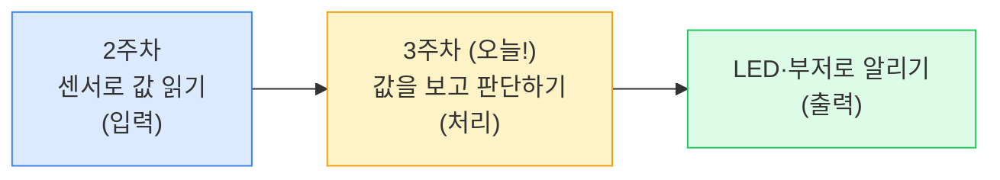
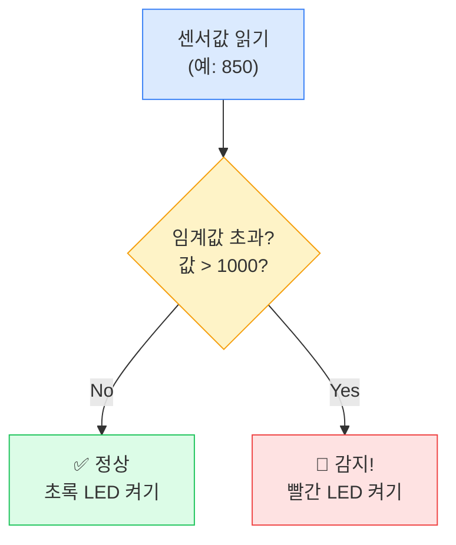
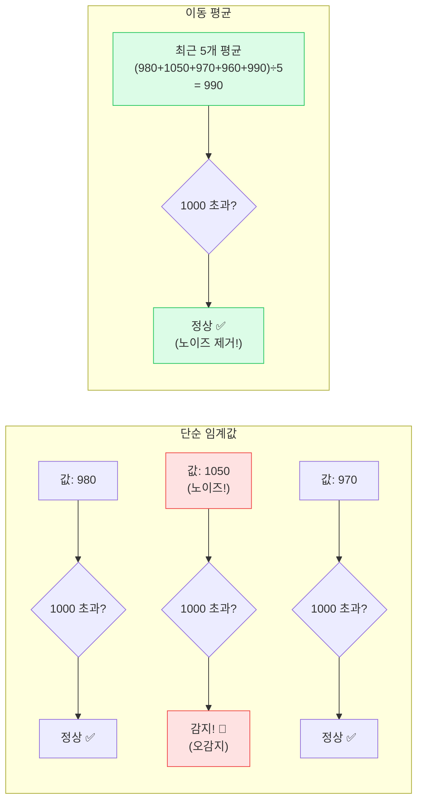
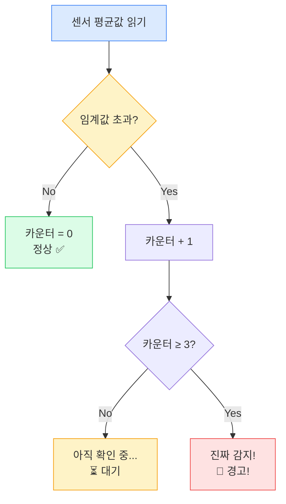
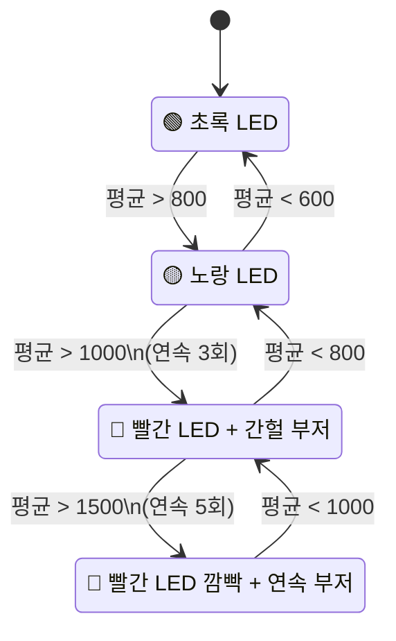
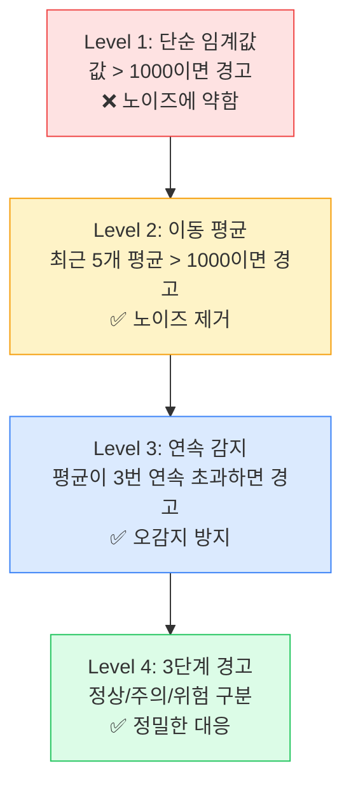
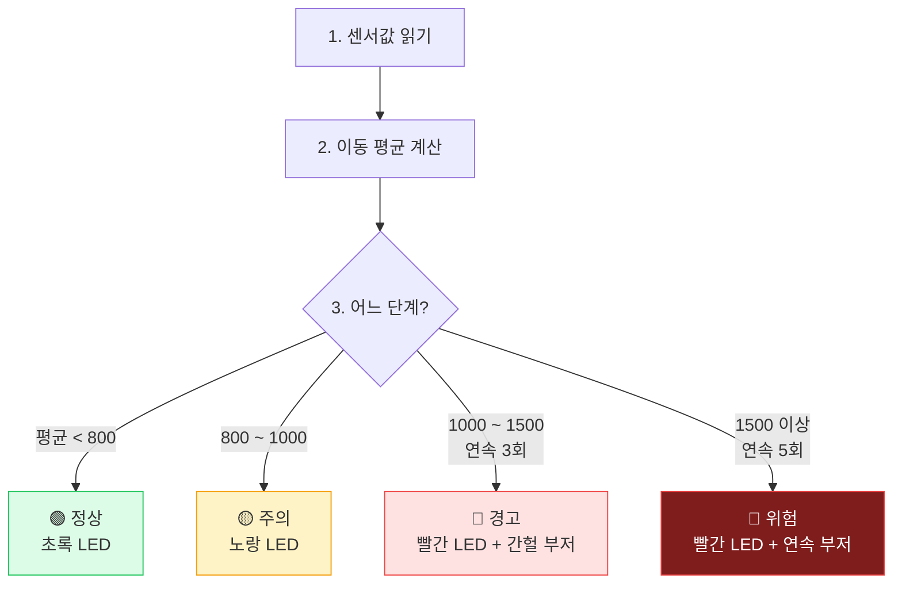
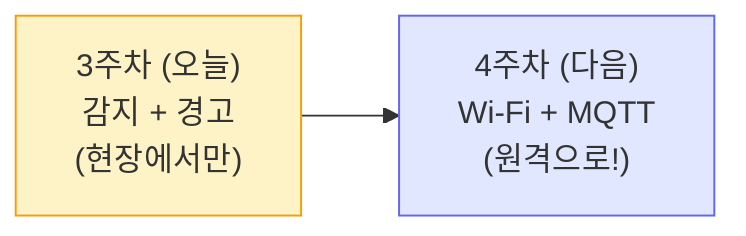

# 3주차: 판단 로직 — 전자담배 감지 알고리즘과 경고 시스템

## 기본 정보

| 항목 | 내용 |
|------|------|
| 주제 | 임계값 판단, 이동 평균, 연속 감지 알고리즘, 3단계 경고 시스템 |
| 시간 | 3시간 (150분 수업 + 쉬는 시간 20분) |
| 형태 | 2인 1조 |
| 준비물 | Pico 2 WH (조별 1대), Micro USB 케이블, 브레드보드, MQ-2 가스 센서 모듈, LED 3개(빨강·노랑·초록), 220Ω 저항 3개, 패시브 부저 모듈 1개, 점퍼 와이어 M-M 12개, 노트북 (조별 1대, Thonny 사전 설치) |

## 학습목표

1. 임계값(Threshold)의 개념을 이해하고, 센서값에 기반한 조건 판단 코드를 작성할 수 있다.
2. 단순 임계값 판단의 한계를 인식하고, 이동 평균과 연속 감지로 오감지를 줄이는 알고리즘을 설계할 수 있다.
3. 3단계 경고 시스템(정상/주의/위험)을 LED와 부저로 구현할 수 있다.
4. 센서 → 판단 → 경고의 전체 흐름을 통합 코드로 완성할 수 있다.

## 타임라인

- **[1교시: 50분]** 임계값 개념 & 단순 판단
  - 00-10분: 2주차 복습 & 도입 질문
  - 10-25분: 임계값 개념 설명 & 첫 판단 코드
  - 25-40분: LED 경고 연결 & 실습
  - 40-50분: 단순 임계값의 한계 토의
- **[쉬는 시간: 10분]**
- **[2교시: 50분]** 스마트한 감지 알고리즘
  - 00-15분: 이동 평균(Moving Average) 개념 & 코드
  - 15-30분: 연속 감지(Consecutive Detection) 구현
  - 30-45분: 부저 추가 & 3단계 경고 시스템
  - 45-50분: 중간 정리 & 질의응답
- **[쉬는 시간: 10분]**
- **[3교시: 50분]** 통합 코드 & 정리
  - 00-10분: 전체 회로 연결 (MQ-2 + LED 3개 + 부저)
  - 10-30분: 통합 코드 작성 & 테스트
  - 30-40분: 도전과제 & 자유 실험
  - 40-50분: 오늘 배운 것 정리 & 다음 주 예고

---

## 상세 수업 진행

---

### 1교시: 임계값 개념 & 단순 판단

---

#### 도입 — 2주차 복습 & 질문 (00-10분)

**[강의 스크립트]**

선생님: "안녕하세요, 여러분! 지난 주에 뭘 했는지 기억나요?"

학생 A: "MQ-2 센서 연결해서 값 읽었어요."

선생님: "맞아요! MQ-2 센서를 Pico에 연결해서 공기 중 가스 농도를 숫자로 읽었죠. 기본값이 얼마 정도였는지 기억나는 사람?"

학생 B: "깨끗한 공기에서 200~300 정도요."

선생님: "정확해요! 깨끗한 공기에서는 200~400 사이, 가스가 있으면 숫자가 확 올라갔었죠."

선생님: "그런데 지난 주에 우리가 한 건 센서값을 '읽기만' 한 거였어요. 숫자가 올라가는 걸 눈으로 봤지만, Pico가 혼자서 '아, 위험하다!' 하고 판단하지는 못했죠. 오늘의 핵심 질문은 이거예요."

(칠판에 크게 쓰며)

선생님: "**'값이 높으면, 어떻게 할까?'** — 이게 오늘 수업의 전부예요."



선생님: "지난 주까지는 '입력'만 했어요. 오늘은 가운데 '처리'와 오른쪽 '출력'을 만들 거예요. 이 세 가지가 합쳐지면 진짜 감지 시스템이 되는 거죠."

---

#### 임계값 개념 설명 & 첫 판단 코드 (10-25분)

**[강의 스크립트]**

선생님: "자, '값이 높으면 경고한다'에서 핵심은 '얼마나 높으면?'이에요. 이걸 정하는 숫자를 **임계값(Threshold)**이라고 해요."

선생님: "일상에서도 임계값을 많이 써요. 예를 들어볼게요."

선생님: "교실 온도가 몇 도 이상이면 에어컨을 켜나요?"

학생 C: "28도요?"

학생 D: "30도!"

선생님: "맞아요. '30도가 넘으면 에어컨 ON' — 여기서 30도가 임계값이에요. 스마트폰 배터리가 몇 퍼센트 이하면 저전력 모드 켜지죠?"

학생 E: "20%요!"

선생님: "네. '20% 이하면 저전력 모드' — 20%가 임계값이에요. 우리 센서도 똑같아요. '센서값이 ○○ 이상이면 전자담배 감지!' 이 ○○을 정하는 거예요."



선생님: "이걸 코드로 쓰면 아주 간단해요. 바로 **if문**이에요."

**[코드: step1_단순_임계값.py]**

```python
# ============================================
# step1_단순_임계값.py
# 센서값이 임계값을 넘으면 경고 메시지 출력
# ============================================

# === 무엇을 하는 코드인지 (WHAT) ===
# MQ-2 센서값을 읽어서 임계값(1000)을 넘으면 "감지!" 출력

# --- 왜 필요한지 (WHY) ---
# 센서값을 사람이 눈으로 보는 게 아니라
# Pico가 스스로 "위험한지 아닌지" 판단하게 만드는 첫 단계예요

from machine import Pin, ADC
import time

# MQ-2 센서 (GP26 = ADC0)
sensor = ADC(26)

# 임계값 설정 — 이 숫자를 기준으로 판단해요
THRESHOLD = 1000

print("=== 단순 임계값 감지 시작 ===")
print(f"임계값: {THRESHOLD}")
print()

while True:
    # 센서값 읽기 (0 ~ 65535)
    value = sensor.read_u16()

    if value > THRESHOLD:
        # 임계값 초과 → 감지!
        print(f"🚨 감지! 센서값: {value} (임계값 {THRESHOLD} 초과)")
    else:
        # 정상 범위
        print(f"✅ 정상. 센서값: {value}")

    time.sleep(1)  # 1초마다 확인
```

선생님: "실행해보세요. Shell에 센서값이 1초마다 뜨죠? 깨끗한 공기에서는 계속 '정상'이 나올 거예요."

선생님: "이제 라이터 가스나 알코올 솜을 센서 가까이 가져가 보세요. 숫자가 확 올라가면서 '감지!'가 뜰 거예요."

(학생들 실험)

학생 F: "와, 진짜 숫자가 확 올라가요!"

학생 G: "근데 1000이 맞는 숫자예요? 왜 1000이에요?"

선생님: "아주 좋은 질문! 사실 1000은 대략적인 값이에요. 센서마다 조금씩 달라요. 여러분이 직접 실험해서 '이 정도면 위험하다'는 값을 찾아야 해요. 이걸 **캘리브레이션(보정)**이라고 해요. 지금은 일단 1000으로 시작하는 거예요."

---

#### LED 경고 연결 & 실습 (25-40분)

**[강의 스크립트]**

선생님: "Shell에 글자만 나오는 건 좀 심심하죠? 진짜 경고등을 만들어봐요. 지난 주까지 쓰던 빨간 LED를 다시 연결하세요."

<div class="hw-diagram" data-type="connection"
     data-title="MQ-2 + 빨간 LED 경고 회로"
     data-connections='[
       {"from":"GP26 (ADC0)","to":"MQ-2 센서 AO (아날로그 출력)","color":"#f59e0b"},
       {"from":"3V3","to":"MQ-2 센서 VCC","color":"#ef4444"},
       {"from":"GND","to":"MQ-2 센서 GND","color":"#6b7280"},
       {"from":"GP15","to":"220Ω 저항","then":"빨간 LED (+, 긴 다리)","color":"#ef4444"},
       {"from":"GND","to":"빨간 LED (-, 짧은 다리)","color":"#6b7280"}
     ]'
     data-notes='["2주차 MQ-2 연결은 그대로 유지하고, 빨간 LED만 추가하면 돼요","GND는 센서와 LED가 공유해요 — 브레드보드 GND 레일 활용"]'>
</div>

선생님: "회로 연결됐으면 이 코드를 입력하세요."

**[코드: step2_임계값_led_경고.py]**

```python
# ============================================
# step2_임계값_led_경고.py
# 센서값이 임계값을 넘으면 빨간 LED로 경고
# ============================================

# === 무엇을 하는 코드인지 (WHAT) ===
# MQ-2 센서값 > 임계값이면 빨간 LED ON,
# 아니면 LED OFF

# --- 왜 필요한지 (WHY) ---
# Shell 메시지는 컴퓨터 화면을 봐야 알 수 있지만
# LED는 멀리서도 눈에 보여요 — 실제 경고등의 원리!

from machine import Pin, ADC
import time

sensor = ADC(26)              # MQ-2 센서
red_led = Pin(15, Pin.OUT)    # 빨간 LED (경고용)

THRESHOLD = 1000              # 임계값

print("=== LED 경고 시스템 작동 ===")

while True:
    value = sensor.read_u16()

    if value > THRESHOLD:
        red_led.on()           # 빨간불 ON
        print(f"🚨 경고! 센서값: {value}")
    else:
        red_led.off()          # 빨간불 OFF
        print(f"✅ 정상. 센서값: {value}")

    time.sleep(0.5)            # 0.5초마다 확인 (더 빠르게 반응)
```

선생님: "실행하고 센서 근처에 라이터 가스를 가져가 보세요. 빨간불이 켜지죠?"

(학생들 실험)

학생 A: "오~ 진짜 켜진다! 빨간불!"

학생 B: "가스 치우니까 다시 꺼져요!"

선생님: "바로 이거예요! 센서가 읽고 → Pico가 판단하고 → LED가 알려주는 거. 이게 '감지 시스템'의 기본이에요."

---

#### 단순 임계값의 한계 토의 (40-50분)

**[강의 스크립트]**

선생님: "그런데 이 시스템, 완벽할까요? 짝이랑 1분 동안 '이 시스템이 실수할 수 있는 상황'을 생각해보세요."

(1분 토의)

선생님: "어떤 상황이 나왔어요?"

학생 C: "급식실에서 음식 냄새가 나면 반응할 것 같아요."

학생 D: "향수 뿌리면요?"

학생 E: "손 소독제 알코올에도 반응하지 않아요?"

선생님: "전부 맞아요! MQ-2 센서는 전자담배 증기만 감지하는 게 아니에요. 알코올, 연기, 가스 등 여러 가지에 반응해요. 이런 걸 **오감지(False Positive)**라고 해요."

선생님: "그리고 또 다른 문제가 있어요."

학생 F: "뭐예요?"

선생님: "센서값이 잠깐 튀는 경우가 있어요. 바람이 불거나 전기 신호가 흔들리면 센서값이 순간적으로 확 올라갔다가 바로 내려가요. 이걸 **노이즈(Noise)**라고 해요. 노이즈 때문에 빨간불이 1초 켜졌다 꺼지면... 진짜 전자담배인지 아닌지 모르잖아요."

선생님: "그래서 2교시에는 이런 문제를 해결하는 **스마트한 알고리즘**을 배울 거예요. 쉬는 시간에 머리 좀 식히고 옵시다!"

---

### 2교시: 스마트한 감지 알고리즘

---

#### 이동 평균 개념 & 코드 (00-15분)

**[강의 스크립트]**

선생님: "1교시에서 문제점 두 가지를 발견했죠? 오감지와 노이즈. 이걸 해결하는 첫 번째 방법이 **이동 평균(Moving Average)**이에요."

선생님: "이동 평균이 뭔지 일상 예시로 설명할게요. 여러분 시험 성적을 생각해보세요. 한 번 시험을 잘 봤다고 실력이 갑자기 오른 걸까요?"

학생 A: "아뇨, 찍었을 수도 있죠."

선생님: "(웃으며) 맞아요! 그래서 보통 '최근 3번 시험의 평균'을 보면 실력을 더 정확하게 알 수 있어요. 이게 이동 평균이에요."



선생님: "왼쪽을 보세요. 단순 임계값은 한 번 1050이 나오면 바로 '감지!'라고 해요. 하지만 오른쪽처럼 최근 5개의 평균을 내면 990이라서 '정상'이에요. 노이즈 하나에 속지 않는 거죠."

**[코드: step3_이동_평균.py]**

```python
# ============================================
# step3_이동_평균.py
# 이동 평균으로 노이즈를 줄여서 판단하기
# ============================================

# === 무엇을 하는 코드인지 (WHAT) ===
# 센서값을 5개씩 모아서 평균을 내고, 그 평균으로 판단해요

# --- 왜 필요한지 (WHY) ---
# 순간적인 노이즈(튀는 값)에 속지 않으려고!
# 한 번 높은 값이 나와도 평균은 크게 안 변해요

from machine import Pin, ADC
import time

sensor = ADC(26)
red_led = Pin(15, Pin.OUT)

THRESHOLD = 1000
WINDOW_SIZE = 5  # 최근 5개의 값을 평균

# 최근 값을 저장할 리스트 (처음엔 비어 있음)
readings = []

print("=== 이동 평균 감지 시작 ===")
print(f"윈도우 크기: {WINDOW_SIZE}, 임계값: {THRESHOLD}")
print()

while True:
    value = sensor.read_u16()

    # 리스트에 새 값 추가
    readings.append(value)

    # 리스트가 WINDOW_SIZE보다 크면, 가장 오래된 값 제거
    if len(readings) > WINDOW_SIZE:
        readings.pop(0)  # 맨 앞(가장 오래된) 값 삭제

    # 평균 계산
    average = sum(readings) / len(readings)

    if average > THRESHOLD:
        red_led.on()
        print(f"🚨 감지! 평균: {average:.0f} (원본: {value})")
    else:
        red_led.off()
        print(f"✅ 정상. 평균: {average:.0f} (원본: {value})")

    time.sleep(0.5)
```

선생님: "실행해보세요. 이번에는 센서 근처에 잠깐 가스를 가져갔다 치워보세요. 아까보다 LED가 덜 민감하게 반응하죠?"

학생 B: "아까는 바로 켜졌는데, 이번엔 좀 늦게 켜져요."

선생님: "맞아요. 평균을 내니까 반응이 조금 느려지지만, 대신 노이즈에 속지 않아요. 이게 바로 **정확도와 반응 속도의 트레이드오프(Trade-off)**예요. 이건 엔지니어링에서 늘 고민하는 문제예요."

**[예상 Q&A]**

- **Q**: "readings.pop(0)이 뭐예요?"
- **A**: "리스트에서 맨 앞의 값을 꺼내서 버리는 거예요. 새로운 값이 들어오면 가장 오래된 값을 빼는 거죠. '최근 5개만 유지'하려면 오래된 걸 빼야 하니까요."

- **Q**: "WINDOW_SIZE를 10으로 바꾸면 어떻게 돼요?"
- **A**: "더 많은 값의 평균을 내니까 더 안정적이에요. 대신 반응이 더 느려져요. 5가 보통 적당한 값이에요."

---

#### 연속 감지 구현 (15-30분)

**[강의 스크립트]**

선생님: "이동 평균으로 노이즈는 해결했어요. 그런데 또 하나 문제가 있어요. 급식실에서 고기 구울 때 MQ-2 센서값이 오를 수 있다고 했죠? 이러면 이동 평균으로도 감지돼버려요."

선생님: "그래서 두 번째 방법을 추가할 거예요. **연속 감지**예요."

선생님: "쉽게 말하면 이거예요. '한 번 높다고 바로 경고하지 말고, 연속으로 3번 이상 높으면 그때 경고해라!' 잠깐 높았다 내려가면 음식 냄새일 가능성이 높고, 계속 높으면 진짜 전자담배일 가능성이 높으니까요."



선생님: "카운터라는 숫자를 하나 만들어서, 임계값을 넘을 때마다 1씩 올려요. 3번 연속으로 넘으면 '진짜 감지!'라고 판단하고, 중간에 정상으로 돌아오면 카운터를 0으로 초기화하는 거예요."

**[코드: step4_연속_감지.py]**

```python
# ============================================
# step4_연속_감지.py
# 이동 평균 + 연속 감지로 오감지 줄이기
# ============================================

# === 무엇을 하는 코드인지 (WHAT) ===
# 평균값이 임계값을 "연속 3번" 초과해야 경고!

# --- 왜 필요한지 (WHY) ---
# 음식 냄새처럼 잠깐 높았다 내려가는 경우를 걸러내요
# 전자담배는 일정 시간 동안 지속적으로 센서값이 높아요

from machine import Pin, ADC
import time

sensor = ADC(26)
red_led = Pin(15, Pin.OUT)

THRESHOLD = 1000
WINDOW_SIZE = 5
CONSECUTIVE_COUNT = 3  # 연속 3번 초과해야 경고

readings = []
alert_counter = 0      # 연속 초과 횟수를 세는 카운터

print("=== 연속 감지 시스템 작동 ===")
print(f"조건: 평균 > {THRESHOLD}이 {CONSECUTIVE_COUNT}번 연속이면 경고")
print()

while True:
    value = sensor.read_u16()

    # 이동 평균 계산
    readings.append(value)
    if len(readings) > WINDOW_SIZE:
        readings.pop(0)
    average = sum(readings) / len(readings)

    if average > THRESHOLD:
        alert_counter += 1  # 카운터 증가
        if alert_counter >= CONSECUTIVE_COUNT:
            red_led.on()
            print(f"🚨 확정 감지! 평균: {average:.0f} (연속 {alert_counter}회)")
        else:
            red_led.off()
            print(f"⏳ 확인 중... 평균: {average:.0f} (연속 {alert_counter}회)")
    else:
        alert_counter = 0   # 정상이면 카운터 초기화!
        red_led.off()
        print(f"✅ 정상. 평균: {average:.0f}")

    time.sleep(0.5)
```

선생님: "실행해보세요. 이번에는 센서 근처에 잠깐만 가스를 가져갔다 치우면 '확인 중...'만 나오고 경고는 안 뜰 거예요. 계속 가까이 두면 그때 '확정 감지!'가 나와요."

**[수업 장면: 알고리즘의 위력]**

민지와 태현이 조가 step4를 테스트하고 있다.

민지: "잠깐 가스 가져다 대면 '확인 중'이라고 나와!"

태현: "진짜? 아까는 바로 빨간불이었는데."

민지: "계속 대고 있으면... 하나, 둘, 셋 — 빨간불 켜졌다!"

태현: "오~ 연속 3번이 넘어야 되는 거구나. 진짜 스마트하다."

선생님이 지나가며: "그게 바로 알고리즘이에요! 같은 센서, 같은 LED인데, 코드 몇 줄 바꿨을 뿐인데 훨씬 똑똑해졌죠?"

---

#### 부저 & 3단계 경고 시스템 (30-45분)

**[강의 스크립트]**

선생님: "이제 경고를 더 강력하게 만들어볼게요. 두 가지를 추가합니다."

선생님: "첫 번째, **부저(Buzzer)**! LED는 눈으로 봐야 하지만, 부저는 소리로 알려주니까 더 확실하죠. 화재 경보기도 소리가 나잖아요."

<div class="hw-diagram" data-type="sensor-module"
     data-name="패시브 부저 모듈"
     data-specs='{"작동 전압":"3.3V~5V","타입":"패시브 (주파수로 음 조절 가능)","핀":"VCC, GND, Signal"}'
     data-notes='["패시브 부저는 PWM 신호로 다양한 음을 낼 수 있어요","액티브 부저는 전원만 주면 한 가지 소리만 나요","이 프로젝트에서는 패시브 부저를 사용해요"]'>
</div>

선생님: "두 번째, **3단계 경고 시스템**이에요. 실제 재난 경보도 '관심 → 주의 → 경고 → 위험' 이렇게 단계가 있잖아요? 우리도 만들어볼 거예요."



선생님: "정상이면 초록 LED, 좀 의심스러우면 노랑 LED, 위험하면 빨간 LED에 부저까지! 이게 완성 시스템이에요."

선생님: "먼저 부저를 연결하고 소리부터 테스트해봅시다."

**[코드: step5_부저_테스트.py]**

```python
# ============================================
# step5_부저_테스트.py
# 패시브 부저로 경고음 만들기
# ============================================

# === 무엇을 하는 코드인지 (WHAT) ===
# PWM(펄스 폭 변조)으로 부저에서 소리를 내요

# --- 왜 필요한지 (WHY) ---
# LED는 눈으로 봐야 하지만, 소리는 어디서든 들려요
# 실제 경보 시스템에는 소리가 필수!

from machine import Pin, PWM
import time

# GP17에 부저 연결 (PWM으로 제어)
buzzer = PWM(Pin(17))

# 경고음 테스트: "삐-삐-삐" 3번
print("부저 테스트 시작!")

for i in range(3):
    buzzer.freq(1000)      # 1000Hz = '삐' 소리
    buzzer.duty_u16(32768) # 음량 50% (0~65535)
    print(f"삐~ ({i+1}/3)")
    time.sleep(0.3)        # 0.3초 울림

    buzzer.duty_u16(0)     # 소리 끄기
    time.sleep(0.2)        # 0.2초 쉬기

buzzer.deinit()            # PWM 해제 (깔끔하게 정리)
print("부저 테스트 완료!")
```

선생님: "실행해보세요. '삐-삐-삐' 소리가 나죠?"

(학생들 실행 — 교실에서 부저 소리가 울림)

학생 C: "헐, 진짜 경보기 같아요!"

학생 D: "freq 숫자를 바꾸면 소리가 달라져요?"

선생님: "그렇죠! freq는 주파수예요. 숫자가 높으면 높은 음, 낮으면 낮은 음이에요. 500으로 바꿔보세요."

학생 D: "(바꿔서 실행) 오, 낮아졌다!"

선생님: "2000으로 바꿔보면?"

학생 D: "귀가 아파요! 엄청 높아요!"

선생님: "경고음은 1000~2000Hz가 적당해요. 사람이 가장 잘 듣는 주파수거든요."

**[예상 Q&A]**

- **Q**: "PWM이 뭐예요?"
- **A**: "Pulse Width Modulation, '펄스 폭 변조'예요. 전기 신호를 아주 빠르게 켰다 껐다 하면 소리가 나는 원리예요. 주파수(freq)를 바꾸면 음높이가 달라지고, duty를 바꾸면 음량이 달라져요."

- **Q**: "duty_u16(32768)에서 32768은 뭐예요?"
- **A**: "최대값 65535의 절반이에요. 50% 세기라는 뜻이에요. 0이면 소리 없음, 65535면 최대 세기예요."

- **Q**: "deinit()은 왜 해요?"
- **A**: "PWM을 깔끔하게 정리하는 거예요. 안 하면 프로그램이 끝나도 부저가 계속 울릴 수 있어요."

---

#### 중간 정리 & 질의응답 (45-50분)

**[강의 스크립트]**

선생님: "2교시에 배운 걸 정리해볼게요. 우리가 센서 판단을 어떻게 개선했는지 봅시다."



선생님: "같은 센서인데 알고리즘만 바꿨을 뿐이에요. 이게 프로그래밍의 힘이에요. 하드웨어를 바꾸지 않아도 소프트웨어로 성능을 개선할 수 있어요."

선생님: "질문 있는 사람?"

(질의응답)

선생님: "좋아요, 쉬는 시간 후에 지금까지 배운 것을 전부 합쳐서 완성 코드를 만들 거예요!"

---

### 3교시: 통합 코드 & 정리

---

#### 전체 회로 연결 (00-10분)

**[강의 스크립트]**

선생님: "자, 이제 전부 합치는 시간이에요! MQ-2 센서, LED 3개, 부저까지 전부 연결합시다."

선생님: "LED가 3개로 늘어났어요. 초록(정상), 노랑(주의), 빨강(위험). 각각 다른 GPIO 핀에 연결합니다."

<div class="hw-diagram" data-type="connection"
     data-title="3주차 완성 회로: MQ-2 + LED 3개 + 부저"
     data-connections='[
       {"from":"GP26 (ADC0)","to":"MQ-2 센서 AO","color":"#f59e0b"},
       {"from":"3V3","to":"MQ-2 센서 VCC","color":"#ef4444"},
       {"from":"GND","to":"MQ-2 센서 GND","color":"#6b7280"},
       {"from":"GP13","to":"220Ω 저항","then":"초록 LED (+)","color":"#22c55e"},
       {"from":"GP14","to":"220Ω 저항","then":"노랑 LED (+)","color":"#eab308"},
       {"from":"GP15","to":"220Ω 저항","then":"빨간 LED (+)","color":"#ef4444"},
       {"from":"GP17","to":"부저 Signal","color":"#8b5cf6"},
       {"from":"3V3","to":"부저 VCC","color":"#ef4444"},
       {"from":"GND","to":"모든 LED (-) + 부저 GND","color":"#6b7280"}
     ]'
     data-notes='["LED 3개는 GP13(초록), GP14(노랑), GP15(빨강) — 나란히 꽂으면 보기 좋아요","부저는 GP17에 Signal선 연결 — PWM으로 제어","GND는 모두 공유: 브레드보드 GND 레일에 한 번에 연결"]'>
</div>

선생님: "핀 번호를 정리해볼게요."

| 부품 | GPIO 핀 | 역할 |
|------|---------|------|
| MQ-2 센서 (AO) | GP26 (ADC0) | 가스 농도 읽기 |
| 초록 LED | GP13 | 정상 표시 |
| 노랑 LED | GP14 | 주의 표시 |
| 빨간 LED | GP15 | 위험 표시 |
| 부저 (Signal) | GP17 | 경고음 |

선생님: "짝이랑 역할 분담하세요. 한 명이 회로 연결, 한 명이 회로도 보면서 체크. 5분 안에 끝내봐요."

(학생들 회로 연결 — 선생님 순회하며 확인)

**[수업 장면: 배선의 어려움]**

수빈이와 현우 조가 배선 중이다.

수빈: "선이 너무 많아... 어디가 어디인지 헷갈려."

현우: "색깔별로 정리하자. 빨간 선은 전원, 검정 선은 GND, 나머지는 신호."

선생님이 지나가며: "좋은 습관이에요! 실제 전자회로에서도 선 색깔을 통일하는 게 중요해요. 빨강=전원, 검정=GND는 업계 표준이에요."

현우: "선생님, 노랑 LED가 없는데요?"

선생님: "노랑 LED 대신 빨강이랑 초록을 같이 켜도 비슷한 색이 나와요. 아니면 그냥 다른 색 LED 아무거나 써도 돼요. 중요한 건 '3단계로 구분된다'는 거니까요."

---

#### 통합 코드 작성 & 테스트 (10-30분)

**[강의 스크립트]**

선생님: "회로 준비됐죠? 이제 오늘의 최종 보스! 모든 걸 합친 통합 코드를 만듭시다."

선생님: "이 코드가 좀 길어요. 하지만 앞에서 배운 것들을 합친 것뿐이에요. 천천히 따라 치세요."

**[코드: step6_통합_경고_시스템.py]**

```python
# ============================================
# step6_통합_경고_시스템.py
# 전자담배 감지 알고리즘 + 3단계 경고 시스템
# ============================================

# === 무엇을 하는 코드인지 (WHAT) ===
# MQ-2 센서 → 이동 평균 → 연속 감지 → 3단계 LED/부저 경고
# 이게 우리 프로젝트의 "두뇌"예요!

# --- 왜 필요한지 (WHY) ---
# 지금까지 배운 모든 기법을 합쳐서
# 실제로 쓸 수 있는 감지 시스템을 완성하는 거예요

from machine import Pin, ADC, PWM
import time

# ===== 하드웨어 설정 =====
sensor = ADC(26)                  # MQ-2 가스 센서

green_led = Pin(13, Pin.OUT)      # 초록 LED (정상)
yellow_led = Pin(14, Pin.OUT)     # 노랑 LED (주의)
red_led = Pin(15, Pin.OUT)        # 빨간 LED (위험)

buzzer = PWM(Pin(17))             # 부저
buzzer.duty_u16(0)                # 처음엔 소리 끄기

# ===== 알고리즘 설정 =====
THRESHOLD_CAUTION = 800           # 주의 임계값
THRESHOLD_WARNING = 1000          # 경고 임계값
THRESHOLD_DANGER = 1500           # 위험 임계값

WINDOW_SIZE = 5                   # 이동 평균 윈도우
CONSECUTIVE_NEEDED = 3            # 연속 감지 필요 횟수

# ===== 상태 변수 =====
readings = []                     # 이동 평균용 리스트
alert_counter = 0                 # 연속 감지 카운터
current_level = "정상"            # 현재 경고 단계

# ===== LED 제어 함수 =====
def set_leds(green, yellow, red):
    """LED를 한 번에 제어하는 함수"""
    green_led.value(green)
    yellow_led.value(yellow)
    red_led.value(red)

# ===== 부저 제어 함수 =====
def beep(freq=1000, duration=0.1):
    """짧은 경고음"""
    buzzer.freq(freq)
    buzzer.duty_u16(32768)
    time.sleep(duration)
    buzzer.duty_u16(0)

# ===== 시작 알림 =====
print("=" * 40)
print("  전자담배 감지 시스템 v1.0")
print("  3단계 경고: 정상 → 주의 → 위험")
print("=" * 40)
print()

# 시작음: 짧게 2번
beep(1500, 0.1)
time.sleep(0.1)
beep(1500, 0.1)

# ===== 메인 루프 =====
try:
    while True:
        # 1. 센서값 읽기
        value = sensor.read_u16()

        # 2. 이동 평균 계산
        readings.append(value)
        if len(readings) > WINDOW_SIZE:
            readings.pop(0)
        average = sum(readings) / len(readings)

        # 3. 경고 단계 판단
        if average > THRESHOLD_DANGER:
            alert_counter += 1
            if alert_counter >= CONSECUTIVE_NEEDED + 2:
                # 위험! (연속 5번 이상)
                current_level = "위험"
                set_leds(0, 0, 1)           # 빨간불만
                beep(2000, 0.15)            # 높은 경고음
                print(f"🔴 [위험] 평균: {average:.0f} | 연속: {alert_counter}회")
            else:
                current_level = "경고"
                set_leds(0, 0, 1)
                print(f"🔴 [경고] 평균: {average:.0f} | 연속: {alert_counter}회")

        elif average > THRESHOLD_WARNING:
            alert_counter += 1
            if alert_counter >= CONSECUTIVE_NEEDED:
                # 경고! (연속 3번 이상)
                current_level = "경고"
                set_leds(0, 0, 1)           # 빨간불
                if alert_counter % 2 == 0:  # 2번에 1번 부저
                    beep(1000, 0.1)
                print(f"🔴 [경고] 평균: {average:.0f} | 연속: {alert_counter}회")
            else:
                current_level = "확인 중"
                set_leds(0, 1, 0)           # 노란불
                print(f"🟡 [확인 중] 평균: {average:.0f} | 연속: {alert_counter}회")

        elif average > THRESHOLD_CAUTION:
            # 주의 (연속 감지 불필요, 바로 노란불)
            alert_counter = max(alert_counter - 1, 0)  # 천천히 감소
            current_level = "주의"
            set_leds(0, 1, 0)               # 노란불
            print(f"🟡 [주의] 평균: {average:.0f}")

        else:
            # 정상
            alert_counter = 0               # 카운터 초기화
            current_level = "정상"
            set_leds(1, 0, 0)               # 초록불
            print(f"🟢 [정상] 평균: {average:.0f}")

        time.sleep(0.5)

except KeyboardInterrupt:
    # Ctrl+C로 멈추면 깔끔하게 정리
    set_leds(0, 0, 0)       # 모든 LED 끄기
    buzzer.deinit()          # 부저 해제
    print("\n시스템 종료.")
```

선생님: "코드가 좀 길죠? 하지만 구조를 보면 이래요."



선생님: "실행해봐요!"

(학생들 실행)

선생님: "깨끗한 공기에서는 초록불이 켜져 있죠? 이제 센서 근처에 가스를 천천히 가져가 보세요. 초록 → 노랑 → 빨강으로 변하는 걸 관찰해보세요."

학생 A: "오~ 노란불로 바뀌었어요!"

학생 B: "계속 대고 있으니까 빨간불이... 삐! 소리도 나요!"

학생 C: "와 진짜 감지기다! 진짜 경보기 같아요!"

선생님: "가스를 치우면 어떻게 되는지도 봐보세요."

학생 A: "빨간불에서 노란불로... 초록불로 돌아왔어요!"

선생님: "바로 그거예요! 상태가 자연스럽게 전환되죠. 이게 **상태 머신(State Machine)**이라는 개념이에요. 컴퓨터 과학에서 아주 중요한 개념인데, 여러분이 방금 직접 만든 거예요."

**[수업 장면: 코드 이해]**

지원이와 예은이가 코드를 분석하고 있다.

지원: "try랑 except KeyboardInterrupt가 뭐야?"

예은: "Ctrl+C 눌렀을 때 깔끔하게 끝나게 하는 거 아닐까?"

선생님이 듣고: "정확해요! try는 '이 코드를 실행해봐', except는 '만약 Ctrl+C를 누르면 이걸 해'라는 뜻이에요. 이게 없으면 멈출 때 부저가 계속 울리거나 LED가 켜져 있을 수 있어요."

지원: "아~ 뒷정리 코드구나."

선생님: "맞아요. 프로도 항상 이렇게 '종료 처리'를 해요. 좋은 습관이에요."

---

#### 도전과제 & 자유 실험 (30-40분)

**[강의 스크립트]**

선생님: "남은 시간은 자유 실험이에요. 도전과제 중에 하나를 골라보세요."

**도전과제**

- **⭐ Level 1: 임계값 조정 실험** — THRESHOLD_CAUTION, THRESHOLD_WARNING, THRESHOLD_DANGER 값을 바꿔보세요. 어떤 값이 가장 적절한지 실험으로 찾아보세요. 결과를 표로 정리하면 보너스!

- **⭐⭐ Level 2: 커스텀 경고음 만들기** — 위험 단계에서 '삐-삐-삐' 대신 '삐삐삐삐삐'(빠른 연속음) 또는 사이렌 소리(주파수를 점점 올리기)를 만들어보세요. 힌트: `for freq in range(500, 2000, 100):`

- **⭐⭐⭐ Level 3: 데이터 로깅 추가** — 센서값과 경고 단계를 리스트에 저장해서, 프로그램 종료 시 최대값·최소값·평균값·경고 발생 횟수를 출력하세요. 나중에 분석에 쓸 수 있어요!

**[도전과제 Level 2 예시 답안 — 교사용]**

```python
# Level 2: 사이렌 효과
def siren():
    """사이렌처럼 주파수를 올렸다 내리는 효과"""
    for freq in range(500, 2000, 50):
        buzzer.freq(freq)
        buzzer.duty_u16(32768)
        time.sleep(0.02)
    for freq in range(2000, 500, -50):
        buzzer.freq(freq)
        buzzer.duty_u16(32768)
        time.sleep(0.02)
    buzzer.duty_u16(0)
```

선생님: "Level 1부터 시도해보고, 되면 다음 단계로 넘어가세요!"

**[수업 장면: 도전과제 탐구]**

서준이와 다은이가 Level 2에 도전하고 있다.

서준: "사이렌 소리 만들고 싶은데, range에서 50씩 올리면 되려나?"

다은: "한번 해보자. for freq in range(500, 2000, 50)..."

(실행하자 점점 높아지는 소리가 남)

서준: "오! 근데 올라가기만 하잖아. 내려가는 것도 만들어야 진짜 사이렌 같지 않아?"

다은: "range를 거꾸로 하면 되지 않을까? range(2000, 500, -50)?"

(수정 후 실행 — 실제 사이렌처럼 울림)

서준: "헐, 진짜 사이렌 같다!"

---

#### 오늘 배운 것 정리 & 다음 주 예고 (40-50분)

**[강의 스크립트]**

선생님: "자, 오늘 수업 정리해볼게요. 오늘 정말 많이 배웠어요. 짝이랑 번갈아가면서 대답해보세요."

선생님: "첫 번째 질문. 임계값이 뭐죠?"

학생들: "기준 값이요! 이거 넘으면 경고!"

선생님: "두 번째. 단순 임계값의 문제점 두 가지는?"

학생들: "노이즈! 오감지!"

선생님: "세 번째. 노이즈를 줄이는 방법은?"

학생들: "이동 평균!"

선생님: "네 번째. 오감지를 줄이는 방법은?"

학생들: "연속 감지!"

선생님: "완벽해요!"

**오늘 배운 것 정리**

- 임계값(Threshold) 개념 → if문으로 판단
- 단순 임계값의 한계 → 노이즈, 오감지 문제
- 이동 평균(Moving Average) → 최근 N개 값의 평균으로 안정적 판단
- 연속 감지(Consecutive Detection) → N번 연속 초과 시에만 경고
- 부저 제어 → PWM으로 주파수와 음량 조절
- 3단계 경고 시스템 → 정상(초록)/주의(노랑)/위험(빨강+부저)
- try/except로 종료 처리 → 깔끔한 프로그램 마무리
- **핵심 키워드**: Threshold, Moving Average, Consecutive Detection, PWM, State Machine

**[다음 주 예고]**

선생님: "지금까지 우리가 만든 시스템은 '현장'에서만 작동해요. 센서 바로 옆에 있어야 LED를 보고 부저 소리를 들을 수 있죠. 그런데 선생님이 항상 화장실 옆에 서 있을 수는 없잖아요?"

학생: "그러면 어떻게 해요?"

선생님: "다음 주에는 **Wi-Fi**를 연결합니다! Pico 2 WH의 W가 Wi-Fi의 W였죠? 감지 결과를 인터넷으로 보내서 교무실에서도 확인할 수 있게 만들 거예요."

선생님: "**MQTT**라는 프로토콜을 써서, Pico가 '여기서 전자담배 감지됐어요!' 라는 메시지를 보내면, 어디서든 받아볼 수 있어요. IoT(사물인터넷)의 핵심이에요."



선생님: "오늘 만든 감지 알고리즘이 '두뇌'라면, 다음 주에 만들 Wi-Fi는 '입'이에요. 감지했다는 걸 멀리 있는 사람한테 말해주는 거죠. 기대되죠?"

학생들: "네!"

선생님: "마지막으로, 오늘 실험하면서 찾은 임계값 (THRESHOLD 값)을 노트에 꼭 적어두세요. 다음 주에 그 값을 그대로 쓸 거예요."

---

## 예상 Q&A

- **Q**: "임계값을 몇으로 설정해야 정확해요?"
- **A**: "환경마다 달라요. 깨끗한 공기에서 센서값의 평균을 재고, 거기에 200~300을 더한 값이 좋은 시작점이에요. 실제 현장에서 반복 실험하며 조정하는 게 가장 정확해요."

- **Q**: "이동 평균 윈도우를 크게 하면 무조건 좋은 거예요?"
- **A**: "아니에요! 윈도우가 크면 노이즈는 줄지만 반응이 느려져요. 5~10이 보통 적당해요. 용도에 따라 다르게 설정해요."

- **Q**: "전자담배 증기와 음식 냄새를 어떻게 구별해요?"
- **A**: "MQ-2 센서 하나로는 완벽하게 구별하기 어려워요. 실제 제품에서는 여러 종류의 센서를 조합하거나, AI 알고리즘을 써서 패턴을 분석해요. 우리 프로젝트에서는 연속 감지로 일시적인 냄새를 걸러내는 수준까지 해보는 거예요."

- **Q**: "부저 소리가 너무 시끄러워요. 줄일 수 있어요?"
- **A**: "duty_u16() 값을 줄이면 소리가 작아져요. 32768(50%) 대신 16384(25%)나 8192(12.5%)로 해보세요."

- **Q**: "try/except는 꼭 써야 해요?"
- **A**: "안 써도 코드는 작동해요. 하지만 쓰면 프로그램을 멈출 때 LED와 부저를 깔끔하게 끌 수 있어요. 좋은 프로그래밍 습관이에요."

- **Q**: "함수(def)를 왜 써요? 그냥 코드를 쓰면 안 돼요?"
- **A**: "함수 없이도 되지만, 같은 코드를 여러 번 쓰면 복잡해져요. `set_leds(1, 0, 0)` 한 줄이 LED 세 개를 한꺼번에 제어하니까 훨씬 깔끔하죠? 코드를 정리하는 도구가 함수예요."

- **Q**: "max() 함수가 뭐예요? `max(alert_counter - 1, 0)`에서요."
- **A**: "두 숫자 중 큰 걸 골라주는 함수예요. alert_counter - 1이 음수가 되면 안 되니까, 0보다 작아지지 않도록 max(값, 0)으로 보호하는 거예요."

- **Q**: "LED를 깜빡이게 하려면 어떻게 해요? 위험 단계에서 빨간불을 깜빡이고 싶어요."
- **A**: "지금 코드에서는 0.5초마다 루프가 도니까, 위험 단계일 때 red_led를 켰다 껐다 하면 돼요. `red_led.value(alert_counter % 2)` 이렇게 하면 홀수 번째는 켜고, 짝수 번째는 꺼져서 자동으로 깜빡여요."

---

## 수업 장면 시나리오

### 시나리오 1: 오감지 체험

1교시 step2 코드를 실행 중, 한 학생이 손 소독제를 사용하자 센서값이 급등한다.

윤서: "선생님! 저 손 소독제 발랐는데 빨간불이 켜졌어요!"

선생님: "오, 아주 좋은 발견이에요! 손 소독제에 알코올이 들어 있거든요. MQ-2는 알코올에도 반응해요."

윤서: "그러면 화장실에서 누가 손 씻고 소독제 바르면 경보가 울리는 거 아니에요?"

선생님: "바로 그게 '오감지' 문제예요. 그래서 2교시에 이동 평균과 연속 감지를 배우는 거예요. 손 소독제는 잠깐이지만, 전자담배는 계속되니까 구별할 수 있어요."

### 시나리오 2: 임계값 논쟁

step2에서 임계값을 정하는 장면.

준혁: "우리 조 센서는 기본값이 350인데, 임계값을 500으로 하면 안 돼요? 더 민감하게?"

서아: "너무 민감하면 맨날 울리잖아."

준혁: "그래도 놓치는 것보다는 낫지 않아?"

선생님: "둘 다 일리가 있어요. 이걸 보안 분야에서는 '민감도(Sensitivity) vs 특이도(Specificity)'라고 해요. 민감하게 잡으면 진짜를 놓치지는 않지만 거짓 경보가 많아지고, 느슨하게 잡으면 거짓 경보는 줄지만 진짜를 놓칠 수 있어요. 어디에 맞출지는 상황에 따라 달라요."

### 시나리오 3: 코드 디버깅

step6 통합 코드에서 부저가 멈추지 않는 문제가 발생한다.

도윤: "선생님, Ctrl+C 눌렀는데 부저가 계속 울려요!"

선생님: "혹시 try/except 부분을 빼고 코드를 작성했어요?"

도윤: "아, 그거 귀찮아서 안 썼어요..."

선생님: "그래서 그래요. try/except가 없으면 Ctrl+C로 멈출 때 '뒷정리 코드'가 실행이 안 돼요. buzzer.deinit()이 안 불린 거예요."

도윤: "그러면 어떻게 해요?"

선생님: "일단 Thonny Shell에서 이 두 줄을 직접 입력하세요. `from machine import PWM, Pin` 그 다음 `PWM(Pin(17)).deinit()` — 이러면 부저가 꺼져요."

도윤: "아, 꺼졌다! 다음부터는 try/except 꼭 쓸게요..."

### 시나리오 4: 알고리즘 확장 아이디어

도전과제 시간에 Level 3를 끝낸 조가 추가 아이디어를 논의한다.

하은: "우리 시스템이 시간대별로 다르게 반응하면 어떨까?"

시우: "무슨 뜻이야?"

하은: "점심시간에는 급식 냄새 때문에 임계값을 높이고, 수업 시간에는 낮추는 거야."

선생님이 듣고: "와, 그거 정말 좋은 아이디어예요! 실제 산업용 센서 시스템에서도 시간대별, 계절별로 임계값을 바꿔요. 이걸 '적응형 임계값(Adaptive Threshold)'이라고 해요. 5주차 대시보드에서 이런 설정을 추가할 수도 있어요."

---

## 교사용 체크리스트

- [ ] 3시간 타임라인이 현실적인가? → 1교시(임계값 개념/LED 실습) + 2교시(이동 평균/연속 감지/부저) + 3교시(통합/도전)
- [ ] 모든 코드가 복사-실행 가능한가? → step1~step6 모두 독립 실행 가능
- [ ] 초보자도 이해할 수 있는 스크립트인가? → 일상 비유(시험 점수, 에어컨), 단계적 난이도 상승
- [ ] 예상 Q&A가 5개 이상 있는가? → 총 8개
- [ ] 수업 장면 시나리오가 2개 이상 있는가? → 4개 (오감지 체험, 임계값 논쟁, 코드 디버깅, 알고리즘 확장)
- [ ] 다음 주와의 연결이 자연스러운가? → 현장 감지 → Wi-Fi 원격 전송으로 연결
- [ ] 알고리즘 발전 단계가 명확한가? → Level 1~4로 점진적 개선
- [ ] 하드웨어 회로도가 단계별로 제공되었는가? → step2(MQ-2+LED 1개), step6(MQ-2+LED 3개+부저)

## 교사용 사전 준비 메모

1. **부품 추가 확인**: 2주차까지의 부품(MQ-2, 빨강 LED, 저항) + 이번 주 추가 부품(초록 LED, 노랑 LED, 저항 2개, 패시브 부저 모듈)을 조별로 준비.
2. **노랑 LED가 없는 경우**: 다른 색 LED로 대체 가능. 코드에서 `yellow_led`라는 이름만 유지하면 됨.
3. **패시브 vs 액티브 부저**: 반드시 **패시브 부저** 사용. 액티브 부저는 PWM으로 주파수 조절이 안 됨. 패시브 부저 모듈은 보통 3핀(VCC, GND, Signal).
4. **가스 테스트 재료**: 라이터 가스 또는 알코올 솜. 안전을 위해 교사가 관리하며 소량만 사용. 환기 필수.
5. **소음 관리**: 부저 테스트 시 교실이 시끄러울 수 있음. 모든 조가 동시에 테스트하지 않도록 순서를 정하거나, duty 값을 낮춰서 소리를 줄이도록 안내.
6. **코드 길이 대비**: step6 통합 코드가 길어서 타이핑에 시간이 걸릴 수 있음. 학교 LMS나 USB로 코드 파일을 미리 배포하는 것도 고려.
7. **2주차 회로 유지**: MQ-2 센서 연결은 2주차 그대로 유지하고, LED와 부저만 추가하면 됨. 학생들에게 "기존 연결은 건드리지 마세요"라고 안내.

## 다음 시간 예고

**4주차: Wi-Fi + MQTT 통신** — Pico 2 WH의 Wi-Fi를 활성화하여 감지 결과를 네트워크로 전송합니다. MQTT 프로토콜을 사용해 "전자담배 감지됨" 메시지를 브로커 서버에 발행(Publish)하고, 다른 기기에서 구독(Subscribe)하여 수신하는 IoT 통신의 기본을 학습합니다.