# 4주차: 연결의 힘 — Wi-Fi와 MQTT로 세상과 소통하기

## 기본 정보

| 항목 | 내용 |
|------|------|
| 주제 | Wi-Fi 네트워크 연결 & MQTT 프로토콜로 센서 데이터 전송 |
| 시간 | 3시간 (150분 수업 + 쉬는 시간 20분) |
| 형태 | 2인 1조 |
| 준비물 | Pico 2 WH (조별 1대, 3주차까지의 회로 유지), Micro USB 케이블, 노트북 (조별 1대, Thonny 사전 설치), 학교 Wi-Fi SSID 및 비밀번호, umqtt 라이브러리 파일 (사전 배포) |

## 학습목표

1. Pico 2 WH의 Wi-Fi 기능을 이해하고, MicroPython으로 무선 네트워크에 연결할 수 있다.
2. MQTT 프로토콜의 Publish/Subscribe 구조를 설명하고, 토픽을 설계할 수 있다.
3. 센서에서 측정한 데이터를 JSON 형식으로 패키징하여 MQTT 브로커에 발행(Publish)할 수 있다.
4. Wi-Fi 연결 끊김에 대응하는 재연결 로직을 구현할 수 있다.

## 타임라인

- **[1교시: 50분]** 복습 & Wi-Fi 연결
  - 00-10분: 3주차 복습 & 동기부여 ("감지는 되는데, 알림이 안 온다")
  - 10-25분: Wi-Fi 개념 & Pico 2 WH의 무선 기능
  - 25-40분: Wi-Fi 연결 코드 작성 & 실습
  - 40-50분: IP 주소 개념 & 연결 상태 확인
- **[쉬는 시간: 10분]**
- **[2교시: 50분]** MQTT 프로토콜 이해 & 실습
  - 00-15분: MQTT 개념 (유튜브 구독 비유)
  - 15-30분: umqtt 라이브러리로 브로커 연결
  - 30-45분: 토픽 설계 & 메시지 발행 실습
  - 45-50분: 중간 정리 & 구독(Subscribe) 맛보기
- **[쉬는 시간: 10분]**
- **[3교시: 50분]** 통합: 감지 + 전송 시스템 완성
  - 00-15분: JSON 데이터 패키징
  - 15-35분: Wi-Fi + 센서 + MQTT 통합 코드
  - 35-45분: 도전과제 & 자유 실험
  - 45-50분: IoT 개념 정리 & 다음 주 예고

---

## 상세 수업 진행

---

### 1교시: 복습 & Wi-Fi 연결

---

#### 도입 — 3주차 복습 & 동기부여 (00-10분)

**[강의 스크립트]**

선생님: "안녕하세요! 지난 3주 동안 우리가 뭘 만들었는지 기억나죠?"

(학생 반응을 기다림)

선생님: "맞아요. 가스 센서로 전자담배 증기를 감지하고, 위험하면 빨간 LED가 켜지고 부저가 울리는 시스템을 만들었어요. 대단했어요."

선생님: "그런데 한 가지 문제가 있어요. 지금 우리 시스템은 화장실에서 빨간불이 켜지고 부저가 울리잖아요. 그런데... 선생님은 어디 계세요?"

학생 A: "교무실이요."

선생님: "맞아요! 교무실에 있으면 화장실에서 부저가 울리는 걸 알 수 있나요?"

학생 B: "못 듣죠..."

선생님: "그렇죠. 지금 시스템의 한계가 뭔지 정리해볼게요."

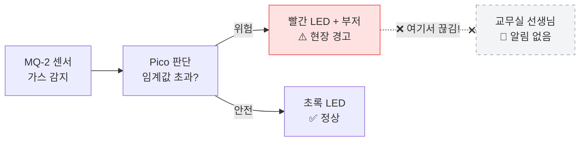

선생님: "센서 → 판단 → 경고까지는 완벽한데, '교무실까지 알려주는' 부분이 빠져 있어요."

선생님: "만약 화장실에서 감지된 순간, 선생님 컴퓨터에 바로 알림이 뜬다면 어떨까요?"

학생 C: "오~ 그러면 바로 달려갈 수 있겠네요."

선생님: "맞아요. 오늘 바로 그걸 만들 거예요. Pico가 Wi-Fi로 인터넷에 연결되면, 데이터를 원격으로 보낼 수 있어요."

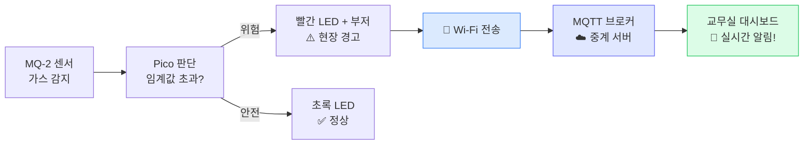

선생님: "오늘이 끝나면, 여러분의 Pico는 진짜 '인터넷에 연결된 장치'가 돼요. 이게 바로 IoT — Internet of Things, 사물인터넷이에요."

---

#### Wi-Fi 개념 & Pico 2 WH의 무선 기능 (10-25분)

**[강의 스크립트]**

선생님: "Pico 2 WH의 이름에서 'W'가 뭐라고 했었죠?"

학생 A: "Wireless요!"

선생님: "맞아요! Wireless, 무선이라는 뜻이에요. Pico 2 WH에는 Wi-Fi 칩이 내장되어 있어요."

선생님: "Pico 보드를 보세요. 뒷면에 은색 사각형 부품이 있죠? 그게 바로 Wi-Fi 모듈이에요. 안테나까지 보드 안에 들어 있어서 별도의 부품을 연결할 필요가 없어요."

선생님: "Wi-Fi 연결은 우리가 스마트폰으로 Wi-Fi 잡는 것과 원리가 같아요."

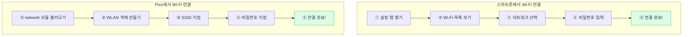

선생님: "스마트폰에서 하는 것과 똑같은 과정을 코드로 하는 거예요. 차이점이라면, 스마트폰은 손가락으로 터치하지만 Pico는 코드로 명령한다는 것뿐이에요."

학생 B: "그러면 학교 Wi-Fi에 연결하는 거예요?"

선생님: "네! 그런데 학교 Wi-Fi는 주의할 점이 있어요."

선생님: "학교 Wi-Fi 연결 시 알아둘 것:"
- 학교 Wi-Fi SSID와 비밀번호는 선생님이 알려줄게요
- 기업용 인증(ID/PW 따로 입력)이 필요한 Wi-Fi는 Pico에서 연결이 어려울 수 있어요
- 그래서 오늘 실습용으로 별도 핫스팟을 준비했어요 (필요시)

---

#### Wi-Fi 연결 코드 작성 & 실습 (25-40분)

**[강의 스크립트]**

선생님: "자, 이제 코드를 작성해볼게요. 먼저 가장 기본적인 Wi-Fi 연결 코드예요."

**[코드: step1_wifi_연결.py]**

```python
# ============================================
# step1_wifi_연결.py
# Pico 2 WH를 Wi-Fi에 연결하는 첫 번째 코드
# ============================================

# === 무엇을 하는 코드인지 (WHAT) ===
# Pico를 학교 Wi-Fi에 연결하는 코드예요

# --- 왜 필요한지 (WHY) ---
# Wi-Fi에 연결해야 센서 데이터를 인터넷으로 보낼 수 있어요
# 이게 "사물인터넷(IoT)"의 첫 번째 단계예요

import network        # Wi-Fi 연결을 위한 모듈
import time           # 대기 시간용

# Wi-Fi 정보 입력 (선생님이 알려준 SSID와 비밀번호로 바꾸세요!)
WIFI_SSID = "School_IoT"         # Wi-Fi 이름
WIFI_PASSWORD = "pico2024!"      # Wi-Fi 비밀번호

# WLAN 객체 만들기 (스마트폰의 Wi-Fi 설정 앱을 여는 것과 같아요)
wlan = network.WLAN(network.STA_IF)

# Wi-Fi 기능 켜기 (스마트폰에서 Wi-Fi 스위치를 ON하는 것)
wlan.active(True)

# Wi-Fi에 연결 시도 (SSID 선택 + 비밀번호 입력하는 것)
print(f"'{WIFI_SSID}' 에 연결 중...")
wlan.connect(WIFI_SSID, WIFI_PASSWORD)

# 연결될 때까지 기다리기 (최대 10초)
timeout = 10
while not wlan.isconnected() and timeout > 0:
    print(f"  연결 대기 중... ({timeout}초 남음)")
    time.sleep(1)
    timeout -= 1

# 결과 확인
if wlan.isconnected():
    print("✅ Wi-Fi 연결 성공!")
    print(f"   IP 주소: {wlan.ifconfig()[0]}")
else:
    print("❌ Wi-Fi 연결 실패! SSID와 비밀번호를 확인하세요.")
```

선생님: "SSID와 비밀번호를 제가 알려드릴게요. 칠판에 적어놓을 테니 정확히 입력하세요. 대소문자도 구분해요!"

(칠판에 SSID, 비밀번호 표기)

선생님: "다 입력했으면 실행해보세요!"

(학생들 실행)

학생 A: "와! 'Wi-Fi 연결 성공!' 떴어요!"

선생님: "축하해요! 여러분의 Pico가 방금 인터넷에 연결됐어요. IP 주소도 나왔죠?"

학생 B: "192.168.0.105 이런 거요?"

선생님: "맞아요! 그게 뭔지 다음에 바로 설명할게요."

**[수업 장면: 연결의 쾌감]**

도윤이와 수아의 조에서 Wi-Fi 연결에 성공한다.

도윤: "야, 진짜 연결됐다! IP 주소 나왔어!"

수아: "오~ 192.168.0.107이래. 근데 이게 뭐야?"

도윤: "집 주소 같은 거 아닐까? 인터넷에서 우리 Pico를 찾으려면 주소가 필요하니까."

선생님이 지나가며: "도윤이가 정확히 맞췄어요! IP 주소는 인터넷 세계에서의 집 주소예요."

---

#### IP 주소 개념 & 연결 상태 확인 (40-50분)

**[강의 스크립트]**

선생님: "도윤이가 좋은 비유를 해줬어요. IP 주소는 인터넷 세계에서 각 기기에 부여되는 '집 주소'예요."

선생님: "여러분이 친구에게 택배를 보내려면 집 주소가 필요하죠? 마찬가지로 Pico가 데이터를 보내려면 IP 주소가 있어야 해요."

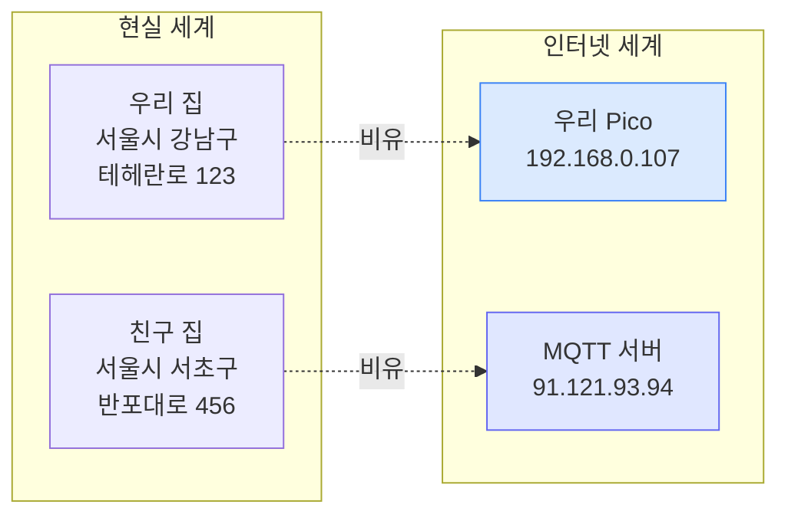

선생님: "192.168.0.xxx처럼 192.168로 시작하는 주소는 '같은 집 안'이라는 뜻이에요. 우리 교실의 모든 기기가 같은 Wi-Fi에 연결되면 192.168.0.xxx 형태의 주소를 받아요."

선생님: "이제 연결 상태를 좀 더 자세히 확인하는 코드를 볼게요."

**[코드: step2_wifi_상태확인.py]**

```python
# ============================================
# step2_wifi_상태확인.py
# Wi-Fi 연결 상태를 자세히 확인하기
# ============================================

# === 무엇을 하는 코드인지 (WHAT) ===
# Wi-Fi 연결 상태와 네트워크 정보를 자세히 보여주는 코드예요

# --- 왜 필요한지 (WHY) ---
# 연결이 안 될 때 문제를 찾으려면 상세 정보가 필요해요
# 실제 IoT 기기에서도 네트워크 상태를 항상 모니터링해요

import network
import time

WIFI_SSID = "School_IoT"
WIFI_PASSWORD = "pico2024!"

def connect_wifi():
    """Wi-Fi에 연결하고 상태를 출력하는 함수"""
    wlan = network.WLAN(network.STA_IF)
    wlan.active(True)

    if wlan.isconnected():
        print("이미 Wi-Fi에 연결되어 있어요!")
    else:
        print(f"'{WIFI_SSID}' 에 연결 중...")
        wlan.connect(WIFI_SSID, WIFI_PASSWORD)

        timeout = 10
        while not wlan.isconnected() and timeout > 0:
            print(".", end="")
            time.sleep(1)
            timeout -= 1
        print()  # 줄바꿈

    if wlan.isconnected():
        config = wlan.ifconfig()
        print("=" * 40)
        print("  Wi-Fi 연결 정보")
        print("=" * 40)
        print(f"  SSID     : {WIFI_SSID}")
        print(f"  IP 주소  : {config[0]}")
        print(f"  서브넷   : {config[1]}")
        print(f"  게이트웨이: {config[2]}")
        print(f"  DNS      : {config[3]}")
        print("=" * 40)
        return wlan
    else:
        print("Wi-Fi 연결 실패!")
        return None

# 실행!
wlan = connect_wifi()
```

선생님: "이 코드는 def로 '함수'를 만든 거예요. 기억나죠? 자주 쓸 기능을 함수로 묶어두면 나중에 한 줄로 호출할 수 있어요."

선생님: "실행해보세요. Wi-Fi 정보가 표처럼 깔끔하게 나올 거예요."

**[예상 Q&A]**

- **Q**: "Wi-Fi 연결 시간이 10초가 넘으면 어떡해요?"
- **A**: "timeout 값을 20으로 늘려보세요. 학교 Wi-Fi가 느릴 수 있어요. 그래도 안 되면 SSID와 비밀번호를 다시 확인하세요."

- **Q**: "집에서도 할 수 있어요?"
- **A**: "물론이죠! SSID와 비밀번호를 집 Wi-Fi 것으로 바꾸면 돼요. 단, 5GHz 전용 Wi-Fi는 Pico가 연결 못 할 수 있어요. 2.4GHz를 사용하세요."

- **Q**: "STA_IF가 뭐예요?"
- **A**: "Station Interface의 약자예요. '이 Pico가 Wi-Fi에 접속하는 기기(station)'라는 뜻이에요. 반대로 AP_IF는 Pico가 직접 Wi-Fi 공유기 역할을 하는 모드예요."

---

### 2교시: MQTT 프로토콜 이해 & 실습

---

#### MQTT 개념 — 유튜브 구독 비유 (00-15분)

**[강의 스크립트]**

선생님: "Wi-Fi로 인터넷에 연결했으니, 이제 데이터를 '어떻게' 보낼지를 배울 거예요. 여기서 MQTT라는 프로토콜을 쓸 건데요."

선생님: "프로토콜이 뭐냐면, '통신 규칙'이에요. 사람들끼리 대화할 때 한국어라는 규칙이 있듯이, 기계들도 서로 대화하려면 규칙이 필요해요."

선생님: "MQTT를 가장 쉽게 이해하는 방법은 유튜브 구독 시스템으로 비유하는 거예요."

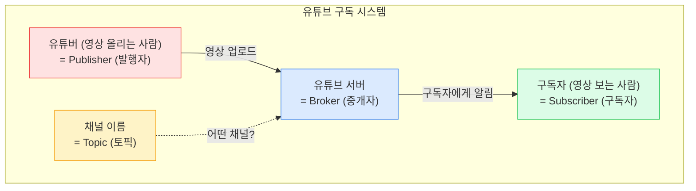

선생님: "유튜브에서 여러분이 좋아하는 채널을 '구독'하면, 그 유튜버가 새 영상을 올릴 때 알림이 오잖아요?"

학생 A: "네, 종 모양 눌러야 하는 거요."

선생님: "맞아요! MQTT도 정확히 같은 구조예요."

- **Publisher (발행자)** = 유튜버 → 우리 Pico가 센서 데이터를 '올리는' 역할
- **Broker (중개자)** = 유튜브 서버 → 메시지를 받아서 구독자에게 전달하는 중간 서버
- **Subscriber (구독자)** = 시청자 → 교무실 대시보드가 데이터를 '받는' 역할
- **Topic (토픽)** = 채널 이름 → 어떤 종류의 데이터인지 구분하는 주소

선생님: "우리 프로젝트에서 누가 무슨 역할인지 보면..."

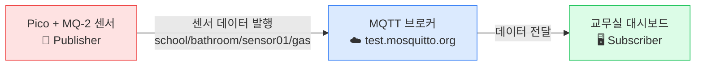

선생님: "Pico가 유튜버처럼 데이터를 올리면, 브로커가 유튜브 서버처럼 중간에서 받아서, 구독하고 있는 대시보드에 전달하는 거예요."

학생 B: "그러면 브로커 서버는 우리가 만들어야 해요?"

선생님: "좋은 질문! 아니에요. 무료로 쓸 수 있는 공개 브로커가 있어요. test.mosquitto.org라는 곳인데, 전 세계 누구나 테스트용으로 쓸 수 있어요. 나중에 실제 서비스할 때는 학교 자체 서버를 쓰겠지만, 지금은 이걸로 충분해요."

선생님: "MQTT의 가장 큰 장점은 '가볍다'는 거예요. 데이터를 최소한으로 보내서 Pico처럼 작은 기기에 딱이에요."

학생 C: "진짜요? 카카오톡보다 가벼워요?"

선생님: "훨씬 가벼워요! 카카오톡이 택배 상자라면, MQTT는 엽서예요. 필요한 내용만 딱 보내는 거죠."

---

#### MQTT 토픽 설계 (15-30분)

**[강의 스크립트]**

선생님: "MQTT에서 중요한 게 '토픽'이에요. 토픽은 메시지를 분류하는 주소인데, 폴더 구조처럼 생겼어요."

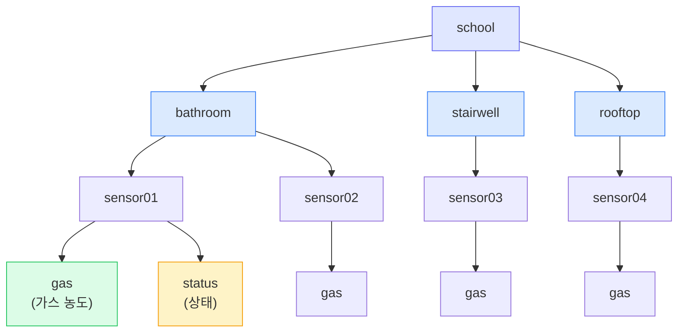

선생님: "우리 토픽은 이렇게 설계해요: `school/bathroom/sensor01/gas`"

- `school` → 학교 (최상위)
- `bathroom` → 설치 장소 (화장실)
- `sensor01` → 센서 번호 (1번 센서)
- `gas` → 데이터 종류 (가스 농도)

선생님: "왜 이렇게 나누냐고요? 학교에 센서가 10개, 20개 생기면 어떤 화장실의 몇 번 센서인지 구분해야 하거든요."

학생 A: "폴더 만드는 거랑 비슷해요! 바탕화면에 폴더 안에 폴더 만드는 거처럼."

선생님: "정확해요! 컴퓨터 폴더 구조랑 같은 원리예요."

선생님: "이제 umqtt 라이브러리를 써서 실제로 MQTT 메시지를 보내볼 거예요."

선생님: "먼저 umqtt 라이브러리를 Pico에 설치해야 해요. Thonny에서 도구 > 패키지 관리에서 'micropython-umqtt.simple'을 검색해서 설치하세요. 안 되면 제가 나눠준 파일을 Pico에 업로드하세요."

**[코드: step3_mqtt_발행.py]**

```python
# ============================================
# step3_mqtt_발행.py
# MQTT 브로커에 메시지를 발행(Publish)하기
# ============================================

# === 무엇을 하는 코드인지 (WHAT) ===
# MQTT 브로커에 연결해서 테스트 메시지를 보내는 코드예요

# --- 왜 필요한지 (WHY) ---
# 센서 데이터를 원격으로 전송하려면 MQTT 통신이 필요해요
# 먼저 간단한 텍스트 메시지로 테스트해볼 거예요

import network
import time
from umqtt.simple import MQTTClient   # MQTT 라이브러리

# === 1단계: Wi-Fi 연결 ===
WIFI_SSID = "School_IoT"
WIFI_PASSWORD = "pico2024!"

wlan = network.WLAN(network.STA_IF)
wlan.active(True)

print("Wi-Fi 연결 중...")
wlan.connect(WIFI_SSID, WIFI_PASSWORD)

while not wlan.isconnected():
    time.sleep(1)
print(f"Wi-Fi 연결 완료! IP: {wlan.ifconfig()[0]}")

# === 2단계: MQTT 브로커 연결 ===
MQTT_BROKER = "test.mosquitto.org"  # 무료 공개 브로커
CLIENT_ID = "pico_sensor01"         # 우리 Pico의 고유 이름
TOPIC = "school/bathroom/sensor01/gas"  # 발행할 토픽

# MQTT 클라이언트 만들기 (유튜브 계정을 만드는 것과 같아요)
client = MQTTClient(CLIENT_ID, MQTT_BROKER)

print(f"MQTT 브로커 '{MQTT_BROKER}' 에 연결 중...")
client.connect()
print("MQTT 연결 완료!")

# === 3단계: 메시지 발행 ===
message = "Hello from Pico!"
client.publish(TOPIC, message)   # 토픽에 메시지 발행!
print(f"발행 완료! 토픽: {TOPIC}")
print(f"메시지: {message}")

# 연결 종료
client.disconnect()
print("MQTT 연결 종료.")
```

선생님: "실행해보세요. '발행 완료!'라고 나오면 성공이에요!"

학생 B: "근데 이걸 누가 받는 거예요? 대시보드가 아직 없잖아요."

선생님: "좋은 질문! 지금은 보내기만 한 거예요. 누가 받는지는 잠시 후에 확인할 수 있어요. 온라인 MQTT 클라이언트 사이트에서 우리 토픽을 구독하면 메시지가 오는 걸 볼 수 있어요."

(선생님이 노트북에서 온라인 MQTT 클라이언트 사이트를 띄워서 school/bathroom/sensor01/gas 토픽을 구독한 후, 학생들에게 다시 코드를 실행하게 함)

선생님: "자, 다시 실행해보세요!"

(학생 실행)

선생님: "보세요! 선생님 화면에 여러분이 보낸 'Hello from Pico!'가 바로 나타났어요!"

학생들: "와! 진짜 왔어요?"

선생님: "네! 이게 바로 MQTT의 마법이에요. 여러분의 Pico에서 보낸 메시지가 인터넷을 타고 서버를 거쳐서 선생님 화면에 나타난 거예요."

**[수업 장면: 원격 통신 체험]**

준혁이와 예린이 조에서 메시지 발행에 성공한 상태.

준혁: "선생님, 메시지를 바꿔서 보내도 돼요?"

선생님: "그럼요! message 변수를 바꿔보세요."

준혁이가 message를 "준혁이의 Pico에서 보냄!"으로 바꿔 실행.

선생님: "오, 선생님 화면에 '준혁이의 Pico에서 보냄!'이라고 나왔어요!"

예린: "헐, 진짜 실시간이네요. 카카오톡 같은 거잖아요!"

선생님: "맞아요. 원리가 비슷해요. 다만 MQTT는 사람 대 사람이 아니라, 기계 대 기계의 대화에 최적화된 거예요."

---

#### 구독(Subscribe) 맛보기 (45-50분)

**[강의 스크립트]**

선생님: "이번엔 반대로, Pico가 메시지를 '받는' 것도 잠깐 보여줄게요. 이건 다음 주에 대시보드 만들 때 본격적으로 하겠지만, 맛보기로 보면 MQTT가 양방향이라는 걸 알 수 있어요."

선생님: "구독은 publish 대신 subscribe를 쓰면 돼요. 다음 주에 자세히 배우기로 하고, 지금은 '아, 보내기만 하는 게 아니라 받기도 되는구나' 정도만 알아두세요."

선생님: "지금까지 배운 걸 정리하면 이래요."

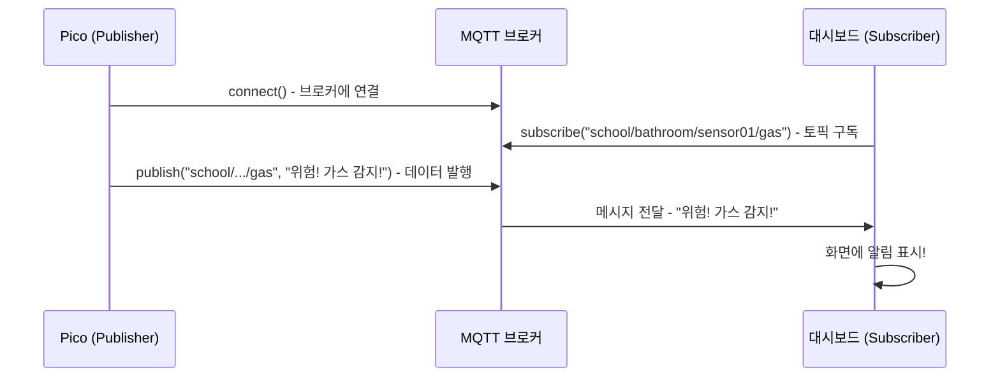

---

### 3교시: 통합 — 감지 + 전송 시스템 완성

---

#### JSON 데이터 패키징 (00-15분)

**[강의 스크립트]**

선생님: "아까는 'Hello from Pico!' 같은 단순 텍스트를 보냈는데, 실제로는 센서 값, 상태, 시간 같은 여러 정보를 한꺼번에 보내야 해요."

선생님: "이때 쓰는 게 JSON이에요. JSON은 데이터를 정리해서 담는 '택배 상자'라고 생각하면 돼요."

선생님: "예를 들어, 친구에게 택배를 보낼 때 물건을 아무렇게나 넣으면 안 되잖아요? 칸칸이 정리해서 넣죠. JSON도 마찬가지예요."

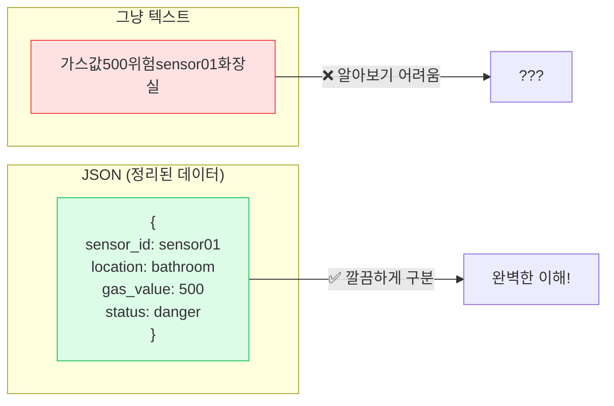

**[코드: step4_json_만들기.py]**

```python
# ============================================
# step4_json_만들기.py
# 센서 데이터를 JSON 형식으로 패키징하기
# ============================================

# === 무엇을 하는 코드인지 (WHAT) ===
# 센서 데이터를 JSON 형식으로 정리하는 코드예요

# --- 왜 필요한지 (WHY) ---
# 여러 정보(센서값, 위치, 상태)를 한꺼번에 보내려면
# 정해진 형식으로 정리해야 받는 쪽에서 알아볼 수 있어요

import json            # JSON 처리 모듈
import time

# 센서 데이터를 딕셔너리(사전)로 만들기
sensor_data = {
    "sensor_id": "sensor01",       # 센서 번호
    "location": "bathroom_1F",     # 설치 장소
    "gas_value": 520,              # 가스 농도 (ADC 값)
    "status": "danger",            # 상태 (safe/warning/danger)
    "threshold": 300,              # 임계값
    "timestamp": time.time()       # 측정 시간
}

# 딕셔너리를 JSON 문자열로 변환
json_string = json.dumps(sensor_data)

print("=== 원본 데이터 (딕셔너리) ===")
print(sensor_data)
print()
print("=== JSON 문자열 (전송용) ===")
print(json_string)
print()
print(f"JSON 길이: {len(json_string)} 글자")
```

선생님: "실행해보세요. 같은 데이터인데, JSON 문자열로 바꾸면 한 줄의 텍스트가 돼요. 이걸 MQTT로 보내는 거예요."

학생 A: "딕셔너리가 뭐예요?"

선생님: "영어 사전(dictionary) 아시죠? 단어 옆에 뜻이 써 있잖아요. 파이썬의 딕셔너리도 똑같아요. 'sensor_id' 옆에 'sensor01'이라는 값이 있고, 'gas_value' 옆에 520이 있고. 이름표와 값이 쌍으로 있는 거예요."

---

#### Wi-Fi + 센서 + MQTT 통합 코드 (15-35분)

**[강의 스크립트]**

선생님: "드디어 최종 보스! 3주 동안 만든 것을 하나로 합칠 거예요. 센서로 읽고, 판단하고, 경고하고, 인터넷으로 보내는 완전한 시스템이에요."

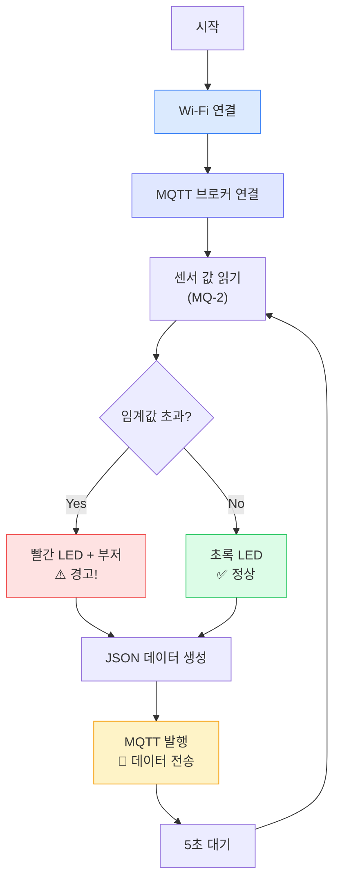

선생님: "전체 흐름이 보이죠? 이걸 코드로 옮기면 됩니다. 코드가 길어 보이지만, 사실 지금까지 배운 것들을 순서대로 합친 거예요."

**[코드: step5_통합_감지_전송.py]**

```python
# ============================================
# step5_통합_감지_전송.py
# 전자담배 감지 + Wi-Fi + MQTT 통합 시스템
# ============================================

# === 무엇을 하는 코드인지 (WHAT) ===
# 센서로 가스를 감지하고, Wi-Fi를 통해 MQTT로 데이터를 전송하는
# 완전한 IoT 시스템이에요!

# --- 왜 필요한지 (WHY) ---
# 감지만 하면 현장에서만 알 수 있지만,
# 전송까지 하면 교무실에서도 실시간으로 모니터링할 수 있어요

from machine import Pin, ADC
import network
import time
import json
from umqtt.simple import MQTTClient

# ==========================================
# 설정값 (여기만 수정하면 돼요!)
# ==========================================
WIFI_SSID = "School_IoT"
WIFI_PASSWORD = "pico2024!"
MQTT_BROKER = "test.mosquitto.org"
CLIENT_ID = "pico_sensor01"
TOPIC = "school/bathroom/sensor01/gas"
GAS_THRESHOLD = 300          # 위험 임계값
SEND_INTERVAL = 5            # 데이터 전송 주기 (초)

# ==========================================
# 하드웨어 초기화
# ==========================================
gas_sensor = ADC(26)          # GP26: MQ-2 센서 (ADC0)
red_led = Pin(15, Pin.OUT)    # 빨간 LED (경고)
green_led = Pin(16, Pin.OUT)  # 초록 LED (정상)
buzzer = Pin(17, Pin.OUT)     # 부저 (경고음)

# ==========================================
# Wi-Fi 연결 함수
# ==========================================
def connect_wifi():
    """Wi-Fi에 연결하는 함수 (실패 시 재시도)"""
    wlan = network.WLAN(network.STA_IF)
    wlan.active(True)

    if not wlan.isconnected():
        print(f"Wi-Fi 연결 중: {WIFI_SSID}")
        wlan.connect(WIFI_SSID, WIFI_PASSWORD)

        timeout = 15
        while not wlan.isconnected() and timeout > 0:
            time.sleep(1)
            timeout -= 1

    if wlan.isconnected():
        print(f"Wi-Fi 연결 완료! IP: {wlan.ifconfig()[0]}")
        return wlan
    else:
        print("Wi-Fi 연결 실패!")
        return None

# ==========================================
# MQTT 연결 함수
# ==========================================
def connect_mqtt():
    """MQTT 브로커에 연결하는 함수"""
    try:
        client = MQTTClient(CLIENT_ID, MQTT_BROKER)
        client.connect()
        print(f"MQTT 연결 완료! 브로커: {MQTT_BROKER}")
        return client
    except Exception as e:
        print(f"MQTT 연결 실패: {e}")
        return None

# ==========================================
# 센서 읽기 + 판단 함수
# ==========================================
def read_gas_sensor():
    """가스 센서 값을 읽고 상태를 판단하는 함수"""
    raw_value = gas_sensor.read_u16()   # 0~65535 범위
    gas_value = raw_value >> 6          # 0~1023 범위로 변환

    # 상태 판단
    if gas_value > GAS_THRESHOLD:
        status = "danger"
        red_led.on()
        green_led.off()
        buzzer.on()
    else:
        status = "safe"
        red_led.off()
        green_led.on()
        buzzer.off()

    return gas_value, status

# ==========================================
# 메인 실행!
# ==========================================
print("=" * 50)
print("  전자담배 감지 IoT 시스템 v2.0")
print("  Wi-Fi + MQTT 원격 전송 모드")
print("=" * 50)

# 1단계: Wi-Fi 연결
wlan = connect_wifi()
if not wlan:
    print("Wi-Fi 없이는 실행할 수 없어요. 설정을 확인하세요.")
    raise SystemExit

# 2단계: MQTT 연결
mqtt_client = connect_mqtt()
if not mqtt_client:
    print("MQTT 연결 실패. 브로커 주소를 확인하세요.")
    raise SystemExit

# 3단계: 감지 + 전송 반복!
print()
print("모니터링 시작! (Ctrl+C로 종료)")
print("-" * 50)

try:
    while True:
        # 센서 읽기 + 판단
        gas_value, status = read_gas_sensor()

        # JSON 데이터 만들기
        data = {
            "sensor_id": CLIENT_ID,
            "location": "bathroom_1F",
            "gas_value": gas_value,
            "status": status,
            "threshold": GAS_THRESHOLD
        }
        json_data = json.dumps(data)

        # MQTT로 전송
        try:
            mqtt_client.publish(TOPIC, json_data)
            emoji = "🔴" if status == "danger" else "🟢"
            print(f"{emoji} 가스:{gas_value:4d} | 상태:{status:7s} | 전송 완료!")
        except:
            # 연결 끊겼으면 재연결 시도
            print("MQTT 전송 실패! 재연결 시도...")
            mqtt_client = connect_mqtt()

        # Wi-Fi 끊겼으면 재연결
        if not wlan.isconnected():
            print("Wi-Fi 끊김! 재연결 시도...")
            wlan = connect_wifi()

        time.sleep(SEND_INTERVAL)

except KeyboardInterrupt:
    # Ctrl+C로 종료할 때 정리
    print("\n모니터링 종료!")
    red_led.off()
    green_led.off()
    buzzer.off()
    mqtt_client.disconnect()
    print("MQTT 연결 해제 완료. 안전하게 종료되었어요.")
```

선생님: "코드가 길어 보이지만, 크게 4개 블록이에요."

1. **설정값**: SSID, 비밀번호, 브로커 주소, 토픽 — 맨 위에서 한 번만 설정
2. **함수들**: Wi-Fi 연결, MQTT 연결, 센서 읽기 — 재사용 가능한 블록
3. **초기화**: Wi-Fi 연결 → MQTT 연결 — 시작할 때 한 번 실행
4. **메인 루프**: 센서 읽기 → JSON 만들기 → MQTT 전송 → 반복

선생님: "특히 주목할 부분은 '재연결 로직'이에요. Wi-Fi가 끊기거나 MQTT 연결이 끊겨도 자동으로 다시 연결을 시도해요."

학생 A: "왜 재연결이 필요해요? 한 번 연결하면 끝 아니에요?"

선생님: "아주 좋은 질문이에요! 실제로 Wi-Fi는 불안정할 수 있어요. 공유기가 재부팅되거나, 전파 간섭이 생기거나, 사람이 많아지면 끊길 수 있어요. IoT 기기는 24시간 돌아가야 하니까, 끊겨도 자동으로 다시 연결하는 게 정말 중요해요."

선생님: "이걸 전문 용어로 '폴트 톨러런스(fault tolerance)', 한국어로 '장애 허용'이라고 해요. 프로 개발자의 필수 덕목이에요."

**[수업 장면: 통합 성공]**

지우와 민서 조에서 통합 코드를 실행한다.

지우: "야, 초록불 들어왔어. 정상이래."

민서: "선생님 화면에도 데이터 올라가요?"

선생님: (화면을 가리키며) "올라오고 있어요! 5초마다 데이터가 들어와요."

지우: "그럼 센서 앞에서 라이터 켜볼까?"

(안전하게 MQ-2 센서 근처에 라이터 가스를 살짝 분사)

민서: "빨간불이다! 부저도 울려!"

선생님: "선생님 화면도 보세요. 'danger'로 바뀌었죠? 가스 값도 확 올라갔어요!"

지우: "와 진짜 실시간이다! 이러면 교무실에서 바로 알 수 있겠네요."

선생님: "바로 그거예요! 이게 이 프로젝트의 핵심이에요. 현장 경고 + 원격 알림, 동시에 되는 거예요."

---

#### 도전과제 & 자유 실험 (35-45분)

**[강의 스크립트]**

선생님: "통합 코드까지 잘 돌아가죠? 남은 시간은 도전과제 시간이에요."

**도전과제**

- **Level 1: 나만의 CLIENT_ID** — CLIENT_ID를 자기 조 이름으로 바꿔보세요. (예: `pico_team_jiwoo`) 선생님 화면에 어떤 센서에서 보낸 건지 구분이 될까요?

- **Level 2: 전송 주기 바꾸기** — SEND_INTERVAL을 1초로 바꿔서 거의 실시간에 가까운 데이터 전송을 해보세요. 반대로 30초로 바꾸면 어떤 장단점이 있을까요? 짝이랑 토의해보세요.

- **Level 3: 경고 레벨 3단계** — danger/safe 2단계 대신 safe(0~200), warning(200~400), danger(400 이상)로 3단계로 나눠보세요. JSON에도 레벨 정보를 추가하고, LED 표시도 다르게 해보세요. (힌트: warning일 때 빨간불 깜빡이기)

**[도전과제 Level 3 예시 답안 — 교사용]**

```python
# Level 3: 3단계 경고
def read_gas_sensor_v2():
    raw_value = gas_sensor.read_u16()
    gas_value = raw_value >> 6

    if gas_value > 400:
        status = "danger"
        level = 3
        red_led.on()
        green_led.off()
        buzzer.on()
    elif gas_value > 200:
        status = "warning"
        level = 2
        red_led.toggle()     # 깜빡이기
        green_led.off()
        buzzer.off()
    else:
        status = "safe"
        level = 1
        red_led.off()
        green_led.on()
        buzzer.off()

    return gas_value, status, level
```

선생님: "Level 1부터 도전해보세요!"

---

#### IoT 개념 정리 & 다음 주 예고 (45-50분)

**[강의 스크립트]**

선생님: "자, 오늘 수업 정리해볼게요. 오늘 우리가 한 것, 한마디로 하면?"

학생들: "Pico를 인터넷에 연결했어요!"

선생님: "맞아요! 더 정확하게는 IoT 시스템을 만든 거예요. IoT, Internet of Things, 사물인터넷."

선생님: "IoT의 핵심 3요소를 정리하면 이래요."

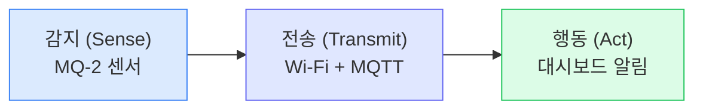

- **감지 (Sense)**: 센서로 물리적 환경을 측정 → MQ-2 가스 센서
- **전송 (Transmit)**: 측정한 데이터를 네트워크로 전송 → Wi-Fi + MQTT
- **행동 (Act)**: 데이터를 받아서 유용한 행동을 함 → 대시보드에서 알림

선생님: "3주차까지는 '감지'만 했고, 오늘 '전송'을 추가했어요. 다음 주에 '행동', 즉 대시보드를 만들 거예요."

**오늘 배운 것 정리**

- Pico 2 WH의 Wi-Fi 기능 → `network` 모듈로 연결
- IP 주소 개념 → 인터넷 세계의 집 주소
- MQTT 프로토콜 → Publisher / Broker / Subscriber 구조
- 토픽 설계 → `school/bathroom/sensor01/gas`
- JSON 데이터 패키징 → `json.dumps()`로 변환
- 통합 시스템 완성 → 감지 + 판단 + 경고 + 전송
- 재연결 로직 → 연결 끊김에 대응하는 안정적인 코드
- **핵심 키워드**: Wi-Fi, MQTT, Publish, Subscribe, Broker, Topic, JSON, IoT

**[다음 주 예고]**

선생님: "다음 주에는 드디어 '대시보드'를 만들어요! 여러분이 보낸 데이터를 웹 페이지에서 실시간 그래프로 보여주는 거예요."

선생님: "지금은 선생님이 MQTT 테스트 사이트에서 데이터를 글자로 봤지만, 다음 주에는 이걸 예쁜 그래프와 실시간 알림으로 바꿀 거예요."

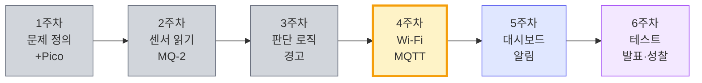

선생님: "센서 데이터가 이런 식으로 실시간 그래프에 나타나고, 위험 수치를 넘으면 알림이 울리는 대시보드를 직접 만들 거예요. 기대되죠?"

학생 A: "진짜요? 진짜 앱 같은 거 만드는 거예요?"

선생님: "앱은 아니고 웹 페이지예요. 하지만 스마트폰 브라우저로도 볼 수 있어서, 사실상 앱이나 다름없어요. 다음 주가 이 프로젝트의 하이라이트예요!"

---

## 예상 Q&A

- **Q**: "Wi-Fi 비밀번호가 코드에 그대로 적혀 있으면 보안에 안 좋은 거 아니에요?"
- **A**: "정확해요! 실제 제품에서는 비밀번호를 코드에 직접 쓰지 않고 별도 설정 파일에 저장해요. 지금은 학습용이라 코드에 직접 쓰지만, 이 코드를 인터넷에 공유할 때는 비밀번호를 반드시 지워야 해요."

- **Q**: "test.mosquitto.org가 해킹당하면 어떡해요?"
- **A**: "좋은 질문! test.mosquitto.org는 테스트용이라 누구나 메시지를 볼 수 있어요. 실제 서비스에서는 비밀번호를 설정하고, 암호화(TLS)를 적용해요. 지금은 학습이 목적이니 걱정 안 해도 돼요."

- **Q**: "MQTT 말고 다른 방법은 없어요?"
- **A**: "있어요! HTTP, WebSocket, CoAP 같은 것들이 있어요. 하지만 MQTT가 IoT에 가장 적합해요. 가볍고, 배터리 소모가 적고, 불안정한 네트워크에서도 잘 동작하거든요."

- **Q**: "Pico 전원이 꺼지면 Wi-Fi 설정이 날아가요?"
- **A**: "네, 코드가 메모리에서만 돌아가니까 전원이 꺼지면 다시 연결해야 해요. 하지만 main.py로 저장해두면 전원을 켤 때마다 자동으로 실행돼요."

- **Q**: "집 Wi-Fi로도 되나요?"
- **A**: "네! SSID와 비밀번호만 집 것으로 바꾸면 돼요. 단, 5GHz 전용 Wi-Fi는 안 되고, 2.4GHz Wi-Fi를 사용해야 해요. 대부분의 공유기는 둘 다 지원해요."

- **Q**: "여러 Pico가 동시에 같은 토픽에 발행하면 어떻게 돼요?"
- **A**: "전부 섞여서 들어와요! 그래서 JSON 데이터에 sensor_id를 넣는 거예요. 어떤 센서에서 보낸 건지 구분할 수 있도록요."

- **Q**: "MQTT 메시지가 도착 안 하면 어떻게 알아요?"
- **A**: "MQTT에는 QoS(Quality of Service)라는 기능이 있어요. QoS 1로 설정하면 메시지가 확실히 도착했는지 확인해줘요. 지금은 기본값(QoS 0)으로 충분하고, 관심 있으면 6주차 때 더 알아보세요."

- **Q**: "json.dumps()에서 dumps는 뭐의 약자예요?"
- **A**: "dump string의 줄임말이에요. dump는 '쏟아내다'라는 뜻이니까, '데이터를 문자열로 쏟아낸다' = '문자열로 변환한다'라는 의미예요."

- **Q**: "try-except가 뭐예요?"
- **A**: "에러가 나도 프로그램이 멈추지 않게 해주는 안전장치예요. try 안의 코드를 '시도(try)'해보고, 에러가 나면 except로 넘어가서 다른 행동을 해요. 여기서는 MQTT 전송이 실패하면 재연결을 시도하는 거예요."

---

## 수업 장면 시나리오

**[장면 1: Wi-Fi 연결 트러블슈팅]**

서준이와 하은이 조에서 Wi-Fi가 연결되지 않는다.

서준: "선생님, 계속 '연결 실패'라고 나와요."

선생님: "SSID를 다시 확인해볼까? 어디 보자... 아, 대문자가 틀렸네. 'school_iot'라고 적었는데, 정확하게 'School_IoT'여야 해요. 대소문자가 다르면 다른 Wi-Fi로 인식해요."

하은: "에이, 이런 것 때문에 안 됐어?"

선생님: "프로그래밍에서 이런 사소한 차이가 가장 흔한 에러 원인이에요. 오히려 이런 경험이 중요해요."

(수정 후 연결 성공)

서준: "됐다! 이제 IP 주소 나왔어요!"

---

**[장면 2: MQTT 메시지 실시간 확인]**

선생님이 빔 프로젝터로 MQTT 클라이언트 화면을 보여주고 있다.

선생님: "자, 각 조에서 메시지를 보내보세요. 선생님 화면에 실시간으로 나타나는 걸 볼 수 있어요."

(여러 조가 동시에 메시지를 발행)

학생들: "와! 한꺼번에 올라온다!"

선생님: "보세요, sensor_id가 다 다르죠? team_jiwoo, team_minseo, team_junhyuk... 이래서 sensor_id가 중요한 거예요. 없으면 누가 보낸 건지 모르잖아요."

학생 A: "유튜브 채팅창 같아요!"

선생님: "맞아요, 원리가 비슷해요! 여러 사람이 동시에 메시지를 보내고 실시간으로 보이는 거."

---

**[장면 3: JSON 데이터의 가치]**

소연이와 태호 조가 통합 코드를 실행하고 있다.

태호: "gas_value가 계속 변하네. 150, 148, 155..."

소연: "status는 계속 safe야. 그러다 센서에 뭔가 갖다 대면 확 올라가겠지?"

태호: "그런데 JSON이 없으면 그냥 숫자만 보내는 거잖아. 그러면 이 숫자가 뭔지 어떻게 알아?"

소연: "아~ 그래서 sensor_id랑 location이랑 다 같이 보내는 거구나. 택배 상자에 내용물 적어 보내는 것처럼."

선생님이 듣고: "소연이가 완벽하게 이해했어요! JSON은 '이 데이터가 뭔지' 설명서를 같이 보내는 거예요."

---

**[장면 4: 재연결 로직 테스트]**

현우와 유나 조가 의도적으로 Wi-Fi를 끊어본다.

현우: "야, Wi-Fi 비밀번호를 일부러 틀리게 바꾸면 어떻게 돼?"

유나: "해보자! 근데 코드 멈추면 어떡해?"

현우: "try-except가 있으니까 안 멈출 것 같은데..."

(USB를 잠시 뽑았다가 다시 연결)

유나: "'Wi-Fi 끊김! 재연결 시도...' 라고 나왔어!"

현우: "오, 그리고 다시 연결됐다! 자동으로!"

유나: "이게 선생님이 말한 폴트 톨러런스?"

선생님: "맞아요! 일부러 테스트해본 거 정말 좋은 자세예요. 진짜 개발자처럼 '이상 상황'을 테스트해본 거거든요."

---

## 도전과제

- **Level 1: 나만의 CLIENT_ID & 토픽** — CLIENT_ID와 TOPIC을 자기 조에 맞게 바꿔보세요. (예: `pico_team_alpha`, `school/bathroom/sensor_alpha/gas`) 선생님 화면에서 자기 조 데이터가 구분되는지 확인하세요.

- **Level 2: 전송 주기 & 배터리 토론** — SEND_INTERVAL을 1초, 5초, 30초로 각각 바꿔보며 트레이드오프를 체험하세요. 짝이랑 "자주 보내면 좋지만 배터리가 빨리 닳는다"의 적정 주기를 토론해보세요.

- **Level 3: 3단계 경고 시스템 + MQTT** — safe/warning/danger 3단계로 상태를 나누고, JSON에 level 필드(1, 2, 3)를 추가하세요. warning 상태에서는 빨간 LED가 깜빡이도록 구현하세요.

---

## 교사용 체크리스트

- [ ] 3시간 타임라인이 현실적인가? → 1교시(Wi-Fi) + 2교시(MQTT) + 3교시(통합/도전)
- [ ] 모든 코드가 복사-실행 가능한가? → step1~step5 모두 독립 또는 순차 실행 가능
- [ ] 초보자도 이해할 수 있는 스크립트인가? → 유튜브 구독, 택배 상자, 집 주소 등 비유 활용
- [ ] 예상 Q&A가 5개 이상 있는가? → 총 10개
- [ ] 수업 장면 시나리오가 2개 이상 있는가? → 4개 (트러블슈팅, 실시간 확인, JSON 가치, 재연결 테스트)
- [ ] 다음 주와의 연결이 자연스러운가? → 전송(MQTT) → 시각화(대시보드)로 연결
- [ ] umqtt 라이브러리가 사전 설치/배포되었는가? → Thonny 패키지 매니저 또는 수동 업로드
- [ ] 학교 Wi-Fi SSID/비밀번호를 확보했는가? → 핫스팟 대안도 준비
- [ ] 선생님 노트북에 MQTT 모니터링 도구가 준비되었는가? → 웹 클라이언트 또는 MQTT Explorer

## 교사용 사전 준비 메모

1. **umqtt 라이브러리 사전 설치**: Thonny > 도구 > 패키지 관리에서 `micropython-umqtt.simple` 설치. 학교 인터넷이 느리면 미리 `.py` 파일을 USB로 배포.
2. **학교 Wi-Fi 확인**: 기업용 인증(802.1X) Wi-Fi는 Pico에서 연결 불가. 별도 핫스팟(휴대폰 또는 휴대용 공유기) 준비 권장.
3. **MQTT 모니터링 준비**: 빔 프로젝터로 보여줄 MQTT 클라이언트 사이트 미리 접속 확인. 추천: HiveMQ Web Client (http://www.hivemq.com/demos/websocket-client/) 또는 MQTT Explorer 설치.
4. **test.mosquitto.org 접근 확인**: 학교 방화벽에서 1883 포트(MQTT)가 차단될 수 있음. 사전에 테스트 필수. 차단 시 대안: `broker.emqx.io`.
5. **3주차 회로 유지**: 학생들의 MQ-2 센서 + LED + 부저 회로가 그대로 유지되어야 함. 분해된 조는 수업 전에 재조립 시간 필요.
6. **보안 안내**: 공개 MQTT 브로커의 특성(누구나 접근 가능)을 학생들에게 설명하고, 개인정보를 메시지에 넣지 않도록 안내.

## 다음 시간 예고

> **5주차: 한눈에 보는 우리 학교 — 대시보드 & 알림 시스템**
>
> MQTT로 전송한 센서 데이터를 웹 대시보드에서 실시간 그래프로 시각화합니다. 위험 감지 시 자동 알림을 보내는 시스템을 구현합니다. 비로소 '센서 → 판단 → 경고 → 전송 → 시각화 → 알림'의 완전한 IoT 파이프라인이 완성됩니다.
