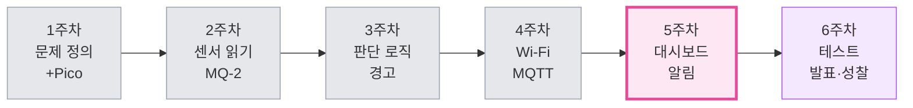
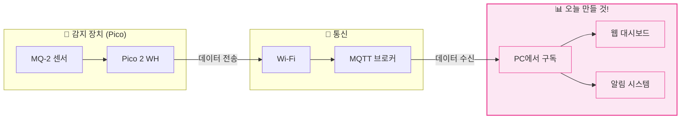
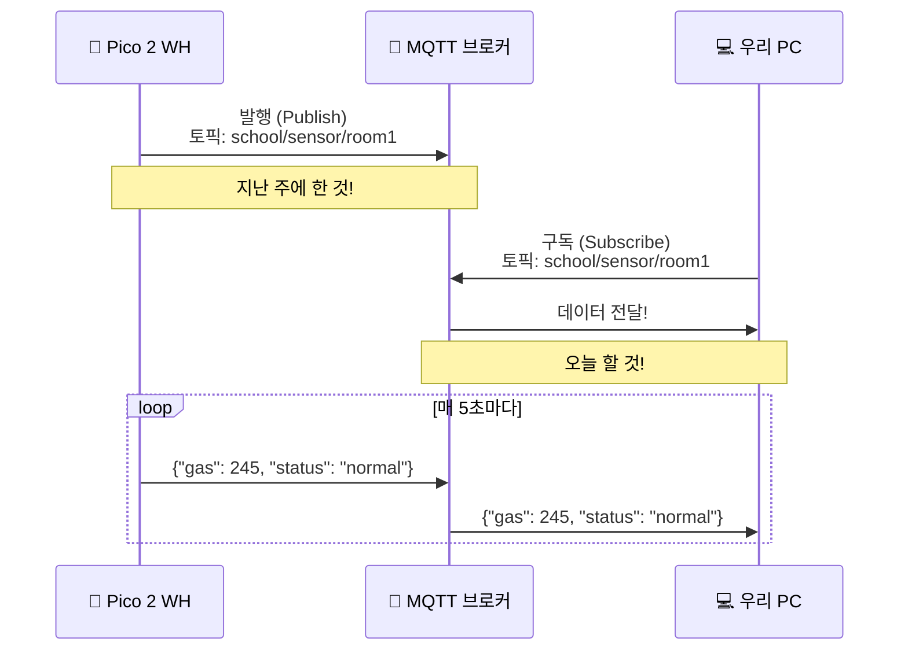
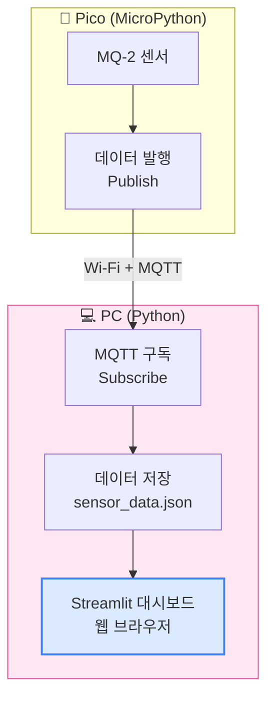
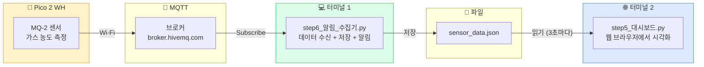
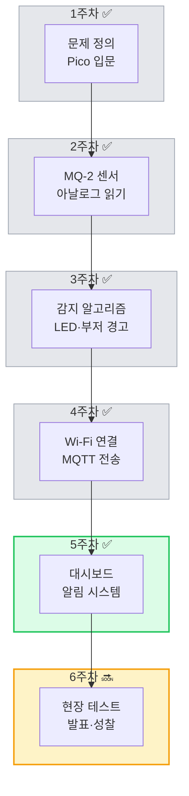

# 5주차: 눈에 보이는 데이터 — 대시보드와 알림 시스템 구축

## 기본 정보

| 항목 | 내용 |
|------|------|
| 주제 | MQTT 수신 데이터를 실시간 대시보드로 시각화하고, 임계값 초과 시 알림 시스템 구축 |
| 시간 | 3시간 (150분 수업 + 쉬는 시간 20분) |
| 형태 | 2인 1조 |
| 준비물 | Pico 2 WH (조별 1대, 4주차 회로 그대로), 노트북 (조별 1대, Python 3.x + pip 설치), Wi-Fi 공유기 (교실 공용), Micro USB 케이블, 교사 PC (Streamlit 데모용) |

## 학습목표

1. MQTT 브로커에서 센서 데이터를 구독(Subscribe)하여 PC에서 실시간으로 수신할 수 있다.
2. Streamlit을 사용하여 센서 데이터를 숫자, 게이지, 그래프로 시각화하는 웹 대시보드를 만들 수 있다.
3. 임계값 초과 시 시각적·청각적 알림을 발생시키는 코드를 작성할 수 있다.
4. Pico(센서) → Wi-Fi → MQTT → 대시보드로 이어지는 전체 IoT 데이터 흐름을 설명할 수 있다.

## 타임라인

- **[1교시: 50분]** MQTT 구독 & 데이터 수신
  - 00-10분: 4주차 복습 & 5주차 동기부여
  - 10-20분: Python 환경 준비 (paho-mqtt, streamlit 설치)
  - 20-35분: MQTT 구독 코드 작성 & 실시간 수신 확인
  - 35-50분: JSON 데이터 파싱 & 콘솔 출력 정리
- **[쉬는 시간: 10분]**
- **[2교시: 50분]** Streamlit 대시보드 만들기
  - 00-10분: Streamlit 소개 & 첫 실행
  - 10-25분: 실시간 센서 값 표시 (숫자 + 게이지)
  - 25-40분: 시간별 그래프 & 감지 이력 테이블
  - 40-50분: 경고 상태 색상 표시 & UI 다듬기
- **[쉬는 시간: 10분]**
- **[3교시: 50분]** 알림 시스템 & 통합 테스트
  - 00-15분: 소리 알림 & 화면 깜빡임 구현
  - 15-30분: 전체 시스템 통합 테스트
  - 30-40분: 도전과제 & 자유 실험
  - 40-50분: 오늘 배운 것 정리 & 다음 주 예고

---

## 상세 수업 진행

---

### 1교시: MQTT 구독 & 데이터 수신

---

#### 도입 & 4주차 복습 (00-10분)

**[강의 스크립트]**

선생님: "안녕하세요! 지난 주에 드디어 Pico가 Wi-Fi에 연결되고, MQTT로 센서 데이터를 '보내는' 데까지 성공했죠?"

학생들: "네!"

선생님: "대단해요. 근데 한 가지 생각해봅시다. 데이터를 보내기만 하면... 누가 봐요?"

학생 A: "아무도 안 보는데요?"

선생님: "맞아요! 아무리 열심히 데이터를 보내도, 그걸 받아서 보는 사람이 없으면 소용이 없어요. 편지를 보냈는데 아무도 안 열어보는 것과 같은 거죠."

선생님: "오늘은 드디어 그 데이터를 '눈에 보이게' 만들 거예요. 웹 브라우저에서 예쁜 대시보드로 실시간 데이터를 보고, 위험하면 알림까지 울리는 시스템을 만듭니다!"



선생님: "지금까지 우리 시스템의 전체 그림을 다시 한번 볼게요."



선생님: "분홍색 부분이 오늘 만들 거예요. PC에서 데이터를 받아서 → 예쁜 대시보드에 보여주고 → 위험하면 알림을 울리는 것까지!"

---

#### Python 환경 준비 (10-20분)

**[강의 스크립트]**

선생님: "오늘은 Pico의 MicroPython이 아니라, 노트북의 일반 Python을 쓸 거예요. Thonny 말고, 명령 프롬프트(터미널)를 열어주세요."

선생님: "Windows면 검색에서 'cmd' 치면 돼요. Mac이면 '터미널'이요."

선생님: "먼저 오늘 쓸 라이브러리를 설치합니다. 아래 명령어를 하나씩 따라 치세요."

```bash
# 1. MQTT 클라이언트 라이브러리 설치
pip install paho-mqtt

# 2. Streamlit 설치 (웹 대시보드 프레임워크)
pip install streamlit

# 3. 그래프 라이브러리 설치
pip install plotly
```

선생님: "'Successfully installed'라고 나오면 성공이에요. 에러가 나면 손 들어주세요."

학생 A: "선생님, pip가 안 된다고 나와요."

선생님: "'pip' is not recognized라고 나왔어요? Python 설치할 때 PATH 설정이 안 된 거예요. `python -m pip install paho-mqtt`으로 해보세요."

학생 B: "오~ 이건 좀 뭔가 있어 보인다!"

선생님: "맞아요, 전문 개발자들도 매일 하는 작업이에요. 라이브러리 설치는 요리하기 전에 재료 사는 거랑 같아요."

**[예상 Q&A]**

- **Q**: "pip install이 느려요."
- **A**: "학교 Wi-Fi가 느릴 수 있어요. 좀 기다려보세요. 정 안 되면 선생님이 미리 다운받은 파일로 오프라인 설치할게요."

- **Q**: "Python이 설치 안 되어 있어요."
- **A**: "python.org에서 최신 버전 다운받아 설치하세요. 설치할 때 'Add Python to PATH' 체크박스를 꼭 체크하세요."

---

#### MQTT 구독 코드 작성 (20-35분)

**[강의 스크립트]**

선생님: "자, 이제 PC에서 Pico가 보내는 데이터를 받아볼 거예요. 지난 주에 Pico가 데이터를 MQTT 브로커에 '발행(Publish)'했죠? 오늘은 반대로 '구독(Subscribe)'을 할 거예요."



선생님: "유튜브 '구독' 버튼 눌러본 적 있죠? MQTT 구독도 비슷해요. '이 토픽에 새 데이터 오면 나한테 알려줘!'라고 등록하는 거예요."

학생 A: "오~ 유튜브 구독이랑 진짜 비슷하네요."

선생님: "맞아요! 유튜브에서 구독하면 새 영상이 올라올 때 알림이 오잖아요? MQTT 구독도 새 데이터가 들어오면 자동으로 받아지는 거예요."

선생님: "자, 메모장이나 VS Code를 열어서 코드를 작성합시다. 이번엔 Thonny가 아니라 일반 편집기를 쓰세요."

**[코드: step1_mqtt_구독.py]**

```python
# ============================================
# step1_mqtt_구독.py
# PC에서 MQTT 브로커의 센서 데이터를 구독하기
# ============================================

# === 무엇을 하는 코드인지 (WHAT) ===
# Pico가 MQTT 브로커에 보낸 센서 데이터를
# PC에서 실시간으로 받아서 콘솔에 표시하는 코드예요

# --- 왜 필요한지 (WHY) ---
# 대시보드를 만들기 전에, 일단 데이터가 잘 오는지
# 눈으로 확인해야 해요. 이게 디버깅의 기본!

import paho.mqtt.client as mqtt    # MQTT 클라이언트 라이브러리
import json                        # JSON 데이터 파싱용

# --- MQTT 브로커 설정 ---
BROKER = "broker.hivemq.com"       # 무료 공용 브로커 (4주차와 동일)
PORT = 1883
TOPIC = "school/sensor/room1"      # 구독할 토픽 (Pico가 보내는 토픽)

# --- 연결 성공 시 호출되는 함수 ---
def on_connect(client, userdata, flags, rc, properties=None):
    if rc == 0:
        print("✅ MQTT 브로커 연결 성공!")
        client.subscribe(TOPIC)    # 토픽 구독 시작
        print(f"📡 토픽 '{TOPIC}' 구독 중...")
        print("=" * 50)
        print("데이터 기다리는 중... (Pico를 켜주세요)")
        print("=" * 50)
    else:
        print(f"❌ 연결 실패 (코드: {rc})")

# --- 메시지 수신 시 호출되는 함수 ---
def on_message(client, userdata, msg):
    try:
        # JSON 문자열을 Python 딕셔너리로 변환
        data = json.loads(msg.payload.decode())

        gas_value = data.get("gas", 0)
        status = data.get("status", "unknown")

        # 상태에 따라 다르게 표시
        if status == "danger":
            print(f"🚨 [경고] 가스 농도: {gas_value} — 전자담배 감지!")
        elif status == "warning":
            print(f"⚠️  [주의] 가스 농도: {gas_value} — 주의 필요")
        else:
            print(f"✅ [정상] 가스 농도: {gas_value} — 공기 깨끗")

    except json.JSONDecodeError:
        print(f"데이터 수신 (원본): {msg.payload.decode()}")

# --- MQTT 클라이언트 생성 & 시작 ---
client = mqtt.Client(mqtt.CallbackAPIVersion.VERSION2)
client.on_connect = on_connect
client.on_message = on_message

print("MQTT 브로커에 연결하는 중...")
client.connect(BROKER, PORT, 60)

# 무한 대기 — 데이터가 올 때마다 on_message 함수가 호출됨
# Ctrl+C로 종료
client.loop_forever()
```

선생님: "이 파일을 `step1_mqtt_구독.py`로 저장하고, 터미널에서 실행해보세요."

```bash
python step1_mqtt_구독.py
```

선생님: "Pico를 켜면 데이터가 뜨기 시작할 거예요. 콘솔에 가스 농도 숫자가 보이면 성공!"

**[수업 장면: 첫 데이터 수신]**

도현이와 수아가 각자 노트북과 Pico를 켜고 있다.

도현: "Pico 켰어. 데이터 보내고 있을 텐데..."

수아: (노트북 화면을 보며) "어? 아무것도 안 나오는데?"

도현: "토픽 이름이 같아야 된다고 했잖아. Pico 코드에서 토픽이 뭐로 되어 있어?"

수아: "아... 'school/sensor/1'로 되어 있다. 여기는 'school/sensor/room1'이고."

도현: "거봐, 이름 맞춰야지! room1으로 바꿔."

수아: (수정 후) "오! 떴다! '정상 가스 농도 245' 이런 거 나온다!"

도현: "와, 진짜 실시간이다. Pico 센서 위에 손 대면 숫자 바뀌려나?"

---

#### JSON 데이터 파싱 & 정리 (35-50분)

**[강의 스크립트]**

선생님: "데이터가 잘 들어오죠? 그런데 지금 받는 데이터가 어떤 형태인지 한번 자세히 볼게요."

선생님: "Pico가 보내는 데이터는 JSON이라는 형식이에요. 이름표가 붙은 데이터라고 생각하면 돼요."

```python
# Pico가 보내는 JSON 데이터 예시
{
    "gas": 245,          # 가스 센서 값 (0~65535)
    "status": "normal",  # 상태 ("normal", "warning", "danger")
    "temp": 24.5,        # 온도 (선택)
    "timestamp": 1234567 # 시간 (밀리초)
}
```

선생님: "JSON은 중괄호 안에 '이름: 값' 형태로 데이터가 들어가요. Python의 딕셔너리랑 똑같은 모양이에요."

학생 A: "딕셔너리요? 파이썬에서 배운 거?"

선생님: "맞아요! Python에서 `data['gas']`하면 가스 값, `data['status']`하면 상태를 가져올 수 있어요. 아까 코드에서 `json.loads()`가 바로 JSON 문자열을 딕셔너리로 바꿔주는 함수예요."

선생님: "이제 데이터에 시간 정보도 넣고, 더 깔끔하게 출력해볼게요."

**[코드: step2_데이터_파싱.py]**

```python
# ============================================
# step2_데이터_파싱.py
# 수신 데이터를 시간 포함하여 깔끔하게 정리
# ============================================

# === 무엇을 하는 코드인지 (WHAT) ===
# MQTT로 받은 센서 데이터를 파싱하고,
# PC의 현재 시간을 기록해서 리스트에 저장하는 코드예요

# --- 왜 필요한지 (WHY) ---
# 대시보드에서 시간별 그래프를 그리려면
# 데이터를 시간과 함께 저장해야 해요

import paho.mqtt.client as mqtt
import json
from datetime import datetime

BROKER = "broker.hivemq.com"
PORT = 1883
TOPIC = "school/sensor/room1"

# --- 데이터 저장용 리스트 ---
sensor_history = []    # {"time": "14:30:05", "gas": 245, "status": "normal"}

def on_connect(client, userdata, flags, rc, properties=None):
    if rc == 0:
        print("MQTT 연결 성공! 데이터 수집을 시작합니다.")
        client.subscribe(TOPIC)
    else:
        print(f"연결 실패: {rc}")

def on_message(client, userdata, msg):
    try:
        data = json.loads(msg.payload.decode())
        now = datetime.now().strftime("%H:%M:%S")

        # 데이터에 수신 시간 추가
        record = {
            "time": now,
            "gas": data.get("gas", 0),
            "status": data.get("status", "unknown")
        }

        sensor_history.append(record)

        # 최근 100개만 유지 (메모리 관리)
        if len(sensor_history) > 100:
            sensor_history.pop(0)

        # 깔끔한 출력
        status_icon = {
            "normal": "🟢",
            "warning": "🟡",
            "danger": "🔴"
        }.get(record["status"], "⚪")

        print(f"[{record['time']}] {status_icon} "
              f"가스: {record['gas']:>5} | "
              f"상태: {record['status']:<8} | "
              f"누적: {len(sensor_history)}건")

    except Exception as e:
        print(f"파싱 오류: {e}")

client = mqtt.Client(mqtt.CallbackAPIVersion.VERSION2)
client.on_connect = on_connect
client.on_message = on_message

client.connect(BROKER, PORT, 60)
client.loop_forever()
```

선생님: "실행하면 이런 식으로 나와요."

```
[14:30:05] 🟢 가스:   245 | 상태: normal   | 누적: 1건
[14:30:10] 🟢 가스:   251 | 상태: normal   | 누적: 2건
[14:30:15] 🟡 가스:   890 | 상태: warning  | 누적: 3건
[14:30:20] 🔴 가스:  2150 | 상태: danger   | 누적: 4건
```

선생님: "깔끔하죠? 시간, 상태 아이콘, 가스 값, 누적 건수까지 한눈에 보여요. 이 데이터를 이제 대시보드로 시각화할 거예요."

**[예상 Q&A]**

- **Q**: "sensor_history 리스트에 데이터가 계속 쌓이면 메모리가 부족하지 않아요?"
- **A**: "좋은 질문! 그래서 100개가 넘으면 가장 오래된 걸 지우는 코드를 넣었어요. `sensor_history.pop(0)`이 그 역할이에요. 실제 서비스에서는 데이터베이스에 저장해요."

- **Q**: "다른 조의 Pico 데이터도 같이 들어오지 않아요?"
- **A**: "토픽 이름이 다르면 안 들어와요! 그래서 토픽을 `school/sensor/room1`, `school/sensor/room2`처럼 조별로 다르게 하는 게 중요해요."

---

### 2교시: Streamlit 대시보드 만들기

---

#### Streamlit 소개 & 첫 실행 (00-10분)

**[강의 스크립트]**

선생님: "자, 이제 오늘의 하이라이트! 웹 대시보드를 만들 거예요."

학생 A: "웹사이트 만드는 거요? HTML 그런 거 배워야 하는 거 아니에요?"

선생님: "그게 바로 Streamlit의 매력이에요. HTML, CSS, JavaScript 하나도 몰라도 Python만으로 웹페이지를 만들 수 있어요!"

선생님: "먼저 Streamlit이 뭔지 맛보기로 해볼게요."

**[코드: step3_streamlit_첫실행.py]**

```python
# ============================================
# step3_streamlit_첫실행.py
# Streamlit 맛보기 — Python으로 웹페이지 만들기
# ============================================

# === 무엇을 하는 코드인지 (WHAT) ===
# Python 코드만으로 웹페이지를 만드는 Streamlit 첫 체험!

# --- 왜 필요한지 (WHY) ---
# 센서 데이터를 예쁘게 보여줄 웹 대시보드의 기초예요

import streamlit as st

# 제목
st.title("전자담배 감지 시스템")
st.subheader("실시간 모니터링 대시보드")

# 간단한 텍스트
st.write("이 대시보드는 MQ-2 센서의 데이터를 실시간으로 보여줍니다.")

# 숫자 표시 (metric)
col1, col2, col3 = st.columns(3)
col1.metric("현재 가스 농도", "245", "-12")
col2.metric("상태", "정상", "안전")
col3.metric("금일 감지", "0건", "0")

# 경고 메시지
st.success("현재 공기 상태가 깨끗합니다.")

# 정보 박스
st.info("Pico 센서가 5초마다 데이터를 전송합니다.")
```

선생님: "이 파일을 `step3_streamlit_첫실행.py`로 저장하고, 터미널에서 이렇게 실행하세요. `python`이 아니라 `streamlit run`이에요!"

```bash
streamlit run step3_streamlit_첫실행.py
```

선생님: "웹 브라우저가 자동으로 열리면서 웹페이지가 나올 거예요!"

(학생들 실행)

학생 A: "헐, 진짜 웹사이트다!"

학생 B: "이거 Python 코드밖에 안 쳤는데 이렇게 나와요?"

선생님: "네! `st.title()`하면 큰 제목, `st.metric()`하면 숫자 카드, `st.success()`하면 초록색 알림 박스가 돼요. 코드 한 줄이 화면 한 줄이 되는 거예요."

선생님: "이 간단한 원리로 진짜 실시간 대시보드를 만들 거예요."

---

#### 실시간 센서 값 표시 (10-25분)

**[강의 스크립트]**

선생님: "이제 진짜로 MQTT에서 데이터를 받아서 대시보드에 표시해볼 거예요."

선생님: "MQTT와 Streamlit을 합치는 게 핵심이에요. 구조를 먼저 볼게요."



선생님: "두 개의 프로그램이 동시에 돌아가야 해요. 하나는 MQTT에서 데이터를 받아 파일에 저장하는 프로그램, 다른 하나는 그 파일을 읽어서 화면에 보여주는 Streamlit이에요."

선생님: "먼저, MQTT 데이터를 파일에 저장하는 코드를 만들게요."

**[코드: step4_데이터_수집기.py]**

```python
# ============================================
# step4_데이터_수집기.py
# MQTT 데이터를 JSON 파일로 저장하는 백그라운드 수집기
# ============================================

# === 무엇을 하는 코드인지 (WHAT) ===
# MQTT에서 받은 센서 데이터를 파일에 계속 저장하는 코드예요
# 대시보드는 이 파일을 읽어서 화면에 보여줘요

# --- 왜 필요한지 (WHY) ---
# MQTT 수신과 대시보드 표시를 분리하면
# 각각 독립적으로 동작할 수 있어요

import paho.mqtt.client as mqtt
import json
from datetime import datetime

BROKER = "broker.hivemq.com"
PORT = 1883
TOPIC = "school/sensor/room1"
DATA_FILE = "sensor_data.json"

def load_data():
    """저장된 데이터 불러오기"""
    try:
        with open(DATA_FILE, "r") as f:
            return json.load(f)
    except (FileNotFoundError, json.JSONDecodeError):
        return {"history": [], "latest": None, "alert_count": 0}

def save_data(data):
    """데이터를 파일에 저장"""
    with open(DATA_FILE, "w") as f:
        json.dump(data, f, ensure_ascii=False, indent=2)

def on_connect(client, userdata, flags, rc, properties=None):
    if rc == 0:
        print("수집기 시작! MQTT 연결 성공")
        client.subscribe(TOPIC)
    else:
        print(f"연결 실패: {rc}")

def on_message(client, userdata, msg):
    try:
        payload = json.loads(msg.payload.decode())
        now = datetime.now().strftime("%H:%M:%S")

        record = {
            "time": now,
            "gas": payload.get("gas", 0),
            "status": payload.get("status", "unknown")
        }

        # 파일에서 기존 데이터 불러오기
        data = load_data()

        # 최신 데이터 업데이트
        data["latest"] = record

        # 이력에 추가 (최대 200개 유지)
        data["history"].append(record)
        if len(data["history"]) > 200:
            data["history"] = data["history"][-200:]

        # 위험 감지 시 카운트 증가
        if record["status"] == "danger":
            data["alert_count"] = data.get("alert_count", 0) + 1

        # 파일에 저장
        save_data(data)

        status_icon = {"normal": "🟢", "warning": "🟡", "danger": "🔴"}
        icon = status_icon.get(record["status"], "⚪")
        print(f"[{now}] {icon} 가스: {record['gas']} | 저장 완료")

    except Exception as e:
        print(f"오류: {e}")

client = mqtt.Client(mqtt.CallbackAPIVersion.VERSION2)
client.on_connect = on_connect
client.on_message = on_message

client.connect(BROKER, PORT, 60)
print("데이터 수집기 실행 중... (Ctrl+C로 종료)")
client.loop_forever()
```

선생님: "이걸 하나의 터미널에서 먼저 실행해두세요."

```bash
python step4_데이터_수집기.py
```

선생님: "그리고 새 터미널 창을 하나 더 열어서, 다음 대시보드 코드를 실행할 거예요."

**[코드: step5_대시보드.py]**

```python
# ============================================
# step5_대시보드.py
# Streamlit 실시간 센서 대시보드
# ============================================

# === 무엇을 하는 코드인지 (WHAT) ===
# JSON 파일에서 센서 데이터를 읽어
# 숫자, 게이지, 그래프, 이력 테이블로 보여주는 대시보드

# --- 왜 필요한지 (WHY) ---
# 데이터를 숫자로만 보면 이해하기 어려워요
# 시각화하면 한눈에 상황을 파악할 수 있어요!

import streamlit as st
import json
import plotly.graph_objects as go
import plotly.express as px
import pandas as pd
from datetime import datetime
import time

# --- 페이지 설정 ---
st.set_page_config(
    page_title="전자담배 감지 시스템",
    page_icon="🔬",
    layout="wide"
)

# --- 데이터 읽기 함수 ---
DATA_FILE = "sensor_data.json"

def load_sensor_data():
    """JSON 파일에서 센서 데이터 읽기"""
    try:
        with open(DATA_FILE, "r") as f:
            return json.load(f)
    except (FileNotFoundError, json.JSONDecodeError):
        return None

# --- 게이지 차트 만들기 ---
def create_gauge(value, title="가스 농도"):
    """가스 농도를 게이지로 표시"""
    # 색상 구간 설정
    fig = go.Figure(go.Indicator(
        mode="gauge+number",
        value=value,
        title={"text": title, "font": {"size": 20}},
        gauge={
            "axis": {"range": [0, 4000], "tickwidth": 1},
            "bar": {"color": "darkblue"},
            "steps": [
                {"range": [0, 800], "color": "#dcfce7"},       # 정상: 연두색
                {"range": [800, 1500], "color": "#fef9c3"},     # 주의: 연노랑
                {"range": [1500, 4000], "color": "#fecaca"},    # 위험: 연빨강
            ],
            "threshold": {
                "line": {"color": "red", "width": 4},
                "thickness": 0.75,
                "value": 1500
            }
        }
    ))
    fig.update_layout(height=300, margin=dict(t=50, b=0, l=30, r=30))
    return fig

# --- 메인 대시보드 ---
st.title("전자담배 감지 시스템 대시보드")
st.caption("Pico 2 WH + MQ-2 센서 | 실시간 모니터링")

# 자동 새로고침 (3초마다)
placeholder = st.empty()

while True:
    data = load_sensor_data()

    with placeholder.container():
        if data is None or data.get("latest") is None:
            st.warning("센서 데이터를 기다리는 중... 수집기와 Pico가 실행 중인지 확인하세요.")
            st.info("1. step4_데이터_수집기.py가 실행 중인가요?\n"
                    "2. Pico가 켜져 있나요?\n"
                    "3. MQTT 토픽 이름이 일치하나요?")
        else:
            latest = data["latest"]
            history = data.get("history", [])
            alert_count = data.get("alert_count", 0)
            gas_value = latest["gas"]
            status = latest["status"]

            # === 상단: 상태 표시 ===
            if status == "danger":
                st.error("전자담배 감지! 즉시 확인이 필요합니다!", icon="🚨")
            elif status == "warning":
                st.warning("가스 농도 상승 — 주의가 필요합니다.", icon="⚠️")
            else:
                st.success("공기 상태가 깨끗합니다.", icon="✅")

            # === 지표 카드 (3열) ===
            col1, col2, col3 = st.columns(3)

            with col1:
                delta = None
                if len(history) >= 2:
                    delta = history[-1]["gas"] - history[-2]["gas"]
                st.metric(
                    label="현재 가스 농도",
                    value=f"{gas_value}",
                    delta=f"{delta:+d}" if delta is not None else None,
                    delta_color="inverse"
                )

            with col2:
                status_text = {
                    "normal": "정상",
                    "warning": "주의",
                    "danger": "위험!"
                }.get(status, "알 수 없음")
                st.metric("감지 상태", status_text)

            with col3:
                st.metric("금일 감지 횟수", f"{alert_count}건")

            # === 게이지 & 그래프 (2열) ===
            col_left, col_right = st.columns(2)

            with col_left:
                st.subheader("가스 농도 게이지")
                gauge_fig = create_gauge(gas_value)
                st.plotly_chart(gauge_fig, use_container_width=True)

            with col_right:
                st.subheader("시간별 변화 그래프")
                if len(history) > 1:
                    df = pd.DataFrame(history)
                    fig = px.line(
                        df, x="time", y="gas",
                        title="가스 농도 추이",
                        labels={"time": "시간", "gas": "농도"},
                        color_discrete_sequence=["#3b82f6"]
                    )
                    # 임계값 선 추가
                    fig.add_hline(
                        y=1500, line_dash="dash",
                        line_color="red",
                        annotation_text="위험 기준선"
                    )
                    fig.add_hline(
                        y=800, line_dash="dash",
                        line_color="orange",
                        annotation_text="주의 기준선"
                    )
                    fig.update_layout(height=300)
                    st.plotly_chart(fig, use_container_width=True)
                else:
                    st.info("데이터가 쌓이면 그래프가 나타납니다.")

            # === 감지 이력 테이블 ===
            st.subheader("최근 감지 이력")

            if history:
                df_table = pd.DataFrame(history[-20:][::-1])  # 최근 20개, 역순
                df_table["상태 아이콘"] = df_table["status"].map({
                    "normal": "🟢 정상",
                    "warning": "🟡 주의",
                    "danger": "🔴 위험"
                })
                st.dataframe(
                    df_table[["time", "gas", "상태 아이콘"]].rename(
                        columns={"time": "시간", "gas": "가스 농도", "상태 아이콘": "상태"}
                    ),
                    use_container_width=True,
                    hide_index=True
                )
            else:
                st.info("아직 감지 이력이 없습니다.")

            # === 하단: 시스템 정보 ===
            st.divider()
            info_col1, info_col2, info_col3 = st.columns(3)
            info_col1.caption(f"마지막 업데이트: {latest['time']}")
            info_col2.caption(f"누적 데이터: {len(history)}건")
            info_col3.caption("갱신 주기: 3초")

    time.sleep(3)   # 3초마다 새로고침
```

선생님: "새 터미널 창에서 실행하세요!"

```bash
streamlit run step5_대시보드.py
```

선생님: "브라우저에 대시보드가 뜨죠? 게이지도 있고, 그래프도 있고, 테이블도 있어요. 이게 전부 Python 코드예요!"

**[수업 장면: 대시보드 감탄]**

은서와 민재가 대시보드를 보며 감탄하고 있다.

은서: "와, 이거 진짜 웹사이트 같다! 게이지 움직이는 거 봐!"

민재: "3초마다 숫자가 바뀌네. 이거 실시간이야?"

은서: "Pico 센서 위에 라이터 갖다 대면 어떻게 될까?"

민재: (라이터 가스를 센서 근처에 살짝 뿜으며) "봐봐, 숫자 올라간다!"

은서: "헐, 게이지가 빨간 구간에 들어갔어! 위에 빨간 경고도 떴다!"

선생님: (지나가며) "와, 벌써 테스트까지 하고 있네요! 센서가 잘 반응하죠? 나중에 이 대시보드가 교무실 PC에서 돌아갈 거예요."

---

#### 시간별 그래프 & 감지 이력 (25-40분)

**[강의 스크립트]**

선생님: "대시보드에서 이미 그래프가 나오고 있죠? 코드를 좀 더 자세히 살펴볼게요."

선생님: "그래프를 만드는 핵심 라이브러리가 Plotly예요. `px.line()`이 꺾은선 그래프를 그려줘요."

```python
# 그래프 만드는 핵심 코드 설명
fig = px.line(df, x="time", y="gas")   # x축: 시간, y축: 가스 농도
fig.add_hline(y=1500, line_color="red") # 위험 기준선 (빨간 점선)
```

선생님: "x축이 시간, y축이 가스 농도예요. 빨간 점선은 '이 선을 넘으면 위험!'이라는 기준선이에요. 주의 기준선은 주황색이고요."

선생님: "그리고 아래쪽 테이블에서 최근 20건의 감지 이력을 볼 수 있어요. 🟢🟡🔴 아이콘으로 상태가 한눈에 보이죠?"

학생 A: "이거 그래프에서 마우스 올리면 숫자도 나와요!"

선생님: "맞아요! Plotly는 인터랙티브 그래프라서 마우스를 올리면 정확한 값을 볼 수 있어요. 확대·축소도 돼요."

---

#### 경고 상태 색상 표시 & UI 다듬기 (40-50분)

**[강의 스크립트]**

선생님: "대시보드 코드에서 상태에 따라 색상이 바뀌는 부분을 봐볼게요."

```python
# 상태에 따른 색상 변화
if status == "danger":
    st.error("전자담배 감지!", icon="🚨")     # 빨간색 배경
elif status == "warning":
    st.warning("주의 필요!", icon="⚠️")         # 주황색 배경
else:
    st.success("공기 깨끗!", icon="✅")          # 초록색 배경
```

선생님: "`st.error()`는 빨간색, `st.warning()`은 주황색, `st.success()`는 초록색 배경이 돼요. 이 세 줄이 대시보드 맨 위에 상태를 한눈에 보여주는 거예요."

선생님: "시간이 남으면 대시보드에 본인만의 요소를 추가해보세요. 예를 들어 `st.balloons()`를 넣으면 풍선이 날아가요!"

학생 B: "진짜요? 한번 해볼게요!"

(학생이 코드에 st.balloons()를 추가하자 화면에 풍선 애니메이션이 나옴)

학생 B: "오~ 풍선이다!"

선생님: "재밌죠? 이런 식으로 Streamlit은 Python 한 줄로 다양한 UI를 만들 수 있어요."

**[예상 Q&A]**

- **Q**: "대시보드가 안 뜨고 에러가 나요."
- **A**: "터미널 에러 메시지를 확인해보세요. `ModuleNotFoundError`면 `pip install streamlit plotly pandas`로 설치하세요. 포트 충돌이면 `streamlit run step5_대시보드.py --server.port 8502`로 다른 포트를 지정하세요."

- **Q**: "데이터가 안 바뀌어요."
- **A**: "수집기(step4)가 다른 터미널에서 실행 중인지 확인하세요. 터미널 두 개가 동시에 돌아가야 해요!"

---

### 3교시: 알림 시스템 & 통합 테스트

---

#### 소리 알림 & 화면 깜빡임 (00-15분)

**[강의 스크립트]**

선생님: "대시보드가 예쁘게 나오고 있는데, 한 가지 문제가 있어요. 선생님이 화면을 계속 보고 있을 수는 없잖아요? 다른 일 하다가도 위험하면 알 수 있어야 해요."

학생 A: "소리가 나면 되지 않아요?"

선생님: "정확해요! 위험 감지 시 소리로 알려주는 알림 시스템을 추가할 거예요."

선생님: "먼저 간단한 소리 알림부터 만들어볼게요."

**[코드: step6_알림_수집기.py]**

```python
# ============================================
# step6_알림_수집기.py
# 소리 알림이 추가된 데이터 수집기
# ============================================

# === 무엇을 하는 코드인지 (WHAT) ===
# step4에 소리 알림을 추가한 버전이에요
# 위험 감지 시 PC에서 경고음이 울려요

# --- 왜 필요한지 (WHY) ---
# 화면을 안 보고 있어도 소리로 위험을 알 수 있어요
# 실제 교무실에서 선생님이 다른 일을 하다가도
# 소리가 나면 바로 대시보드를 확인할 수 있어요

import paho.mqtt.client as mqtt
import json
from datetime import datetime
import os
import platform

BROKER = "broker.hivemq.com"
PORT = 1883
TOPIC = "school/sensor/room1"
DATA_FILE = "sensor_data.json"

def beep_alert(times=3):
    """PC에서 경고음 울리기"""
    system = platform.system()
    for _ in range(times):
        if system == "Windows":
            import winsound
            winsound.Beep(1000, 500)        # 1000Hz, 0.5초
        elif system == "Darwin":            # macOS
            os.system('afplay /System/Library/Sounds/Glass.aiff')
        else:                               # Linux
            os.system('play -nq -t alsa synth 0.5 sine 1000 2>/dev/null || echo "\a"')

def load_data():
    try:
        with open(DATA_FILE, "r") as f:
            return json.load(f)
    except (FileNotFoundError, json.JSONDecodeError):
        return {"history": [], "latest": None, "alert_count": 0}

def save_data(data):
    with open(DATA_FILE, "w") as f:
        json.dump(data, f, ensure_ascii=False, indent=2)

# --- 이전 상태 기억 (중복 알림 방지) ---
prev_status = "normal"

def on_connect(client, userdata, flags, rc, properties=None):
    if rc == 0:
        print("알림 수집기 시작! MQTT 연결 성공")
        client.subscribe(TOPIC)
    else:
        print(f"연결 실패: {rc}")

def on_message(client, userdata, msg):
    global prev_status
    try:
        payload = json.loads(msg.payload.decode())
        now = datetime.now().strftime("%H:%M:%S")

        record = {
            "time": now,
            "gas": payload.get("gas", 0),
            "status": payload.get("status", "unknown")
        }

        # 파일 저장
        data = load_data()
        data["latest"] = record
        data["history"].append(record)
        if len(data["history"]) > 200:
            data["history"] = data["history"][-200:]

        # 상태 변화 감지 — 정상 → 위험으로 바뀔 때만 알림
        if record["status"] == "danger" and prev_status != "danger":
            print()
            print("!" * 50)
            print("!!!  전자담배 감지! 경고음 울림  !!!")
            print("!" * 50)
            print()
            data["alert_count"] = data.get("alert_count", 0) + 1
            beep_alert(3)    # 경고음 3회

        elif record["status"] == "warning" and prev_status == "normal":
            print(f"\n⚠️  [{now}] 주의: 가스 농도 상승 중!\n")
            beep_alert(1)    # 주의음 1회

        prev_status = record["status"]
        save_data(data)

        status_icon = {"normal": "🟢", "warning": "🟡", "danger": "🔴"}
        icon = status_icon.get(record["status"], "⚪")
        print(f"[{now}] {icon} 가스: {record['gas']} | 저장 완료")

    except Exception as e:
        print(f"오류: {e}")

client = mqtt.Client(mqtt.CallbackAPIVersion.VERSION2)
client.on_connect = on_connect
client.on_message = on_message

client.connect(BROKER, PORT, 60)
print("알림 수집기 실행 중... 위험 감지 시 소리가 울립니다!")
print("(Ctrl+C로 종료)")
client.loop_forever()
```

선생님: "이제 step4 대신 이걸 실행하세요."

```bash
python step6_알림_수집기.py
```

선생님: "핵심은 `prev_status`를 기억하는 거예요. 정상에서 위험으로 '바뀌는 순간'에만 소리가 나요. 안 그러면 위험 상태일 때 5초마다 계속 삐삐삐 울릴 거잖아요."

학생 A: "아, 맞아요. 그러면 시끄러워서 미칠 것 같아요."

선생님: "맞아요! 이런 걸 '상태 변화 감지'라고 해요. 프로그래밍에서 아주 중요한 패턴이에요."

선생님: "이제 대시보드에도 깜빡임 효과를 넣어볼게요. step5 대시보드 코드에서 위험 상태일 때 이런 코드를 추가하면 돼요."

```python
# 대시보드에 추가할 깜빡임 효과
if status == "danger":
    # CSS로 빨간색 깜빡임 테두리
    st.markdown("""
        <style>
        .stApp {
            animation: blink-border 1s infinite;
        }
        @keyframes blink-border {
            0%, 100% { border: 5px solid transparent; }
            50% { border: 5px solid #ef4444; }
        }
        </style>
    """, unsafe_allow_html=True)
```

선생님: "이 CSS 코드를 `step5_대시보드.py`의 danger 조건 안에 추가하면, 위험 감지 시 화면 테두리가 빨갛게 깜빡여요."

학생 B: "오, 진짜 경보 시스템 같아지겠다!"

---

#### 전체 시스템 통합 테스트 (15-30분)

**[강의 스크립트]**

선생님: "자, 이제 전체 시스템을 한번 돌려봅시다! 터미널이 몇 개 필요할까요?"

학생들: "두 개요?"

선생님: "맞아요. 정리해볼게요."

| 터미널 | 실행 명령 | 역할 |
|--------|----------|------|
| 터미널 1 | `python step6_알림_수집기.py` | MQTT 수신 + 파일 저장 + 소리 알림 |
| 터미널 2 | `streamlit run step5_대시보드.py` | 웹 대시보드 표시 |
| Pico | (4주차 코드 실행 중) | 센서 데이터 발행 |

선생님: "Pico가 데이터를 보내고 → 수집기가 받아서 저장하고 → 대시보드가 보여주는 거예요. 세 개가 톱니바퀴처럼 맞물려 돌아가는 거죠."



선생님: "자, 이제 테스트를 해볼게요. 센서에 라이터 가스를 아주 살짝만 뿜어주세요. 절대 불을 붙이지 마시고, 가스만 살짝 나오게요."

(학생들이 라이터 가스를 센서 근처에 조심스럽게 뿜음)

선생님: "대시보드 화면이 어떻게 변했어요?"

학생 A: "빨갛게 바뀌었어요! '전자담배 감지!'라고 떴어요!"

학생 B: "컴퓨터에서 삐 소리도 났어요!"

선생님: "완벽해요! 게이지를 봐보세요. 빨간 구간에 들어가 있죠? 그래프에도 갑자기 올라간 부분이 보이고요."

선생님: "이게 바로 IoT 시스템이에요. 센서가 감지하고 → 네트워크로 전송하고 → 대시보드에서 시각화하고 → 알림까지 울리는 것. 여러분이 5주 동안 하나하나 만든 것들이 이렇게 합쳐진 거예요!"

**[수업 장면: 통합 테스트의 감동]**

준영이와 하은이가 통합 테스트 중이다.

준영: "야, 대시보드에서 그래프 봐봐. 내가 센서에 손 대니까 바로 올라간다."

하은: "와 진짜? 내가 대시보드 보고 있을 테니까 너 손 떼봐."

준영: (손을 뗌)

하은: "오, 숫자 떨어진다! 실시간이야 이거!"

준영: "이제 라이터 가스 한번 해볼까?"

하은: "조심해서 해. 살짝만."

준영: (아주 살짝 가스를 뿜음)

하은: "와! 게이지가 빨간 구간 가고 있어! 삐 소리도 날 것 같은데..."

(PC에서 경고음이 울림)

하은: "헐, 진짜 울린다! 이거 교무실에 설치하면 진짜 잡겠다!"

선생님: "두 분 멋져요! 이렇게 전체 시스템이 동작하는 걸 확인하는 걸 '통합 테스트'라고 해요. 각 부품이 따로따로 잘 돌아가는 것과, 합쳤을 때 잘 돌아가는 건 다른 문제거든요."

---

#### 도전과제 & 자유 실험 (30-40분)

**[강의 스크립트]**

선생님: "남은 시간은 자유 실험 시간이에요. 아래 도전과제 중에 하나를 골라서 도전해보세요."

**도전과제**

- **Level 1: 대시보드 꾸미기** — `st.sidebar`를 사용해서 사이드바에 설정 메뉴를 추가해보세요. 예: 위험 기준값을 슬라이더로 조절하기 (`st.slider("위험 기준값", 500, 3000, 1500)`)

- **Level 2: 멀티 센서 대시보드** — 토픽을 `school/sensor/room1`과 `school/sensor/room2` 두 개 구독해서, 대시보드에 '화장실A'와 '화장실B' 탭을 만들어보세요. 힌트: `st.tabs(["화장실A", "화장실B"])`

- **Level 3: 감지 로그 다운로드** — 대시보드에 CSV 다운로드 버튼을 추가해보세요. 감지 이력을 엑셀에서 열 수 있는 CSV 파일로 저장하는 기능이에요. 힌트: `st.download_button()`

선생님: "Level 1부터 도전해보세요!"

**[도전과제 Level 1 예시 답안 — 교사용]**

```python
# Level 1: 사이드바 추가 (step5_대시보드.py에 추가)
with st.sidebar:
    st.header("설정")
    danger_threshold = st.slider(
        "위험 기준값",
        min_value=500,
        max_value=3000,
        value=1500,
        step=100
    )
    warning_threshold = st.slider(
        "주의 기준값",
        min_value=200,
        max_value=1500,
        value=800,
        step=100
    )
    st.divider()
    st.caption("기준값을 조절하면 게이지와 그래프에 반영됩니다.")
```

**[수업 장면: 도전과제]**

서윤이와 지호가 Level 2에 도전하고 있다.

서윤: "st.tabs로 탭을 나누는 건 알겠는데, 데이터를 어떻게 분리하지?"

지호: "파일을 두 개 만들면 되지 않을까? sensor_data_room1.json, sensor_data_room2.json 이렇게?"

서윤: "아, 수집기에서도 토픽에 따라 다른 파일에 저장하면 되겠다!"

지호: "오, 그러면 if msg.topic에 room1이 들어 있으면 파일1에 저장하고..."

서윤: "맞아맞아, 해보자!"

---

#### 오늘 배운 것 정리 & 다음 주 예고 (40-50분)

**[강의 스크립트]**

선생님: "자, 오늘 수업 정리해볼게요. 오늘은 정말 많은 걸 했어요."

선생님: "첫 번째 질문. MQTT에서 데이터를 받으려면 뭘 해야 하죠?"

학생들: "구독! Subscribe!"

선생님: "두 번째. Python으로 웹페이지를 만드는 라이브러리 이름은?"

학생들: "Streamlit!"

선생님: "세 번째. 위험 감지 시 알림은 어떤 방법으로 했죠?"

학생 A: "소리!"
학생 B: "화면 깜빡임!"

선생님: "완벽해요!"

**오늘 배운 것 정리**

- MQTT 구독 (Subscribe) → `paho-mqtt` 라이브러리로 데이터 수신
- JSON 데이터 파싱 → `json.loads()`로 문자열을 딕셔너리로 변환
- Streamlit 대시보드 → `st.metric()`, `st.plotly_chart()`, `st.dataframe()`
- 실시간 시각화 → 게이지, 꺾은선 그래프, 이력 테이블
- 알림 시스템 → 소리 알림 (`winsound` / `afplay`), 화면 깜빡임 (CSS)
- 상태 변화 감지 → `prev_status`로 중복 알림 방지
- **핵심 키워드**: Subscribe, JSON, Streamlit, Plotly, 알림, 대시보드

**[다음 주 예고]**

선생님: "다음 주는 드디어 마지막 시간이에요! 6주 동안 만든 전체 시스템을 실제 환경에서 테스트하고, 발표도 할 거예요."

선생님: "지금까지 우리가 만든 시스템 전체를 다시 볼게요."



선생님: "5주 동안 하나씩 쌓아온 것들이 전부 합쳐져서 완전한 시스템이 됐어요. 센서가 감지하고, Wi-Fi로 보내고, 대시보드에서 보여주고, 알림까지 울리는 전체 IoT 시스템을 여러분이 직접 만든 거예요."

선생님: "다음 주에는 이 시스템을 학교 화장실에 실제로 설치해보고, 작동하는지 테스트합니다. 그리고 6주 동안의 과정을 발표하고, 처음에 작성한 '문제 정의 캔버스'를 다시 꺼내서 뭐가 달라졌는지 성찰하는 시간을 가질 거예요."

선생님: "다음 주를 위해, 오늘 만든 대시보드 코드를 USB에 저장해오세요. 학교에서 바로 실행할 수 있게요."

선생님: "여러분, 이거 알아요? 여러분이 5주 동안 한 게 실제 IoT 엔지니어가 하는 일과 똑같은 과정이에요. 진짜 대단합니다."

---

## 예상 Q&A

- **Q**: "Streamlit 말고 다른 걸로 대시보드를 만들 수는 없어요?"
- **A**: "물론이죠! Flask, Django 같은 웹 프레임워크를 쓸 수도 있고, Node.js로도 가능해요. Streamlit을 쓰는 이유는 Python만으로 가장 빠르게 대시보드를 만들 수 있기 때문이에요."

- **Q**: "MQTT 브로커를 공용 말고 직접 만들 수 있어요?"
- **A**: "네! Mosquitto라는 무료 소프트웨어를 PC에 설치하면 자체 MQTT 브로커가 돼요. 보안상으로도 자체 브로커가 더 안전해요. 관심 있으면 선생님이 따로 알려줄게요."

- **Q**: "카카오톡이나 문자로 알림을 보낼 수 있어요?"
- **A**: "가능해요! 카카오톡 알림은 카카오 디벨로퍼스에서 API를 발급받아야 하고, 이메일 알림은 Python의 smtplib로 보낼 수 있어요. 다만 설정이 좀 복잡해서 교사 수준에서 추가하는 게 좋아요."

- **Q**: "대시보드를 다른 컴퓨터에서도 볼 수 있어요?"
- **A**: "같은 Wi-Fi에 있으면 가능해요! Streamlit을 실행하면 'Network URL'이 나오는데, 다른 컴퓨터에서 그 주소로 접속하면 돼요. 교무실 PC에서 실행하면 선생님 스마트폰으로도 볼 수 있어요."

- **Q**: "JSON이 뭐예요? 왜 그냥 텍스트로 안 보내요?"
- **A**: "JSON은 데이터에 이름표를 붙이는 형식이에요. 그냥 '245'라고 보내면 이게 온도인지 가스 농도인지 모르잖아요? `{\"gas\": 245}`처럼 보내면 '아, 가스 값이 245구나' 하고 바로 알 수 있어요."

- **Q**: "그래프가 너무 빽빽해져요. 데이터가 많아지면 어떻게 해요?"
- **A**: "두 가지 방법이 있어요. 첫째, 최근 N개만 보여주기 (지금 코드에서 하고 있어요). 둘째, 시간 범위를 선택할 수 있게 만들기. Streamlit의 `st.date_input()`이나 `st.selectbox()`로 '최근 1시간', '최근 24시간'을 선택하게 할 수 있어요."

- **Q**: "Pico 없이도 대시보드를 테스트해볼 수 있어요?"
- **A**: "네! 가짜 데이터를 보내는 시뮬레이터를 만들면 돼요. Python으로 랜덤 센서 값을 MQTT에 Publish하는 작은 프로그램을 짜면 Pico 없이도 대시보드 테스트가 가능해요."

- **Q**: "Streamlit 코드를 수정하면 바로 반영돼요?"
- **A**: "네! Streamlit은 '핫 리로드' 기능이 있어서, 코드를 저장하면 브라우저에 'Rerun' 버튼이 나타나요. 클릭하면 바로 반영돼요. 항상 자동으로 재실행하게 설정할 수도 있어요."

---

## 수업 장면 시나리오

**[시나리오 1: 디버깅의 힘]**

태민이와 수빈이가 MQTT 구독이 안 되는 상황이다.

태민: "선생님, 코드 실행했는데 데이터가 안 들어와요."

선생님: "음, 터미널에 '연결 성공'은 떴어?"

태민: "네, 그건 나왔어요."

선생님: "그러면 토픽 이름을 확인해볼까? Pico 코드에서 토픽이 뭐로 되어 있어?"

수빈: (Pico 코드를 보며) "school/sensor/room1이요."

선생님: "PC 코드에서는?"

태민: "school/sensor/Room1... 아! R이 대문자네요."

선생님: "빙고! MQTT 토픽은 대소문자를 구분해요. 'room1'과 'Room1'은 다른 토픽이에요. 이런 사소한 차이를 찾아내는 게 디버깅이에요."

태민: (수정 후) "떴다! 데이터 오기 시작했어요!"

선생님: "실제 개발에서도 버그의 50%는 이런 오타 때문이에요. 천천히 확인하는 습관이 중요해요."

---

**[시나리오 2: 사용자 관점 생각하기]**

예린이와 동우가 대시보드를 꾸미고 있다.

예린: "우리 대시보드 너무 심심하지 않아? 색을 좀 넣을까?"

동우: "위험할 때 빨간색은 이미 있잖아."

예린: "그게 아니라, 정상일 때도 좀 더 눈에 들어오게. 선생님이 교무실에서 바로 상태를 알 수 있게."

선생님: (지나가며) "좋은 생각이에요! UX 디자인이라고 하는 건데, '사용자가 가장 먼저 보고 싶은 게 뭘까?'를 생각하는 거예요. 교무실 선생님이 바쁠 때 한눈에 봐야 하잖아요."

예린: "그러면 숫자보다 색깔이 더 중요하겠다. 큰 원으로 초록-노랑-빨강을 보여주면?"

동우: "오, 신호등 같은 거? 그거 좋다."

---

**[시나리오 3: 실전 시뮬레이션]**

윤호와 지아가 전체 테스트 중이다.

윤호: "라이터 가스 뿌렸는데 1초 만에 위험 뜨네. 실제 전자담배는 이것보다 약할 수도 있지 않을까?"

지아: "기준값을 낮추면 되지 않을까? 슬라이더 만들었잖아."

윤호: "근데 너무 낮추면 정상인데도 경고 울리겠지? 방귀 뀌어도 울리면 안 되잖아."

지아: (웃으며) "진짜 중요한 문제다. 기준값을 어떻게 정하는지가 핵심이네."

선생님: "바로 그거예요! 기준값을 너무 낮추면 '오탐'(거짓 경보)이 많아지고, 너무 높이면 '미탐'(놓치기)이 많아져요. 이 균형을 맞추는 게 3주차에서 했던 알고리즘의 핵심이죠. 다음 주 현장 테스트에서 최적의 기준값을 찾아볼 거예요."

---

**[시나리오 4: 확장 가능성 발견]**

소연이와 찬우가 Level 2 도전과제를 끝낸 후 아이디어를 내고 있다.

소연: "야, 이거 전자담배 말고 다른 데도 쓸 수 있지 않아?"

찬우: "뭐, 예를 들면?"

소연: "과학실 환기 시스템? 실험할 때 유해가스 농도 모니터링하면 유용하잖아."

찬우: "오, 그러면 화학 선생님한테 제안해볼까?"

소연: "센서랑 대시보드 코드 거의 그대로 쓰면 되잖아. 토픽 이름만 바꾸면 돼."

선생님: "정말 좋은 아이디어예요! 이게 IoT의 장점이에요. 한번 만든 시스템을 다른 곳에도 쉽게 적용할 수 있어요. 과학실, 미술실, 급식실... 가스 센서를 다른 종류로 바꾸면 온갖 환경 모니터링이 가능해요."

---

## 교사용 체크리스트

- [ ] 3시간 타임라인이 현실적인가? → 1교시(MQTT 수신/파싱) + 2교시(Streamlit 대시보드) + 3교시(알림/통합테스트)
- [ ] 모든 코드가 복사-실행 가능한가? → step1~step6 모두 독립 실행 가능 (pip 설치 후)
- [ ] Python 환경이 학생 노트북에 준비되어 있는가? → Python 3.x + pip 동작 확인
- [ ] Wi-Fi가 교실에서 안정적으로 연결되는가? → MQTT 브로커 접속 테스트 사전 확인
- [ ] 예상 Q&A가 충분한가? → 총 10개
- [ ] 수업 장면 시나리오가 충분한가? → 6개 (첫 데이터 수신, 대시보드 감탄, 통합 테스트, 디버깅, 사용자 관점, 확장 가능성)
- [ ] 다음 주와의 연결이 자연스러운가? → 대시보드 완성 → 현장 테스트 & 발표
- [ ] 4주차 Pico 코드(MQTT Publish)가 각 조에서 정상 작동하는가? → 수업 전 사전 확인 필수

## 교사용 사전 준비 메모

1. **Python 환경 사전 설치**: 수업 전 주에 학생 노트북에 Python 3.x 설치 확인. `pip install paho-mqtt streamlit plotly pandas`를 미리 실행해두면 수업 시간 절약.
2. **오프라인 설치 파일 준비**: 학교 Wi-Fi가 느릴 경우를 대비, pip 패키지를 USB에 미리 다운로드: `pip download paho-mqtt streamlit plotly pandas -d ./packages/`
3. **MQTT 브로커 접속 테스트**: 교실 Wi-Fi에서 `broker.hivemq.com:1883` 접속이 되는지 사전 확인. 방화벽에 막힐 수 있음.
4. **4주차 Pico 코드 확인**: 각 조의 Pico가 MQTT Publish를 정상적으로 하고 있는지 확인. 토픽 이름을 통일해두면 좋음.
5. **데모용 시뮬레이터 준비**: Pico 없이 테스트할 수 있도록, 랜덤 데이터를 MQTT에 발행하는 Python 스크립트를 준비해두면 좋음.
6. **라이터 안전 관리**: 센서 테스트용 라이터는 교사가 관리하고, 가스만 살짝 뿜도록 지도. 불 붙이지 않도록 주의.
7. **Streamlit 포트 충돌**: 여러 조가 같은 PC에서 Streamlit을 실행하면 포트 충돌 가능. `--server.port` 옵션으로 조별 다른 포트 사용.
