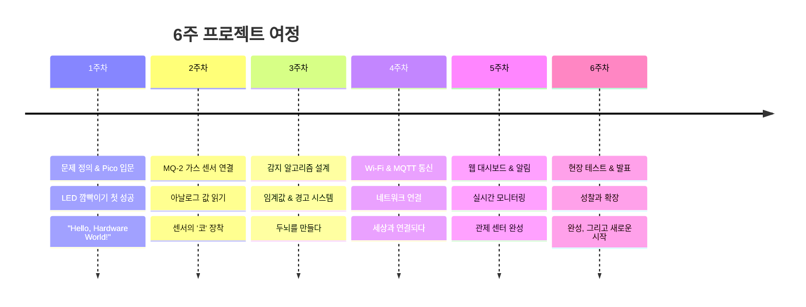
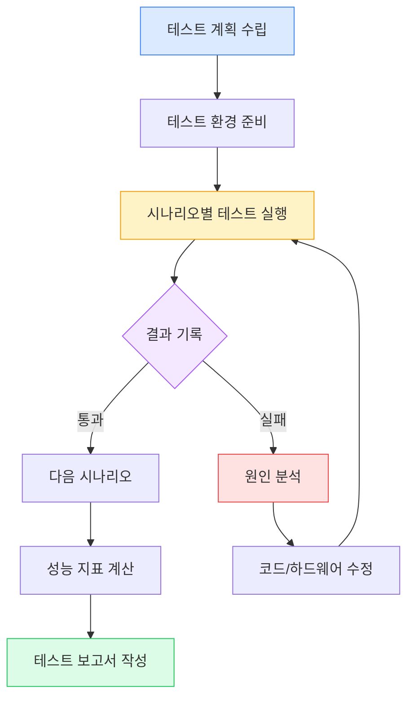
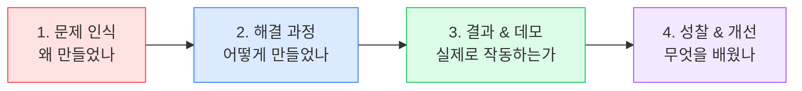
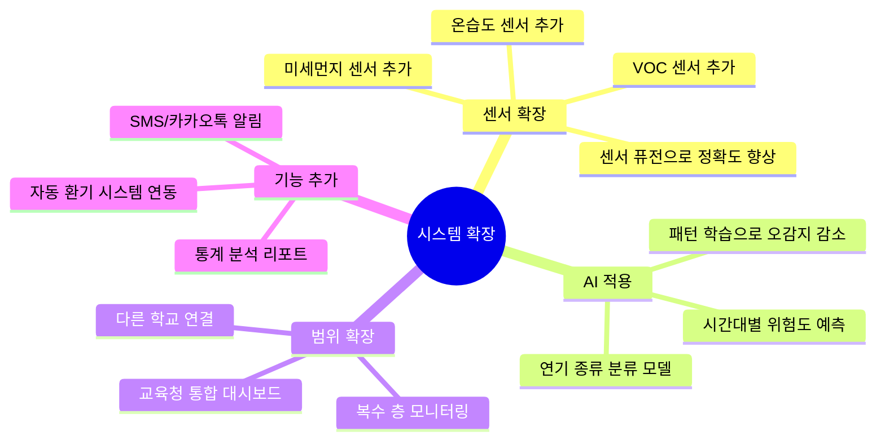
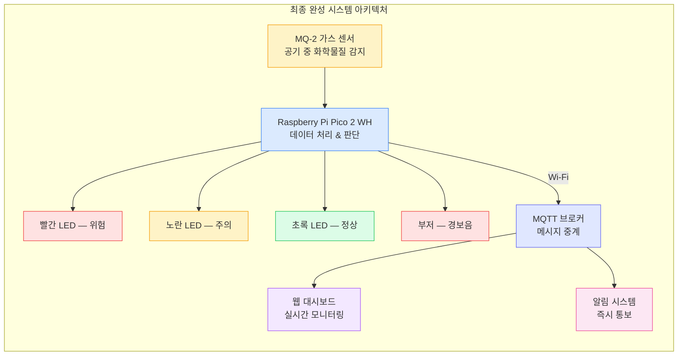

# 6주차: 완성과 공유 — 현장 테스트, 발표, 그리고 성찰

## 기본 정보

| 항목 | 내용 |
|------|------|
| 주제 | 전자담배 감지 시스템 현장 테스트, 프로젝트 발표, 성찰과 확장 |
| 시간 | 3시간 (150분 수업 + 쉬는 시간 20분) |
| 형태 | 2인 1조 (기존 조 유지) |
| 준비물 | 완성된 감지 장치 (Pico 2 WH + MQ-2 + LED 3개 + 부저), 노트북 (Thonny + 대시보드 접속), 테스트용 향초·방향제 스프레이, 발표 평가지, 성찰 워크시트, 프로젝터 |

## 학습목표

1. 완성된 전자담배 감지 시스템을 체계적인 테스트 계획에 따라 검증하고, 성능 지표(정확도, 오감지율, 반응시간)를 측정할 수 있다.
2. 프로젝트 전 과정을 논리적으로 구성하여 발표하고, 질의응답에 대응할 수 있다.
3. 6주간의 프로젝트를 성찰하고, 개선 및 확장 방안을 제안할 수 있다.
4. IoT 기술의 사회적 영향(프라이버시, 감시, 공익)에 대해 다양한 관점에서 토론할 수 있다.

## 타임라인

- **[1교시: 50분]** 프로젝트 여정 회고 & 현장 테스트
  - 00-10분: 6주 여정 회고 & 오늘의 목표
  - 10-20분: 테스트 계획 수립 & 체크리스트 작성
  - 20-40분: 현장 테스트 실행 & 결과 기록
  - 40-50분: 테스트 결과 분석 & 디버깅
- **[쉬는 시간: 10분]**
- **[2교시: 50분]** 발표 준비 & 발표
  - 00-15분: 발표 자료 구성 & 데모 리허설
  - 15-45분: 조별 발표 & 질의응답 (조당 5~7분)
  - 45-50분: 동료 평가 & 피드백
- **[쉬는 시간: 10분]**
- **[3교시: 50분]** 성찰과 확장
  - 00-15분: 프로젝트 성찰 워크시트 작성
  - 15-30분: 개선 아이디어 & 확장 가능성 토론
  - 30-45분: IoT와 사회적 영향 토론
  - 45-50분: 프로젝트 마무리 & 축하

---

## 상세 수업 진행

---

### 1교시: 프로젝트 여정 회고 & 현장 테스트

---

#### 도입 — 6주 여정 회고 (00-10분)

**[강의 스크립트]**

선생님: "여러분, 드디어 6주차입니다! 마지막 수업이에요."

(잠시 학생들 반응을 기다림)

선생님: "1주차 첫날 기억나요? LED 하나 켜놓고 '와 켜졌다!' 하던 때. 그때 여러분은 GPIO가 뭔지도 몰랐어요."

선생님: "그런데 지금은요? 가스 센서로 공기를 분석하고, 알고리즘으로 위험을 판단하고, Wi-Fi로 데이터를 보내고, 웹 대시보드에서 실시간 모니터링까지 하는 시스템을 만들었어요."

선생님: "6주 동안 우리가 걸어온 길을 한번 돌아볼게요."



선생님: "1주차에 LED 하나 켜는 데 세 줄이면 됐잖아요. 지금 여러분 코드는 몇 줄이에요?"

학생: "200줄 넘을 걸요?"

선생님: "맞아요. 그런데 그 200줄이 한 번에 나온 게 아니라, 매주 조금씩 쌓아올린 거잖아요. 그게 바로 '엔지니어링'이에요. 작은 것부터 하나씩, 확실하게."

선생님: "오늘은 세 가지를 할 거예요. 첫째, 이 시스템이 진짜로 작동하는지 '현장 테스트'. 둘째, 우리가 뭘 만들었는지 '발표'. 셋째, 6주를 돌아보는 '성찰'. 마지막 수업인 만큼, 의미 있는 시간 만들어봅시다."

---

#### 테스트 계획 수립 & 체크리스트 작성 (10-20분)

**[강의 스크립트]**

선생님: "프로 엔지니어는 '됐다!'라고 바로 끝내지 않아요. 반드시 '검증' 과정을 거쳐요. 우리도 이 시스템이 정말 제대로 작동하는지 테스트해봐야 해요."

선생님: "테스트를 하려면 먼저 계획이 필요해요. 무작정 '해보자'가 아니라, 뭘 테스트하고, 어떤 결과를 기대하는지 정해놓고 시작하는 거예요."



선생님: "테스트 체크리스트를 같이 만들어볼게요. 짝이랑 같이 이 양식을 채워보세요."

> **테스트 체크리스트**
>
> 조: ___조 &nbsp;&nbsp; 이름: __________, __________
>
> **1. 하드웨어 점검**
> - [ ] Pico 전원 정상 (LED 점등)
> - [ ] MQ-2 센서 예열 완료 (전원 인가 후 2분 이상)
> - [ ] 빨간 LED 작동 확인
> - [ ] 노란 LED 작동 확인
> - [ ] 초록 LED 작동 확인
> - [ ] 부저 작동 확인
> - [ ] 모든 연결부 단단히 고정
>
> **2. 소프트웨어 점검**
> - [ ] 메인 코드 정상 실행
> - [ ] Wi-Fi 연결 성공
> - [ ] MQTT 브로커 연결 성공
> - [ ] 대시보드에서 데이터 수신 확인
> - [ ] 알림 기능 작동 확인
>
> **3. 시나리오 테스트**
> - [ ] 일반 공기 → 정상 판정 (초록 LED)
> - [ ] 향초 연기 → 감지 반응 확인
> - [ ] 방향제 스프레이 → 오감지 여부 확인
> - [ ] 입김 불기 → 오감지 여부 확인
> - [ ] 감지 후 환기 → 정상 복귀 확인

선생님: "체크리스트의 힘은요, 빠뜨리는 것 없이 체계적으로 확인할 수 있다는 거예요. 실제 IT 회사에서도 제품 출시 전에 이런 체크리스트를 수백 개씩 만들어요."

---

#### 현장 테스트 실행 & 결과 기록 (20-40분)

**[강의 스크립트]**

선생님: "자, 이제 실제로 테스트해볼 거예요. 먼저 자동 테스트 스크립트를 돌려서 하드웨어가 정상인지 확인하고, 그다음에 시나리오 테스트로 넘어갈게요."

선생님: "먼저 이 코드를 실행해서 하드웨어가 다 제대로 연결됐는지 자동으로 검사하세요."

**[코드: test_hardware_auto.py]**

```python
# ============================================
# test_hardware_auto.py
# 전자담배 감지 시스템 — 하드웨어 자동 테스트
# ============================================

# === 무엇을 하는 코드인지 (WHAT) ===
# 모든 하드웨어 구성요소를 하나씩 자동으로 테스트해요
# 테스트 결과를 PASS/FAIL로 보여줘요

# --- 왜 필요한지 (WHY) ---
# 시나리오 테스트 전에 하드웨어가 정상인지 먼저 확인해야 해요
# 문제가 있으면 어디가 문제인지 바로 알 수 있어요

from machine import Pin, ADC
import time

# === 핀 설정 ===
red_led = Pin(15, Pin.OUT)     # 빨간 LED (경고)
yellow_led = Pin(14, Pin.OUT)  # 노란 LED (주의)
green_led = Pin(16, Pin.OUT)   # 초록 LED (정상)
buzzer = Pin(17, Pin.OUT)      # 부저
sensor = ADC(26)               # MQ-2 센서 (GP26 = ADC0)

# === 테스트 결과 저장 ===
results = []

def test_led(name, led_pin):
    """LED 테스트 — 켜고 끄기"""
    try:
        led_pin.on()
        time.sleep(0.5)
        led_pin.off()
        time.sleep(0.3)
        results.append((name, "PASS"))
        print(f"  [PASS] {name}")
    except Exception as e:
        results.append((name, "FAIL"))
        print(f"  [FAIL] {name} — 오류: {e}")

def test_buzzer():
    """부저 테스트 — 짧게 울리기"""
    try:
        buzzer.on()
        time.sleep(0.2)
        buzzer.off()
        results.append(("부저", "PASS"))
        print("  [PASS] 부저")
    except Exception as e:
        results.append(("부저", "FAIL"))
        print(f"  [FAIL] 부저 — 오류: {e}")

def test_sensor():
    """MQ-2 센서 테스트 — 값 읽기"""
    try:
        readings = []
        for i in range(10):
            readings.append(sensor.read_u16())
            time.sleep(0.1)
        avg = sum(readings) / len(readings)
        min_val = min(readings)
        max_val = max(readings)

        if avg > 0:
            results.append(("MQ-2 센서", "PASS"))
            print(f"  [PASS] MQ-2 센서")
            print(f"         평균: {avg:.0f} | 최소: {min_val} | 최대: {max_val}")
        else:
            results.append(("MQ-2 센서", "FAIL"))
            print(f"  [FAIL] MQ-2 센서 — 값이 0 (연결 확인 필요)")
    except Exception as e:
        results.append(("MQ-2 센서", "FAIL"))
        print(f"  [FAIL] MQ-2 센서 — 오류: {e}")

# === 테스트 실행 ===
print("=" * 45)
print("  전자담배 감지 시스템 — 하드웨어 자동 테스트")
print("=" * 45)
print()

print("[1/5] 빨간 LED 테스트...")
test_led("빨간 LED", red_led)

print("[2/5] 노란 LED 테스트...")
test_led("노란 LED", yellow_led)

print("[3/5] 초록 LED 테스트...")
test_led("초록 LED", green_led)

print("[4/5] 부저 테스트...")
test_buzzer()

print("[5/5] MQ-2 센서 테스트...")
test_sensor()

# === 결과 요약 ===
print()
print("=" * 45)
print("  테스트 결과 요약")
print("=" * 45)

pass_count = sum(1 for _, r in results if r == "PASS")
fail_count = sum(1 for _, r in results if r == "FAIL")

for name, result in results:
    icon = "O" if result == "PASS" else "X"
    print(f"  [{icon}] {name}: {result}")

print()
print(f"  통과: {pass_count}/{len(results)} | "
      f"실패: {fail_count}/{len(results)}")

if fail_count == 0:
    print()
    print("  >>> 모든 테스트 통과! 시나리오 테스트로 진행하세요.")
    # 성공 표시: 초록 LED 3번 깜빡
    for _ in range(3):
        green_led.on()
        time.sleep(0.3)
        green_led.off()
        time.sleep(0.2)
else:
    print()
    print("  >>> 실패 항목을 확인하고 수정 후 다시 테스트하세요.")
    # 실패 표시: 빨간 LED 3번 깜빡
    for _ in range(3):
        red_led.on()
        time.sleep(0.3)
        red_led.off()
        time.sleep(0.2)
```

선생님: "자동 테스트 다 통과했으면 시나리오 테스트로 넘어갈게요. 통과 못 한 조는 손 들어주세요, 같이 해결합시다."

선생님: "시나리오 테스트는 실제 상황을 흉내 내서 시스템이 올바르게 반응하는지 보는 거예요. 각 시나리오를 테스트하고 결과를 이 표에 기록하세요."

> **테스트 결과 기록표**
>
> | # | 시나리오 | 예상 결과 | 실제 결과 | 센서값 범위 | 반응시간 | 판정 |
> |---|---------|----------|----------|------------|---------|------|
> | 1 | 일반 공기 (아무것도 안 함) | 정상 (초록) | | | | |
> | 2 | 입김 불기 | 정상 (반응 없음) | | | | |
> | 3 | 향초 연기 (가까이) | 감지 (빨강+부저) | | | | |
> | 4 | 방향제 스프레이 | 약한 반응 or 무반응 | | | | |
> | 5 | 향초 연기 후 환기 | 정상 복귀 | | | | |
> | 6 | 센서 멀리 떨어뜨리기 (1m) | 약한 반응 or 무반응 | | | | |

**[코드: test_scenario.py]**

```python
# ============================================
# test_scenario.py
# 전자담배 감지 시스템 — 시나리오 테스트 도우미
# ============================================

# === 무엇을 하는 코드인지 (WHAT) ===
# 시나리오별 테스트를 안내하고, 센서값과 반응시간을 자동 기록해요

# --- 왜 필요한지 (WHY) ---
# 손으로 수치를 적는 것보다 정확하고, 나중에 성능 분석에 쓸 수 있어요

from machine import Pin, ADC
import time

# === 핀 설정 ===
red_led = Pin(15, Pin.OUT)
yellow_led = Pin(14, Pin.OUT)
green_led = Pin(16, Pin.OUT)
buzzer = Pin(17, Pin.OUT)
sensor = ADC(26)

# === 설정값 (3주차에서 정한 임계값) ===
THRESHOLD_WARNING = 35000   # 주의 단계
THRESHOLD_DANGER = 50000    # 위험 단계

# === 시나리오 목록 ===
scenarios = [
    "일반 공기 (아무것도 안 함)",
    "입김 불기",
    "향초 연기 (센서 가까이)",
    "방향제 스프레이",
    "향초 연기 후 환기 (30초 대기)",
    "센서에서 1m 거리에서 향초",
]

def get_status(value):
    """센서값으로 상태 판정"""
    if value >= THRESHOLD_DANGER:
        return "위험"
    elif value >= THRESHOLD_WARNING:
        return "주의"
    else:
        return "정상"

def set_leds(status):
    """상태에 따라 LED 제어"""
    red_led.off()
    yellow_led.off()
    green_led.off()
    buzzer.off()

    if status == "위험":
        red_led.on()
        buzzer.on()
    elif status == "주의":
        yellow_led.on()
    else:
        green_led.on()

def run_test(scenario_num, name, duration=10):
    """시나리오 테스트 실행"""
    print(f"\n{'='*45}")
    print(f"  시나리오 {scenario_num}: {name}")
    print(f"  측정 시간: {duration}초")
    print(f"{'='*45}")

    input("  준비되면 Enter를 누르세요...")

    readings = []
    start_time = time.ticks_ms()
    first_detect_time = None

    for i in range(duration * 5):  # 0.2초 간격으로 측정
        value = sensor.read_u16()
        readings.append(value)
        status = get_status(value)
        set_leds(status)

        # 첫 감지 시점 기록
        if status != "정상" and first_detect_time is None:
            first_detect_time = time.ticks_diff(
                time.ticks_ms(), start_time
            )

        # 실시간 표시 (매 1초)
        if i % 5 == 0:
            bar = "#" * (value // 3000)
            print(f"  {i//5:2d}초 | 값: {value:5d} | "
                  f"상태: {status} | {bar}")

        time.sleep(0.2)

    # LED 초기화
    set_leds("정상")
    green_led.off()

    # 결과 계산
    avg = sum(readings) / len(readings)
    max_val = max(readings)
    min_val = min(readings)

    react_ms = first_detect_time if first_detect_time else "미감지"

    print(f"\n  --- 시나리오 {scenario_num} 결과 ---")
    print(f"  평균: {avg:.0f} | 최대: {max_val} | 최소: {min_val}")
    print(f"  반응시간: {react_ms}{'ms' if isinstance(react_ms, int) else ''}")
    print(f"  판정: {get_status(int(avg))}")

    return {
        "avg": avg, "max": max_val, "min": min_val,
        "react_ms": react_ms
    }

# === 메인 실행 ===
print("=" * 45)
print("  전자담배 감지 시스템 — 시나리오 테스트")
print("=" * 45)
print()
print("  각 시나리오마다 안내가 나옵니다.")
print("  준비가 되면 Enter를 누르세요.")

all_results = []

for i, name in enumerate(scenarios, 1):
    result = run_test(i, name)
    all_results.append((name, result))

# === 전체 결과 요약 ===
print(f"\n{'='*45}")
print("  전체 테스트 결과 요약")
print(f"{'='*45}")
print(f"  {'시나리오':<25} {'평균':>7} {'최대':>7} {'반응':>8}")
print(f"  {'-'*25} {'-'*7} {'-'*7} {'-'*8}")

for name, r in all_results:
    react = (f"{r['react_ms']}ms"
             if isinstance(r['react_ms'], int)
             else "미감지")
    print(f"  {name:<25} {r['avg']:>7.0f} "
          f"{r['max']:>7} {react:>8}")

print(f"\n  테스트 완료!")
```

선생님: "시나리오 테스트 하나씩 해볼게요. 1번 시나리오부터 시작합니다. 아무것도 안 한 상태에서 10초 동안 센서값을 측정해요."

(학생들 시나리오 테스트 실행)

선생님: "향초를 사용하는 시나리오에서는 안전에 주의하세요. 선생님이 직접 향초를 켜고, 센서 근처에 가져다 놓겠습니다."

**[수업 장면: 테스트의 재미]**

지훈이와 서연이 조가 시나리오 3번 테스트를 진행하고 있다.

선생님이 향초 연기를 센서 근처에 가져다 대자 —

서연: "어? 값이 올라간다! 30000... 40000... 50000!"

지훈: "빨간불 켜졌다! 부저도 울린다!"

서연: "와, 진짜 작동하는 거야! 우리가 이걸 만든 거잖아!"

선생님: "반응시간이 몇 초였어요?"

지훈: "1200ms요. 1.2초!"

선생님: "훌륭해요. 1초 안에 감지하면 아주 좋은 거고, 2초 이내면 충분히 실용적이에요."

---

#### 테스트 결과 분석 & 디버깅 (40-50분)

**[강의 스크립트]**

선생님: "테스트 다 끝난 조 있나요? 결과를 같이 분석해볼게요."

선생님: "성능 평가에서 중요한 세 가지 지표가 있어요."

| 성능 지표 | 의미 | 목표 |
|----------|------|------|
| 정확도 | 실제 연기를 감지한 비율 | 80% 이상 |
| 오감지율 | 연기 아닌 것에 반응한 비율 | 20% 이하 |
| 반응시간 | 연기 발생~감지까지 시간 | 3초 이내 |

선생님: "방향제 스프레이에 반응한 조 있어요?"

학생: "저희 조가 반응했어요. 주의 단계까지 올라갔어요."

선생님: "그게 바로 '오감지(False Positive)'예요. 진짜 전자담배가 아닌데 알람이 울린 거죠. 어떻게 줄일 수 있을까요?"

학생: "임계값을 높이면요?"

선생님: "맞아요! 하지만 임계값을 높이면 진짜 전자담배도 놓칠 수 있어요. 이런 걸 '트레이드오프'라고 해요. 정확도와 오감지율은 시소처럼 한쪽을 올리면 다른 쪽이 내려가는 관계예요."

선생님: "3주차에서 정한 임계값을 테스트 결과에 따라 미세 조정해보세요. 이게 바로 '데이터 기반 최적화'예요."

**[예상 Q&A]**

- **Q**: "테스트할 때마다 센서값이 달라요."
- **A**: "정상이에요. MQ-2 센서는 온도, 습도에 따라 기준값이 조금씩 달라져요. 그래서 '기준값 대비 변화량'으로 판단하는 게 더 정확하죠. 3주차에서 배운 동적 기준선 방식을 쓰면 돼요."

- **Q**: "부저 소리가 너무 작아요."
- **A**: "부저와 Pico 사이 연결을 확인해보세요. 선이 느슨하면 소리가 작아요. 그래도 작다면 부저 자체가 액티브 부저인지 확인해보세요. 패시브 부저는 PWM으로 주파수를 지정해야 해요."

---

### 2교시: 발표 준비 & 발표

---

#### 발표 자료 구성 & 데모 리허설 (00-15분)

**[강의 스크립트]**

선생님: "이제 여러분이 만든 것을 다른 조에게 보여주고 설명하는 시간이에요. 발표는 기술자에게 아주 중요한 능력이에요."

선생님: "발표는 이런 순서로 구성하세요."



선생님: "각 파트에 이런 내용을 넣으면 좋아요."

> **발표 구성 가이드 (조당 5~7분)**
>
> **파트 1 — 문제 인식 (1분)**
> - 학교 전자담배 문제의 심각성
> - 기존 방법으로 해결이 어려운 이유
> - 1주차 문제 정의 캔버스에서 가져오기
>
> **파트 2 — 해결 과정 (2분)**
> - 사용한 기술: Pico, MQ-2, Wi-Fi, MQTT
> - 시스템 구성도 보여주기 (아키텍처 다이어그램)
> - 가장 어려웠던 부분과 해결 방법
>
> **파트 3 — 결과 & 데모 (2분)**
> - 라이브 데모: 실제 감지 시연
> - 테스트 결과: 정확도, 오감지율, 반응시간
> - 대시보드 화면 보여주기
>
> **파트 4 — 성찰 & 개선 (1~2분)**
> - 잘된 점 / 아쉬운 점
> - 개선 아이디어
> - 느낀 점 한마디

선생님: "지금부터 15분 동안 짝이랑 발표를 준비하세요. 역할을 나누면 좋아요 — 한 명이 설명하고, 한 명이 데모를 보여주거나요."

선생님: "가장 중요한 팁! 데모가 안 될 수도 있어요. 실제 IT 발표에서도 데모 사고가 흔해요. 그래서 미리 데모 영상이나 스크린샷을 백업으로 찍어두세요."

**[수업 장면: 발표 준비]**

하윤이와 재민이가 발표 역할을 나누고 있다.

하윤: "나는 문제 인식이랑 해결 과정 설명할게. 너는 데모 보여줘."

재민: "데모할 때 향초 연기 넣으면 되지?"

하윤: "근데 만약 작동 안 하면? 민망하잖아."

재민: "아까 테스트할 때 영상 찍어놨으니까, 안 되면 영상 보여주자."

하윤: "오, 좋다. 그리고 마지막에 '가장 어려웠던 점' 뭐라고 할까?"

재민: "4주차 Wi-Fi 연결이 진짜 힘들었잖아. 비밀번호 잘못 넣어서 한 시간 동안 헤맸잖아."

하윤: "(웃으며) 맞아, 그거 얘기하면 다들 공감할 듯."

---

#### 조별 발표 & 질의응답 (15-45분)

**[강의 스크립트]**

선생님: "발표를 시작해볼게요. 한 조당 5~7분이에요. 발표 후 1~2분 질의응답 시간을 가질 거예요."

선생님: "다른 조가 발표할 때는 경청하고, 발표 평가지를 작성해주세요. 평가지에는 이 항목들이 있어요."

> **발표 동료 평가지**
>
> 발표 조: ___조 &nbsp;&nbsp; 평가자: __________
>
> | 항목 | 1점 | 2점 | 3점 | 4점 | 5점 |
> |------|-----|-----|-----|-----|-----|
> | 문제 인식이 명확한가 | | | | | |
> | 해결 과정 설명이 논리적인가 | | | | | |
> | 데모가 효과적인가 | | | | | |
> | 성찰과 개선점이 구체적인가 | | | | | |
> | 발표 태도 (자신감, 전달력) | | | | | |
>
> **가장 인상적이었던 점:**
>
> **한 가지 제안:**

선생님: "평가할 때 중요한 건, '깎아내리기'가 아니라 '도와주기'예요. 좋은 점을 찾아주고, 더 나아질 수 있는 제안을 해주세요."

(발표 진행 — 선생님이 시간 관리 및 진행)

**[수업 장면: 라이브 데모]**

민수와 유진이 조가 발표 중 라이브 데모를 하고 있다.

유진: "지금부터 실제로 작동하는 모습을 보여드리겠습니다. 향초 연기를 센서에 가까이 가져가면..."

(센서 근처에 향초 연기를 가져다 대자)

유진: "보시면 지금 대시보드에 그래프가 올라가고 있고요..."

민수: "빨간 LED가 켜졌고 부저가 울리고 있습니다! 대시보드에도 '경고' 알림이 떴습니다."

(교실에서 환호)

학생 C: "오~ 진짜 된다!"

학생 D: "헐, 대시보드에서 실시간으로 보이는 거야?"

유진: "네, Wi-Fi로 MQTT 서버에 데이터를 보내고, 웹 대시보드에서 실시간으로 확인할 수 있습니다."

선생님: "좋아요! 질문 있는 사람?"

학생 E: "센서를 여러 개 달면 어느 화장실인지 구분이 돼요?"

민수: "네, 각 센서마다 고유 ID를 부여해서 MQTT 토픽을 다르게 설정했어요. 예를 들어 toilet_1, toilet_2 이렇게요."

선생님: "훌륭한 질문이었고, 아주 좋은 답변이었어요."

---

#### 동료 평가 & 피드백 (45-50분)

**[강의 스크립트]**

선생님: "모든 조가 발표를 마쳤어요. 정말 대단해요, 여러분."

선생님: "발표 평가지를 해당 조에 전달해주세요. 받은 평가지를 읽어보면서, 다른 사람들이 어떤 점을 인상적으로 봤는지 확인해보세요."

선생님: "제가 보기에 모든 조가 6주 전과 비교하면 놀라울 만큼 성장했어요. 코드 한 줄도 안 쳐봤던 친구들이 센서 데이터를 분석하고, 네트워크로 전송하고, 웹으로 보여주는 시스템을 만든 거잖아요."

---

### 3교시: 성찰과 확장

---

#### 프로젝트 성찰 워크시트 작성 (00-15분)

**[강의 스크립트]**

선생님: "마지막 시간이에요. 6주 동안 달려왔는데, 잠깐 멈추고 되돌아보는 시간이 필요해요. 이걸 '성찰'이라고 해요."

선생님: "왜 성찰이 중요할까요? 그냥 '했다, 끝!'이 아니라 '나는 뭘 배웠고, 뭘 느꼈고, 다음에는 어떻게 할까'를 정리해야 진짜 내 것이 되거든요."

선생님: "성찰 워크시트를 나눠줄게요. 짝이랑 같이 쓰되, 느낀 점은 각자 쓰세요."

> **프로젝트 성찰 워크시트**
>
> 이름: __________ &nbsp;&nbsp; 조: ___조
>
> **1. 우리 조가 잘한 점 (3가지)**
> - ①
> - ②
> - ③
>
> **2. 가장 어려웠던 순간**
> - 언제:
> - 무엇이:
> - 어떻게 해결했는지:
>
> **3. 이 프로젝트에서 배운 기술적 지식 (아는 만큼 적기)**
> - 하드웨어:
> - 소프트웨어:
> - 네트워크:
>
> **4. 기술 외에 배운 것 (소프트 스킬)**
> - 예: 협업, 문제 해결, 인내심, 발표력 등
>
> **5. 6주 전의 나에게 한마디**
> (프로젝트 시작 전의 나에게 뭐라고 말해주고 싶어요?)
>
> **6. 이 시스템을 실제로 학교에 설치한다면?**
> - 가능할까요? (예/아니오, 이유)
> - 어떤 추가 작업이 필요할까요?
>
> **7. 프로젝트 참여도 자기 평가**
> | 항목 | 1 | 2 | 3 | 4 | 5 |
> |------|---|---|---|---|---|
> | 수업 참여도 | | | | | |
> | 협업 기여도 | | | | | |
> | 문제 해결 노력 | | | | | |
> | 새로운 시도 의지 | | | | | |

선생님: "5번 '6주 전의 나에게 한마디'를 꼭 솔직하게 적어보세요. 나중에 이 워크시트를 보면 그때의 감정이 떠오를 거예요."

**[수업 장면: 성찰의 힘]**

소율이가 워크시트를 쓰다가 멈춘다.

소율: "선생님, '6주 전의 나에게 한마디'에 뭐라고 쓸지 모르겠어요."

선생님: "6주 전에 첫 수업 왔을 때 기분이 어땠어요?"

소율: "솔직히 '나는 코딩 못하는데, 어떡하지' 이런 생각이었어요."

선생님: "그럼 그때의 소율이에게 뭐라고 해주고 싶어요?"

소율: "(생각하다가) '걱정 마, 생각보다 재밌어. 그리고 너 생각보다 잘해'?"

선생님: "그거 그대로 적으세요. 완벽한 성찰이에요."

---

#### 개선 아이디어 & 확장 가능성 토론 (15-30분)

**[강의 스크립트]**

선생님: "이제 '만약에?'를 생각해볼 시간이에요. 우리 시스템을 더 좋게 만들려면 뭘 바꿀 수 있을까요?"

선생님: "조별로 3분간 브레인스토밍 해보세요. 아무리 황당한 아이디어라도 괜찮아요. '그건 안 돼'라는 말은 금지!"

(3분 브레인스토밍)

선생님: "나온 아이디어를 발표해볼까요?"

학생 A: "AI를 붙여서 전자담배 연기랑 요리 연기를 구분하게 하면 어떨까요?"

선생님: "오, 머신러닝! 실제로 센서 데이터를 학습시켜서 물질별로 구분하는 연구가 있어요. 완전 실현 가능한 아이디어예요."

학생 B: "카메라도 달아서 누구인지 확인하면요?"

선생님: "기술적으로는 가능하지만, 여기서 중요한 문제가 나오죠. 뭘까요?"

학생들: "프라이버시!"

선생님: "맞아요. 이건 잠시 후에 토론해볼 거예요."

학생 C: "다른 센서도 쓰면요? 미세먼지 센서나 VOC 센서?"

선생님: "정확해요! MQ-2 하나보다 여러 센서를 조합하면 정확도가 훨씬 올라가요. 이걸 '센서 퓨전'이라고 해요."

선생님: "여러분 아이디어를 정리하면 이런 확장 방향이 나와요."



---

#### IoT와 사회적 영향 토론 (30-45분)

**[강의 스크립트]**

선생님: "마지막 활동이에요. 1주차에 문제 정의 캔버스에서 '걱정되는 점'을 적었던 거 기억나요? 그때 어떤 조가 '학생 인권 침해 아니냐'고 했었죠."

선생님: "이 질문을 이제 제대로 토론해봅시다. 우리가 만든 시스템은 '좋은 기술'일까요, '감시 도구'일까요?"

선생님: "짝이랑 같이, 찬성과 반대 양쪽 입장을 모두 생각해보세요."

| 관점 | 찬성 (설치해야 한다) | 반대 (설치하면 안 된다) |
|------|---------------------|----------------------|
| 건강 | 비흡연 학생의 건강 보호 | 센서가 건강을 지켜주는 건 아님 |
| 인권 | 깨끗한 공기를 마실 권리 | 감시받지 않을 권리 |
| 효과 | 실제 흡연 감소 기대 | 다른 장소로 이동할 뿐 |
| 기술 | 기술로 문제 해결 가능 | 기술 만능주의의 위험 |
| 교육 | 경각심을 줄 수 있음 | 신뢰 기반 교육이 더 효과적 |

선생님: "잠깐 토론해보고, 각 조의 의견을 들어볼게요."

(토론 시간)

학생 A: "저는 설치해야 한다고 생각해요. 전자담배 안 피우는 학생들은 피해를 보고 있잖아요."

학생 B: "근데 화장실에 센서 달면 기분 나쁠 것 같아요. 감시당하는 느낌이잖아요."

학생 C: "카메라는 안 되지만 가스 센서는 괜찮지 않아요? 누군지는 모르고 연기만 감지하니까요."

선생님: "좋은 포인트예요. 우리 시스템은 '누가'가 아니라 '무엇이 일어났는지'만 감지하죠. 이런 걸 '비식별 감지'라고 해요. 카메라와 센서의 차이는 프라이버시 측면에서 아주 중요한 구분이에요."

선생님: "기술을 만든 사람에게는 책임이 있어요. '만들 수 있다'와 '만들어야 한다'는 다른 문제예요. 여러분이 이런 고민을 하는 것 자체가 훌륭한 엔지니어의 자질이에요."

**[예상 Q&A]**

- **Q**: "이런 시스템이 실제로 학교에 설치된 사례가 있어요?"
- **A**: "미국에서 'HALO Smart Sensor'라는 제품이 학교 화장실에 설치된 사례가 있어요. 전자담배 감지뿐 아니라 소음, 공기질까지 감지해요. 다만 프라이버시 논란도 있었어요."

- **Q**: "이 프로젝트를 대회에 출품할 수 있어요?"
- **A**: "물론이에요! 과학전람회, 청소년 발명대회, 소프트웨어 경진대회 등에 출품할 수 있어요. 특히 '사회 문제 해결' 카테고리에 딱 맞아요."

- **Q**: "Pico 말고 다른 보드로도 만들 수 있어요?"
- **A**: "네! Arduino, ESP32, Raspberry Pi 등으로도 만들 수 있어요. 특히 ESP32는 Pico와 비슷한 가격에 Wi-Fi와 Bluetooth가 내장되어 있어서 IoT에 많이 쓰여요."

- **Q**: "이 프로젝트를 포트폴리오로 쓸 수 있어요?"
- **A**: "당연하죠! 대학 입시나 취업 시 '실제로 만든 프로젝트'는 큰 강점이에요. 특히 문제 정의 → 설계 → 구현 → 테스트 → 발표까지의 과정이 잘 정리되어 있으니 훌륭한 포트폴리오예요."

- **Q**: "코딩 더 배우고 싶은데 어디서 배워요?"
- **A**: "MicroPython은 일반 Python과 아주 비슷해요. Python을 배우면 웹, AI, 데이터 분석 등 다양한 분야로 확장할 수 있어요. 온라인 강의나 코딩 동아리를 추천해요."

- **Q**: "가스 센서 말고 다른 센서도 쓸 수 있어요?"
- **A**: "Pico에 연결할 수 있는 센서는 수백 가지예요. 초음파 거리 센서, 적외선 모션 센서, 조도 센서, 토양 수분 센서 등등. 센서만 바꾸면 전혀 다른 IoT 프로젝트를 만들 수 있어요."

- **Q**: "MQTT 말고 다른 통신 방법도 있어요?"
- **A**: "HTTP(웹), WebSocket(실시간), CoAP(경량 IoT) 등이 있어요. MQTT가 IoT에서 가장 많이 쓰이는 이유는 가볍고 신뢰할 수 있기 때문이에요."

- **Q**: "이 시스템을 상용화하면 돈 벌 수 있어요?"
- **A**: "실제로 유사 제품이 시장에 있어요. 다만 상용화하려면 인증(KC 인증 등), 내구성 테스트, 양산 설계 등 추가 과정이 필요해요. 하지만 여러분이 만든 프로토타입이 바로 그 첫걸음이에요!"

---

#### 프로젝트 마무리 & 축하 (45-50분)

**[강의 스크립트]**

선생님: "여러분, 6주 동안 정말 수고했어요."

(잠시 멈추며)

선생님: "솔직하게 말할게요. 선생님도 처음에 걱정했어요. '이 프로젝트가 너무 어려운 건 아닐까', 'Pico 처음 만져보는 학생들이 6주 만에 IoT 시스템을 만들 수 있을까'라고요."

선생님: "근데 여러분이 해냈어요. 진짜로."

선생님: "1주차에 LED 켜놓고 신기해하던 여러분이, 6주차에는 센서로 데이터를 읽고, 알고리즘으로 판단하고, 인터넷으로 전송하고, 웹에서 모니터링하는 시스템을 만들었어요. 그리고 오늘 그걸 테스트하고, 발표하고, 성찰까지 했어요."

선생님: "이게 얼마나 대단한 건지 한번 생각해보세요."



<div class="hw-diagram" data-type="connection"
     data-title="최종 완성 하드웨어 연결도"
     data-connections='[
       {"from":"GP26 (ADC0)","to":"MQ-2 센서 AOUT","color":"#f59e0b"},
       {"from":"3V3","to":"MQ-2 센서 VCC","color":"#ef4444"},
       {"from":"GND","to":"MQ-2 센서 GND","color":"#6b7280"},
       {"from":"GP15","to":"220Ω 저항","then":"빨간 LED (+)","color":"#ef4444"},
       {"from":"GP14","to":"220Ω 저항","then":"노란 LED (+)","color":"#eab308"},
       {"from":"GP16","to":"220Ω 저항","then":"초록 LED (+)","color":"#22c55e"},
       {"from":"GP17","to":"부저 (+)","color":"#ef4444"},
       {"from":"GND","to":"모든 LED (-) 및 부저 (-)","color":"#6b7280"}
     ]'
     data-notes='["MQ-2 센서는 전원 인가 후 2분 이상 예열 필요","LED 3개 각각 220Ω 저항 필수","부저는 액티브 부저 사용 (별도 주파수 설정 불필요)","GND는 공통으로 연결 (브레드보드 GND 레일 활용)"]'>
</div>

선생님: "여러분이 만든 이 시스템, 부품 가격을 다 합치면 얼마 정도일까요? Pico 12,000원, MQ-2 3,000원, LED와 부저 합쳐서 2,000원. 대략 2만 원도 안 돼요."

선생님: "2만 원짜리 부품으로 학교 안전을 지키는 시스템을 만든 거예요. 기술의 힘이란 이런 거예요. 비싸지 않아도, 아이디어와 노력이 있으면 세상을 바꿀 수 있어요."

선생님: "마지막으로 한 가지만 더요. 이 프로젝트가 끝이 아니에요. 여러분은 이제 '만들 수 있는 사람'이 됐어요. 다음에는 뭘 만들어볼 건가요?"

선생님: "6주 동안 함께해서 정말 즐거웠어요. 여러분 최고예요!"

(박수)

---

## 수업 장면 시나리오

### 장면 1: 테스트의 스릴

향초 테스트 중, 준호와 소율이 조.

준호: "자, 향초 연기 간다. 준비?"

소율: "(노트북 화면 보며) 센서값 모니터링 중. 지금 12000 정도야."

준호: (향초 연기를 센서 쪽으로 부채질)

소율: "올라간다! 25000... 35000... 노란불 켜졌다!"

준호: "더 가까이..."

소율: "50000 넘었다! 빨간불! 부저 울린다!"

준호: "와! 진짜 된다! 대시보드는?"

소율: "(노트북 확인) 대시보드에도 경고 알림 떴어! 반응시간 1.4초!"

준호: "우리가 이걸 만든 거야? 진짜 신기하다."

소율: "6주 전에는 LED 하나 켜는 것도 어려웠는데..."

### 장면 2: 데모 사고 대처

민수와 유진이 조의 발표 중 데모 시연.

유진: "지금부터 라이브 데모를 보여드리겠습니다."

(센서 근처에 향초 연기를 가져다 대지만... 반응이 없다)

유진: "(당황하며) 잠깐만요..."

민수: "(침착하게) 센서 예열 시간이 부족한 것 같아요. 대신 아까 테스트할 때 찍은 영상을 보여드릴게요."

(미리 촬영한 테스트 영상 재생)

유진: "영상에서 보시면, 센서값이 올라가면서 빨간 LED가 켜지고 부저가 울리는 걸 확인하실 수 있습니다."

선생님: "(발표 후) 데모가 안 됐을 때 백업 영상으로 바로 전환한 거 정말 프로다웠어요. 실제 현장에서도 이런 대처 능력이 중요해요."

### 장면 3: 성찰의 순간

지훈이가 성찰 워크시트의 '6주 전의 나에게 한마디'를 쓰고 있다.

지훈: (쓰다 멈추며) "선생님, 솔직하게 써도 돼요?"

선생님: "당연하죠. 솔직한 게 가장 좋아요."

지훈: (쓴다) "'야, 너 코딩 진짜 못하거든. 근데 걱정 마. 짝이 도와줄 거야. 그리고 어차피 어려운 건 다 같이 어렵거든. 힘들면 선생님한테 물어봐. 절대 혼내지 않으시거든.'"

서연: (옆에서 보고) "뭐야, 감동적이잖아."

지훈: "진짜 처음에 겁났거든. 근데 돌아보니까 제일 재밌었던 수업이야."

### 장면 4: 미래를 꿈꾸다

하윤이와 재민이가 확장 가능성을 토론하고 있다.

하윤: "만약에 AI를 넣으면 어떤 연기인지 구분할 수 있을까?"

재민: "센서 데이터를 몇천 개 모아서 학습시키면 될 수도 있을 것 같은데?"

하윤: "오, 그러면 '전자담배 연기 vs 향초 연기 vs 방향제 스프레이'를 구분하는 AI?"

재민: "그러면 오감지가 확 줄겠다! 근데 우리가 AI를 할 수 있을까?"

하윤: "이번에 MicroPython도 처음이었는데 해냈잖아. 뭐든 하나씩 배우면 되지!"

재민: "맞아, 1주차에 LED 켤 때만 해도 '이게 되나?' 했는데."

선생님이 지나가며: "여러분 대화 듣고 있었는데, 정말 멋져요. 그 자세가 바로 엔지니어 마인드예요. '몰라도 일단 시작한다.'"

---

## 도전과제

- **Level 1: 테스트 리포트 작성** — 오늘 수행한 테스트 결과를 정리하여, '테스트 목적 / 방법 / 결과 / 결론'을 포함한 간단한 보고서를 작성하세요. (A4 1장)

- **Level 2: 개선된 시스템 설계도** — 오늘 토론에서 나온 개선 아이디어를 반영하여, '개선된 전자담배 감지 시스템'의 설계도를 그려보세요. 어떤 센서를 추가하고, 어떤 기능을 넣을지 구체적으로 그리세요.

- **Level 3: 프로젝트 포트폴리오** — 6주간의 프로젝트를 정리한 포트폴리오 문서를 만들어보세요. 내용: ① 프로젝트 개요 ② 시스템 구성 ③ 핵심 코드 설명 ④ 테스트 결과 ⑤ 배운 점과 개선 방안. 대학 입시나 대회 출품에 활용할 수 있어요!

---

## 교사용 체크리스트

- [ ] 3시간 타임라인이 현실적인가? → 1교시(회고/테스트) + 2교시(발표) + 3교시(성찰/토론)
- [ ] 모든 코드가 복사-실행 가능한가? → test_hardware_auto.py, test_scenario.py 모두 독립 실행 가능
- [ ] 초보자도 이해할 수 있는 스크립트인가? → 전문 용어 최소화, 6주간의 맥락 활용
- [ ] 예상 Q&A가 5개 이상 있는가? → 총 10개
- [ ] 수업 장면 시나리오가 2개 이상 있는가? → 4개 (테스트의 스릴, 데모 사고 대처, 성찰의 순간, 미래를 꿈꾸다)
- [ ] 테스트 체크리스트와 결과 기록표가 있는가? → 하드웨어 체크리스트, 시나리오 기록표 포함
- [ ] 발표 구성 가이드가 있는가? → 4파트 구성 가이드 + 동료 평가지
- [ ] 성찰 워크시트가 있는가? → 7개 항목 포함
- [ ] 6주 전체를 아우르는 마무리인가? → 회고 타임라인, 전체 아키텍처, 감동적 마무리
- [ ] 사회적 영향 토론이 포함되어 있는가? → 프라이버시 vs 공익 토론

---

## 프로젝트를 마치며

> **선생님, 수고하셨습니다.**
>
> 6주 동안 학생들과 함께 전자담배 감지 시스템을 만들어오셨습니다.
> LED 하나 켜는 것부터 시작해서, 센서, 알고리즘, 네트워크, 대시보드까지.
> 쉽지 않은 여정이었을 겁니다.
>
> 학생들이 코드를 잘못 쳐서 에러가 날 때,
> 센서가 말을 안 들을 때,
> Wi-Fi가 안 잡힐 때,
> 하나하나 함께 해결해주신 그 시간들이
> 학생들에게는 '기술'보다 더 큰 것을 가르쳐준 시간이었습니다.
>
> **"몰라도 괜찮아. 같이 해보자."**
>
> 이 한마디가 학생들에게 용기를 주었을 겁니다.
> 그리고 그 용기가 LED 한 개에서 IoT 시스템까지 이끌었습니다.
>
> 학생들이 오늘 발표하면서 뿌듯해하는 모습을 보셨을 겁니다.
> 성찰 워크시트에 솔직한 마음을 적는 모습도요.
> 그게 바로 선생님이 6주 동안 만들어내신 교육의 결과입니다.
>
> 이 프로젝트를 통해 학생들은 코딩을 배운 게 아닙니다.
> **"나도 만들 수 있다"**는 자신감을 배운 겁니다.
> 그 자신감이 어디로 이어질지는 아무도 모릅니다.
> 하지만 분명한 건, 시작은 이 교실에서, 선생님과 함께였다는 거예요.
>
> 다음 프로젝트도 기대하겠습니다.
> 정말 수고하셨습니다.
